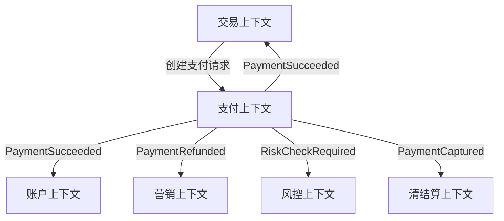

# DDD到底解决什么问题

## 1. 这一章解决什么问题

很多人第一次接触 DDD，会被一串名词拦住：领域、子域、核心域、限界上下文、聚合、仓库、工厂、领域服务、领域事件。于是 DDD 很容易被误解成一套“复杂项目专用设计模式”，甚至变成一堆目录规范和类名后缀。

但 DDD 真正要解决的不是“代码怎么分包”这么小的问题，而是复杂业务系统长期演进中的三个核心矛盾：

- 业务人员说的语言，和代码里的语言对不上。
- 业务规则散落在 Controller、Service、SQL、消息消费和前端判断里。
- 系统边界不是按业务能力形成，而是被数据库表、技术分层或组织临时分工绑架。

当这些问题长期存在，系统会越来越像一个“能跑但难改”的机器：需求可以上线，但每次修改都需要猜测影响面；代码可以复用，但复用的是耦合；服务可以拆分，但拆完之后调用链和数据一致性问题更多。

DDD 的价值，就是把复杂业务重新拉回到“业务语言、领域模型、边界和演进”这条主线上。

## 2. 核心概念

DDD，全称 Domain-Driven Design，领域驱动设计。这里的“领域”不是技术领域，而是系统要解决的业务问题空间。

几个关键词需要先建立直觉：

- 领域：业务问题所在的范围，例如电商、支付、物流、会员、风控。
- 模型：对业务概念和规则的抽象，不是数据库表，也不是页面字段集合。
- 统一语言：业务、产品、测试、开发都能理解并一致使用的语言。
- 边界：一个模型成立的范围，超过边界后，同一个词可能有不同含义。
- 演进：DDD 不是一次设计完成，而是在业务变化中持续校准模型。

比如“订单”这个词，在交易上下文中表示用户购买行为的凭证；在履约上下文中更关心发货、签收、配送状态；在财务上下文中可能是收入确认和结算依据。如果所有上下文都共享一个巨大的 `Order` 对象，短期看是复用，长期看就是耦合的起点。

DDD 会提醒我们：先问“这个概念在哪个业务语境下成立”，再决定它是否应该共享。

## 3. DDD真正管理的是复杂度

软件复杂度大致可以分成两类：

- 技术复杂度：高并发、分布式事务、缓存一致性、网络抖动、可观测性、部署发布。
- 业务复杂度：规则多、场景多、角色多、例外多、术语含义变化快。

技术复杂度可以通过框架、中间件、平台能力降低门槛。业务复杂度却不能简单外包给框架，因为它来自业务本身。一个支付系统的退款规则、风控策略、清结算流程、账务平衡约束，不会因为用了 Spring Cloud 或 Kubernetes 就自动变清晰。

DDD 的主要战场是业务复杂度。它通过以下方式降低复杂度：

- 用统一语言减少沟通损耗。
- 用领域模型承载业务规则，避免逻辑散落。
- 用限界上下文隔离不同语义，避免模型污染。
- 用聚合约束一致性边界，避免对象关系无限蔓延。
- 用领域事件表达业务事实，降低上下文之间的直接耦合。
- 用分层架构和依赖倒置保护领域层，避免业务规则被技术细节吞掉。

可以把 DDD 看成一套“复杂业务知识的组织方法”。代码只是它的最终表达之一。

## 4. 一个电商支付例子

假设要设计电商支付功能。最朴素的做法是从表开始：

- `order`
- `payment`
- `refund`
- `account`
- `coupon`
- `settlement`

然后围绕表生成 DAO、Service、Controller。这种方式能快速上线，但随着业务发展会出现几个典型问题：

- 支付成功后要改订单状态、扣优惠、记账、发消息，逻辑散落在多个 Service。
- 退款既影响支付单，也影响订单售后、账户流水、优惠券退回，边界不清。
- 结算团队、风控团队、交易团队都要读写同一批表，互相影响。
- “支付订单”“交易订单”“账务凭证”“结算单”混在一起，代码里全叫 order。

DDD 会换一个入口：先看业务能力和语义边界。

- 交易上下文：关心用户购买、订单状态、商品快照。
- 支付上下文：关心支付单、支付渠道、支付状态、退款。
- 账户上下文：关心余额、流水、入账、出账。
- 营销上下文：关心优惠券、活动、核销和退回。
- 风控上下文：关心风险规则、拦截、审核。
- 清结算上下文：关心对账、分润、结算周期。

这些上下文之间可以通过 API 或事件协作，而不是共享一个巨大的数据库模型。

这里的重点不是“拆成几个服务”，而是先识别不同模型的边界。部署上可以先是模块化单体，等边界稳定后再拆成微服务。

## 5. DDD不解决什么问题

DDD 很有价值，但不是万能药。

它不直接解决：

- 性能问题：慢查询、锁竞争、GC、网络延迟仍然需要技术优化。
- 组织问题：没有业务专家参与，DDD 工作坊很容易变成开发闭门造词。
- 简单 CRUD：低复杂度管理后台强行 DDD，往往收益小于成本。
- 一次性需求：生命周期很短的活动页、运营工具不一定值得建完整模型。
- 不稳定探索：业务形态未定时，应保留轻量模型，避免过早抽象。

DDD 最适合的场景是：业务复杂、规则多变、生命周期长、团队协作多、模型长期复用的系统。

## 6. 实战落地建议

落地 DDD 不建议从“重构所有代码”开始，而应该从一个高价值、边界相对清晰的业务域开始试点。

建议路径：

1. 选一个复杂业务问题，例如支付、订单履约、售后、库存。
2. 拉业务、产品、测试、开发一起梳理统一语言。
3. 用事件风暴梳理关键业务事件和流程。
4. 识别子域和限界上下文，明确哪些模型不能共享。
5. 选择一个上下文做战术建模，设计实体、值对象、聚合和领域事件。
6. 用分层架构保护领域层，不让 ORM、RPC、消息框架侵入核心模型。
7. 把建模结果落到包结构、接口契约、数据库边界和代码评审规则中。

如果建模只停留在白板上，没有进入代码结构和团队协作流程，它很快会退化成一次热闹的会议。

## 7. 常见坑

- 把 DDD 当成目录规范：只建 `domain`、`application`、`infrastructure` 包，但业务逻辑仍然全在 Service。
- 把实体当成数据库表：表有什么字段，实体就有什么字段，模型完全被存储结构牵着走。
- 过早微服务化：限界上下文还没稳定，就急着拆服务，导致分布式复杂度提前爆炸。
- 所有概念都共享：为了复用建公共模型，结果每个业务都被公共模型限制。
- 只靠开发建模：没有业务专家参与，统一语言无法成立。

## 8. 面试与复盘问题

- DDD 和传统三层架构最大的区别是什么？
- 统一语言为什么重要？它如何影响代码命名？
- 为什么说领域模型不是数据库模型？
- 什么场景不适合引入完整 DDD？
- DDD 和微服务是什么关系？
- 一个支付系统可以拆出哪些限界上下文？
- 如何判断一个模型是否已经被多个业务语境污染？

## 9. 小结

- DDD 的核心目标是治理复杂业务，而不是制造复杂代码。
- 领域模型是业务知识的表达，数据库表只是持久化方式。
- 统一语言让业务、产品、测试、开发在同一套概念下协作。
- 限界上下文让不同语义各自成立，避免共享模型污染。
- DDD 可以指导微服务拆分，但不等于必须微服务。
- 落地 DDD 要从高价值业务试点开始，并把模型落进代码和协作流程。
