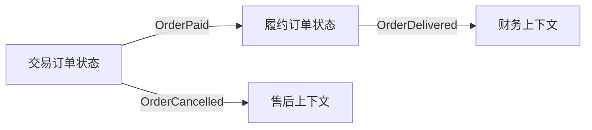

# 从软件退化看DDD的价值

## 1. 这一章解决什么问题

很多系统刚上线时结构并不差，甚至还有清晰的分层、统一的命名和完整的测试。但业务迭代几年后，代码逐渐变成另一种样子：

- 一个 `OrderService` 几千行，所有流程都往里面塞。
- 一个字段在不同场景下有不同含义，没人敢改。
- 新需求看似简单，开发却要改十几个模块。
- 老功能没人讲得清，只能从 SQL 和 if-else 里考古。
- 微服务数量越来越多，但业务边界越来越模糊。

这就是软件退化。它不是某一次错误设计造成的，而是无数次“先这样改一下”的累积结果。

DDD 的价值，恰恰体现在对抗这种长期退化。它通过语言、模型、边界和架构约束，让业务知识不至于在迭代中散掉。

## 2. 软件为什么会退化

软件退化的根因通常不是技术能力不足，而是变化没有被正确安放。

### 2.1 需求变化直接冲击技术结构

在普通三层代码里，需求常常直接落到 Service 方法、SQL 和接口字段中。短期看快，长期会让业务规则散落。

例如订单取消逻辑可能分散在：

- 用户主动取消接口。
- 超时未支付定时任务。
- 商家缺货取消流程。
- 风控拦截流程。
- 客服后台强制取消。
- 消息补偿消费逻辑。

它们都在修改订单状态，但每个入口都有一点自己的判断。几年后，没人知道“订单到底什么时候能取消”。

### 2.2 数据库模型反向驱动业务模型

很多系统从表设计开始。表结构为了查询、报表、兼容历史系统不断加字段，最后实体类也跟着膨胀。

典型症状：

- 一个 `Order` 类包含交易、履约、售后、结算、营销字段。
- 字段名越来越技术化，如 `type`、`source`、`flag`、`status2`。
- 业务约束不在对象里，而在多个 SQL 和 Service 分支里。

数据库是存储模型，不应该成为业务模型的全部。DDD 强调领域对象要表达业务行为和不变量，而不是只做表字段载体。

### 2.3 公共复用变成公共耦合

团队为了减少重复，经常抽公共模块、公共枚举、公共模型。问题是，业务概念一旦进入公共层，就很难变化。

例如多个上下文都依赖同一个 `Customer`：

- 会员上下文关心等级、权益、积分。
- 营销上下文关心标签、触达、转化。
- 风控上下文关心风险画像、黑名单、设备。
- 售后上下文关心服务记录、投诉等级。

如果它们共用一个 `Customer` 模型，这个模型会越来越大，也越来越难满足任何一个上下文。

DDD 会把“复用”拆开看：通用技术能力可以共享，稳定业务能力可以沉淀，不同语义的业务模型不应强行共享。

## 3. DDD如何对抗退化

### 3.1 用统一语言对齐理解

统一语言不是写一份术语表就结束，而是让业务语言进入代码、接口、事件、测试用例和文档。

如果业务说的是“支付单已捕获”，代码却写成 `status = 3`，模型就已经开始失真。

更好的方式是：

```java
payment.capture(channelResult);
payment.markFailed(reason);
payment.requestRefund(refundAmount);
```

同等 Go 写法：

```go
payment.Capture(channelResult)
payment.MarkFailed(reason)
payment.RequestRefund(refundAmount)
```

这些方法名不是语法糖，而是在告诉后来的维护者：业务行为在哪里，规则入口在哪里。

### 3.2 用领域模型集中业务规则

领域模型应该承载业务规则，而不是把规则全部放在应用服务里。

反例：

```java
if (order.getStatus() == 1 && order.getPaidAt() == null && user.isNormal()) {
    order.setStatus(5);
}
```

同等 Go 写法：

```go
if order.Status() == 1 && order.PaidAt().IsZero() && user.IsNormal() {
	order.SetStatus(5)
}
```

更好的方向：

```java
order.cancelByBuyer(cancelReason, operator);
```

同等 Go 写法：

```go
if err := order.CancelByBuyer(cancelReason, operator); err != nil {
	return err
}
```

取消规则应尽量靠近订单聚合。应用服务负责加载对象、调用行为、保存结果和发布事件，不负责拼凑所有业务判断。

### 3.3 用限界上下文隔离变化

一个模型最怕被多个业务语境共同修改。限界上下文的作用是告诉团队：这个模型在哪个边界内有效。

例如“订单状态”在不同上下文中可以不同：

- 交易上下文：待支付、已支付、已取消。
- 履约上下文：待发货、已发货、已签收。
- 售后上下文：待审核、退款中、已完成。
- 财务上下文：待入账、已入账、待结算。

如果所有状态都塞进一个订单状态机，复杂度会急剧上升。更好的方式是让不同上下文拥有自己的状态模型，通过事件同步关键事实。



### 3.4 用架构约束保护领域层

如果领域对象可以直接调用 Mapper、Redis、MQ、HTTP Client，那么技术细节会慢慢侵入业务模型。

DDD 常结合分层架构、整洁架构或六边形架构，让依赖方向保持稳定：

- 领域层不依赖基础设施。
- 应用层编排用例，不承载核心规则。
- 基础设施层实现仓库、消息、外部系统适配。
- 接口层只做协议转换、鉴权、参数校验和响应组装。

这样的结构不是为了“优雅”，而是为了让业务规则有一个相对稳定的家。

## 4. 退化信号清单

如果一个系统出现下面信号，说明可以考虑引入 DDD 思路治理：

- 一个 Service 方法超过 200 行，且包含大量业务分支。
- 同一个状态字段被多个模块修改，没人能完整说明状态机。
- 新需求经常要改公共模型，导致多个业务联动测试。
- 代码命名与业务语言脱节，只有老开发知道含义。
- 表字段越来越多，但业务对象越来越贫血。
- 服务拆分后仍然共享数据库。
- 跨服务调用大量出现“查一下你的表”“我直接改你的状态”。
- 业务规则无法单元测试，只能靠集成环境验证。

这些不是单纯的代码整洁问题，而是业务模型已经散了。

## 5. 实战改造路径

不要试图一次性把存量系统改造成完整 DDD。更现实的路径是分层治理。

### 第一步：给核心流程补统一语言

选择一个高频变化流程，例如订单取消、退款、支付确认、库存扣减。把业务术语和代码术语对齐：

- 梳理状态、事件、角色、命令、业务规则。
- 把隐晦字段和魔法值改成清晰枚举和值对象。
- 在测试用例中使用业务语言描述场景。

### 第二步：抽出领域行为

优先把散落在应用服务中的核心规则迁回领域对象：

- 状态流转规则放回聚合。
- 金额、数量、比例等概念封装成值对象。
- 校验逻辑从 Controller 和 Service 中下沉到领域行为。

### 第三步：识别上下文边界

当一个对象承载太多语义时，不要继续加字段。要问：

- 这些字段是否来自不同业务团队？
- 是否有不同生命周期？
- 是否有不同一致性要求？
- 是否可以通过事件同步事实，而不是共享对象？

### 第四步：保护新模型

新模型需要架构规则保护，否则会很快再次退化：

- 领域层禁止依赖基础设施层。
- 应用服务禁止出现复杂业务判断。
- Repository 接口定义在领域或应用边界，ORM 实现放基础设施层。
- 跨上下文调用必须通过 API、事件或反腐层。

## 6. 常见坑

- 只改包结构，不改业务规则位置。
- 把所有旧表直接映射成实体，导致领域模型继续贫血。
- 为了“充血模型”把数据库操作塞进实体。
- 认为 DDD 会降低代码量。实际上 DDD 往往增加局部结构，但降低长期认知成本。
- 没有测试保护就大规模重构，导致模型还没建立，风险先爆炸。

## 7. 面试与复盘问题

- 什么是软件退化？它和代码腐化有什么区别？
- 为什么贫血模型容易导致业务规则散落？
- 统一语言如何防止模型失真？
- 什么情况下公共模型会变成公共耦合？
- 如何判断一个 Service 已经承担了过多领域职责？
- 存量系统如何渐进式引入 DDD？
- 领域层为什么不应该依赖 ORM、MQ、RPC 框架？

## 8. 小结

- 软件退化来自业务变化被随意安放。
- DDD 的价值在于让业务知识稳定地存在于语言、模型、边界和代码中。
- 统一语言解决沟通退化，领域模型解决规则散落，限界上下文解决语义污染。
- 分层架构和依赖倒置不是形式主义，而是保护领域模型的工程手段。
- 存量系统落地 DDD 应从核心流程、小范围、可验证的改造开始。
