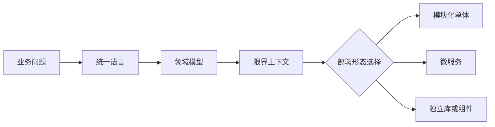

# DDD和微服务不是绑定关系

## 1. 这一章解决什么问题

很多团队是在做微服务拆分时认识 DDD 的，所以容易形成一个误解：DDD 是微服务设计方法，学 DDD 就是为了拆服务。

这个理解只对了一半。

DDD 确实能帮助微服务找到边界，但 DDD 的核心不是微服务，而是领域模型。微服务只是领域边界的一种部署和运行时形态。一个系统完全可以在模块化单体中实践 DDD，也可以在微服务架构中违背 DDD。

真正要区分的是：

- DDD 解决业务复杂度和模型边界问题。
- 微服务解决独立部署、团队自治、弹性扩展和技术异构问题。

两者可以协作，但不是绑定关系。

## 2. 为什么DDD经常和微服务一起出现

微服务最大的难点不是用什么框架，而是怎么拆。

按技术层拆：

- 用户服务
- 订单服务
- 商品服务
- 支付服务
- 库存服务

看起来合理，但如果继续深挖，会发现“订单服务”可能同时包含交易、履约、售后、结算、风控所需的不同订单概念。服务名像业务，内部却仍然是混合模型。

按数据库表拆更危险：

- `order` 表一个服务
- `payment` 表一个服务
- `refund` 表一个服务
- `account` 表一个服务

这样会把服务拆成数据访问壳。业务流程一跑起来，跨服务事务、循环调用、共享状态会迅速出现。

DDD 的战略设计正好提供了一套识别业务边界的方法：

- 领域和子域帮助判断业务能力。
- 核心域、支撑域、通用域帮助决定投入策略。
- 限界上下文帮助确定模型边界。
- 上下文映射帮助定义协作关系。
- 聚合帮助识别一致性边界。

所以，DDD 常常成为微服务拆分的前置方法。

## 3. 微服务不是DDD的起点

更稳妥的路径是：先建模，再选择架构形态。



如果团队一开始就把每个限界上下文拆成独立服务，可能会过早承担分布式成本：

- 服务调用延迟。
- 分布式事务和最终一致性。
- 数据同步和读模型构建。
- 发布协调和接口兼容。
- 链路追踪、监控、告警、容量治理。
- 本地开发和测试复杂度。

在很多场景下，模块化单体是更好的第一步：代码中先建立清晰上下文边界，数据库和部署可以暂时保持单体。等某个上下文的团队、发布频率、容量、稳定性诉求真的独立出来，再拆成微服务。

## 4. 模块化单体也可以实践DDD

模块化单体不是传统大单体。它的关键是“模块内高内聚，模块间显式依赖”。

例如电商系统可以在一个进程内划分模块：

```text
commerce-app/
  trade/
    domain/
    application/
    infrastructure/
  payment/
    domain/
    application/
    infrastructure/
  fulfillment/
    domain/
    application/
    infrastructure/
  marketing/
    domain/
    application/
    infrastructure/
```

模块之间遵守规则：

- 不能直接访问对方数据库表。
- 不能直接引用对方领域对象。
- 只能通过应用服务接口、领域事件或防腐适配层交互。
- 模块边界由架构测试或代码评审守护。

这样做的好处是：保留单体的部署简单性，同时获得 DDD 的模型边界。如果未来要拆微服务，边界已经在代码中存在，迁移成本会低很多。

### 4.1 模块边界的代码示例

模块化单体里最容易失守的是“看起来只是本地调用”。例如交易模块想知道支付结果，不能直接引用支付模块的 `PaymentOrder` 实体，而应该依赖支付模块暴露出来的应用服务接口或事件契约。

```java
// trade/application/PaymentQueryPort.java
package com.example.commerce.trade.application;

public interface PaymentQueryPort {
    PaymentView getPayment(String paymentId);
}

public record PaymentView(
        String paymentId,
        String tradeOrderId,
        String status,
        long paidAmount
) {}
```

同等 Go 写法：

```go
package application

type PaymentQueryPort interface {
	GetPayment(paymentID string) (PaymentView, error)
}

type PaymentView struct {
	PaymentID    string
	TradeOrderID string
	Status       string
	PaidAmount   int64
}
```

支付模块在基础设施适配层实现这个端口，而不是让交易模块反向依赖支付领域对象：

```java
// trade/infrastructure/PaymentQueryAdapter.java
package com.example.commerce.trade.infrastructure;

import com.example.commerce.trade.application.PaymentQueryPort;
import com.example.commerce.trade.application.PaymentView;
import com.example.commerce.payment.api.PaymentApi;

public class PaymentQueryAdapter implements PaymentQueryPort {
    private final PaymentApi paymentApi;

    public PaymentQueryAdapter(PaymentApi paymentApi) {
        this.paymentApi = paymentApi;
    }

    @Override
    public PaymentView getPayment(String paymentId) {
        var dto = paymentApi.getPayment(paymentId);
        return new PaymentView(dto.paymentId(), dto.tradeOrderId(), dto.status(), dto.paidAmount());
    }
}
```

同等 Go 写法：

```go
package infrastructure

import "example.com/commerce/trade/application"

type PaymentAPI interface {
	GetPayment(paymentID string) (PaymentDTO, error)
}

type PaymentDTO struct {
	PaymentID    string
	TradeOrderID string
	Status       string
	PaidAmount   int64
}

type PaymentQueryAdapter struct {
	api PaymentAPI
}

func NewPaymentQueryAdapter(api PaymentAPI) *PaymentQueryAdapter {
	return &PaymentQueryAdapter{api: api}
}

func (a *PaymentQueryAdapter) GetPayment(paymentID string) (application.PaymentView, error) {
	dto, err := a.api.GetPayment(paymentID)
	if err != nil {
		return application.PaymentView{}, err
	}
	return application.PaymentView{
		PaymentID:    dto.PaymentID,
		TradeOrderID: dto.TradeOrderID,
		Status:       dto.Status,
		PaidAmount:   dto.PaidAmount,
	}, nil
}
```

这种写法的关键点是：交易上下文只认识自己的 `PaymentQueryPort` 和 `PaymentView`，不认识支付上下文的内部聚合。未来支付模块拆成独立微服务时，只需要替换适配器实现。

也可以用架构测试守住边界：

```java
@AnalyzeClasses(packages = "com.example.commerce")
class ModuleBoundaryTest {
    @ArchTest
    static final ArchRule trade_should_not_depend_on_payment_domain =
            noClasses()
                    .that().resideInAPackage("..trade..")
                    .should().dependOnClassesThat()
                    .resideInAPackage("..payment.domain..");
}
```

同等 Go 写法：

```go
func TestTradeShouldNotImportPaymentDomain(t *testing.T) {
	for _, file := range listGoFiles(t, "./trade") {
		content := readFile(t, file)
		if strings.Contains(content, `"example.com/commerce/payment/domain"`) {
			t.Fatalf("trade module must not import payment domain: %s", file)
		}
	}
}
```

## 5. 微服务也可能违背DDD

服务数量多，不代表领域边界清晰。

常见反例：

- 多个服务共享同一个数据库。
- 一个“公共业务服务”被所有系统调用，里面堆满跨领域规则。
- 服务接口直接暴露数据库字段。
- 一个服务修改另一个服务的核心状态。
- 服务按技术能力拆分，如 `controller-service`、`dao-service`。
- 一个业务流程需要同步调用十几个服务才能完成。

这些系统虽然叫微服务，但本质仍然是分布式大泥球。

DDD 关注的是模型自治。微服务关注的是运行时自治。运行时自治没有模型自治支撑，复杂度只会从进程内转移到网络上。

## 6. DDD如何指导微服务边界

### 6.1 服务边界优先来自限界上下文

一个限界上下文内应该有一致的模型和语言。微服务边界通常不应跨越多个强冲突的上下文。

例如支付上下文中，“支付单”“支付渠道”“退款”“支付状态”是一组紧密模型。清结算上下文中，“账单”“结算周期”“分润规则”是另一组模型。两者关联密切，但语言和生命周期不同，不宜强行合并。

### 6.2 聚合决定事务边界

聚合内可以强一致，聚合之间优先通过事件实现最终一致。

这对微服务非常关键。跨服务事务代价很高，所以服务设计时应避免一个业务操作必须同时强一致修改多个服务内部数据。

### 6.3 上下文协作要显式建模

上下文之间常见协作方式：

- 同步 API：适合查询、校验、强依赖流程。
- 异步事件：适合事实通知、状态传播、最终一致。
- 反腐层：适合对接遗留系统、第三方系统或语义不一致系统。
- 共享内核：只适合非常稳定、变化少、团队协作紧密的少量模型。

不要把所有协作都做成 RPC，也不要把所有协作都做成事件。选择取决于业务时效、一致性、耦合和故障隔离要求。

## 7. 一个拆分判断清单

考虑把一个上下文拆成微服务前，至少问这些问题：

- 这个上下文是否有清晰统一语言？
- 它是否拥有独立的业务生命周期？
- 它的数据是否可以私有化？
- 它是否需要独立发布？
- 它是否有不同的容量和可用性要求？
- 它和其他上下文之间是否能通过契约协作？
- 跨上下文一致性是否可以接受最终一致？
- 团队是否有能力承担服务治理成本？

如果多数答案是否定的，先做模块化边界通常更稳。

## 8. 常见坑

- 把 DDD 当成微服务拆分公式，以为一个聚合一个服务。
- 没有统一语言就拆服务，导致服务名业务化、模型仍然混乱。
- 服务拆了，数据库没拆，仍然共享表。
- 为了自治拒绝所有同步调用，导致简单流程被事件链复杂化。
- 为了复用建立公共领域模型，破坏各上下文自治。
- 忽略团队能力，拆完后发布、监控、排障、测试都跟不上。

## 9. 面试与复盘问题

- DDD 和微服务分别解决什么问题？
- 为什么模块化单体也能实践 DDD？
- 限界上下文和微服务是一一对应的吗？
- 聚合和微服务是什么关系？
- 共享数据库为什么会破坏微服务自治？
- 什么时候应该用同步 API，什么时候应该用领域事件？
- 如何判断一个上下文是否值得拆成独立微服务？

## 10. 小结

- DDD 不等于微服务，DDD 的核心是领域模型和边界。
- 微服务是部署形态，不是建模方法。
- DDD 可以帮助微服务识别边界，但不要求一开始就拆服务。
- 模块化单体是很多团队实践 DDD 的更稳起点。
- 没有模型自治的微服务，很容易变成分布式大泥球。
- 服务拆分要同时考虑业务边界、数据边界、接口边界、部署边界和团队能力。
