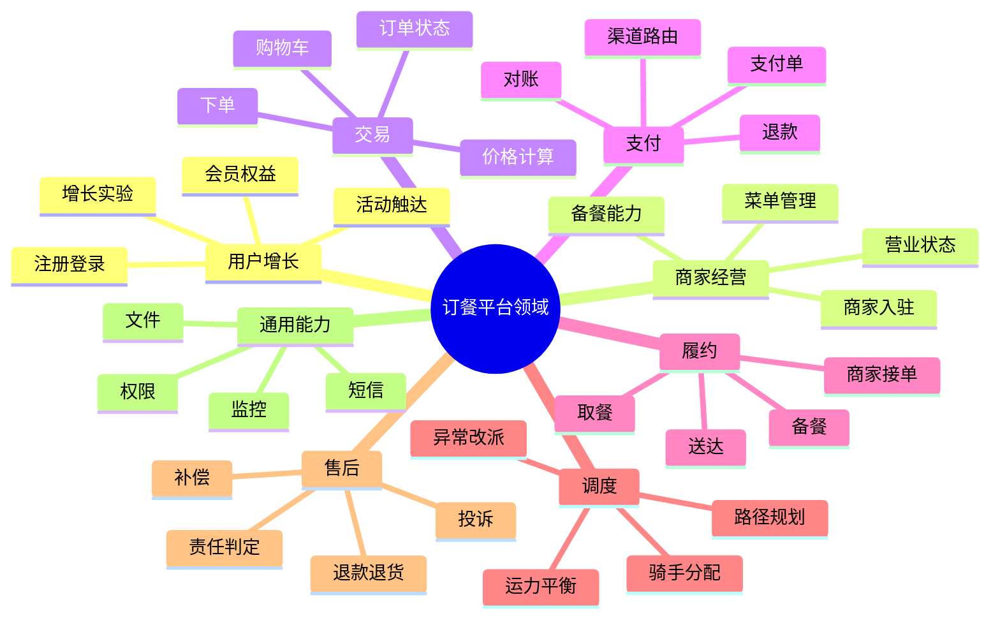
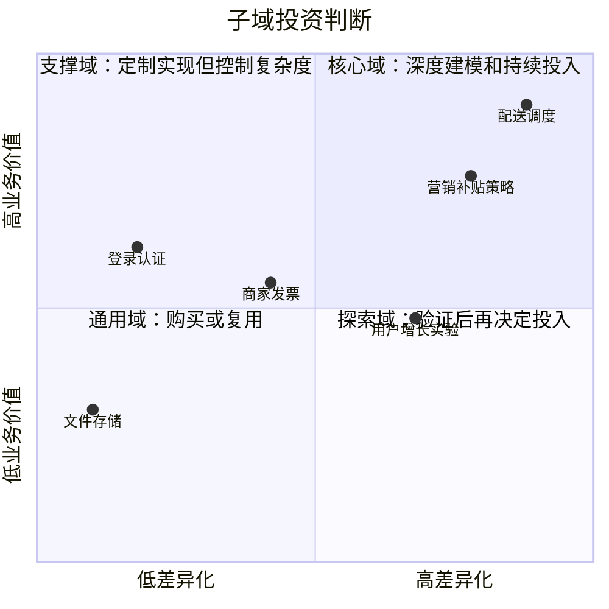
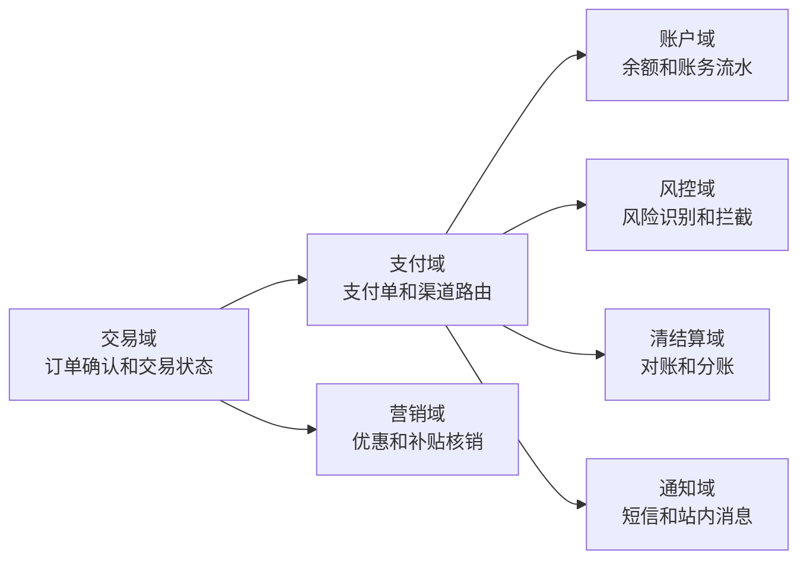

# 领域、子域、核心域、支撑域和通用域

## 1. 这一章解决什么问题

很多团队第一次做 DDD 时，会急着讨论实体、聚合、Repository、分层架构，甚至一上来就问“这个服务要不要拆”。但真正困难的问题通常更靠前：我们到底在解决哪一块业务问题？哪些能力值得重兵投入，哪些能力可以购买、复用或者简单实现？如果这些问题没有先回答清楚，后面的模型和服务边界很容易变成“按数据库表拆”“按组织部门拆”或者“按技术层拆”。

领域和子域划分解决的是业务版图问题。它帮助团队把一个庞大系统拆成若干业务能力区域，再按业务价值和差异化程度决定投入策略。对电商、支付、订餐、物流、风控这类系统来说，这一步尤其重要，因为它决定了团队应该在哪些地方沉淀核心模型，在哪些地方保持轻量，在哪些地方直接接入成熟产品。

这篇文章不把 DDD 当成术语记忆，而是从“业务能力投资组合”的角度理解领域、子域、核心域、支撑域和通用域。

## 2. 核心概念

领域是组织要解决的业务问题空间。它不是系统名，也不是数据库名，而是企业用软件支撑的一类业务活动。例如“外卖平台”这个领域里，包含用户下单、商家接单、骑手履约、支付结算、营销补贴、评价售后等业务活动。

子域是对领域的进一步拆分。一个子域通常对应一组高内聚的业务能力，具有相对稳定的业务语言、流程目标和规则集合。子域可以按价值链、业务能力、生命周期、组织协作和变化频率来识别。

核心域是直接形成竞争优势的子域。它通常是公司差异化能力所在，值得投入最强的业务专家、架构师和研发力量。外卖平台的实时调度、配送履约、运力供需匹配可能是核心域；支付公司的风控决策、资金路由、清结算能力可能是核心域；电商平台的搜索推荐、交易履约、促销引擎也可能是核心域。

支撑域是为了支撑核心业务运转而必须存在的子域。它有定制化需求，但通常不是差异化竞争力本身。例如外卖平台的商家资质审核、发票管理、客服工单，电商系统的售后单据流转、运营配置、商家结算对账等。

通用域是行业内已经比较成熟、标准化程度高的子域。它通常不值得重复造轮子，可以优先采用 SaaS、开源组件、云服务或企业已有平台能力。例如登录认证、短信发送、文件存储、通用报表、基础权限、客服 IM、通用支付渠道接入等。

这三个分类不是给子域贴永久标签，而是帮助团队决定投入方式：核心域要深建模，支撑域要稳妥实现，通用域要控制自研冲动。

## 3. 原理与方法拆解

### 3.1 先画业务能力地图，而不是系统功能菜单

功能菜单往往反映的是当前系统实现，业务能力地图反映的是业务真实运转。比如一个电商后台菜单里可能有“订单管理、商品管理、用户管理、优惠券管理、财务报表”，但业务能力地图应该继续追问：

- 订单管理背后是在管理交易生命周期，还是在处理履约异常？
- 商品管理背后是供给建模、库存可售、价格策略，还是内容运营？
- 优惠券是营销域的一部分，还是交易域里的价格计算策略？
- 财务报表只是查询展示，还是清结算和对账的结果视图？

可以用下面几个维度识别子域：

- 业务目标：这组能力最终服务什么业务结果，例如提升转化、降低履约成本、控制资金风险。
- 业务语言：这里的核心名词是否有一套独立含义，例如“订单”在交易、履约、售后、财务里含义并不相同。
- 生命周期：核心对象是否有独立状态流，例如支付单、退款单、配送单、工单。
- 规则密度：是否存在大量业务规则、策略组合、例外流程和人工干预。
- 变化频率：需求是否经常变化，是否由特定业务团队持续运营。
- 依赖关系：它是被很多能力依赖，还是只依赖别人完成辅助工作。

### 3.1.1 能力地图示例

业务能力地图可以先画粗，再逐步细化。下面是订餐平台的一版能力地图，它不是组织架构图，也不是系统清单，而是业务能力视图：



这张图的价值不在于一次画准，而在于逼团队讨论：哪些能力直接决定竞争力，哪些能力只是支撑主流程，哪些能力不值得自研。

### 3.2 用价值和差异化程度判断子域类型

子域分类最常见的误区，是把“重要”直接等同于“核心”。登录认证很重要，短信通道很重要，日志审计也很重要，但它们多数情况下不是竞争优势。核心域的关键判断不是“离不开”，而是“做得更好是否能显著拉开差距”。

可以用一个简单矩阵来判断：



在订餐平台中，配送调度和履约异常处理可能是核心域，因为它直接影响履约成本、配送时效和用户体验。商家发票是支撑域，需要满足平台规则和财税要求，但不是平台差异化来源。登录认证和短信通知是通用域，除非你的公司本身就是身份安全厂商，否则不应把最强研发资源投入到自研登录体系上。

也可以把这个判断固化为轻量评分，辅助架构评审：

```java
public enum SubdomainType {
    CORE, SUPPORTING, GENERIC, EXPLORATORY
}

public record SubdomainScore(
        int businessValue,       // 1-5，业务价值
        int differentiation,     // 1-5，差异化程度
        int ruleComplexity,      // 1-5，规则复杂度
        int changeFrequency,     // 1-5，变化频率
        int marketMaturity       // 1-5，外部成熟方案程度
) {
    public SubdomainType classify() {
        if (businessValue >= 4 && differentiation >= 4 && ruleComplexity >= 3) {
            return SubdomainType.CORE;
        }
        if (businessValue >= 3 && marketMaturity <= 3) {
            return SubdomainType.SUPPORTING;
        }
        if (differentiation <= 2 && marketMaturity >= 4) {
            return SubdomainType.GENERIC;
        }
        return SubdomainType.EXPLORATORY;
    }
}
```

同等 Go 写法：

```go
type SubdomainType string

const (
	Core        SubdomainType = "CORE"
	Supporting  SubdomainType = "SUPPORTING"
	Generic     SubdomainType = "GENERIC"
	Exploratory SubdomainType = "EXPLORATORY"
)

type SubdomainScore struct {
	BusinessValue   int // 1-5，业务价值
	Differentiation int // 1-5，差异化程度
	RuleComplexity  int // 1-5，规则复杂度
	ChangeFrequency int // 1-5，变化频率
	MarketMaturity  int // 1-5，外部成熟方案程度
}

func (s SubdomainScore) Classify() SubdomainType {
	if s.BusinessValue >= 4 && s.Differentiation >= 4 && s.RuleComplexity >= 3 {
		return Core
	}
	if s.BusinessValue >= 3 && s.MarketMaturity <= 3 {
		return Supporting
	}
	if s.Differentiation <= 2 && s.MarketMaturity >= 4 {
		return Generic
	}
	return Exploratory
}
```

评分不是为了替代业务判断，而是为了让讨论显性化。比如“短信通知”业务价值很高，但差异化低、市场成熟度高，所以更像通用域；“骑手调度”业务价值高、差异化高、规则复杂，所以更像核心域。

### 3.3 子域分类会随业务阶段变化

核心域不是一成不变的。创业早期，一个外卖平台的核心可能是快速撮合商家和用户；规模变大后，核心可能转向配送调度、动态定价、履约质量和供应链效率。电商平台早期可能把交易闭环作为核心，成熟后搜索推荐、广告变现、会员体系、商家经营工具可能逐渐成为新的核心域。

这意味着子域分类需要定期复盘。不要因为某个能力早期是核心，就永远用重模型维护；也不要因为某个能力过去是通用采购，就忽略它在新战略下可能变成关键能力。一个典型例子是风控：在普通电商里风控可能只是支撑域，但在支付、信贷、出行安全等场景中，风控往往就是核心域。

## 4. 实战落地

### 4.1 电商支付场景的子域拆分

以电商支付为例，用户从提交订单到支付完成，看起来只是“调支付接口”，但放到领域视角里会出现多个子域：



如果这是一个普通电商平台，交易域、支付域、营销域可能是核心或重要支撑域，通知域多半是通用域。若公司是第三方支付机构，支付路由、账户账务、风控、清结算就可能成为核心域。上下文不同，同一个能力的战略价值也会变化。

落地时可以为每个子域输出一张“子域卡片”：

| 项目 | 内容 |
|---|---|
| 子域名称 | 支付域 |
| 业务目标 | 完成安全、稳定、可追踪的资金支付 |
| 核心对象 | 支付单、支付渠道、支付请求、支付结果 |
| 关键规则 | 渠道路由、幂等处理、超时关闭、状态推进 |
| 依赖上游 | 交易域、营销域、风控域 |
| 输出下游 | 账户域、清结算域、通知域 |
| 子域类型 | 核心域或支撑域，取决于公司战略 |
| 投入策略 | 建立独立模型，沉淀支付状态机和渠道适配能力 |

### 4.2 在线订餐场景的子域拆分

订餐场景适合练习“不要按页面拆子域”。用户 App 看到的是下单、支付、配送、评价，但领域内部可以拆成：

- 用户增长域：新客、会员、积分、活动触达。
- 商家经营域：菜单、营业状态、备餐能力、商家服务质量。
- 交易域：购物车、订单、价格、优惠、状态流。
- 支付域：支付单、退款、渠道回调、资金安全。
- 履约域：接单、备餐、取餐、配送、送达确认。
- 调度域：骑手分配、路径规划、运力平衡、异常改派。
- 售后域：退款、投诉、补偿、责任判定。
- 评价域：用户评价、商家评分、骑手服务反馈。

其中调度域和履约域在大规模平台中通常具有核心域特征。它们的规则复杂、变化快、影响成本和体验，且很难直接购买成熟通用方案。评价域和售后域可能是支撑域，但如果平台把“服务质量治理”作为核心竞争力，它们也可能升级为核心域。短信、地图 SDK、基础权限、文件存储通常是通用域。

### 4.3 大规模微服务案例给我们的启发

Uber 的 DOMA 案例很有代表性。Uber 在微服务数量膨胀后，没有简单地继续鼓励服务越拆越细，而是把相关微服务组织为更高层的 domain，通过 domain gateway 和 layer design 降低理解成本和依赖复杂度。这个案例说明：领域不是纸面概念，它可以反过来治理大规模微服务的组织方式。

Microsoft 的无人机配送示例也强调，领域分析要先识别业务功能和子域，再定义限界上下文，最后才推导微服务边界。它把配送和无人机管理识别为核心子域，把账户、开票、呼叫中心等识别为支撑或通用能力。这种分析方式比“一个名词一个服务”稳得多。

## 5. 常见坑

第一，按数据库表拆子域。表结构是实现结果，不是业务边界。按表拆出来的“用户服务、订单服务、订单明细服务、支付流水服务”往往只得到一堆贫血数据服务，业务流程仍然散落在上层应用里。

第二，把所有重要能力都叫核心域。核心域应该少而精，否则会导致资源平均分配，真正差异化的地方得不到足够投入。一个团队同时声称十几个核心域，通常意味着它还没有想清楚战略重点。

第三，把组织部门直接当子域。组织会变，子域来自业务能力。组织结构可以参考，但不能机械照搬。否则系统会被当前汇报关系绑住，未来组织调整就会造成架构震荡。

第四，低估通用域的集成成本。通用域不代表没有边界设计。即使购买第三方能力，也需要反腐层、适配层、统一错误码、审计日志和数据回流策略。

第五，静态看待子域分类。业务进入新阶段后，原来的支撑域可能变成核心域，原来的核心域也可能商品化、平台化，变成内部通用能力。

## 6. 面试与复盘问题

1. 如何判断一个子域是核心域、支撑域还是通用域？
2. 为什么“重要”不等于“核心”？
3. 在电商支付场景中，交易、支付、风控、清结算分别可能是什么类型的子域？
4. 如果一个团队按数据库表拆服务，可能会带来哪些问题？
5. 子域分类和微服务拆分是什么关系？
6. 当核心域逐渐稳定后，是否还应该保持重投入？
7. 通用域接入第三方系统时，为什么仍然需要边界和反腐层？
8. 你如何组织一次业务能力地图梳理会议？

## 7. 小结

- 领域是业务问题空间，子域是对业务能力的拆分。
- 核心域代表差异化竞争力，支撑域保障主流程运转，通用域优先复用成熟方案。
- 子域划分要从业务目标、语言、生命周期、规则密度、变化频率和依赖关系入手。
- 子域分类的目的不是命名，而是决定资源投入和建模深度。
- 核心域要深建模，支撑域要稳健实现，通用域要避免重复造轮子。
- 子域分类会随业务阶段变化，需要定期复盘。
- 微服务边界应该建立在领域分析之上，而不是建立在数据库表、页面菜单或组织部门之上。

## 8. 延伸阅读

- 《DDD 实战课》：02 领域、子域、核心域、通用域和支撑域。
- 《DDD 微服务落地实战》：02 以电商支付功能为例演练 DDD。
- Microsoft Learn: Use domain analysis to model microservices, https://learn.microsoft.com/en-us/azure/architecture/microservices/model/domain-analysis
- Uber Engineering: Introducing Domain-Oriented Microservice Architecture, https://www.uber.com/us/en/blog/microservice-architecture/
