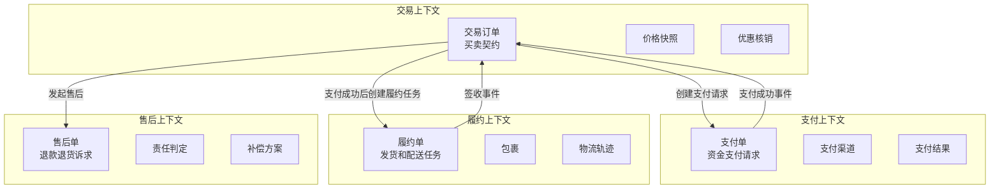
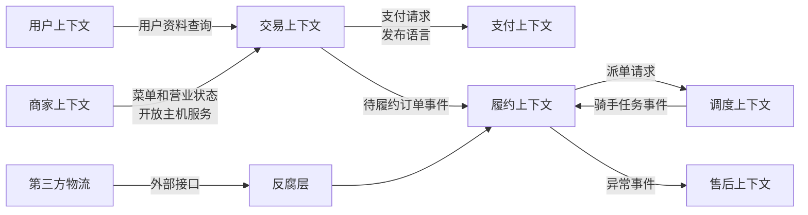

# 限界上下文如何定义领域边界

## 1. 这一章解决什么问题

很多系统变复杂，不是因为类太多，也不是因为服务太多，而是因为“同一个词在不同地方偷偷变了意思”。订单在交易团队眼里是买卖契约，在履约团队眼里是配送任务来源，在财务团队眼里是结算依据，在售后团队眼里是维权入口。如果所有团队强行共享一个 Order 模型，这个模型最终会长满字段、状态和条件分支，谁也不敢改。

限界上下文解决的是模型边界问题。它明确规定：某一套领域模型、业务语言和规则，只在一个确定边界内成立。边界内追求语言一致、规则内聚、模型干净；边界外通过契约协作，而不是共享内部模型。

理解限界上下文以后，微服务拆分会从“按名词切系统”变成“按模型语义切边界”。这也是 DDD 战略设计里最关键的一步。

## 2. 核心概念

限界上下文是一个显式边界，在这个边界内，一套统一语言和领域模型保持一致。它可以落实为代码模块、应用服务、微服务、团队职责、数据库 schema、接口契约，甚至是一组文档和测试规范。它首先是模型边界，其次才可能成为部署边界。

统一语言是限界上下文内部共同使用的业务词汇。它不是写在 Wiki 里的术语表，而是应该贯穿需求讨论、设计文档、代码命名、接口字段、测试用例和监控指标。只要语言不一致，模型就会漂移。

上下文映射描述多个限界上下文之间如何协作。常见关系包括客户方/供应方、开放主机服务、发布语言、反腐层、共享内核、各行其道等。它让团队在边界处明确谁依赖谁、契约在哪里、变化如何传递。

反腐层用于隔离外部模型污染。它把第三方系统、遗留系统或其他上下文的语言翻译成本上下文自己的语言，避免外部数据结构直接进入领域模型。

## 3. 原理与方法拆解

### 3.1 为什么一个全局模型通常会失败

全局模型看起来节省成本：大家共用同一套 Customer、Order、Product、Account。问题是业务语义并不会因为代码复用而统一。以 Account 为例：

- 在用户中心，Account 表示登录身份、手机号、邮箱、实名状态。
- 在支付系统，Account 表示资金账户、余额、冻结金额、账务流水。
- 在商家系统，Account 可能表示商家经营主体、结算账号、权限主体。

如果强行建一个全局 Account，模型会被多个上下文拉扯。字段越来越多，校验越来越复杂，状态越来越难解释。最后团队只能绕开模型，在各种 Service 和 SQL 里写规则，DDD 就退化成了 DTO 搬运。

限界上下文的本质，是承认复杂业务里不存在一个适用于全局的万能模型。同一个现实对象，可以在不同上下文中有不同表示。关键不是消灭差异，而是让差异有边界、有契约、有翻译。

### 3.2 识别限界上下文的信号

可以从以下信号判断是否需要拆出新的限界上下文：

- 同一个词在不同团队里含义不同，例如订单、账户、库存、客户。
- 同一个对象存在不同生命周期，例如交易订单、配送单、售后单。
- 规则变化来源不同，例如营销规则由运营改，账务规则由财务和合规改。
- 数据一致性要求不同，例如交易创建要求强一致，报表统计可以延迟。
- 技术质量属性不同，例如支付要求高可靠和审计，推荐要求高吞吐和实验能力。
- 团队协作成本高，一个需求总要跨多个团队改同一个模型。

这些信号出现时，不要急着拆微服务，而是先问：这里是不是存在两个不同的模型语境？如果是，先画清楚限界上下文，再决定它在实现上是模块、子系统还是独立服务。

### 3.3 上下文边界不等于微服务边界

限界上下文是模型边界，微服务是部署和运行时边界。两者经常有关联，但不能直接画等号。

一个限界上下文可以先落在模块化单体中，等业务复杂度、团队规模、发布节奏和运行时诉求成熟后，再拆成独立微服务。一个微服务通常不应该跨多个限界上下文承载核心模型，否则服务内部会出现多套语言混杂，边界失去意义。反过来，一个大型限界上下文也可能由多个服务支撑，但这些服务应该围绕同一套模型语言协作，并通过清晰的内部模块治理复杂度。

Microsoft 的微服务建模建议里有一个很实用的判断：微服务不要小于聚合，也不要大于限界上下文。这个原则的意思不是机械规定大小，而是提醒我们，服务粒度要落在“一致性边界”和“模型边界”之间。

## 4. 实战落地

### 4.1 电商中的订单上下文

电商里最容易被误用的模型就是订单。下面是一种更接近业务语义的上下文拆分：



在交易上下文中，订单关注买卖双方、商品快照、价格、优惠、交易状态。在履约上下文中，履约单关注仓库、包裹、物流、发货时效。在售后上下文中，售后单关注申请原因、责任归属、退款金额和补偿策略。

它们可以共享同一个 orderId 作为关联标识，但不共享同一个 Order 类。跨上下文协作通过命令、查询 API 或领域事件完成。例如支付上下文发布 PaymentSucceeded，交易上下文消费后推进交易状态；履约上下文不直接修改交易订单，而是通过履约事件让交易上下文更新可见状态。

### 4.2 订餐中的上下文映射

订餐平台中，交易、商家、配送、支付、售后之间的协作更密集。可以用上下文映射图描述关系：



这里需要特别关注两个边界：

第一，商家上下文不要把完整商家模型暴露给交易上下文。交易只需要菜单、价格、库存可售、营业状态等下单所需信息。商家的资质、合同、结算规则属于商家经营模型，不应泄漏到交易域。

第二，履约上下文对接第三方物流时需要反腐层。第三方物流的运单状态、错误码、时效描述、取消规则很可能与平台自己的履约模型不同。如果直接把第三方字段传进领域模型，平台履约逻辑会被外部系统牵着走。

### 4.3 边界如何落到代码和接口

限界上下文不是画图结束。它至少要落到以下工程约束：

- 包结构：按上下文组织模块，例如 `trade`、`payment`、`fulfillment`，避免 `entity`、`service`、`dao` 这种纯技术分包统治业务代码。
- 模型命名：不同上下文使用各自语言，例如 `TradeOrder`、`PaymentOrder`、`DeliveryTask`，不要为了复用强行叫同一个 `Order`。
- 数据边界：每个上下文维护自己的数据模型。跨上下文只能通过 API、事件或只读视图协作。
- 接口契约：暴露稳定的命令、查询和事件契约，而不是暴露内部表结构或领域对象。
- 转换层：在接口层、应用层或反腐层做模型转换，领域层不直接依赖外部 DTO。
- 测试约束：用契约测试和架构测试守住边界，防止内部类被其他上下文直接调用。

一个常见的包结构可以是：

```text
com.example.food
  trade
    api
    application
    domain
    infrastructure
  payment
    api
    application
    domain
    infrastructure
  fulfillment
    api
    application
    domain
    infrastructure
  shared
    kernel
```

注意 `shared` 要非常克制。共享内核只适合放极少数稳定概念，例如 Money、UserId、OrderId 这类值对象或基础规范。不要把业务规则、实体和领域服务塞进 shared，否则共享内核会变成新的大泥球。

### 4.4 反腐层代码示例

对接第三方物流时，外部系统返回的状态通常不等于本上下文的履约状态。不要把外部 DTO 直接传进领域层，可以在反腐层完成翻译。

```java
// fulfillment/domain/DeliveryStatus.java
package com.example.food.fulfillment.domain;

public enum DeliveryStatus {
    WAITING_PICKUP,
    PICKED_UP,
    DELIVERED,
    FAILED
}
```

```java
// fulfillment/infrastructure/acl/ThirdPartyLogisticsAcl.java
package com.example.food.fulfillment.infrastructure.acl;

import com.example.food.fulfillment.domain.DeliveryStatus;

public class ThirdPartyLogisticsAcl {
    public DeliveryStatus translateStatus(String externalStatus) {
        return switch (externalStatus) {
            case "RIDER_ACCEPTED", "ARRIVED_SHOP" -> DeliveryStatus.WAITING_PICKUP;
            case "PICKED", "ON_THE_WAY" -> DeliveryStatus.PICKED_UP;
            case "SIGNED" -> DeliveryStatus.DELIVERED;
            case "CANCELLED", "EXCEPTION" -> DeliveryStatus.FAILED;
            default -> throw new IllegalArgumentException("Unknown logistics status: " + externalStatus);
        };
    }
}
```

```java
// fulfillment/application/SyncDeliveryStatusService.java
package com.example.food.fulfillment.application;

import com.example.food.fulfillment.infrastructure.acl.ThirdPartyLogisticsAcl;

public class SyncDeliveryStatusService {
    private final DeliveryTaskRepository repository;
    private final ThirdPartyLogisticsAcl logisticsAcl;

    public void sync(String deliveryTaskId, String externalStatus) {
        var task = repository.get(deliveryTaskId);
        var status = logisticsAcl.translateStatus(externalStatus);
        task.updateStatus(status);
        repository.save(task);
    }
}
```

同等 Go 写法：

```go
package fulfillment

import "fmt"

type DeliveryStatus string

const (
	WaitingPickup DeliveryStatus = "WAITING_PICKUP"
	PickedUp      DeliveryStatus = "PICKED_UP"
	Delivered     DeliveryStatus = "DELIVERED"
	Failed        DeliveryStatus = "FAILED"
)

type ThirdPartyLogisticsACL struct{}

func (ThirdPartyLogisticsACL) TranslateStatus(externalStatus string) (DeliveryStatus, error) {
	switch externalStatus {
	case "RIDER_ACCEPTED", "ARRIVED_SHOP":
		return WaitingPickup, nil
	case "PICKED", "ON_THE_WAY":
		return PickedUp, nil
	case "SIGNED":
		return Delivered, nil
	case "CANCELLED", "EXCEPTION":
		return Failed, nil
	default:
		return "", fmt.Errorf("unknown logistics status: %s", externalStatus)
	}
}

type DeliveryTaskRepository interface {
	Get(deliveryTaskID string) (*DeliveryTask, error)
	Save(task *DeliveryTask) error
}

type DeliveryTask struct {
	status DeliveryStatus
}

func (t *DeliveryTask) UpdateStatus(status DeliveryStatus) {
	t.status = status
}

type SyncDeliveryStatusService struct {
	repository DeliveryTaskRepository
	acl        ThirdPartyLogisticsACL
}

func (s SyncDeliveryStatusService) Sync(deliveryTaskID, externalStatus string) error {
	task, err := s.repository.Get(deliveryTaskID)
	if err != nil {
		return err
	}
	status, err := s.acl.TranslateStatus(externalStatus)
	if err != nil {
		return err
	}
	task.UpdateStatus(status)
	return s.repository.Save(task)
}
```

这段代码表达了一个边界原则：第三方物流的语言只停留在反腐层，履约领域层只使用自己的 `DeliveryStatus`。这样第三方状态码变更时，不会污染履约聚合。

## 5. 常见坑

第一，把限界上下文当成微服务数量规划。画出五个上下文不等于马上建五个服务。对很多团队来说，先在模块化单体里建立边界，比直接拆成分布式系统更稳。

第二，边界只存在于 PPT。图上有交易、支付、履约，代码里却共用同一个 OrderEntity、同一个 order 表、同一个万能 OrderService，这种边界没有工程意义。

第三，过度共享模型。为了“复用”，把所有上下文都依赖一个 common-model 包。短期少写几个类，长期会让所有上下文被同一套模型绑死。

第四，忽略上下文之间的关系模式。不是所有依赖都一样。对稳定平台能力可以用开放主机服务和发布语言；对遗留系统和第三方系统要用反腐层；对强协作团队可以考虑客户方/供应方模式。

第五，边界过细导致流程破碎。限界上下文要围绕模型语义和业务能力，而不是围绕每个实体、每个页面、每个接口。边界越多，协作成本越高。

## 6. 面试与复盘问题

1. 什么是限界上下文？它和子域是什么关系？
2. 为什么同一个现实对象可以在不同上下文中有不同模型？
3. 限界上下文和微服务是否一一对应？
4. 交易订单、支付单、履约单为什么不应该强行共用同一个 Order 模型？
5. 什么场景下需要反腐层？
6. 共享内核适合放什么，不适合放什么？
7. 如何判断一个边界只是 PPT 边界，还是已经落到工程约束？
8. 如果两个团队频繁修改同一个领域模型，你会怎么复盘边界？

## 7. 小结

- 限界上下文定义一套模型和统一语言的适用边界。
- 复杂业务中不存在全局万能模型，同一现实对象在不同上下文中可以有不同表达。
- 限界上下文首先是模型边界，不必立即等同于微服务。
- 上下文映射用于描述边界之间的协作关系和契约。
- 反腐层用于保护本上下文模型，避免外部系统语言污染领域模型。
- 边界必须落到包结构、数据、接口、事件、测试和团队职责中。
- 共享模型要非常克制，过度共享会让系统重新退化成大泥球。

## 8. 延伸阅读

- 《DDD 实战课》：03 限界上下文：定义领域边界的利器。
- 《DDD 微服务落地实战》：06 限界上下文：冲破微服务设计困局的利器。
- Martin Fowler: Bounded Context, https://martinfowler.com/bliki/BoundedContext.html
- Microsoft Learn: Use domain analysis to model microservices, https://learn.microsoft.com/en-us/azure/architecture/microservices/model/domain-analysis
- Microsoft Learn: Use tactical DDD to design microservices, https://learn.microsoft.com/en-us/azure/architecture/microservices/model/tactical-domain-driven-design
