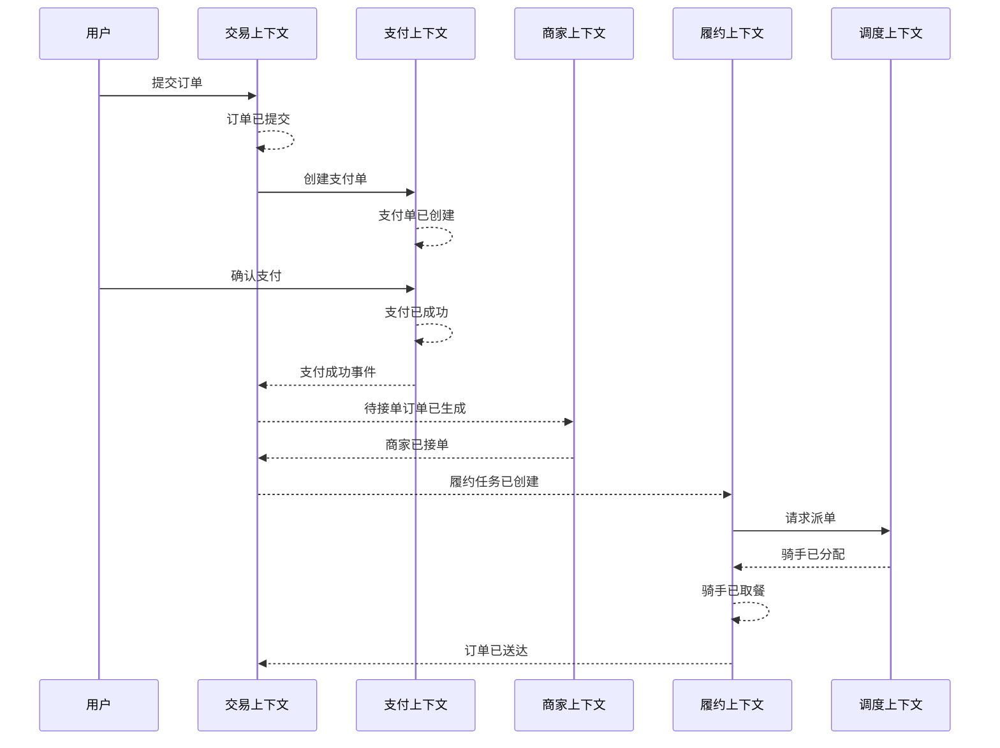
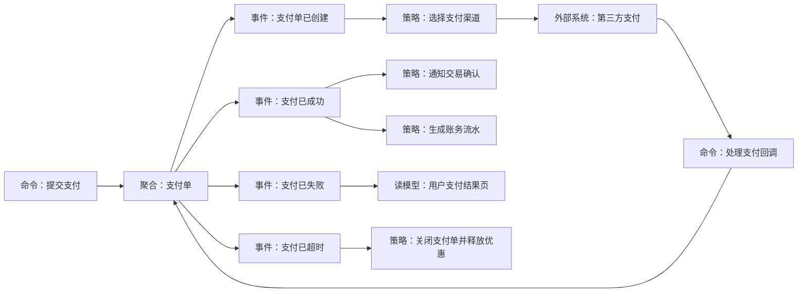

# 事件风暴：从业务流程到领域模型

## 1. 这一章解决什么问题

战略设计最怕两件事：业务专家讲流程，技术团队直接画表；技术团队讲架构，业务专家听不懂。事件风暴的价值，就是把业务知识从人的脑子里拉到墙上，让产品、业务、研发、测试、架构和运营围绕同一条业务事件流对齐事实、规则、异常和边界。

事件风暴不是贴便利贴的仪式，也不是需求评审的换皮版本。它解决的是“我们如何从真实业务过程出发，识别领域事件、命令、聚合、策略、读模型、外部系统和限界上下文”的问题。对于在线订餐、电商支付、物流履约、风控审批这类流程长、异常多、角色多的业务，事件风暴尤其有效。

这篇文章关注落地方法：如何组织事件风暴，如何从事件流提炼领域模型，如何避免开完会以后只留下一张漂亮照片。

## 2. 核心概念

领域事件是业务上已经发生且值得关注的事实，通常用过去式命名，例如“订单已提交”“支付已成功”“商家已接单”“骑手已取餐”。事件不是操作请求，而是结果事实。

命令是触发业务动作的意图，通常用动词命名，例如“提交订单”“确认支付”“商家接单”“申请退款”。命令可能成功，也可能失败；成功后通常产生一个或多个领域事件。

参与者是发起命令的人或系统，例如用户、商家、骑手、客服、定时任务、第三方支付平台。

聚合是处理命令、维护业务不变量、产生领域事件的一致性边界。例如交易订单聚合处理提交订单、取消订单；支付单聚合处理支付回调、超时关闭；配送任务聚合处理接单、取餐、送达。

策略是事件发生后触发的业务规则或自动化反应。例如“支付成功后通知商家接单”“订单超时未支付则自动关闭”“骑手长时间未取餐则触发异常调度”。

读模型是为了查询、展示、运营分析而构建的视图。例如用户订单列表、商家待接单列表、骑手任务看板、客服工单详情。

外部系统是当前领域之外的依赖，例如支付渠道、短信平台、地图服务、风控系统、物流系统。

## 3. 原理与方法拆解

### 3.1 事件风暴为什么从事件开始

流程图常常从“用户点击按钮”开始，数据库设计常常从“有哪些表”开始。事件风暴选择从“业务上发生了什么”开始，因为事件天然具有几个优势：

- 事件是事实，比需求描述更稳定。
- 事件能串起时间顺序，帮助团队发现完整流程。
- 事件会暴露状态变化，进而暴露业务规则。
- 事件能连接上下游，帮助识别上下文边界。
- 事件用业务语言表达，业务专家和技术人员都能参与。

比如“用户支付订单”这个动作背后可能有多个事件：支付单已创建、支付渠道已选择、支付已成功、交易订单已确认、商家已收到接单通知、履约任务已创建。把事件摊开后，团队会发现支付、交易、商家、履约并不是一个模型能装下的。

### 3.2 事件风暴的基本流程

一次完整的事件风暴可以分为六步：

1. 明确目标和范围：本次工作坊讨论的是“用户下单到送达”，还是“支付和退款”，范围越清楚越容易产出。
2. 铺业务事件：让业务专家按时间顺序说出已经发生的业务事实，先不要讨论系统实现。
3. 补命令和参与者：为每个关键事件找到是谁通过什么意图触发的。
4. 找规则和异常：补充策略、校验、超时、失败、补偿、人工干预。
5. 提炼聚合和读模型：识别谁处理命令、谁维护不变量、哪些视图服务查询。
6. 划上下文边界：根据语言、规则、生命周期和协作关系，把事件流切成限界上下文。

这个流程不是线性的。团队通常会反复回到前面调整事件命名、合并重复概念、拆开过大的模型。

### 3.3 便利贴颜色只是辅助，语义才是关键

线下事件风暴常用颜色区分元素，线上工具也可以模拟。颜色不是标准答案，但保持一致有助于沟通：

| 元素 | 建议颜色 | 命名方式 | 示例 |
|---|---|---|---|
| 领域事件 | 橙色 | 过去式 | 订单已提交 |
| 命令 | 蓝色 | 动词短语 | 提交订单 |
| 参与者 | 黄色 | 角色名 | 用户 |
| 聚合 | 浅黄色 | 名词 | 交易订单 |
| 策略 | 紫色 | 条件触发 | 支付成功后创建履约任务 |
| 读模型 | 绿色 | 查询视图 | 商家待接单列表 |
| 外部系统 | 粉色 | 系统名 | 第三方支付 |
| 问题和风险 | 红色 | 待确认事项 | 退款金额如何计算 |

真正重要的是命名。事件要表达业务事实，不要写成“调用支付接口成功”“更新订单状态”。命令要表达业务意图，不要写成“saveOrder”。聚合要表达一致性边界，不要直接照搬数据库表名。

## 4. 实战落地

### 4.1 在线订餐事件风暴示例

下面用简化的在线订餐流程展示事件风暴如何从业务流程走向领域模型：



从这条事件流可以提炼出几个上下文：

- 交易上下文：负责订单提交、价格快照、交易状态、取消规则。
- 支付上下文：负责支付单、渠道回调、支付状态、退款入口。
- 商家上下文：负责营业状态、接单能力、备餐规则。
- 履约上下文：负责配送任务、取餐、送达、履约异常。
- 调度上下文：负责骑手分配、路径、运力策略。

再进一步看聚合：

| 命令 | 主要聚合 | 可能产生的事件 |
|---|---|---|
| 提交订单 | 交易订单 | 订单已提交、订单提交失败 |
| 创建支付单 | 支付单 | 支付单已创建 |
| 确认支付 | 支付单 | 支付已成功、支付已失败 |
| 商家接单 | 商家订单 | 商家已接单、商家已拒单 |
| 创建履约任务 | 配送任务 | 履约任务已创建 |
| 分配骑手 | 调度任务 | 骑手已分配、暂无可用骑手 |
| 申请退款 | 售后单 | 退款申请已提交、退款已拒绝 |

这一步开始把业务流转化为模型候选项。注意它仍然不是最终代码设计，后续还要结合一致性边界、事务要求、性能和团队结构继续校准。

### 4.2 电商支付事件风暴示例

支付流程看起来短，但异常比主流程更重要：



在这个场景中，事件风暴会逼团队回答一些关键问题：

- 支付成功以后，是支付上下文直接改交易订单，还是发布事件给交易上下文？
- 渠道回调重复到达时，支付单如何保证幂等？
- 支付超时和订单超时谁说了算？
- 优惠券在支付失败、超时、取消时如何释放？
- 账务流水由支付域生成，还是账户域根据支付成功事件生成？
- 对账发现渠道成功但本地失败时，如何补偿？

这些问题如果在建模阶段不暴露，后面会变成线上事故或者跨团队扯皮。

### 4.3 从事件风暴到交付物

一场有效的事件风暴至少应沉淀以下交付物：

- 事件流：按时间顺序描述主流程和关键异常流程。
- 术语表：统一事件、命令、角色、聚合、状态的命名。
- 规则清单：记录校验规则、策略规则、超时规则、补偿规则。
- 问题清单：保留业务未决问题，不要在会上假装已经清楚。
- 上下文候选图：标记事件流中语言和规则明显不同的区域。
- 聚合候选表：列出命令、聚合、事件、不变量、事务边界。
- 接口和事件候选：初步识别跨上下文协作契约。

这些交付物要进入后续设计，而不是停留在照片里。可以把事件流整理成 Markdown 文档，把术语表进入代码命名规范，把跨上下文事件进入事件契约仓库，把未决问题进入需求跟踪系统。

### 4.4 从事件风暴产物到代码骨架

事件风暴产出的“命令、聚合、事件”可以直接转成第一版代码骨架。以下单场景为例：

```java
// trade/application/command/SubmitOrderCommand.java
package com.example.food.trade.application.command;

import java.util.List;

public record SubmitOrderCommand(
        String userId,
        String merchantId,
        List<OrderItemCommand> items,
        String addressId
) {}

public record OrderItemCommand(String skuId, int quantity) {}
```

```java
// trade/domain/TradeOrder.java
package com.example.food.trade.domain;

import java.util.ArrayList;
import java.util.List;

public class TradeOrder {
    private final OrderId id;
    private final List<OrderLine> lines;
    private OrderStatus status;
    private final List<Object> domainEvents = new ArrayList<>();

    public static TradeOrder submit(UserId userId, MerchantId merchantId, List<OrderLine> lines) {
        if (lines.isEmpty()) {
            throw new IllegalArgumentException("Order must contain at least one item");
        }
        var order = new TradeOrder(OrderId.next(), lines, OrderStatus.SUBMITTED);
        order.domainEvents.add(new OrderSubmitted(order.id.value(), userId.value(), merchantId.value()));
        return order;
    }

    public List<Object> pullDomainEvents() {
        var events = List.copyOf(domainEvents);
        domainEvents.clear();
        return events;
    }

    private TradeOrder(OrderId id, List<OrderLine> lines, OrderStatus status) {
        this.id = id;
        this.lines = List.copyOf(lines);
        this.status = status;
    }
}
```

```java
// trade/application/SubmitOrderService.java
package com.example.food.trade.application;

public class SubmitOrderService {
    private final TradeOrderRepository repository;
    private final DomainEventPublisher publisher;

    public String handle(SubmitOrderCommand command) {
        var lines = command.items().stream()
                .map(item -> new OrderLine(item.skuId(), item.quantity()))
                .toList();

        var order = TradeOrder.submit(
                new UserId(command.userId()),
                new MerchantId(command.merchantId()),
                lines
        );

        repository.save(order);
        publisher.publish(order.pullDomainEvents());
        return order.id().value();
    }
}
```

同等 Go 写法：

```go
package trade

import "errors"

type SubmitOrderCommand struct {
	UserID     string
	MerchantID string
	Items      []OrderItemCommand
	AddressID  string
}

type OrderItemCommand struct {
	SkuID    string
	Quantity int
}

type TradeOrder struct {
	id           OrderID
	lines        []OrderLine
	status       OrderStatus
	domainEvents []any
}

func SubmitTradeOrder(userID UserID, merchantID MerchantID, lines []OrderLine) (*TradeOrder, error) {
	if len(lines) == 0 {
		return nil, errors.New("order must contain at least one item")
	}
	order := &TradeOrder{
		id:     NextOrderID(),
		lines:  append([]OrderLine(nil), lines...),
		status: OrderSubmitted,
	}
	order.domainEvents = append(order.domainEvents, OrderSubmittedEvent{
		OrderID:    order.id.Value(),
		UserID:     userID.Value(),
		MerchantID: merchantID.Value(),
	})
	return order, nil
}

func (o *TradeOrder) PullDomainEvents() []any {
	events := append([]any(nil), o.domainEvents...)
	o.domainEvents = nil
	return events
}

type SubmitOrderService struct {
	repository TradeOrderRepository
	publisher  DomainEventPublisher
}

func (s SubmitOrderService) Handle(command SubmitOrderCommand) (string, error) {
	lines := make([]OrderLine, 0, len(command.Items))
	for _, item := range command.Items {
		lines = append(lines, NewOrderLine(item.SkuID, item.Quantity))
	}

	order, err := SubmitTradeOrder(
		NewUserID(command.UserID),
		NewMerchantID(command.MerchantID),
		lines,
	)
	if err != nil {
		return "", err
	}

	if err := s.repository.Save(order); err != nil {
		return "", err
	}
	if err := s.publisher.Publish(order.PullDomainEvents()); err != nil {
		return "", err
	}
	return order.id.Value(), nil
}
```

这段骨架体现了事件风暴到代码的映射：

- “提交订单”变成 `SubmitOrderCommand`。
- “交易订单”变成 `TradeOrder` 聚合。
- “订单已提交”变成 `OrderSubmitted` 领域事件。
- 应用服务负责编排，不承载核心规则。
- 规则先进入聚合，后续再决定哪些领域事件需要转成集成事件。

## 5. 常见坑

第一，把事件风暴开成流程评审会。流程评审只确认“现在怎么做”，事件风暴要进一步追问“发生了什么事实、谁触发、什么规则、哪个模型负责”。

第二，事件命名技术化。比如“订单表已更新”“调用支付接口成功”“MQ 已发送”。这些不是领域事件，而是技术实现细节。领域事件应该让业务专家也能理解。

第三，只画主流程，不画异常。真实系统的复杂度往往藏在失败、超时、取消、退款、补偿、人工审核里。只画 happy path 会得到过于天真的模型。

第四，过早讨论数据库和接口。事件风暴早期应该先让业务事实浮现出来，过早进入表结构会压制业务讨论。

第五，没有会后收敛。开完会不整理术语、边界、聚合和问题清单，事件风暴就只是一场热闹的讨论。

第六，把所有事件都做成消息。事件风暴中的领域事件是建模工具，不等于所有事件都要发布到消息队列。是否发布要看跨上下文协作、异步解耦、审计和扩展需求。

## 6. 面试与复盘问题

1. 事件风暴为什么从领域事件开始，而不是从实体或数据库表开始？
2. 领域事件和命令有什么区别？
3. 如何从事件流中识别聚合？
4. 如何从事件风暴结果中识别限界上下文？
5. 在线订餐场景中，哪些事件属于交易上下文，哪些属于履约上下文？
6. 支付回调重复到达，事件风暴阶段应该暴露哪些规则？
7. 事件风暴中的领域事件是否都要落成 MQ 消息？
8. 如何保证事件风暴的产出能继续进入代码设计？
9. 一次事件风暴应该邀请哪些角色参与？

## 7. 小结

- 事件风暴通过领域事件把隐性业务知识显性化。
- 事件表示已经发生的业务事实，命令表示触发业务动作的意图。
- 从事件流可以逐步识别参与者、策略、聚合、读模型、外部系统和上下文边界。
- 异常流程比主流程更能暴露真实业务复杂度。
- 事件风暴产出的领域事件不等于都要实现为消息队列事件。
- 有效的事件风暴必须沉淀术语表、规则清单、问题清单、上下文候选图和聚合候选表。
- 事件风暴的终点不是便利贴，而是模型、边界、契约和代码结构的持续对齐。

## 8. 延伸阅读

- 《DDD 实战课》：12 领域建模：如何用事件风暴构建领域模型。
- 《DDD 微服务落地实战》：07 在线订餐场景中是如何开事件风暴会议的。
- Microsoft Learn: Use domain analysis to model microservices, https://learn.microsoft.com/en-us/azure/architecture/microservices/model/domain-analysis
- Alberto Brandolini: EventStorming 相关资料，https://www.eventstorming.com/
