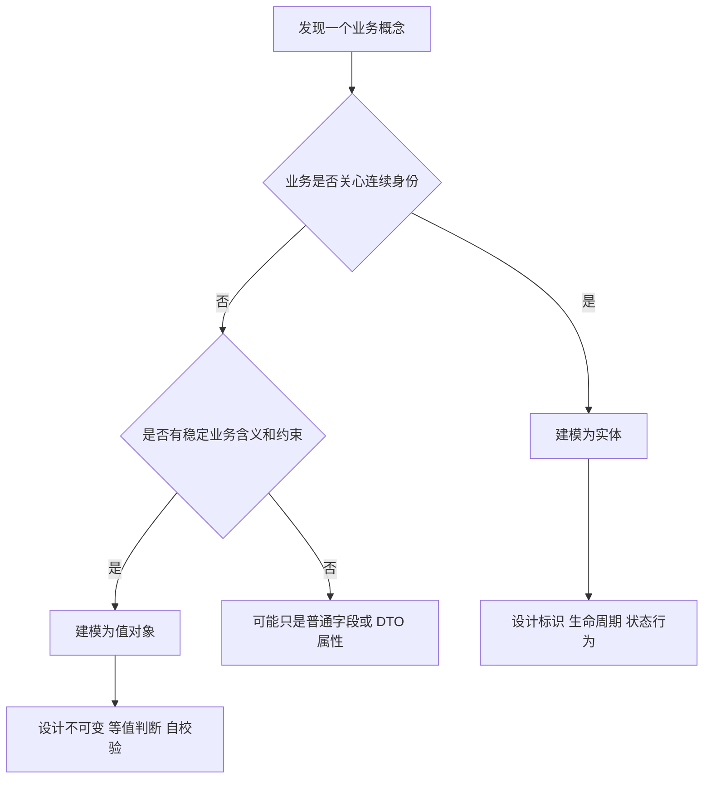

# 实体和值对象：从基础单元看系统设计

## 1. 这一章解决什么问题

很多系统一开始写得很快，后来却越来越难改，一个常见原因是：代码里只有表字段，没有业务对象。`user_id`、`amount`、`status`、`address` 到处传，校验散落在 Controller、Service、Mapper 甚至 SQL 里。需求变更时，开发者只能全文搜索，再祈祷没有漏掉某个分支。

实体和值对象要解决的不是“类怎么分类”这种教材问题，而是帮助我们回答：哪些对象有身份和生命周期，哪些对象只表达一个业务含义；哪些变化应该被跟踪，哪些变化应该用新值替换旧值；哪些规则应该进入对象内部，哪些规则只是应用流程编排。

如果说战略设计帮助我们找到边界，那么实体和值对象就是边界内部最小的一批业务积木。积木定义得好，后面的聚合、仓库、领域事件才有落点；积木定义得差，再漂亮的分层也会退化成表结构驱动的 CRUD。

## 2. 核心概念

**实体**关注身份。只要两个对象代表同一个业务对象，即使属性发生变化，它们仍然是同一个实体。例如订单、用户、账户、优惠券实例。实体通常有唯一标识、生命周期、状态变化和行为约束。

**值对象**关注值的含义。只要两个对象的属性值相同，它们就可以认为相等。例如金额、地址、手机号、时间范围、坐标、订单号。值对象通常不可变，没有独立生命周期，不单独被业务跟踪。

判断实体和值对象的关键不是“数据库里有没有表”，而是业务是否关心它的连续身份。一个地址在电商订单里可能只是值对象，因为订单只需要记录当时收货地址；但在物流地址簿上下文中，地址条目可能是实体，因为用户会新增、编辑、删除、设为默认地址。

| 维度 | 实体 | 值对象 |
|---|---|---|
| 核心关注 | 身份和生命周期 | 属性含义和约束 |
| 相等性 | 标识相同即相同 | 所有关键属性相同即相同 |
| 可变性 | 可以在规则约束下变化 | 推荐不可变，变化即替换 |
| 持久化 | 通常独立或作为聚合的一部分持久化 | 通常嵌入实体或聚合持久化 |
| 典型例子 | Order、Account、Coupon | Money、Address、DateRange、OrderNo |

## 3. 原理与方法拆解

识别实体和值对象时，可以沿着四个问题走。

第一，业务是否会追踪这个对象的“同一个”。用户改名后还是同一个用户，订单从已创建变为已支付仍然是同一个订单，这就是实体。金额从 10 元变成 20 元，不是“同一个金额变化了”，而是用了一个新的金额值替代旧值。

第二，这个对象有没有生命周期。实体通常经历创建、变更、冻结、关闭、取消等状态流转。值对象则更像一次性表达，创建后就不应该被局部修改。

第三，规则应该靠对象自己守住，还是靠外部流程守住。订单不能从已关闭变成已支付，这是订单实体的状态规则；金额不能为负、币种不能为空，这是 Money 值对象的创建规则。

第四，这个对象是否应该暴露内部结构。值对象尤其适合封装复杂含义，外部只通过行为使用它，而不是拿出字段自行判断。比如 `money.isGreaterThan(limit)` 比 `money.getAmount().compareTo(limit.getAmount()) > 0` 更接近业务语言。



一个实用原则是：不要一开始就问“这个类怎么存表”，先问“业务人员如何谈论它”。如果业务语言里经常出现“这张订单”“这个账户”“那张券”，多半有实体味道；如果经常出现“100 元”“北京某地址”“近 30 天”“手机号格式”，多半是值对象或领域原语。

## 4. 实战落地

以订单场景为例，订单是实体，订单号、金额、地址是值对象。订单行是否是实体取决于业务：如果订单行有独立的退货、履约、售后跟踪，可能需要身份；如果只是订单内部的商品明细，可以先作为订单聚合内的局部实体或值对象。

```java
public final class OrderNo {
    private final String value;

    private OrderNo(String value) {
        if (value == null || !value.matches("O\\d{18}")) {
            throw new IllegalArgumentException("订单号格式不合法");
        }
        this.value = value;
    }

    public static OrderNo of(String value) {
        return new OrderNo(value);
    }

    public String value() {
        return value;
    }
}

public final class Money {
    private final BigDecimal amount;
    private final Currency currency;

    public Money(BigDecimal amount, Currency currency) {
        if (amount == null || amount.compareTo(BigDecimal.ZERO) < 0) {
            throw new IllegalArgumentException("金额不能为负");
        }
        this.amount = amount.setScale(2, RoundingMode.HALF_UP);
        this.currency = Objects.requireNonNull(currency);
    }

    public Money add(Money other) {
        if (!currency.equals(other.currency)) {
            throw new IllegalArgumentException("不同币种不能相加");
        }
        return new Money(amount.add(other.amount), currency);
    }
}

public class Order {
    private final OrderId id;
    private final OrderNo orderNo;
    private OrderStatus status;
    private Money totalAmount;
    private Address shippingAddress;

    public void pay(Money paidAmount) {
        if (status != OrderStatus.CREATED) {
            throw new IllegalStateException("只有待支付订单可以支付");
        }
        if (!totalAmount.equals(paidAmount)) {
            throw new IllegalArgumentException("支付金额与订单金额不一致");
        }
        this.status = OrderStatus.PAID;
    }

    public void changeAddress(Address newAddress) {
        if (status != OrderStatus.CREATED) {
            throw new IllegalStateException("订单支付后不能修改收货地址");
        }
        this.shippingAddress = newAddress;
    }
}
```

同等 Go 写法：

```go
package domain

import (
	"errors"
	"regexp"
)

var orderNoPattern = regexp.MustCompile(`^O\d{18}$`)

type OrderNo struct {
	value string
}

func NewOrderNo(value string) (OrderNo, error) {
	if !orderNoPattern.MatchString(value) {
		return OrderNo{}, errors.New("订单号格式不合法")
	}
	return OrderNo{value: value}, nil
}

func (o OrderNo) Value() string {
	return o.value
}

type Money struct {
	amount   int64
	currency string
}

func NewMoney(amount int64, currency string) (Money, error) {
	if amount < 0 {
		return Money{}, errors.New("金额不能为负")
	}
	return Money{amount: amount, currency: currency}, nil
}

func (m Money) Add(other Money) (Money, error) {
	if m.currency != other.currency {
		return Money{}, errors.New("不同币种不能相加")
	}
	return Money{amount: m.amount + other.amount, currency: m.currency}, nil
}
```

在 Spring Boot 项目里，可以让领域对象保持干净，避免把 Web、JPA、JSON 注解塞满领域层。常见做法是：领域层定义实体和值对象，基础设施层用 ORM PO 或 DataObject 负责持久化映射，Assembler 负责转换。

```text
order/
  domain/
    model/
      Order.java
      OrderNo.java
      Money.java
      Address.java
    repository/
      OrderRepository.java
  application/
    OrderApplicationService.java
  infrastructure/
    persistence/
      OrderJpaEntity.java
      OrderJpaRepository.java
      OrderRepositoryImpl.java
```

这不是为了制造层数，而是为了让领域对象不被数据库字段和框架生命周期绑死。小项目可以简化，但不要让实体只剩 getter/setter；一旦业务规则开始变多，就要把行为往对象里收。

## 5. 常见坑

第一个坑是把所有表都映射成实体。数据库表是存储结构，不等于领域模型。有些表只是关联表、快照表、读模型表，没有必要拥有领域行为。

第二个坑是值对象可变。`address.setProvince()` 看似方便，实际会制造共享引用和半更新状态。更稳妥的方式是创建新 `Address`，再由实体方法替换。

第三个坑是实体贫血。订单实体只有字段，`OrderService.pay(orderId)` 里塞满状态判断、金额校验、库存扣减，这会让规则分散，最终每个用例都重新实现一遍业务。

第四个坑是过度建模。不是所有字符串都要立刻封装成类。优先封装高频变化、高风险校验、有明确业务语言的概念，比如金额、手机号、证件号、时间范围、数量。

第五个坑是把 JPA 实体当领域实体直接暴露。JPA 的延迟加载、无参构造、集合代理和脏检查会影响领域模型设计。可以共用，但要有清晰边界；复杂业务更推荐领域模型和持久化模型分离。

## 6. 面试与复盘问题

1. 怎么判断一个对象应该设计成实体还是值对象？
2. 为什么值对象通常要设计成不可变？
3. 数据库表和领域实体是一一对应的吗？什么时候不应该对应？
4. 订单地址在订单上下文中是实体还是值对象？在地址簿上下文中呢？
5. 贫血模型会带来哪些长期维护问题？
6. JPA Entity 能不能直接作为领域实体？代价是什么？
7. 哪些业务概念值得优先封装为值对象？
8. 如何把已有 CRUD Service 逐步重构成有行为的领域对象？

## 7. 小结

- 实体关注身份和生命周期，值对象关注属性含义和不可变约束。
- 判断模型类型要看业务语义，而不是看数据库有没有表。
- 值对象适合封装校验、单位、格式、比较、计算等低层业务规则。
- 实体应该承载与自身状态相关的行为，避免规则散落在应用服务里。
- 领域模型可以和持久化模型分离，尤其在复杂业务中能减少框架对业务对象的污染。
- 好的基础对象会让后续聚合、仓库、领域事件更自然；坏的基础对象会把系统推回表驱动 CRUD。
