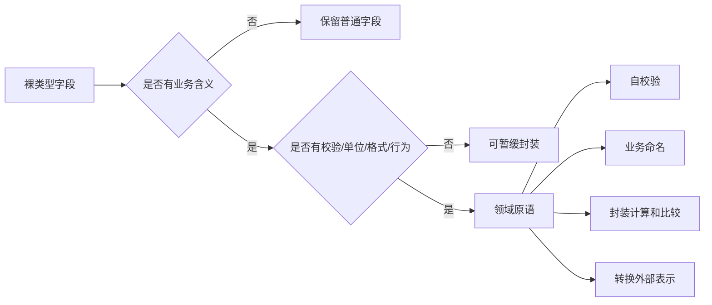

# 领域原语：让隐性业务概念显性化

## 1. 这一章解决什么问题

很多系统的问题不是没有分层，而是业务概念被裸类型吞掉了。手机号是 `String`，订单号是 `String`，金额是 `BigDecimal`，数量是 `Integer`，状态是 `String`。这些类型对编译器来说都差不多，但对业务来说完全不是一回事。

裸类型会带来三个直接后果：校验散落、语义丢失、参数错传。比如 `pay(String orderNo, BigDecimal amount, String phone)` 看起来能跑，但谁也不知道 amount 是元还是分，phone 是下单人还是收货人，orderNo 是外部交易号还是内部订单号。业务约束只能靠注释、约定和测试兜底。

领域原语要解决的就是这个问题：把隐性的业务概念显性化，让类型本身携带语义、约束和基本行为。它是从贫血模型走向业务模型的第一步，成本小，却能立刻改善代码可读性和可靠性。

## 2. 核心概念

领域原语可以理解为“具有业务含义的最小类型”。它通常是值对象的一种，但更强调从裸类型中解放业务概念。`PhoneNumber`、`Money`、`OrderNo`、`SkuCode`、`Quantity`、`DateRange`、`Email`、`UserId` 都是典型候选。

一个合格的领域原语至少应该做到四件事。

第一，自校验。非法值不应该进入系统内部。手机号格式不对、数量小于 1、金额精度错误，都应该在创建领域原语时失败。

第二，语义命名。方法签名应该让人一眼看懂参数含义。`pay(OrderNo orderNo, Money amount)` 比 `pay(String orderNo, BigDecimal amount)` 更可靠。

第三，封装行为。金额可以比较、相加、换算；时间范围可以判断重叠；数量可以增减；手机号可以脱敏。行为越靠近数据，重复逻辑越少。

第四，隔离外部表示。接口传入的字符串、数据库存储的数字、消息里的 JSON 字段，都是表示形式；领域原语负责把表示转换成业务含义。

## 3. 原理与方法拆解

识别领域原语，可以从代码异味入手。

如果同一类校验在多个地方重复出现，例如手机号正则、金额非负、日期范围起止校验，说明这里有领域原语。重复校验不是简单的代码重复，而是业务知识没有归位。

如果方法参数里连续出现多个相同基础类型，也说明需要显性类型。例如 `createOrder(String userId, String skuId, String address, String couponId)`，编译器无法阻止你把 `skuId` 和 `couponId` 传反。

如果字段有单位、精度、格式、上下限、来源含义，也应该考虑领域原语。金额的币种和精度，重量的单位，库存数量的最小值，折扣率的区间，都不应该靠注释维护。



领域原语的设计不追求“一切皆对象”。它更像一把小刀，优先切开那些最容易出错、最频繁复用、最能表达业务语言的地方。实践中可以先从 Money、OrderNo、Quantity、PhoneNumber 这类高价值概念开始。

## 4. 实战落地

先看一个典型的坏味道。

```java
public void submitOrder(String userId, String skuId, Integer quantity,
                        BigDecimal price, String receiverPhone) {
    if (quantity == null || quantity <= 0) {
        throw new IllegalArgumentException("数量不合法");
    }
    if (price == null || price.compareTo(BigDecimal.ZERO) < 0) {
        throw new IllegalArgumentException("价格不合法");
    }
    if (!receiverPhone.matches("^1\\d{10}$")) {
        throw new IllegalArgumentException("手机号不合法");
    }
    // 继续处理下单流程
}
```

同等 Go 写法：

```go
func SubmitOrder(userID, skuID string, quantity int, price int64, receiverPhone string) error {
	if quantity <= 0 {
		return errors.New("数量不合法")
	}
	if price < 0 {
		return errors.New("价格不合法")
	}
	if !phonePattern.MatchString(receiverPhone) {
		return errors.New("手机号不合法")
	}
	// 继续处理下单流程
	return nil
}
```

这些校验迟早会复制到预下单、改数量、结算、补单、批量导入等场景。更好的方式是把概念收进领域原语。

```java
public final class Quantity {
    private final int value;

    private Quantity(int value) {
        if (value <= 0 || value > 999) {
            throw new IllegalArgumentException("购买数量必须在 1 到 999 之间");
        }
        this.value = value;
    }

    public static Quantity of(int value) {
        return new Quantity(value);
    }

    public Quantity add(Quantity other) {
        return new Quantity(this.value + other.value);
    }

    public int value() {
        return value;
    }
}

public final class PhoneNumber {
    private final String value;

    private PhoneNumber(String value) {
        if (value == null || !value.matches("^1\\d{10}$")) {
            throw new IllegalArgumentException("手机号格式不合法");
        }
        this.value = value;
    }

    public static PhoneNumber of(String value) {
        return new PhoneNumber(value);
    }

    public String masked() {
        return value.substring(0, 3) + "****" + value.substring(7);
    }
}

public final class Money {
    private final BigDecimal amount;
    private final Currency currency;

    public static Money cny(BigDecimal amount) {
        return new Money(amount, Currency.getInstance("CNY"));
    }

    private Money(BigDecimal amount, Currency currency) {
        if (amount == null || amount.compareTo(BigDecimal.ZERO) < 0) {
            throw new IllegalArgumentException("金额不能为负");
        }
        this.amount = amount.setScale(2, RoundingMode.HALF_UP);
        this.currency = currency;
    }

    public boolean greaterThan(Money other) {
        assertSameCurrency(other);
        return amount.compareTo(other.amount) > 0;
    }

    private void assertSameCurrency(Money other) {
        if (!currency.equals(other.currency)) {
            throw new IllegalArgumentException("币种不一致");
        }
    }
}
```

同等 Go 写法：

```go
type Quantity struct {
	value int
}

func NewQuantity(value int) (Quantity, error) {
	if value <= 0 || value > 999 {
		return Quantity{}, errors.New("购买数量必须在 1 到 999 之间")
	}
	return Quantity{value: value}, nil
}

func (q Quantity) Add(other Quantity) (Quantity, error) {
	return NewQuantity(q.value + other.value)
}

func (q Quantity) Value() int {
	return q.value
}

type PhoneNumber struct {
	value string
}

var phonePattern = regexp.MustCompile(`^1\d{10}$`)

func NewPhoneNumber(value string) (PhoneNumber, error) {
	if !phonePattern.MatchString(value) {
		return PhoneNumber{}, errors.New("手机号格式不合法")
	}
	return PhoneNumber{value: value}, nil
}

func (p PhoneNumber) Value() string {
	return p.value
}
```

应用服务中可以把外部 DTO 转换成命令对象，再由命令持有领域原语。

```java
public record SubmitOrderCommand(
        UserId userId,
        SkuId skuId,
        Quantity quantity,
        Money price,
        PhoneNumber receiverPhone
) {
    public static SubmitOrderCommand from(SubmitOrderRequest request) {
        return new SubmitOrderCommand(
                UserId.of(request.userId()),
                SkuId.of(request.skuId()),
                Quantity.of(request.quantity()),
                Money.cny(request.price()),
                PhoneNumber.of(request.receiverPhone())
        );
    }
}
```

同等 Go 写法：

```go
type SubmitOrderRequest struct {
	UserID        string
	SkuID         string
	Quantity      int
	Price         int64
	ReceiverPhone string
}

type SubmitOrderCommand struct {
	UserID        UserID
	SkuID         SkuID
	Quantity      Quantity
	Price         Money
	ReceiverPhone PhoneNumber
}

func NewSubmitOrderCommand(request SubmitOrderRequest) (SubmitOrderCommand, error) {
	quantity, err := NewQuantity(request.Quantity)
	if err != nil {
		return SubmitOrderCommand{}, err
	}
	phone, err := NewPhoneNumber(request.ReceiverPhone)
	if err != nil {
		return SubmitOrderCommand{}, err
	}
	price, err := CNY(request.Price)
	if err != nil {
		return SubmitOrderCommand{}, err
	}
	return SubmitOrderCommand{
		UserID:        NewUserID(request.UserID),
		SkuID:         NewSkuID(request.SkuID),
		Quantity:      quantity,
		Price:         price,
		ReceiverPhone: phone,
	}, nil
}
```

在 Spring Boot 中，领域原语可以通过 Converter、Jackson 序列化器、MyBatis TypeHandler 或 JPA AttributeConverter 处理边界转换。但要注意，转换器属于接口层或基础设施层，领域原语本身不要依赖 Spring。

```java
@Converter(autoApply = true)
public class PhoneNumberConverter implements AttributeConverter<PhoneNumber, String> {
    @Override
    public String convertToDatabaseColumn(PhoneNumber attribute) {
        return attribute == null ? null : attribute.value();
    }

    @Override
    public PhoneNumber convertToEntityAttribute(String dbData) {
        return dbData == null ? null : PhoneNumber.of(dbData);
    }
}
```

同等 Go 写法：

```go
func PhoneNumberToDB(value PhoneNumber) string {
	return value.Value()
}

func PhoneNumberFromDB(value string) (PhoneNumber, error) {
	if value == "" {
		return PhoneNumber{}, nil
	}
	return NewPhoneNumber(value)
}
```

## 5. 常见坑

第一个坑是把领域原语写成普通包装类，只包一层字段，没有校验也没有行为。这只是换了名字的裸类型，收益很低。

第二个坑是让领域原语依赖基础设施。比如在 `PhoneNumber` 里调用数据库查号段，在 `Money` 里调用汇率服务。领域原语应保持轻量，涉及外部资源的规则可以放到领域服务或应用服务编排中。

第三个坑是过度封装。后台列表页里的普通备注、临时搜索关键字、导出文件名，不一定都需要领域原语。封装应该优先服务于业务正确性，而不是追求形式完整。

第四个坑是异常语义混乱。领域原语创建失败通常意味着输入不满足业务约束，接口层应转换成明确的参数错误；不要让底层 `IllegalArgumentException` 原样冒到用户界面。

第五个坑是忽略序列化和持久化成本。领域原语越多，DTO、ORM、JSON 转换就越需要规范。团队最好约定统一的转换方式，否则会在工程细节上耗掉收益。

## 6. 面试与复盘问题

1. 领域原语和值对象是什么关系？
2. 为什么裸类型会导致业务规则散落？
3. 什么样的字段值得优先封装成领域原语？
4. 领域原语应该包含哪些行为，哪些行为不应该放进去？
5. 如何在 Spring Boot 中处理领域原语的 JSON 和数据库转换？
6. 领域原语会不会增加代码量？它的收益如何衡量？
7. 如何从已有项目中渐进式引入领域原语？
8. 参数校验放在 Controller、DTO 注解和领域原语中分别有什么差异？

## 7. 小结

- 领域原语把裸类型中的业务含义、约束和行为显性化。
- 它通常是值对象的一种，但更强调治理 `String`、`BigDecimal`、`Integer` 滥用。
- 自校验、语义命名、行为封装和外部表示隔离，是领域原语的四个核心价值。
- 领域原语不应该依赖数据库、RPC、Spring Bean 等外部设施。
- 引入领域原语要从高风险、高复用、高业务含义的概念开始，避免为了封装而封装。
- 它是改善贫血模型的低成本入口，也是让统一语言进入代码的最短路径。
