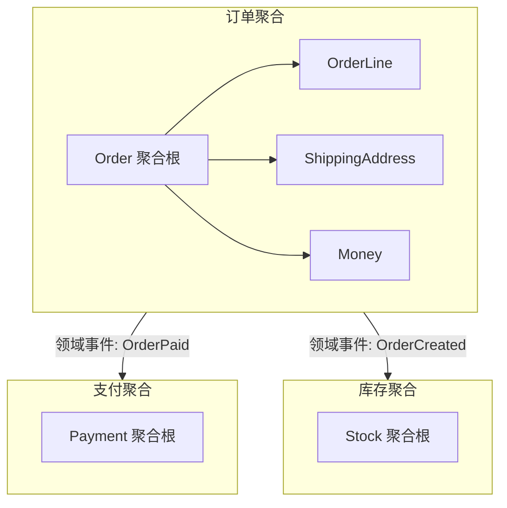
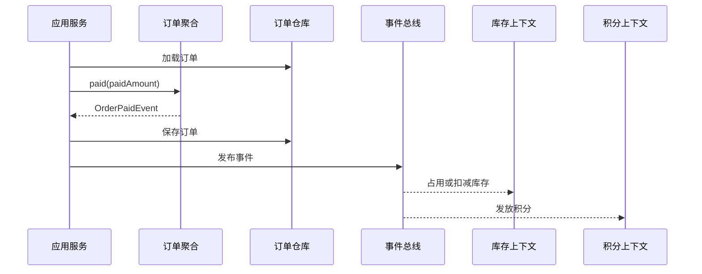

# 聚合和聚合根怎样设计

## 1. 这一章解决什么问题

实体和值对象解决的是模型内部的基础单元问题，但业务系统真正麻烦的地方在于对象之间的协作。订单有订单行、收货地址、支付记录、优惠明细、库存占用、发票信息。它们看起来都有关联，如果直接画成对象关系图，很容易把整个交易链路揉成一个巨大对象。

聚合要解决的是一致性边界问题：哪些对象必须在同一个事务里保持强一致，哪些对象可以通过事件、任务或补偿达到最终一致。聚合根则解决访问入口问题：外部只能通过一个根对象修改聚合内部状态，从而让不变量有地方被守住。

一句话说，聚合不是“对象包含关系”，也不是“数据库外键关系”，而是业务规则要求的事务边界。设计聚合时，真正要问的是：如果这次操作成功，哪些规则必须立即成立？

## 2. 核心概念

**聚合**是一组相关对象的边界，边界内部共同维护一组业务不变量。聚合内部可以包含实体和值对象，外部不应该直接修改内部对象。

**聚合根**是聚合的唯一入口。外部通过聚合根调用行为，由聚合根协调内部对象变化，并保证聚合内规则成立。

**不变量**是任何时候都必须成立的业务约束。例如订单总金额必须等于订单行金额汇总；已支付订单不能修改收货地址；优惠券不能被重复核销；账户余额不能为负。

**一致性边界**决定事务范围。聚合内通常强一致，聚合间通常最终一致。跨聚合强一致不是绝对禁止，但要非常谨慎，因为它会放大锁、事务、服务调用和故障恢复成本。



## 3. 原理与方法拆解

设计聚合可以按五步走。

第一步，列出业务动作。不要从表结构出发，而是从命令出发：创建订单、修改地址、确认支付、取消订单、申请退款、核销优惠券、扣减库存。

第二步，找不变量。每个动作成功后，哪些规则必须立即满足？创建订单时，订单行不能为空、总金额要正确、收货地址要合法；支付订单时，订单必须处于待支付，支付金额必须匹配；取消订单时，已发货订单不能直接取消。

第三步，确定强一致对象集合。为了守住这些不变量，哪些对象必须在一个事务里一起变化？这些对象就是聚合候选。订单和订单行通常在一个聚合内，因为总金额、商品数量、订单状态强相关；订单和库存通常不在同一个聚合，因为库存服务可能服务多个业务场景，扣减可以通过库存占用事件最终完成。

第四步，选择聚合根。聚合根应该是业务上最自然的操作入口，也是外部引用的身份。订单聚合的根通常是 `Order`，外部不应直接保存 `OrderLine` 并修改数量，而应调用 `order.changeQuantity(lineId, quantity)`。

第五步，控制聚合大小。聚合越大，单次事务越重，并发冲突越多；聚合越小，跨聚合协作越多，最终一致性成本越高。好的聚合设计是在业务一致性和系统并发之间找平衡。

## 4. 实战落地

下面是一个订单聚合的简化设计。注意应用服务只负责加载聚合、调用行为、保存聚合、发布事件，不负责拼装订单内部规则。

```java
public class Order {
    private final OrderId id;
    private final UserId buyerId;
    private final List<OrderLine> lines = new ArrayList<>();
    private Address shippingAddress;
    private Money totalAmount;
    private OrderStatus status;
    private final List<DomainEvent> events = new ArrayList<>();

    public static Order create(UserId buyerId, List<OrderLine> lines, Address address) {
        if (lines == null || lines.isEmpty()) {
            throw new IllegalArgumentException("订单明细不能为空");
        }
        Order order = new Order(OrderId.newId(), buyerId);
        order.lines.addAll(lines);
        order.shippingAddress = address;
        order.totalAmount = order.calculateTotal();
        order.status = OrderStatus.CREATED;
        order.events.add(new OrderCreatedEvent(order.id));
        return order;
    }

    public void changeQuantity(OrderLineId lineId, Quantity quantity) {
        ensureCreated();
        OrderLine line = findLine(lineId);
        line.changeQuantity(quantity);
        this.totalAmount = calculateTotal();
    }

    public void paid(Money paidAmount) {
        ensureCreated();
        if (!this.totalAmount.equals(paidAmount)) {
            throw new IllegalArgumentException("支付金额不一致");
        }
        this.status = OrderStatus.PAID;
        this.events.add(new OrderPaidEvent(this.id, this.buyerId, this.totalAmount));
    }

    private void ensureCreated() {
        if (status != OrderStatus.CREATED) {
            throw new IllegalStateException("当前订单状态不允许该操作");
        }
    }

    private Money calculateTotal() {
        return lines.stream()
                .map(OrderLine::subtotal)
                .reduce(Money.zero(Currency.getInstance("CNY")), Money::add);
    }
}
```

同等 Go 写法：

```go
type Order struct {
	id              OrderID
	buyerID         UserID
	lines           []OrderLine
	shippingAddress Address
	totalAmount     Money
	status          OrderStatus
	events          []DomainEvent
}

func CreateOrder(buyerID UserID, lines []OrderLine, address Address) (*Order, error) {
	if len(lines) == 0 {
		return nil, errors.New("订单明细不能为空")
	}
	order := &Order{
		id:              NewOrderID(),
		buyerID:         buyerID,
		lines:           append([]OrderLine(nil), lines...),
		shippingAddress: address,
		status:          Created,
	}
	order.totalAmount = order.calculateTotal()
	order.events = append(order.events, OrderCreatedEvent{OrderID: order.id})
	return order, nil
}

func (o *Order) ChangeQuantity(lineID OrderLineID, quantity Quantity) error {
	if err := o.ensureCreated(); err != nil {
		return err
	}
	line, err := o.findLine(lineID)
	if err != nil {
		return err
	}
	if err := line.ChangeQuantity(quantity); err != nil {
		return err
	}
	o.totalAmount = o.calculateTotal()
	return nil
}

func (o *Order) Paid(paidAmount Money) error {
	if err := o.ensureCreated(); err != nil {
		return err
	}
	if !o.totalAmount.Equal(paidAmount) {
		return errors.New("支付金额不一致")
	}
	o.status = Paid
	o.events = append(o.events, OrderPaidEvent{OrderID: o.id})
	return nil
}
```

仓库以聚合根为单位读写，不为聚合内部对象单独开放仓库。

```java
public interface OrderRepository {
    Optional<Order> findById(OrderId orderId);
    void save(Order order);
}

@Service
public class PayOrderApplicationService {
    private final OrderRepository orderRepository;
    private final DomainEventPublisher eventPublisher;

    @Transactional
    public void pay(PayOrderCommand command) {
        Order order = orderRepository.findById(command.orderId())
                .orElseThrow(() -> new NotFoundException("订单不存在"));
        order.paid(command.paidAmount());
        orderRepository.save(order);
        eventPublisher.publish(order.pullEvents());
    }
}
```

同等 Go 写法：

```go
type OrderRepository interface {
	FindByID(orderID OrderID) (*Order, error)
	Save(order *Order) error
}

type DomainEventPublisher interface {
	Publish(events []DomainEvent) error
}

type PayOrderApplicationService struct {
	orderRepository OrderRepository
	eventPublisher  DomainEventPublisher
}

func (s PayOrderApplicationService) Pay(command PayOrderCommand) error {
	order, err := s.orderRepository.FindByID(command.OrderID)
	if err != nil {
		return err
	}
	if err := order.Paid(command.PaidAmount); err != nil {
		return err
	}
	if err := s.orderRepository.Save(order); err != nil {
		return err
	}
	return s.eventPublisher.Publish(order.PullEvents())
}
```

如果支付成功后还要扣库存、发积分、通知商家，不要把这些对象都塞进订单聚合。订单聚合只发布 `OrderPaidEvent`，库存、积分、通知由各自上下文订阅处理。这样订单只维护订单规则，跨聚合协作交给事件和最终一致性。



## 5. 常见坑

第一个坑是把聚合设计成对象关系图。看到订单关联支付、库存、物流、发票，就全部放进一个聚合，最后任何小改动都要加载半个系统。

第二个坑是聚合过小。每个表一个聚合，导致一个业务操作要保存五六个聚合，还要求一个本地事务强一致。这其实说明边界切碎了，不变量没有被识别清楚。

第三个坑是绕过聚合根。外部直接更新订单行、优惠明细、状态字段，聚合根就失去了守门作用。不变量散了，后面只能靠数据库触发器或补丁脚本兜底。

第四个坑是用双向对象引用制造复杂性。聚合之间推荐通过 ID 引用，而不是直接持有对方对象。需要对方信息时，可以通过应用服务查询，或者维护读模型快照。

第五个坑是把所有一致性都做成强一致。跨上下文的支付、库存、积分、通知天然会遇到网络、事务和失败恢复问题。能接受最终一致的场景，应优先用事件、Outbox、幂等消费和补偿机制。

## 6. 面试与复盘问题

1. 聚合和普通对象组合有什么区别？
2. 聚合根为什么必须是外部访问聚合的唯一入口？
3. 如何识别聚合内部的不变量？
4. 聚合内强一致、聚合间最终一致是什么意思？
5. 为什么微服务通常不应该小于聚合？
6. 订单、支付、库存应该放在一个聚合里吗？为什么？
7. Repository 为什么通常以聚合根为单位？
8. 聚合之间通过对象引用和通过 ID 引用有什么差异？
9. 聚合设计过大或过小分别会带来什么问题？

## 7. 小结

- 聚合的本质是事务一致性边界，不是对象关系图，也不是数据库外键集合。
- 聚合根是聚合对外的唯一修改入口，用来守住内部不变量。
- 聚合设计要从业务动作和不变量出发，而不是从表结构出发。
- 聚合内优先强一致，聚合间优先最终一致，跨聚合事务要谨慎。
- 仓库应以聚合根为单位读写，避免为内部对象暴露独立修改入口。
- 聚合过大降低并发、增加加载成本；聚合过小会制造大量跨聚合一致性问题。
- 领域事件是聚合之间协作的重要手段，但需要配合 Outbox、幂等和补偿机制落地。
