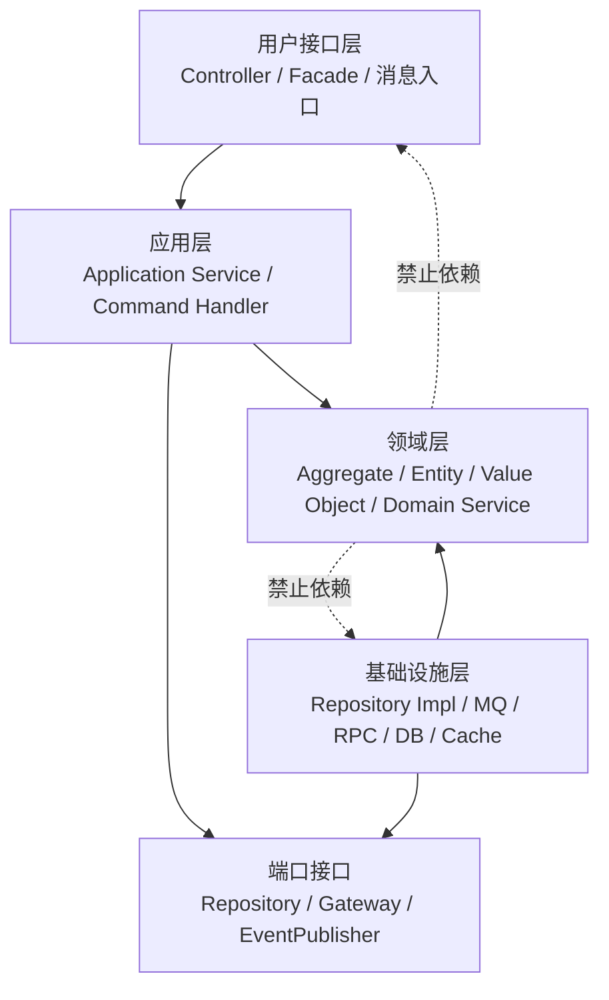

# DDD分层架构如何降低依赖

## 1. 解决什么问题

很多团队第一次落地 DDD 时，最容易把精力放在“实体、值对象、聚合、仓库”这些名词上，却忽略一个更朴素的问题：这些对象最后到底放在哪里，谁可以调用谁，谁不能依赖谁。

如果架构分层不清，领域对象会很快被数据库字段、RPC DTO、前端展示格式和框架注解污染。短期看功能能跑，长期看每次改业务规则都要顺手改表结构、接口协议、缓存逻辑和页面字段，系统逐渐变成“技术细节牵着业务走”。DDD 分层架构要解决的不是多写几层代码，而是让业务规则拥有一个稳定的位置，让变化沿着可控方向传递。

这篇文章重点回答三个问题：

- DDD 为什么需要分层，分层到底隔离了哪些变化。
- 应用层、领域层、基础设施层、用户接口层分别负责什么。
- 如何在代码目录、依赖方向和团队评审中守住分层边界。

## 2. 核心概念

DDD 常见分层可以简化为四层：

- 用户接口层：接收外部请求，完成协议转换、参数校验、认证上下文提取和响应组装。
- 应用层：编排一个业务用例，控制事务、调用领域对象、发送领域事件、协调外部端口。
- 领域层：表达核心业务概念和规则，包括实体、值对象、聚合、领域服务、仓库接口、领域事件。
- 基础设施层：实现技术细节，包括 ORM、数据库、消息队列、缓存、RPC 客户端、第三方 SDK。

分层的关键不在“有几个包”，而在依赖方向：外层可以依赖内层，内层不能依赖外层。领域层应该不知道 Spring MVC、MyBatis、Kafka、Redis、HTTP 状态码、数据库表名这些细节。它只关心订单是否能支付、账户余额是否足够、优惠券是否可用、库存是否能锁定。

可以用一张图理解依赖方向：



这里有一个容易误解的点：基础设施层看起来在最底下，但它并不是被领域层依赖的“底座”。在 DDD 里，仓库接口、网关接口、事件发布接口通常定义在领域层或应用层，基础设施层反过来实现这些接口。这就是依赖倒置。

## 3. 原理/方法拆解

### 3.1 按变化原因分层

分层的本质是把不同变化原因隔离开。

用户接口层的变化来自协议和交互：REST 改成 GraphQL、Web 请求增加字段、消息入口新增消费主题。

应用层的变化来自用例流程：下单后要不要发券，支付成功后是否触发会员成长值，审批流程是否增加节点。

领域层的变化来自业务规则：什么叫有效订单，什么状态允许退款，什么条件下优惠可以叠加。

基础设施层的变化来自技术实现：MySQL 换分库分表，Redis 缓存策略调整，MQ 从 RocketMQ 换 Kafka，第三方支付 SDK 升级。

如果这些变化混在一个 `OrderService` 里，任何一个变化都会牵动全部代码。分层的价值，就是让协议变化停在接口层，流程变化停在应用层，规则变化集中在领域层，技术变化被基础设施层吸收。

### 3.2 应用服务不等于领域服务

应用服务负责“用例编排”，领域服务负责“领域规则”。

例如“用户提交订单”这个用例，应用服务可以做：

- 解析命令对象。
- 查询买家、商品、优惠券等聚合。
- 调用聚合行为完成下单。
- 保存聚合。
- 发布订单已创建事件。
- 返回订单号。

但“订单金额如何计算”“优惠券能否使用”“订单状态如何流转”不应该散落在应用服务里。它们属于领域规则，应该进入值对象、聚合或领域服务。

一个判断标准是：如果这段逻辑去掉数据库、事务、RPC、消息队列后仍然有业务意义，它大概率属于领域层；如果它主要是在安排谁先调用谁、失败如何回滚、请求如何转换，它更像应用层。

### 3.3 仓库接口属于领域语言

很多项目把 Repository 写成 DAO 的另一种名字：

```java
List<OrderDO> selectByUserId(Long userId);
void insert(OrderDO orderDO);
void updateStatus(Long orderId, Integer status);
```

同等 Go 写法：

```go
SelectByUserID(userID int64) ([]OrderDO, error)
Insert(orderDO OrderDO) error
UpdateStatus(orderID int64, status int) error
```

这样的接口表达的是表操作，不是领域概念。DDD 中的仓库应该围绕聚合根组织：

```java
public interface OrderRepository {
    Optional<Order> find(OrderId orderId);
    void save(Order order);
}
```

同等 Go 写法：

```go
type OrderRepository interface {
	Find(orderID OrderID) (*Order, error)
	Save(order *Order) error
}
```

它的语义是“取出一个订单聚合”和“保存一个订单聚合”，而不是暴露 SQL 能力。至于底层是单表、多表、事件存储还是远程服务，属于基础设施层实现细节。

### 3.4 DTO、DO、Entity 不能混用

一个常见依赖污染是让同一个对象同时扮演多种角色：

- Controller 入参用它。
- 数据库映射用它。
- 领域逻辑也写在它上面。
- RPC 出参还继续复用它。

这种“全场通用对象”会让任何一方的变化都污染全局。DDD 通常会区分：

- Command / Query：表达用例输入。
- DTO / VO：表达接口输出。
- Entity / Value Object：表达领域模型。
- DO / PO：表达持久化结构。
- Assembler / Converter：负责对象转换。

转换看似繁琐，实则是在不同模型之间建立防火墙。越是复杂业务，越不能用一套对象穿透所有层。

## 4. 实战落地

### 4.1 推荐代码目录

以订单上下文为例，一个偏 Java/Spring Boot 的目录可以这样组织：

```text
order-service
  src/main/java/com/example/order
    interfaces
      rest
        OrderController.java
        request/CreateOrderRequest.java
        response/OrderDetailResponse.java
      mq
        PaymentSucceededConsumer.java
    application
      command
        CreateOrderCommand.java
        PayOrderCommand.java
      service
        OrderApplicationService.java
      assembler
        OrderDtoAssembler.java
    domain
      model
        Order.java
        OrderItem.java
        OrderId.java
        Money.java
        OrderStatus.java
      service
        PricingDomainService.java
      repository
        OrderRepository.java
      event
        OrderCreatedEvent.java
    infrastructure
      persistence
        OrderRepositoryImpl.java
        mapper/OrderMapper.java
        dataobject/OrderDO.java
      mq
        DomainEventPublisherImpl.java
      rpc
        InventoryGatewayImpl.java
```

这套目录不是唯一答案，但它表达了几个重要约束：

- `interfaces` 不直接操作数据库，不直接拼业务规则。
- `application` 可以开启事务、编排领域对象，但不写复杂领域判断。
- `domain` 不依赖 Spring MVC、ORM、MQ 客户端。
- `infrastructure` 可以依赖领域层接口并提供实现。

### 4.2 一段典型调用链

```java
@Service
public class OrderApplicationService {
    private final OrderRepository orderRepository;
    private final InventoryGateway inventoryGateway;
    private final DomainEventPublisher eventPublisher;

    @Transactional
    public OrderId create(CreateOrderCommand command) {
        InventorySnapshot inventory = inventoryGateway.check(command.items());
        Order order = Order.create(command.buyerId(), command.items(), inventory);

        orderRepository.save(order);
        eventPublisher.publish(order.domainEvents());

        return order.id();
    }
}
```

同等 Go 写法：

```go
type OrderApplicationService struct {
	orderRepository OrderRepository
	inventoryGateway InventoryGateway
	eventPublisher   DomainEventPublisher
}

func (s OrderApplicationService) Create(command CreateOrderCommand) (OrderID, error) {
	inventory, err := s.inventoryGateway.Check(command.Items)
	if err != nil {
		return OrderID{}, err
	}
	order, err := CreateOrder(command.BuyerID, command.Items, inventory)
	if err != nil {
		return OrderID{}, err
	}

	if err := s.orderRepository.Save(order); err != nil {
		return OrderID{}, err
	}
	if err := s.eventPublisher.Publish(order.DomainEvents()); err != nil {
		return OrderID{}, err
	}
	return order.ID(), nil
}
```

这里应用服务负责协调库存网关、订单聚合、仓库和事件发布。订单能不能创建、明细是否合法、金额如何计算，则应该由 `Order.create`、`OrderItem`、`Money` 或领域服务承担。

### 4.3 依赖守护规则

分层不是靠口头约定长期维持的，最好配合工程规则：

- 领域层禁止引用 `controller`、`mapper`、`repository.impl`、`dataobject` 包。
- 领域层禁止依赖 Web、ORM、MQ、RPC 框架。
- 接口层不得直接调用基础设施层 Mapper。
- 应用服务不得返回 DO。
- 仓库实现不得把 ORM 查询对象泄漏到领域层。

在 Java 项目里可以用 ArchUnit、Maven module、Gradle dependency constraints 或简单的包扫描脚本做检查。哪怕最开始只做几条规则，也比完全依赖 code review 稳定。

### 4.4 从贫血模型渐进改造

存量项目不必一次性重构成标准 DDD。更现实的路径是：

1. 先识别最核心的业务用例，例如下单、支付、退款。
2. 把这些用例中的规则从大 Service 中抽取到领域对象。
3. 为核心聚合建立仓库接口，避免业务层直接操作 Mapper。
4. 保留原有表结构，通过基础设施层完成 DO 与领域对象转换。
5. 再逐步拆出值对象、领域事件和领域服务。

DDD 落地最怕“一上来全量重构”。更好的方式是围绕高变化、高复杂度的业务闭环做局部加固。

## 5. 常见坑

- 把分层理解成“Controller-Service-DAO”三层改名。传统三层常以技术职责分层，DDD 分层强调领域模型的独立性。
- 应用服务越来越厚。所有 if/else 都写在应用服务里，领域对象只剩 getter/setter，本质还是事务脚本。
- Repository 变成万能查询器。仓库暴露分页、联表、任意条件查询后，会把数据访问模型倒灌进领域层。
- DTO 到处复用。接口 DTO 一旦进入领域层，前端字段变化就会影响业务模型。
- 基础设施层反客为主。为了适配 ORM，把领域对象设计成无参构造、可变属性、公开 setter，业务不变式就会失守。
- 所有模块都套满 DDD 模式。简单字典、后台配置、低复杂度 CRUD 可以轻量处理，不必强行聚合、工厂、领域服务齐全。

## 6. 面试/复盘问题

- DDD 分层和传统三层架构有什么本质区别？
- 应用服务和领域服务如何分工？如何判断一段逻辑应该放在哪里？
- 为什么领域层不应该依赖数据库、消息队列和 Web 框架？
- Repository 和 DAO 的区别是什么？为什么仓库接口要围绕聚合根设计？
- DTO、DO、领域实体混用会带来什么问题？
- 如何在工程上防止分层被破坏？
- 存量贫血模型系统如何渐进式引入 DDD 分层？
- 分层会不会增加代码量？什么场景下不值得使用重型 DDD？

## 7. 小结

DDD 分层架构的核心价值，是把业务规则从技术细节中解放出来。用户接口层处理协议，应用层编排用例，领域层表达规则，基础设施层吸收技术变化。

判断分层是否有效，不是看包名是否标准，而是看依赖方向是否稳定：领域模型能否脱离数据库和框架单独表达业务，应用服务是否只做编排，基础设施变化是否不会冲击业务规则。

好的分层会让代码多一些转换和接口，但换来的是长期演进能力。对于复杂业务系统，这些边界不是形式主义，而是抵抗软件退化的基本工程纪律。
