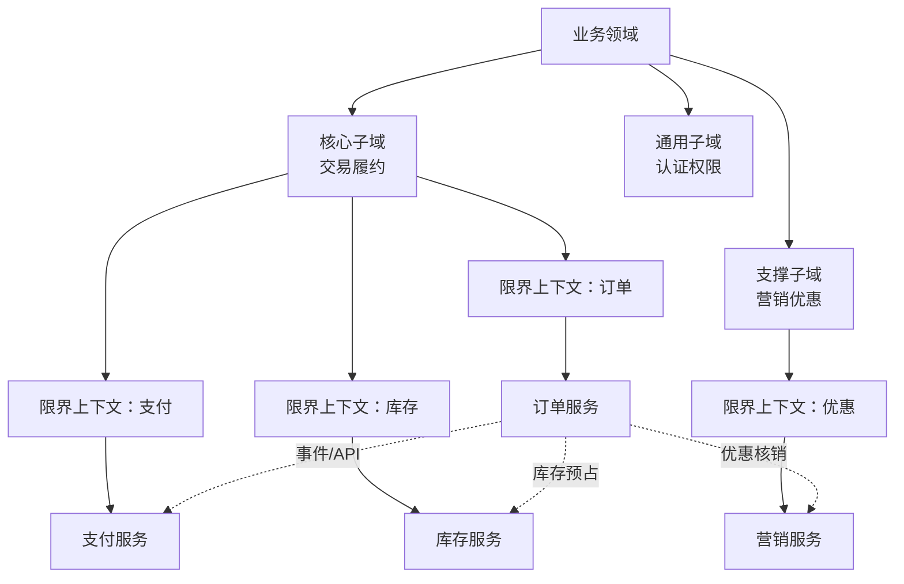
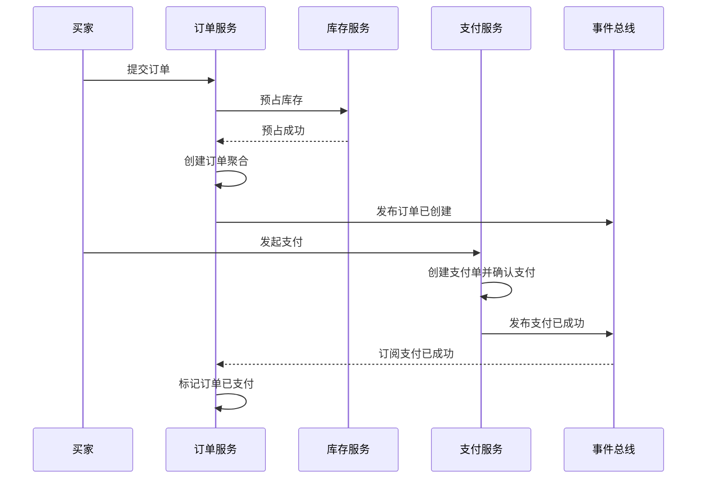
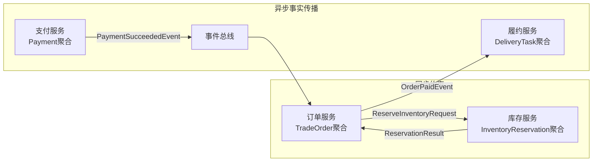

# DDD如何解决微服务拆分难题

## 1. 解决什么问题

微服务最难的不是把一个应用拆成多个进程，而是决定“按什么边界拆”。拆得太粗，团队仍然互相等待，一个服务里塞满所有业务；拆得太细，调用链、分布式事务、数据一致性和发布协调会迅速吞掉收益。

很多失败的微服务拆分有一个共同点：按技术层、数据库表、团队临时分工或接口数量拆，而不是按业务边界拆。DDD 的价值在这里非常直接：它通过领域、子域、限界上下文、聚合和上下文映射，帮助团队先识别业务边界，再选择服务边界。

这篇文章重点回答：

- DDD 如何帮助识别微服务边界。
- 限界上下文、聚合、数据边界和团队边界之间是什么关系。
- 如何从单体系统渐进拆分到微服务，而不是一次性爆破。

## 2. 核心概念

微服务边界不是单一维度，而是多种边界的交集：

- 业务边界：某个业务能力或子域的职责范围。
- 模型边界：限界上下文内统一语言和领域模型的适用范围。
- 数据边界：服务是否拥有自己的数据，是否避免共享表。
- 接口边界：上下文之间通过 API、事件或防腐层协作。
- 部署边界：能否独立构建、测试、发布、扩容和回滚。
- 团队边界：一个团队是否能对服务的业务和技术生命周期负责。

DDD 不是简单地说“一个限界上下文等于一个微服务”。更准确的说法是：限界上下文是候选服务边界，聚合是事务一致性边界，微服务边界通常应该落在聚合之上、限界上下文之内或与其对齐。实际落地还要考虑团队能力、运行成本、性能、发布频率和遗留系统约束。

可以用下图理解几种边界的关系：



这张图不是模板，而是一种思考顺序：先看业务能力，再看模型边界，最后决定服务形态。

## 3. 原理/方法拆解

### 3.1 先识别子域，再讨论服务

如果一开始就问“要拆几个服务”，讨论很容易滑向技术偏好。DDD 更建议先做领域分析：

- 业务目标是什么，核心竞争力在哪里？
- 完整业务流程包含哪些阶段？
- 哪些能力变化最频繁，哪些能力相对稳定？
- 哪些规则需要领域专家深度参与？
- 哪些能力可以购买或复用？

以电商交易为例，订单、支付、库存、履约、售后可能属于核心交易链路；短信、文件、认证可能是通用能力；营销、会员、风控可能是支撑能力。不同子域的投入策略不同，服务拆分粒度也不同。核心域值得更清晰的模型和更独立的演进空间，通用域则可以优先复用成熟方案。

### 3.2 限界上下文定义模型边界

微服务拆分最怕“共享一个大模型”。比如“订单”这个词，在订单上下文里代表买家的一次交易承诺，在支付上下文里可能只是支付单的业务来源，在履约上下文里则是发货任务的上游依据。

限界上下文允许同一个词在不同语境下有不同模型。它要求上下文内部保持统一语言，上下文之间通过明确契约协作。

判断一个限界上下文是否成立，可以看：

- 是否有独立的业务语言和规则。
- 是否有相对稳定的生命周期。
- 是否能定义清晰的输入输出。
- 是否能拥有自己的数据事实。
- 是否能由一个团队负责持续演进。

如果两个模块总是同时改、共享大量表、状态机互相穿透、团队也无法独立负责，把它们拆成两个微服务通常只会增加分布式复杂度。

### 3.3 聚合决定事务边界

聚合是强一致性的边界，微服务不应该小于聚合。把一个聚合拆进多个服务，通常会导致每次业务操作都要跨服务事务。

例如订单聚合内部包含订单头、订单项、金额、状态流转和必要的不变式。下单时必须保证订单明细、总价、状态一致。若把订单头服务、订单项服务、订单金额服务拆开，就会把本来本地事务能解决的问题变成分布式事务。

但微服务也不应该简单等于聚合。一个限界上下文内可能有多个聚合，例如订单上下文里可能有订单、退单、发票申请等聚合。是否拆成多个服务，要看它们是否需要独立发布、独立扩展、独立团队负责，以及它们之间的事务和查询耦合是否足够低。

### 3.4 上下文映射决定协作方式

服务不是孤岛。DDD 的上下文映射可以帮助我们设计协作关系：

- 客户方/供应方：下游依赖上游接口，需要明确契约和版本策略。
- 防腐层：当外部模型不适合本上下文时，通过转换隔离污染。
- 开放主机服务：上游提供稳定 API，让多个下游集成。
- 发布语言：上下文之间通过共享的事件或接口语言协作。
- 共享内核：少量稳定模型共享，但要严格治理，避免变成公共泥球。

在微服务里，这些关系会落成 REST、RPC、事件、BFF、数据同步、ACL 等技术方案。技术选型应服务于上下文关系，而不是反过来。

### 3.5 数据边界是服务自治的硬约束

微服务如果共享数据库，很难真正自治。一个服务改表会影响另一个服务，一个服务绕过另一个服务直接写数据，会破坏业务不变式。

更合理的原则是：

- 服务拥有自己的写模型和数据表。
- 其他服务不能直接写入本服务数据。
- 跨服务查询优先通过 API、事件同步读模型或 BFF 聚合。
- 跨服务一致性优先采用最终一致性、Saga、Outbox、补偿机制。
- 必须共享的数据要通过发布语言治理，而不是直接共享表。

这并不意味着拆分第一天就要物理分库。存量系统可以先做逻辑数据边界：代码层禁止跨上下文直接访问表，逐步把表所有权、写入口和数据同步关系理清。

## 4. 实战落地

### 4.1 拆分步骤

一个比较稳的微服务拆分路径是：

1. 画出业务流程和关键领域事件，例如“订单已创建、支付已成功、库存已预占、商家已接单、商品已发货”。
2. 按业务能力归类事件、命令和规则，识别候选子域。
3. 定义限界上下文，为每个上下文写清统一语言、核心对象、状态机和数据事实。
4. 识别聚合边界，明确哪些操作必须本地强一致，哪些可以最终一致。
5. 画上下文映射，确定 API、事件、防腐层和开放主机服务。
6. 评估团队、发布频率、性能和遗留系统约束，决定哪些上下文先模块化，哪些上下文先服务化。
7. 建立数据所有权和迁移计划，逐步切断共享表和跨库写。

### 4.2 模块化单体优先

对于大多数存量系统，直接拆微服务风险很高。更推荐先做模块化单体：

```text
commerce-platform
  order-context
    application
    domain
    infrastructure
  payment-context
    application
    domain
    infrastructure
  inventory-context
    application
    domain
    infrastructure
  marketing-context
    application
    domain
    infrastructure
```

在单体内先建立上下文边界：

- 模块之间只能通过应用接口调用。
- 禁止跨模块访问内部领域对象和数据库 Mapper。
- 每个模块拥有自己的表前缀或 schema 约定。
- 模块间事件先用本地事件机制模拟。
- 用依赖扫描守住包边界。

当某个上下文确实需要独立发布、独立扩展或独立团队负责时，再把它抽成微服务。这样拆出来的服务天然有业务边界，而不是凭感觉切出来的远程包。

### 4.3 订单、支付、库存的协作示例

下单链路常见协作可以这样设计：



这里有几个边界选择：

- 订单服务不直接修改支付表，只订阅支付事实。
- 支付服务不理解订单完整模型，只保存支付来源和支付单。
- 库存预占可以是同步 API，因为下单强依赖库存结果。
- 支付成功后订单状态更新可以走事件，允许短暂最终一致。
- 如果支付上下文接入第三方渠道，应在支付服务内部建立防腐层。

### 4.3.1 API契约和事件契约示例

库存预占是下单的前置约束，通常适合同步 API；支付成功是已经发生的事实，通常适合集成事件。二者的契约应该分开设计。

库存预占 API：

```java
// inventory/api/InventoryApi.java
package com.example.inventory.api;

public interface InventoryApi {
    ReservationResult reserve(ReserveInventoryRequest request);
}

public record ReserveInventoryRequest(
        String requestId,
        String tradeOrderId,
        String skuId,
        int quantity
) {}

public record ReservationResult(
        boolean success,
        String reservationId,
        String failureReason
) {}
```

支付成功事件：

```java
// payment/event/PaymentSucceededEvent.java
package com.example.payment.event;

import java.time.Instant;

public record PaymentSucceededEvent(
        String eventId,
        int eventVersion,
        String paymentId,
        String tradeOrderId,
        long paidAmount,
        String channel,
        Instant paidAt
) {}
```

订单服务消费支付事件时，要做幂等和状态校验：

```java
// order/application/PaymentSucceededHandler.java
package com.example.order.application;

public class PaymentSucceededHandler {
    private final OrderRepository orderRepository;
    private final ProcessedEventRepository processedEventRepository;

    public void handle(PaymentSucceededEvent event) {
        if (processedEventRepository.exists(event.eventId())) {
            return;
        }

        var order = orderRepository.get(event.tradeOrderId());
        order.markPaid(event.paymentId(), event.paidAmount(), event.paidAt());

        orderRepository.save(order);
        processedEventRepository.save(event.eventId());
    }
}
```

同等 Go 写法：

```go
package order

import "time"

type InventoryAPI interface {
	Reserve(request ReserveInventoryRequest) (ReservationResult, error)
}

type ReserveInventoryRequest struct {
	RequestID    string
	TradeOrderID string
	SkuID        string
	Quantity     int
}

type ReservationResult struct {
	Success       bool
	ReservationID string
	FailureReason string
}

type PaymentSucceededEvent struct {
	EventID      string
	EventVersion int
	PaymentID    string
	TradeOrderID string
	PaidAmount   int64
	Channel      string
	PaidAt       time.Time
}

type PaymentSucceededHandler struct {
	orderRepository          OrderRepository
	processedEventRepository ProcessedEventRepository
}

func (h PaymentSucceededHandler) Handle(event PaymentSucceededEvent) error {
	exists, err := h.processedEventRepository.Exists(event.EventID)
	if err != nil {
		return err
	}
	if exists {
		return nil
	}

	order, err := h.orderRepository.Get(event.TradeOrderID)
	if err != nil {
		return err
	}
	if err := order.MarkPaid(event.PaymentID, event.PaidAmount, event.PaidAt); err != nil {
		return err
	}
	if err := h.orderRepository.Save(order); err != nil {
		return err
	}
	return h.processedEventRepository.Save(event.EventID)
}
```

这个示例体现了拆分后的基本原则：

- 同步 API 用于调用方必须立即知道结果的业务约束。
- 集成事件用于发布已经发生的事实。
- 事件消费者必须幂等。
- 下游不能依赖上游内部领域对象，只依赖发布契约。

### 4.3.2 服务协作边界图



如果团队把所有关系都设计成同步调用，链路会变长且故障传播明显；如果所有关系都设计成事件，又会让本该立即失败的业务约束变成后置补偿。DDD 的价值在于先理解业务语义，再选择协作方式。

### 4.4 服务边界评估清单

候选服务拆出来之前，可以用这些问题做评估：

- 它是否对应一个清晰的业务能力，而不是一组技术表？
- 它内部是否有统一语言和相对完整的模型？
- 它是否拥有自己的数据事实和写入口？
- 它和其他上下文之间是否可以通过 API 或事件表达协作？
- 它是否需要独立发布、独立扩容或独立团队负责？
- 它的核心操作是否避免频繁跨服务强一致事务？
- 它是否有明确的监控、告警、回滚和降级方案？
- 拆分后调用链、数据同步和排障成本是否可接受？

如果多数问题答不上来，先做模块化边界治理，通常比贸然服务化更划算。

## 5. 常见坑

- 按表拆服务。用户表、订单表、订单明细表各一个服务，会制造大量跨服务事务和贫血接口。
- 按技术层拆服务。Controller 服务、业务服务、DAO 服务不是微服务，只是远程三层架构。
- 一个聚合拆多个服务。强一致规则跨网络执行，复杂度会急剧上升。
- 所有上下文共享数据库。服务看似拆开，数据和发布仍然绑死。
- 只拆代码不拆语言。不同团队仍然使用同一套大 DTO、大枚举、大状态机，边界名存实亡。
- 事件满天飞但没有契约治理。事件字段随意改、语义不稳定，会让下游服务长期被动。
- 忽略前端和查询视图。微服务拆完后，页面要拼十几个接口，性能和体验一起下降，需要 BFF 或读模型支撑。
- 低估运维成本。服务拆分会带来注册发现、链路追踪、限流熔断、配置治理、灰度发布和故障隔离要求。

## 6. 面试/复盘问题

- 为什么说微服务拆分首先是业务问题，不是技术问题？
- 限界上下文和微服务是一一对应的吗？
- 聚合边界和服务边界有什么关系？
- 如何判断两个模块不适合拆成两个微服务？
- 共享数据库会破坏哪些微服务自治能力？
- API、事件和防腐层分别适合什么集成场景？
- 为什么建议从模块化单体渐进到微服务？
- 下单、支付、库存之间哪些操作应该同步，哪些可以异步？
- 服务拆分后，前端页面聚合查询应该如何处理？
- 如何治理事件版本和接口契约？

## 7. 小结

DDD 解决微服务拆分难题的关键，不是提供一个“按名词切服务”的公式，而是提供一套从业务到架构的推理路径：先识别子域，再定义限界上下文，然后设计聚合、数据边界和上下文协作，最后才决定服务部署形态。

微服务边界应该尊重业务语言、事务一致性和团队责任。好的服务拆分会让团队更自治、模型更清晰、发布更独立；坏的拆分只会把单体内部调用变成分布式调用。

真正稳妥的落地方式通常是渐进式的：先在单体内建立模块边界和数据所有权，再把高价值、高变化、低耦合的上下文服务化。DDD 的作用，就是让这条演进路线有依据、有语言、有边界。
