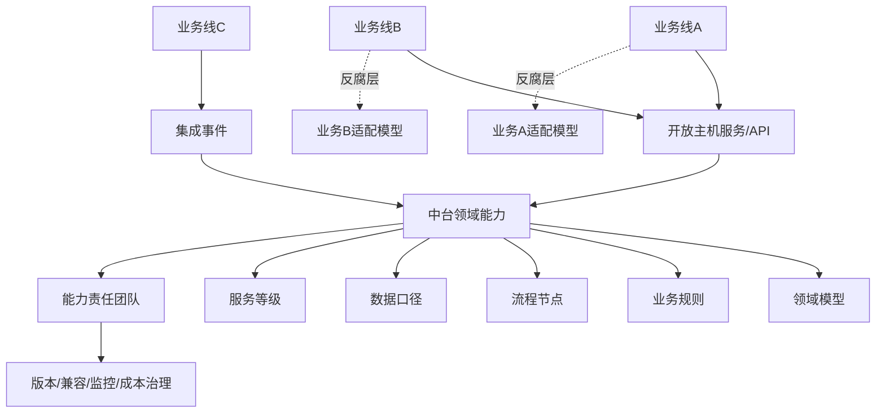
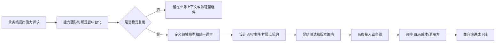

# 中台到底应该共享什么

## 1. 这一章解决什么问题

很多团队做中台时，第一反应是“把公共代码抽出来”“把公共表统一起来”“把所有业务都接到一个公共服务上”。短期看，这像是在减少重复建设；长期看，却经常演变成一个更难改、更难排期、更难理解的大泥球。

中台真正要解决的问题不是“有没有共享”，而是“共享什么、由谁维护、以什么契约被使用、如何持续演进”。如果共享的是数据库表、工具函数、万能接口，业务团队会被平台节奏绑住；如果共享的是稳定的业务能力、统一语言、可组合的流程节点和可治理的服务契约，中台才可能成为组织复用能力的放大器。

DDD 在这里的价值，是帮助我们判断哪些能力值得沉淀到中台，哪些能力必须留在具体业务上下文里。它不是给中台贴一个架构标签，而是用领域、子域、限界上下文和上下文映射，把“共享”从技术复用拉回到业务能力复用。

## 2. 核心概念

**中台**可以理解为企业级能力产品化的一种组织和架构形态。它承接多条业务线反复需要、规则相对稳定、可以通过标准契约被复用的能力，例如会员、交易、库存、结算、营销、风控、消息、权限、数据资产、研发平台等。

**业务中台**沉淀的是业务能力，不是业务流程的所有细节。它应该回答：“这个能力是否跨业务线高频出现？它背后的规则是否稳定？它能否以明确模型和契约对外提供？”例如“优惠券核销”可能适合中台化，但“某次直播大促的特殊玩法”不一定适合。

**技术中台**沉淀的是工程能力，例如脚手架、流水线、配置、网关、可观测性、消息基础设施、测试环境、发布治理、架构扫描。它的目标不是替业务建模，而是降低业务团队从模型到交付的摩擦。

**数据中台**沉淀的是数据采集、治理、标签、指标、分析和服务化能力。它不能取代业务系统的事务模型，也不应该让业务系统反向依赖一套“大而全”的共享宽表。

**领域能力**是中台共享的核心单位。它比接口更稳定，比代码更有业务含义，比数据库表更接近组织协作语言。一个领域能力通常包含模型、规则、流程、接口、事件、数据口径、治理责任和服务等级。

## 3. 原理和方法拆解

中台建设最容易混淆三种复用：代码复用、数据复用和能力复用。

代码复用解决的是实现重复，例如统一日志、统一异常、通用校验、工具类、SDK。它有价值，但它不是中台的核心。代码复用一旦跨越业务语义边界，就会把多个上下文的变化原因绑在一起。今天促销需要改一个字段，明天会员也被迫回归测试，这不是共享，是耦合。

数据复用解决的是信息一致和分析效率，例如客户画像、指标体系、订单明细、交易汇总。它同样有价值，但如果把共享数据库当成中台主干，业务系统就会绕开领域模型直接读写别人的状态。最终每个团队都在“顺手改一列”，边界会被数据库一点点溶解。

能力复用解决的是业务协作。例如营销上下文需要“发券、锁券、核销、退券”，交易上下文需要“创建订单、确认支付、取消订单”，履约上下文需要“锁库存、出库、签收”。这些能力背后有完整的业务规则和生命周期，适合通过明确契约对外开放。

一个能力是否适合进入中台，可以用五个问题判断：

1. 它是否被多个业务场景稳定复用，而不是只有一个团队临时需要？
2. 它是否有清晰的统一语言，业务专家能说清楚对象、规则和状态？
3. 它是否有独立演进的生命周期，变更不应该被某条业务线完全支配？
4. 它是否能通过 API、事件、页面组件、规则配置等方式产品化交付？
5. 它是否有明确的责任团队，能对可用性、正确性、兼容性和成本负责？

如果答案多为“否”，不要急着中台化。它可能只是一个业务模块、一个支撑域、一个组件库，甚至只是一次性活动逻辑。

## 4. 中台共享能力图



这张图强调两个点。第一，业务线不应该直接共享中台内部表或内部对象，而应通过开放主机服务、发布语言、集成事件等契约使用能力。第二，每条业务线仍然可以有自己的适配模型，不能因为接入中台就丢掉自己的限界上下文。

## 5. 实战落地

落地中台时，可以按“能力地图 -> 上下文边界 -> 契约产品化 -> 治理闭环”的节奏推进。

第一步，画企业能力地图。不要从系统清单开始，而要从业务价值链开始：获客、注册、认证、定价、下单、支付、履约、售后、结算、会员、营销、风控、客服、数据分析。每个能力标注复用频率、规则稳定度、业务差异度、交易一致性要求和团队归属。

第二步，识别核心域、支撑域和通用域。核心域通常不应该被粗暴拉进共享中台，因为它承载差异化竞争力，变化也更频繁。支撑域适合在组织内沉淀，例如会员、优惠、库存、结算。通用域优先采购或使用成熟平台，例如认证、消息、监控、CI/CD。

第三步，给能力划定限界上下文。以“会员”为例，交易上下文里的会员可能只关心等级、权益和折扣资格；客服上下文里的会员关心投诉、风险和服务记录；增长上下文里的会员关心标签、偏好和触达。中台可以提供会员身份与权益能力，但不能强迫所有上下文使用同一个庞大会员对象。

第四步，设计对外契约。同步接口适合强交互、需要即时反馈的能力，例如“试算优惠”“查询权益”。异步事件适合事实广播，例如“会员等级已变更”“优惠券已核销”。配置和规则平台适合变化频繁但边界明确的策略，例如活动门槛、黑白名单、费率规则。

第五步，建立演进机制。中台能力一旦被多个业务依赖，任何字段、状态、事件语义的变化都会扩散。要有版本策略、灰度发布、兼容期、契约测试、调用监控、事件回放和变更公告。没有治理，中台越成功，变更成本越高。

一个比较实用的目录组织方式是：

```text
mall-platform/
  promotion/
    domain/          # 优惠券、活动、核销、预算等领域模型
    application/     # 发券、试算、核销、退回等用例编排
    interfaces/      # API、事件、管理端入口
    infrastructure/  # 持久化、消息、外部规则引擎适配
  member/
  settlement/
  inventory/
```

这里的关键不是目录名字，而是每个能力都要有自己的模型、契约和责任边界。不要把所有“公共服务”塞进一个 `common-service`，那只是把复杂度换了个位置。

### 5.1 能力契约治理流程

中台能力一旦被多条业务线复用，契约治理就要前置。推荐把“能力申请、契约设计、灰度发布、兼容治理、下线回收”做成显式流程。



### 5.2 API 与事件契约示例

以优惠中台的“试算优惠”和“核销优惠券”为例，同步 API 适合强交互，集成事件适合通知事实。

```java
// promotion/api/PromotionFacade.java
package com.example.platform.promotion.api;

public interface PromotionFacade {
    DiscountQuote quote(QuotePromotionRequest request);

    CouponRedeemResult redeem(RedeemCouponRequest request);
}

public record QuotePromotionRequest(
        String buyerId,
        String merchantId,
        long orderAmount,
        String scene
) {}

public record DiscountQuote(
        long discountAmount,
        String promotionPlanId,
        String reason
) {}
```

核销成功后，不要让交易上下文直接读优惠中台内部表，而是发布稳定事件：

```java
// promotion/event/CouponRedeemedEvent.java
package com.example.platform.promotion.event;

import java.time.Instant;

public record CouponRedeemedEvent(
        String eventId,
        int eventVersion,
        String couponId,
        String buyerId,
        String tradeOrderId,
        long discountAmount,
        Instant occurredAt
) {}
```

同等 Go 写法：

```go
package promotion

import "time"

type PromotionFacade interface {
	Quote(request QuotePromotionRequest) (DiscountQuote, error)
	Redeem(request RedeemCouponRequest) (CouponRedeemResult, error)
}

type QuotePromotionRequest struct {
	BuyerID    string
	MerchantID string
	OrderAmount int64
	Scene      string
}

type DiscountQuote struct {
	DiscountAmount int64
	PromotionPlanID string
	Reason         string
}

type CouponRedeemedEvent struct {
	EventID        string
	EventVersion   int
	CouponID       string
	BuyerID        string
	TradeOrderID   string
	DiscountAmount int64
	OccurredAt     time.Time
}
```

API 解决“现在我要一个结果”，事件解决“这个事实已经发生”。两者一起构成中台能力的发布语言。

## 6. 常见坑

**把中台做成共享数据库。** 共享表看起来最省事，但它会让所有业务直接依赖同一套数据结构。一旦表结构变化，影响范围不可控；一旦数据语义不同，问题很难定位。

**把中台做成万能审批队列。** 所有需求都要排中台团队，业务线无法独立交付。中台从能力复用者变成组织瓶颈，最后大家会绕开它。

**只沉淀接口，不沉淀模型。** 接口越做越多，但背后没有统一语言、状态机和规则归属。结果是每个业务线都要求加参数，接口变成“参数垃圾场”。

**用平台统一抹平业务差异。** 真正有价值的业务差异不应该被中台消灭。中台应提供稳定能力和扩展点，而不是要求所有业务线按同一种玩法运转。

**技术中台替代业务建模。** 脚手架、网关、消息中心、发布平台能提升交付效率，但不能自动产生正确边界。没有领域分析，工具越强，错误的拆分跑得越快。

**没有退出机制。** 有些能力早期适合共享，后期可能因为业务分化需要拆出独立上下文。中台能力也应该允许分叉、下线、迁移和自治。

## 7. 面试和复盘问题

1. 中台和公共服务最大的区别是什么？
2. 你如何判断一个业务能力是否值得中台化？
3. 为什么共享数据库不是好的中台复用方式？
4. DDD 的限界上下文如何帮助中台避免大一统模型？
5. 业务中台、技术中台、数据中台分别应该沉淀什么？
6. 当业务线差异很大时，中台应该统一规则还是提供扩展点？
7. 中台能力对外提供同步 API 和异步事件时，边界如何划分？
8. 如何评估中台是否从“复用能力”变成了“交付瓶颈”？
9. 你做过的系统里，哪些公共能力其实不该被抽到中台？
10. 中台团队和业务团队的责任边界应该如何约定？

## 8. 小结

中台不是“所有人共用一套东西”，而是企业把稳定、可复用、可治理的能力产品化。

DDD 给中台建设提供了边界判断方法：用领域能力识别复用对象，用限界上下文保护模型自治，用上下文映射定义协作契约。

真正值得共享的是能力、规则、语言、契约、事件、数据口径和工程治理；不应该随意共享的是数据库表、内部对象、临时代码和某条业务线的特殊流程。

中台要能服务业务，而不是接管业务。它的目标是让业务团队更快、更稳地组合能力，而不是把所有变化都集中到一个巨大平台团队。

判断中台是否健康，可以看三件事：业务线是否更容易交付，能力团队是否能独立演进，跨团队协作是否从人肉沟通变成了稳定契约。
