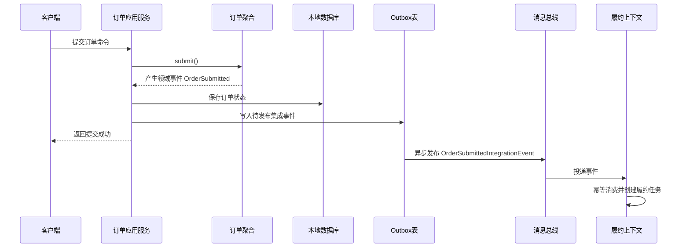

# 领域事件和集成事件有什么区别

## 1. 这一章解决什么问题

很多团队刚引入事件驱动时，会把所有“发生过的事情”都塞进消息队列：订单创建了发一条消息，库存扣减了发一条消息，用户登录了也发一条消息。队列里很热闹，但系统并没有变得更清晰，反而出现了事件语义混乱、重复消费、字段随意变更、跨服务流程难追踪等问题。

问题的根源通常是没有区分领域事件和集成事件。领域事件是模型内部表达业务事实的语言，集成事件是上下文之间协作的发布契约。二者都叫事件，但使用场景、生命周期、可靠性要求和演进方式完全不同。

DDD 讨论事件，不是为了让系统“全异步”，而是为了把领域中重要的事实显性化，并在合适的边界上解耦协作。

## 2. 核心概念

**领域事件**表示某个限界上下文内已经发生、且对领域有意义的业务事实。它通常由聚合在执行业务行为后产生，例如“订单已提交”“支付已确认”“库存已预占”“会员等级已升级”。领域事件属于领域模型的一部分，命名应使用业务语言，而不是技术动作。

**集成事件**表示一个上下文愿意对外公布、供其他上下文订阅的事实。它是跨服务、跨团队、跨系统协作的契约，通常会进入消息中间件、事件总线或事件中心。它需要考虑版本、幂等、兼容、可观测性和发布可靠性。

**应用事件**有时用来描述应用层内部的流程通知，例如一个用例执行完成后触发后续编排。它不一定是领域模型的一部分，也不一定对外发布。实际项目里不必执着于命名，但必须清楚事件的边界和受众。

**事件溯源**不是“多发点事件”，而是把事件作为状态的事实来源。系统不再只保存当前状态，而是保存导致当前状态的一串事件，再通过回放事件重建聚合状态。它带来审计、追溯和时间旅行能力，也引入快照、版本迁移、查询投影和存储成本等复杂度。

## 3. 原理和方法拆解

领域事件和集成事件最大的区别，是它们面对的变化来源不同。

领域事件面对的是领域模型内部变化。它帮助聚合表达“我完成了一件业务上重要的事”，并让同一上下文内的策略、读模型、通知、审计等逻辑可以解耦。例如订单聚合完成提交后产生 `OrderSubmitted`，应用层可以据此生成操作日志、刷新查询模型、触发后续规则检查。

集成事件面对的是上下文之间的协作变化。它是发布语言的一部分，需要被下游长期依赖。例如交易上下文对外发布 `OrderPaidIntegrationEvent`，履约上下文订阅后创建发货任务，积分上下文订阅后累计积分。这个事件一旦发布，就不能随便改字段含义，也不能把内部对象直接暴露出去。

可以用四个维度区分：

| 维度 | 领域事件 | 集成事件 |
|---|---|---|
| 所属边界 | 限界上下文内部 | 限界上下文之间 |
| 主要受众 | 聚合、领域服务、应用服务、内部策略 | 其他服务、外部系统、数据平台 |
| 模型关系 | 领域模型的一部分 | 发布语言/接口契约的一部分 |
| 演进要求 | 可随内部模型重构调整 | 必须版本化、兼容、可观测 |
| 可靠性 | 通常与本地事务一致 | 需要 Outbox、重试、幂等、死信 |
| 内容 | 可携带内部业务事实和标识 | 只发布下游需要且允许依赖的信息 |

一个领域事件不一定要变成集成事件。订单上下文内部可能有 `OrderItemChanged`、`OrderPriceRecalculated`、`OrderRiskMarked` 等事件，它们对内部模型有意义，但没有必要全部广播给外部。对外发布太多内部细节，会让下游绑死上游实现。

一个集成事件也不应该直接复用领域事件类。领域事件可以随着模型优化而变化，集成事件却要维护契约稳定。正确做法通常是在应用层或事件发布层把领域事件转换为集成事件，只发布跨上下文协作所需的事实。

## 4. 事件流转图



这条链路有一个关键点：领域事件在本地事务内产生，集成事件通过 Outbox 可靠发布。这样既能保证业务状态和待发布消息一致，又能避免把消息中间件纳入本地事务。

## 5. 实战落地

先从事件命名开始。事件必须用过去式表达事实，而不是用命令式表达意图。`PayOrder` 是命令，`OrderPaid` 是事件；`DeductInventory` 是命令，`InventoryReserved` 是事件。命名一旦变成技术动作，例如 `SendMqMessage`、`UpdateOrderStatus`，说明模型语言已经跑偏。

再看事件内容。领域事件可以精简，甚至只包含聚合 ID 和发生时间，因为同一上下文内可以通过仓储读取更多状态。集成事件应该站在下游视角设计，包含消费方做决策所需的稳定字段，但不要把上游整张表、内部枚举、数据库主键细节全部倾倒出去。

一个比较稳妥的事件对象可以包含：

```text
eventId          # 全局唯一，用于幂等
eventType        # 事件类型
eventVersion     # 契约版本
occurredAt       # 业务发生时间
publishedAt      # 发布时间
traceId          # 链路追踪
source           # 来源上下文
aggregateId      # 聚合标识
payload          # 业务负载
```

可以把领域事件和集成事件显式拆开：

```java
// order/domain/event/OrderPaid.java
package com.example.order.domain.event;

import java.time.Instant;

public record OrderPaid(
        String orderId,
        String paymentId,
        long paidAmount,
        Instant occurredAt
) {}
```

```java
// order/interfaces/event/OrderPaidIntegrationEvent.java
package com.example.order.interfaces.event;

import java.time.Instant;
import java.util.UUID;

public record OrderPaidIntegrationEvent(
        String eventId,
        int eventVersion,
        String traceId,
        String orderId,
        String paymentId,
        long paidAmount,
        Instant occurredAt
) {
    public static OrderPaidIntegrationEvent from(OrderPaid event, String traceId) {
        return new OrderPaidIntegrationEvent(
                UUID.randomUUID().toString(),
                1,
                traceId,
                event.orderId(),
                event.paymentId(),
                event.paidAmount(),
                event.occurredAt()
        );
    }
}
```

同等 Go 写法：

```go
package event

import (
	"time"

	"github.com/google/uuid"
)

type OrderPaid struct {
	OrderID    string
	PaymentID  string
	PaidAmount int64
	OccurredAt time.Time
}

type OrderPaidIntegrationEvent struct {
	EventID      string
	EventVersion int
	TraceID      string
	OrderID      string
	PaymentID    string
	PaidAmount   int64
	OccurredAt   time.Time
}

func NewOrderPaidIntegrationEvent(event OrderPaid, traceID string) OrderPaidIntegrationEvent {
	return OrderPaidIntegrationEvent{
		EventID:      uuid.NewString(),
		EventVersion: 1,
		TraceID:      traceID,
		OrderID:      event.OrderID,
		PaymentID:    event.PaymentID,
		PaidAmount:   event.PaidAmount,
		OccurredAt:   event.OccurredAt,
	}
}
```

领域事件 `OrderPaid` 服务于订单上下文内部模型，集成事件 `OrderPaidIntegrationEvent` 服务于对外契约。两者字段可以相似，但不要共用同一个类。

可靠发布建议使用 Outbox 模式。应用服务在同一个本地事务里保存聚合状态和 Outbox 记录，后台发布器扫描未发布记录发送到消息总线，成功后标记状态。消费端必须幂等，不能假设消息只来一次。

Outbox 的核心代码可以长这样：

```java
public class PayOrderService {
    private final OrderRepository orderRepository;
    private final OutboxRepository outboxRepository;

    @Transactional
    public void markPaid(String orderId, String paymentId, long paidAmount, String traceId) {
        var order = orderRepository.get(orderId);
        order.markPaid(paymentId, paidAmount);
        orderRepository.save(order);

        for (Object domainEvent : order.pullDomainEvents()) {
            if (domainEvent instanceof OrderPaid paid) {
                var integrationEvent = OrderPaidIntegrationEvent.from(paid, traceId);
                outboxRepository.save(OutboxMessage.from(integrationEvent));
            }
        }
    }
}
```

```java
public class OutboxPublisher {
    private final OutboxRepository outboxRepository;
    private final MessageBus messageBus;

    public void publishPending() {
        var messages = outboxRepository.findPending(100);
        for (var message : messages) {
            try {
                messageBus.publish(message.topic(), message.body());
                outboxRepository.markPublished(message.id());
            } catch (Exception ex) {
                outboxRepository.markFailed(message.id(), ex.getMessage());
            }
        }
    }
}
```

同等 Go 写法：

```go
type PayOrderService struct {
	orderRepository  OrderRepository
	outboxRepository OutboxRepository
}

func (s PayOrderService) MarkPaid(orderID, paymentID string, paidAmount int64, traceID string) error {
	order, err := s.orderRepository.Get(orderID)
	if err != nil {
		return err
	}
	if err := order.MarkPaid(paymentID, paidAmount); err != nil {
		return err
	}
	if err := s.orderRepository.Save(order); err != nil {
		return err
	}

	for _, domainEvent := range order.PullDomainEvents() {
		if paid, ok := domainEvent.(OrderPaid); ok {
			integrationEvent := NewOrderPaidIntegrationEvent(paid, traceID)
			if err := s.outboxRepository.Save(NewOutboxMessage(integrationEvent)); err != nil {
				return err
			}
		}
	}
	return nil
}

type OutboxPublisher struct {
	outboxRepository OutboxRepository
	messageBus       MessageBus
}

func (p OutboxPublisher) PublishPending() {
	messages := p.outboxRepository.FindPending(100)
	for _, message := range messages {
		if err := p.messageBus.Publish(message.Topic, message.Body); err != nil {
			p.outboxRepository.MarkFailed(message.ID, err.Error())
			continue
		}
		p.outboxRepository.MarkPublished(message.ID)
	}
}
```

对于跨服务长流程，不要试图用一个“超级事务事件”解决所有问题。可以使用 Saga 或流程管理器编排，例如下单后依次处理支付、库存、履约、积分。每一步通过事件推进，并为失败场景设计补偿动作。事件驱动的核心不是“没有流程”，而是流程状态显性化、步骤解耦、失败可恢复。

对于查询场景，可以用事件投影读模型。交易上下文发布订单状态变更事件，客服或运营上下文维护自己的查询视图。但要接受最终一致性，界面上需要展示“处理中”“稍后刷新”等状态，而不是假装所有数据实时强一致。

事件版本演进要早做约定。新增字段通常兼容，删除字段和修改含义通常不兼容。可以采用 `eventVersion`、新事件类型、双发一段时间、消费者契约测试等方式过渡。不要指望“通知大家改一下”能支撑多团队协作。

## 6. 常见坑

**把事件当 RPC。** 发布一个事件后立刻等待某个消费者处理完，再继续同步流程，本质上还是远程调用，只是多绕了一层消息队列。

**把内部领域事件直接广播出去。** 下游开始依赖上游内部模型，上游聚合一重构，全公司跟着改。

**事件太细。** 每个字段变化都发事件，消费者不知道哪些事件有业务意义，消息量和理解成本一起膨胀。

**事件太粗。** 一个 `OrderChanged` 包含所有状态变化，下游只能解析前后状态猜业务意图，最终又回到共享数据库式耦合。

**没有幂等。** 消息系统天然可能重复投递。消费端不做去重和状态校验，迟早会出现重复发券、重复积分、重复出库。

**忽视顺序和时间。** 同一聚合内事件通常需要顺序处理，跨聚合事件不应假设全局顺序。业务发生时间和消息发布时间也要区分。

**把事件溯源当默认架构。** 事件溯源适合审计强、状态演进重要、需要回放和追溯的领域，例如账户、交易、风控。普通 CRUD 系统强行事件溯源，会让开发、排障和查询都变重。

## 7. 面试和复盘问题

1. 领域事件和集成事件的边界分别在哪里？
2. 为什么不建议直接把领域事件类发布到消息总线？
3. 一个事件应该携带完整快照，还是只携带变更信息？
4. Outbox 模式解决了什么问题？它不能解决什么问题？
5. 消费端如何保证幂等？
6. 事件驱动和同步 RPC 应该如何取舍？
7. 如何处理事件版本升级和消费者兼容？
8. Saga、领域事件、集成事件之间是什么关系？
9. 什么时候值得引入事件溯源？
10. 如何排查“事件已经发了，但业务结果不一致”的问题？

## 8. 小结

领域事件是领域模型内部的业务事实，集成事件是跨上下文协作的发布契约。二者都很重要，但不能混用。

领域事件帮助模型表达业务变化，集成事件帮助系统之间降低耦合。前者服务建模，后者服务集成。

事件驱动不是为了消灭同步调用，而是把跨边界协作从隐式调用变成显式事实流。

可靠事件发布通常需要 Outbox、重试、幂等、死信、监控和契约版本治理。

事件越多不代表架构越先进。好的事件应该有明确业务语义、明确边界、明确消费者预期和明确演进策略。
