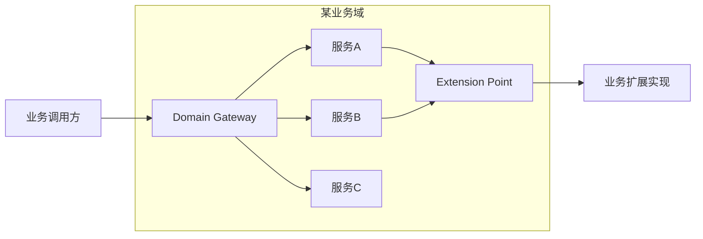
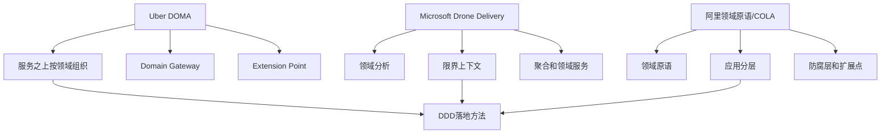

# 大厂 DDD 落地案例和反模式

## 1. 这一章解决什么问题

DDD 最容易被讲成一套漂亮术语：领域、子域、限界上下文、聚合、领域事件、仓储、工厂。真正落地时，团队遇到的往往不是“概念不会背”，而是“边界怎么和组织对齐”“微服务太多之后怎么治理”“模型如何进入代码”“哪些地方不该用 DDD”。

看大厂案例的目的，不是照搬某家公司架构，而是提炼它们面对复杂度时的共同方法：先承认复杂度来自业务和组织，再用边界、契约、平台和工程约束让复杂度可控。

这一章选三个常被引用的方向做复盘：Uber 的 DOMA、Microsoft Drone Delivery 示例、阿里的领域原语与 COLA。它们分别对应大规模微服务治理、DDD 建模路径、代码落地约束。最后再总结常见反模式，避免把 DDD 做成新一轮形式主义。

## 2. 核心概念

**DOMA** 是 Uber 在微服务数量膨胀后提出的 Domain-Oriented Microservice Architecture。它关注的不是“再拆更多服务”，而是把大量微服务重新组织到更高层的 domain 里，通过 domain gateway、extension point 等机制降低服务理解和调用成本。

**Drone Delivery** 是 Microsoft 架构文档中用于说明微服务建模的无人机配送案例。它从业务域分析开始，识别配送、无人机管理、账户、第三方运输、ETA 分析等能力，再进入限界上下文、实体、聚合、领域服务和服务边界。

**领域原语**强调把业务中的基础概念从裸类型里解放出来，例如 Money、PhoneNumber、OrderNo、Quantity、Address。它看起来很小，却能显著减少贫血模型、重复校验和隐式规则。

**COLA** 可以理解为一种面向复杂业务的应用架构约束。它通过分层、扩展点、领域模型和防腐隔离，帮助团队把 DDD 的概念落到代码结构中，而不是停在建模会议和 PPT 里。

## 3. 案例一：Uber DOMA 的启发

Uber 的问题很典型：微服务带来了独立部署、清晰 ownership、故障隔离等收益，但服务数量持续增长后，开发一个需求可能要理解许多细碎服务。系统没有退回单体，却需要一种更高层的组织方式来降低认知成本。

DOMA 的关键启发是：服务不是架构理解的最高层单位。一个成熟系统里，比服务更重要的是领域。多个微服务可以围绕一个业务域组织起来，对外暴露更稳定的 domain gateway；内部服务如何协作、如何拆分、如何扩展，不必全部泄露给外部调用方。

这和 DDD 的思路高度一致：限界上下文保护模型边界，上下文之间通过契约协作。DOMA 进一步提醒我们，当微服务过多时，需要在服务之上建立领域层级和访问门面，否则“每个服务都很小”并不等于“系统容易理解”。

可以把它抽象成下面的结构：



这里的重点不是“所有系统都要加网关”，而是：当一个领域内存在多个协作服务时，对外应该提供稳定入口和清晰扩展点。否则外部团队会直接依赖内部服务拓扑，内部重构就会变得非常困难。

方法提炼：

1. 微服务治理不能只看服务数量，要看调用方理解一个业务能力需要跨多少服务。
2. 领域可以成为服务之上的组织单元，帮助团队管理复杂服务群。
3. Domain gateway 适合封装领域内协作，但不能变成万能转发层。
4. Extension point 适合承接可预期差异，但不能放任业务随意绕过核心模型。
5. 组织 ownership 要跟领域边界对齐，否则技术边界很快会被沟通结构扭曲。

## 4. 案例二：Microsoft Drone Delivery 的启发

Microsoft 的无人机配送案例更适合用来学习 DDD 建模过程。它不是从“我要几个微服务”开始，而是先分析业务域：配送是核心能力，无人机管理、ETA 分析、第三方运输、账户、发票、客服等能力围绕它协作。

这个案例最值得学习的是“同一个现实对象在不同上下文里可以有不同模型”。无人机管理上下文关心无人机型号、维修记录、里程、电池、性能；配送调度上下文可能只关心无人机是否可用、当前位置、预计到达时间。如果强行做一个统一 Drone 模型，两个上下文都会被对方的变化拖累。

进入战术设计后，配送上下文可以识别 Delivery、Package、Schedule、DroneAssignment 等实体或聚合。调度算法可能不属于任何单个实体，这时可以建模为领域服务。配送状态变化可以产生领域事件，例如 `DeliveryScheduled`、`DroneDispatched`、`PackageDelivered`。

它给我们的原则是：

1. 微服务边界应该围绕业务能力，而不是围绕技术层、数据表或团队临时分工。
2. 限界上下文不是画完就结束，它要继续落到实体、聚合、领域服务和事件。
3. 微服务粒度通常不应小于聚合，也不应大于限界上下文。
4. 架构特性也要随领域变化，不同服务对性能、可用性、一致性、查询能力的要求可能不同。
5. DDD 是迭代过程，边界会随着业务理解加深而调整。

用它复盘自己的项目时，可以问一个很直接的问题：我们现在的服务，是围绕“配送、调度、账户、结算”这样的业务能力组织，还是围绕“controller、dao、message、job”这样的技术职责组织？如果是后者，DDD 基本还没开始。

## 5. 案例三：阿里领域原语和 COLA 的启发

很多团队讲 DDD 时只讲战略设计，到了代码里仍然是 `String userId`、`BigDecimal amount`、`Integer status` 到处传。领域规则散落在 Service、Mapper、Controller 和前端页面里，最后模型图和代码完全脱节。

领域原语的价值在于把小而稳定的业务概念显性化。比如 Money 不只是 BigDecimal，它还包含币种、精度、比较、加减、格式化和非法值约束；PhoneNumber 不只是 String，它包含区号、格式、脱敏、校验；OrderNo 不只是字符串，它有生成规则、业务前缀和可读性要求。

这些对象看起来微小，但它们能把大量重复校验和隐式约定集中起来。更重要的是，它们让代码语言接近业务语言。读到 `order.pay(Money.ofCny(100))`，比读到 `order.setStatus(2)` 更容易理解业务意图。

COLA 的启发则在更大的代码结构层面：应用层编排用例，领域层承载业务规则，基础设施层适配数据库、消息和外部系统，接口层处理协议和 DTO。扩展点、防腐层、领域对象和应用服务各有位置，避免所有逻辑都滑向一个万能 Service。

方法提炼：

1. 先治理裸类型，再谈复杂聚合。裸类型泛滥是贫血模型的早期信号。
2. 领域对象要承载行为，不只是字段容器。
3. 应用层负责编排流程，不应吞掉领域规则。
4. 防腐层要隔离三方系统和遗留模型，不能让外部字段污染核心领域。
5. 架构模板的价值在于形成约束，但模板本身不能替代建模。

领域原语的代码可以从最常见的 Money 开始：

```java
package com.example.shared.domain;

import java.math.BigDecimal;
import java.math.RoundingMode;
import java.util.Currency;

public final class Money {
    private final BigDecimal amount;
    private final Currency currency;

    private Money(BigDecimal amount, Currency currency) {
        if (amount == null || currency == null) {
            throw new IllegalArgumentException("amount and currency must not be null");
        }
        if (amount.scale() > currency.getDefaultFractionDigits()) {
            throw new IllegalArgumentException("amount scale exceeds currency fraction digits");
        }
        this.amount = amount.setScale(currency.getDefaultFractionDigits(), RoundingMode.UNNECESSARY);
        this.currency = currency;
    }

    public static Money cny(String amount) {
        return new Money(new BigDecimal(amount), Currency.getInstance("CNY"));
    }

    public Money add(Money other) {
        requireSameCurrency(other);
        return new Money(this.amount.add(other.amount), this.currency);
    }

    public boolean greaterThan(Money other) {
        requireSameCurrency(other);
        return this.amount.compareTo(other.amount) > 0;
    }

    private void requireSameCurrency(Money other) {
        if (!this.currency.equals(other.currency)) {
            throw new IllegalArgumentException("currency mismatch");
        }
    }
}
```

同等 Go 写法：

```go
package domain

import (
	"errors"
	"math"
)

type Money struct {
	amount   int64
	currency string
}

func CNY(fen int64) (Money, error) {
	if fen < 0 {
		return Money{}, errors.New("amount must not be negative")
	}
	return Money{amount: fen, currency: "CNY"}, nil
}

func Yuan(amount float64) (Money, error) {
	fen := int64(math.Round(amount * 100))
	return CNY(fen)
}

func (m Money) Add(other Money) (Money, error) {
	if m.currency != other.currency {
		return Money{}, errors.New("currency mismatch")
	}
	return Money{amount: m.amount + other.amount, currency: m.currency}, nil
}

func (m Money) GreaterThan(other Money) (bool, error) {
	if m.currency != other.currency {
		return false, errors.New("currency mismatch")
	}
	return m.amount > other.amount, nil
}
```

这类小对象能把“金额不能为 null、币种必须一致、精度不能随意变化”这些规则放到一个地方，避免每个 Service 都写一遍散乱校验。

也可以用 Mermaid 把三个案例的方法映射到 DDD 落地点：



## 6. 反模式复盘

**反模式一：为 DDD 而 DDD。** 简单 CRUD 后台也强行实体、值对象、工厂、仓储、领域服务齐全。代码层数增加了，业务表达没有变清晰。判断标准很简单：如果模型没有承载规则，只是把数据搬来搬去，就不需要重型 DDD。

**反模式二：按表拆服务。** 用户表一个服务，订单表一个服务，订单明细表一个服务，状态表一个服务。结果一个业务动作要跨多个服务事务，数据一致性成本暴涨。DDD 的边界是业务一致性和语言边界，不是数据库表边界。

**反模式三：限界上下文只存在于 PPT。** 文档上画了上下文，代码里仍然共用同一个 `UserDTO`、同一个 `OrderStatus`、同一个数据库。上下文没有进入代码和契约，就没有真正存在。

**反模式四：领域对象贫血。** 实体只有 getter/setter，所有规则都在 `OrderService` 里。久而久之 Service 变成事务脚本集合，领域模型只剩数据结构。

**反模式五：领域事件泛滥。** 什么变化都发事件，下游靠猜测状态做业务。事件没有清晰语义、没有版本、没有幂等、没有追踪，最后队列成了新的共享数据库。

**反模式六：中台吞掉所有差异。** 平台团队要求所有业务用一套统一模型，短期便于治理，长期压制业务创新。健康的中台应该沉淀稳定能力，同时保留业务上下文的差异表达。

**反模式七：只建模不落地。** 事件风暴开了很多次，便利贴贴满墙，但没有转化为代码包结构、接口契约、数据库边界、事件定义和测试用例。建模活动必须有工程产物闭环。

## 7. 实战落地建议

第一，先从一个复杂但边界相对清楚的业务域试点，不要一上来全公司推广 DDD。试点目标不是“证明 DDD 很高级”，而是证明它能降低变化成本。

第二，把建模产物落到代码约束。限界上下文对应模块或服务边界，聚合对应事务一致性边界，领域事件对应显式事件类和发布策略，领域原语对应值对象，防腐层对应适配器。

第三，建立架构守护机制。可以用代码扫描、模块依赖检查、契约测试、事件 schema 校验、包访问规则，防止边界在日常需求中被慢慢打穿。

第四，让业务专家参与模型命名。DDD 最重要的资产是统一语言。如果模型词汇只有技术团队能懂，它就很难长期保持生命力。

第五，保留演进空间。Uber 的 DOMA 提醒我们，微服务拆多了还需要再组织；Microsoft 的案例提醒我们，边界是迭代出来的；阿里的实践提醒我们，模型必须进入代码。三者放在一起看，DDD 更像持续治理方法，而不是一次性设计动作。

## 8. 面试和复盘问题

1. Uber DOMA 主要解决微服务架构中的什么问题？
2. Domain gateway 和普通 API Gateway 有什么区别？
3. Microsoft Drone Delivery 案例为什么强调同一对象在不同上下文中有不同模型？
4. “微服务不小于聚合、不大于限界上下文”应该如何理解？
5. 领域原语相比普通值类型解决了什么问题？
6. COLA 这类应用架构模板的价值和局限分别是什么？
7. 如何判断一个团队只是“画了 DDD 图”，但没有真正落地？
8. 项目里哪些迹象说明领域模型正在贫血化？
9. 事件驱动在 DDD 落地中最容易出现哪些反模式？
10. 如果让你复盘一个失败的微服务拆分项目，你会先看哪些边界？

## 9. 小结

大厂案例不能照搬，但可以提炼方法。

Uber DOMA 的重点是微服务过多之后，用领域重新组织服务群，并通过领域入口和扩展点降低认知成本。

Microsoft Drone Delivery 的重点是从业务域分析到限界上下文，再到聚合、领域服务和微服务边界的完整建模路径。

阿里领域原语和 COLA 的重点是让模型真正进入代码：小到值对象，大到应用分层和扩展机制，都要服务于业务表达。

DDD 的反模式通常不是“概念用少了”，而是“概念用错了”：边界没有进入代码，事件没有契约治理，中台吞掉差异，服务按表拆，领域对象只剩数据。

真正有效的 DDD 落地，应该同时改变讨论方式、代码结构、服务契约和组织协作。

## 10. 延伸阅读

- Uber Engineering: [Introducing Domain-Oriented Microservice Architecture](https://www.uber.com/en-CH/blog/microservice-architecture/)
- Microsoft Learn: [Use domain analysis to model microservices](https://learn.microsoft.com/en-us/azure/architecture/microservices/model/domain-analysis)
- Microsoft Learn: [Use tactical DDD to design microservices](https://learn.microsoft.com/en-us/azure/architecture/microservices/model/tactical-domain-driven-design)
- Alibaba Cloud Community: [An Alibaba Cloud Technical Expert's Insight Into Domain-driven Design: Domain Primitive](https://www.alibabacloud.com/blog/596116)
