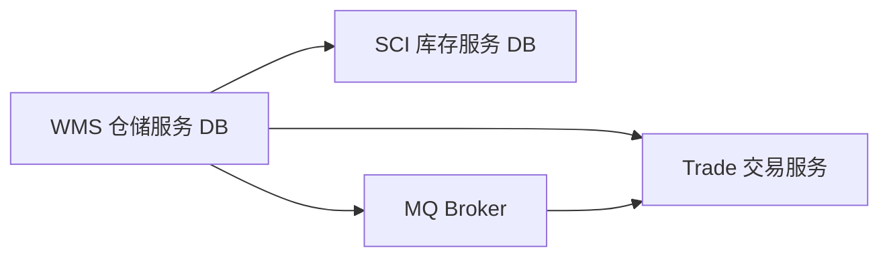
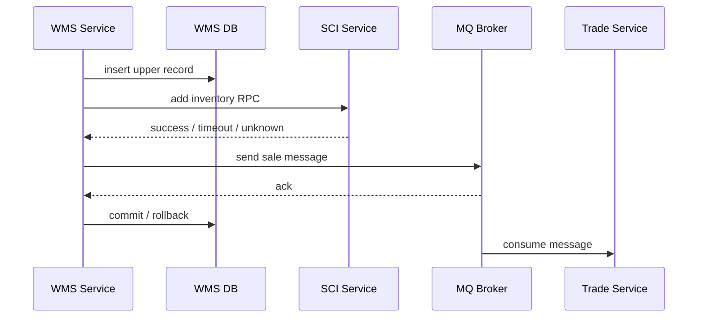
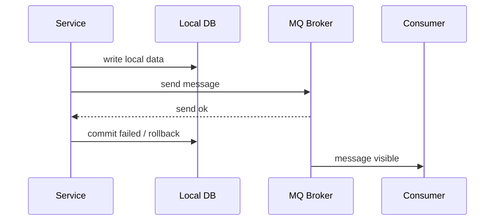
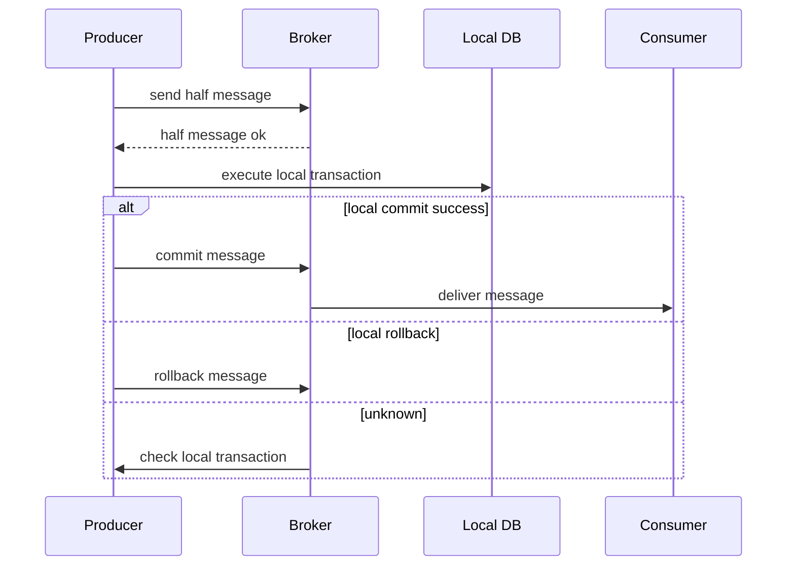
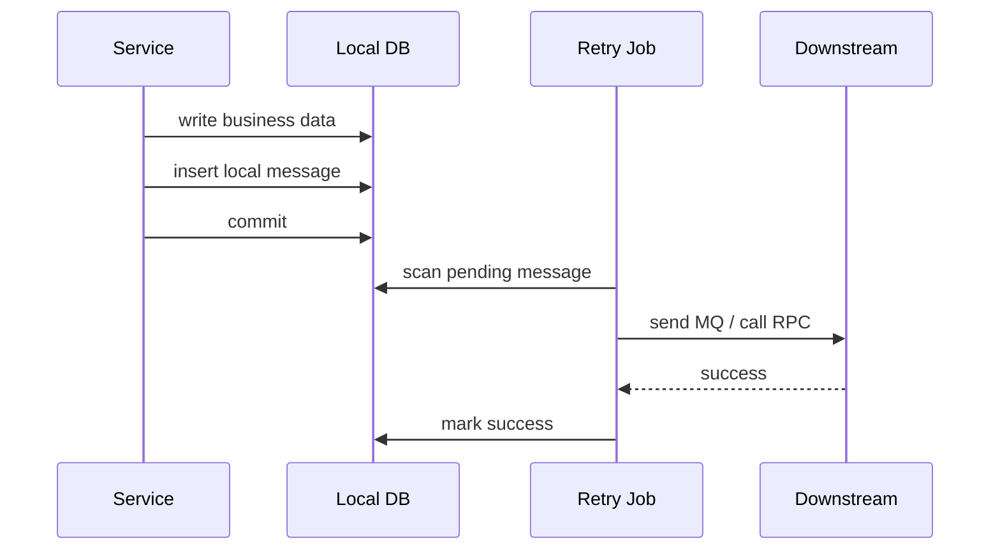

# 分布式数据一致性场景与方案处理分析

> 来源整理：根据微信公众号文章《分布式数据一致性场景与方案处理分析｜得物技术》提取、总结并重写为技术博客版本。本文围绕跨服务写操作、消息发送、本地消息表、事务事件和 RocketMQ 事务消息进行结构化整理，并在文末补充面向 5 年经验开发/架构候选人的高质量面试追问。

## 1. 文章摘要

随着微服务架构拆分，原本在单体应用和单库事务中可以用 ACID 保证的原子性，会被拆成多个服务、多个数据库、多个消息链路。一个业务动作可能同时涉及本地 DB 更新、写 RPC、MQ 消息、日志记录和下游异步处理。

原文以“商品仓库上架”为例，分析了分布式系统中生产者端常见的数据一致性问题，并对几种方案进行了比较：

- 写 RPC 调用：调用成功但返回失败、调用超时、下游重复处理。
- 同步消息 + 重试：消息发送可靠性提升，但仍无法解决“消息成功、本地事务回滚”。
- RocketMQ 事务消息：能绑定消息和本地事务，但实现复杂、性能成本高。
- Spring 事务事件 + 同步消息：事务提交后再发消息，降低消息早发风险。
- 本地消息表：把跨服务动作写成本地可靠事件，通过异步重试实现最终一致。

核心结论是：分布式一致性不存在银弹。需要根据业务一致性要求、吞吐量、实现复杂度、失败补偿能力和运维成本选择方案。

## 2. 从 ACID 到 BASE：一致性目标变了

单体应用中，一个业务动作通常可以包在一个本地事务里：

```java
@Transactional
public void doBusiness() {
    updateTableA();
    updateTableB();
}
```

只要数据库事务提交成功，两个表就一致；失败则一起回滚。

微服务拆分后，事务边界变成这样：



本地事务无法跨越 RPC、MQ 和其他服务数据库。此时系统通常从强一致转向最终一致，也就是 BASE 思路：

| 概念 | 含义 |
|---|---|
| Basically Available | 出现故障时保证核心功能基本可用 |
| Soft State | 系统允许存在短暂中间状态 |
| Eventually Consistent | 通过重试、补偿、对账等方式最终一致 |

工程上要先问一个问题：业务到底需要强一致、准实时一致，还是最终一致？

## 3. 示例场景：商品仓库上架

简化流程：

1. 操作员在仓储系统 WMS 中上架商品。
2. WMS 写入仓储数据库。
3. WMS 调用中央库存系统 SCI，增加可用库存。
4. WMS 通知交易系统 Trade，该商品可以售卖。
5. 记录日志或执行其他后置动作。

伪代码如下：

```java
@Transactional
public void upper(UpperRequest request) {
    UpperDO upper = buildUpperDO(request);
    wmsService.upper(upper);

    SciInventoryRequest inventoryRequest = buildSciInventoryRequest(request);
    sciRpcService.addInventory(inventoryRequest);

    TradeMessageRequest tradeMessage = buildTradeMessageRequest(request);
    sendMessageToTrade(tradeMessage);

    recordLog(buildLogRequest(request));
}
```

这段代码看起来顺序清晰，但隐藏了多个一致性风险点：

- 本地 DB 成功，RPC 失败。
- RPC 实际成功，但调用方收到失败或超时。
- 消息发送成功，但本地事务随后回滚。
- 消息发送失败，但本地事务已经提交。
- 后续重试导致下游重复处理。

完整风险链路：



## 4. 写 RPC 的一致性问题

RPC 可以分为两类：

- 读 RPC：补充数据，不改变下游状态。
- 写 RPC：改变下游数据，对其他服务有副作用。

读 RPC 失败通常只影响当前流程；写 RPC 失败则可能造成跨服务数据不一致。

### 4.1 写 RPC 的不确定状态

调用写 RPC 时，结果不只有成功和失败：

| 调用方看到 | 下游实际状态 | 风险 |
|---|---|---|
| 成功 | 成功 | 一致 |
| 失败 | 失败 | 可重试 |
| 失败/超时 | 成功 | 调用方误以为失败，重试可能重复 |
| 成功 | 下游后续回滚/补偿失败 | 状态漂移 |

最危险的是“超时未知”。调用方不知道下游是否成功，简单重试可能造成重复库存、重复支付、重复履约。

### 4.2 基本治理手段

写 RPC 要求下游提供幂等能力：

```java
public AddInventoryResult addInventory(AddInventoryCommand command) {
    // requestId 唯一
    if (idempotentRepository.exists(command.requestId())) {
        return AddInventoryResult.success();
    }

    inventoryRepository.add(command.skuId(), command.quantity());
    idempotentRepository.save(command.requestId());
    return AddInventoryResult.success();
}
```

调用方则需要：

- 设置超时。
- 对可重试错误进行有限重试。
- 对未知状态记录异常。
- 告警并进入补偿流程。
- 不要在一个本地事务里长时间阻塞等待外部 RPC。

## 5. 同步消息 + 重试

同步消息通过等待 Broker ack，提高消息发送可靠性。

```java
DefaultMQProducer producer = new DefaultMQProducer("ProducerGroup");
producer.setNamesrvAddr("127.0.0.1:9876");
producer.setRetryTimesWhenSendFailed(3);
producer.start();

Message msg = new Message(
        "UpperTopic",
        "UpperFinished",
        "upper_1001",
        payload.getBytes(StandardCharsets.UTF_8)
);

SendResult result = producer.send(msg);
if (result.getSendStatus() != SendStatus.SEND_OK) {
    throw new BizException("send message failed");
}
```

同步消息 + 重试可以提升“消息到达 Broker”的概率，但无法解决一个关键问题：

> 消息发送成功后，本地事务还没提交。如果本地事务回滚，消息已经无法回滚。



因此，如果在事务内直接发送消息，可能出现“下游收到消息，但上游本地数据不存在”的不一致。

## 6. RocketMQ 事务消息

RocketMQ 事务消息通过二阶段机制解决“本地事务和消息发送原子性”问题。

基本流程：

1. 发送半消息。
2. Broker 暂不投递半消息。
3. Producer 执行本地事务。
4. 本地事务成功则提交消息。
5. 本地事务失败则回滚消息。
6. 如果 Producer 没有明确提交/回滚，Broker 回查本地事务状态。



### 6.1 优点

- 能保证消息发送和本地事务结果一致。
- 适合强一致性要求较高的消息场景。
- Broker 回查机制能处理 Producer 崩溃或网络异常。

### 6.2 缺点

- 实现复杂，需要实现本地事务回查逻辑。
- 每类消息都要能通过消息体反查本地事务状态。
- 性能低于普通同步消息。
- 代码侵入度较高。
- 对业务状态机设计要求高。

原文观点是：事务消息适合低并发、强一致场景；如果为了少量一致性提升付出明显性能下降和复杂度成本，在高并发业务中未必划算。

## 7. Spring 事务事件 + 同步消息

Spring 提供 `@TransactionalEventListener`，可以在事务不同阶段触发事件处理。常见做法是在本地事务提交后再发送消息。

业务方法：

```java
@Service
public class WmsService {
    private final ApplicationEventPublisher eventPublisher;

    @Transactional
    public void upper(UpperRequest request) {
        UpperDO upper = buildUpperDO(request);
        upperRepository.save(upper);

        UpperFinishedEvent event = buildUpperFinishedEvent(request);
        eventPublisher.publishEvent(event);
    }
}
```

事务提交后监听：

```java
@Component
public class UpperFinishedEventListener {

    @TransactionalEventListener(phase = TransactionPhase.AFTER_COMMIT)
    public void handle(UpperFinishedEvent event) {
        TradeMessageRequest message = buildTradeMessageRequest(event);
        sendMessageToTrade(message);
    }
}
```

这样可以避免“本地事务回滚但消息已发送”的问题。

但要注意：

- `AFTER_COMMIT` 后发送消息失败，不能再回滚本地事务。
- 必须配合发送重试、告警、补偿。
- 监听逻辑不宜过重，否则会影响业务线程。
- 如果事件异步执行，要关注线程池、异常处理和上下文丢失。

适用场景：

- 消息是本地事务提交后的后置动作。
- 允许最终一致。
- 对性能要求高，不想使用事务消息。
- 可以通过重试和补偿解决发送失败。

## 8. 本地消息表

本地消息表是最终一致性中非常经典的方案。核心思想是：把“要通知下游的事件”作为本地事务的一部分写入数据库，随后由异步任务扫描消息表并投递消息或调用 RPC。



表结构示例：

```sql
CREATE TABLE local_message (
    id BIGINT PRIMARY KEY,
    biz_id VARCHAR(64) NOT NULL,
    event_type VARCHAR(64) NOT NULL,
    payload TEXT NOT NULL,
    status VARCHAR(16) NOT NULL,
    retry_count INT NOT NULL DEFAULT 0,
    next_retry_time DATETIME NOT NULL,
    created_at DATETIME NOT NULL,
    updated_at DATETIME NOT NULL,
    UNIQUE KEY uk_biz_event (biz_id, event_type)
);
```

发送任务伪代码：

```java
public void dispatch() {
    List<LocalMessage> messages = localMessageRepository.lockPendingMessages(100);
    for (LocalMessage message : messages) {
        try {
            downstreamClient.send(message.payload());
            localMessageRepository.markSuccess(message.id());
        } catch (Exception e) {
            localMessageRepository.markRetry(message.id(), nextRetryTime(message.retryCount()));
        }
    }
}
```

### 8.1 优点

- 本地业务数据和消息记录在同一个 DB 事务中提交。
- 发送失败可重试。
- 失败状态可查询、可告警、可人工补偿。
- 可统一封装为一致性框架。
- 对写 RPC 和 MQ 发送都适用。

### 8.2 缺点

- 有延迟，不是实时一致。
- 高并发下消息表可能成为瓶颈。
- 扫描和重试任务需要治理。
- payload 过大时存储和查询成本高。
- 如果放在主业务事务内写入复杂消息，可能造成大事务。

### 8.3 适用场景

- 跨服务最终一致。
- 后置通知。
- 异步任务。
- 对可靠性要求较高，但不要求强实时。
- 需要统一失败查询和补偿的平台化场景。

## 9. 方案选型对比

| 方案 | 一致性 | 性能 | 实现复杂度 | 适用场景 |
|---|---|---:|---:|---|
| 写 RPC + 重试 | 依赖幂等和补偿 | 中 | 中 | 同步依赖、调用链较短 |
| 同步消息 + 重试 | 消息发送可靠性较高 | 高 | 低 | 普通异步通知 |
| 事务消息 | 本地事务与消息一致性强 | 中低 | 高 | 金融、交易等强一致消息 |
| 事务事件 + 同步消息 | 避免事务回滚后消息已发 | 高 | 中 | 事务提交后通知 |
| 本地消息表 | 最终一致可靠性高 | 中 | 中高 | 跨服务事务、异步补偿 |

选型建议：

- 高并发、允许最终一致：优先事务事件 + 同步消息或本地消息表。
- 强一致、低并发、能实现回查：考虑 RocketMQ 事务消息。
- 写 RPC 必不可少：下游必须幂等，调用方必须记录异常并补偿。
- 需要统一可观测、可重试、可补偿：本地消息表更适合平台化。

## 10. 架构设计要点

### 10.1 幂等是所有方案的地基

无论使用 RPC 重试、MQ 重试还是本地消息表，都无法避免重复投递和重复调用。因此下游必须支持幂等：

- 使用业务唯一键。
- 使用 requestId。
- 使用状态机防重复流转。
- 使用唯一索引兜底。

### 10.2 可观测性决定补偿效率

一致性方案必须能回答：

- 哪些消息待处理？
- 哪些消息失败？
- 失败原因是什么？
- 重试了多少次？
- 是否需要人工介入？
- 影响了哪些业务单据？

### 10.3 不要在本地事务中做太多外部调用

本地事务持有数据库锁，期间调用 RPC/MQ 会放大事务时间，增加锁等待和死锁风险。

更合理的做法是：

- 本地事务只写本地状态和事件。
- 外部调用放到事务提交后或异步任务中。
- 通过重试、补偿、对账实现最终一致。

## 11. 总结

分布式一致性没有 100% 完美方案。所有方案都在一致性、性能、复杂度、侵入性和业务可接受延迟之间做取舍。

这篇文章讨论的是生产者端一致性问题，核心思路可以归纳为：

- 写 RPC 必须幂等，并配合重试和补偿。
- 普通同步消息适合大多数异步通知，但不能解决事务回滚后消息已发送。
- RocketMQ 事务消息能增强一致性，但复杂度和性能成本较高。
- Spring 事务事件适合事务提交后发送消息。
- 本地消息表是最终一致性中非常实用的通用方案，尤其适合需要失败可查、可重试、可补偿的业务。

真正成熟的系统，靠的不是某个“万能一致性方案”，而是幂等、状态机、消息表、重试、告警、补偿、对账和人工兜底共同组成的闭环。

## 12. 面试追问：五年资深开发与架构设计视角

以下问题适合考察候选人是否真正具备分布式一致性和业务架构思考能力，而不是只会背 CAP、BASE 和事务消息。

### 12.1 一致性目标与业务边界

1. 你如何判断一个业务场景需要强一致、准实时一致还是最终一致？
2. 商品上架、库存增加、交易可售三个动作中，哪些必须强一致？哪些可以最终一致？为什么？
3. 如果业务方说“必须 100% 一致”，你会如何追问和澄清需求？
4. 最终一致允许“不一致窗口”，这个窗口如何定义、监控和验收？
5. 你如何向产品或业务解释一致性、可用性和性能之间的取舍？

### 12.2 写 RPC 与幂等

6. 写 RPC 超时后，调用方不知道下游是否成功，你会如何处理？
7. 下游幂等应该依赖 requestId、业务唯一键还是状态机？不同方式有什么差异？
8. 如果下游接口不支持幂等，但你必须重试，你会如何降低风险？
9. 写 RPC 放在本地事务内有什么问题？如何改造？
10. 如何设计一个可观测的写 RPC 重试和补偿机制？

### 12.3 消息发送与事务边界

11. 为什么“同步消息 + 重试”仍然可能导致数据不一致？
12. 消息发送成功但本地事务回滚，这种问题如何发现？如何补救？
13. 本地事务提交成功但消息发送失败，事务事件方案如何处理？
14. Spring 的 `@TransactionalEventListener(AFTER_COMMIT)` 有什么坑？
15. 如果事件监听器里发送消息失败，你会同步重试、异步重试还是落本地消息表？

### 12.4 RocketMQ 事务消息

16. RocketMQ 事务消息的半消息、提交、回滚、回查分别解决什么问题？
17. 本地事务回查接口应该如何设计？消息体里必须包含哪些字段？
18. 为什么事务消息实现复杂、性能更低？低在哪里？
19. 哪些业务值得使用事务消息？哪些业务不值得？
20. 如果事务消息回查时本地状态查不到，你会返回 commit、rollback 还是 unknown？

### 12.5 本地消息表

21. 本地消息表如何保证业务数据和消息记录原子提交？
22. 本地消息表扫描任务如何避免多实例重复处理？
23. 消息表积压时，你如何扩容、限速和保护主库？
24. 本地消息表 payload 很大怎么办？存全量、存引用还是存快照？
25. 本地消息表长期运行后如何归档、清理和审计？

### 12.6 架构与生产治理

26. 如何设计一套统一的一致性框架，让业务通过注解或声明式配置接入？
27. 一致性补偿失败多次后，什么时候自动重试，什么时候人工介入？
28. 如何设计一致性对账任务？对账频率、数据源和修复策略如何选择？
29. 如果库存系统和交易系统长期不一致，你如何定位是 RPC、MQ、消费端还是补偿任务的问题？
30. 请设计一个“商品上架后库存成功增加但交易未可售”的完整排障和修复流程。

这些追问的核心不是找标准答案，而是看候选人能否从代码实现上升到业务正确性、失败模型、补偿闭环和系统可治理性。

## 参考来源

- 微信公众号文章：[分布式数据一致性场景与方案处理分析｜得物技术](https://mp.weixin.qq.com/s/F6ldIj_zM9kuaRcT69YBtA)
