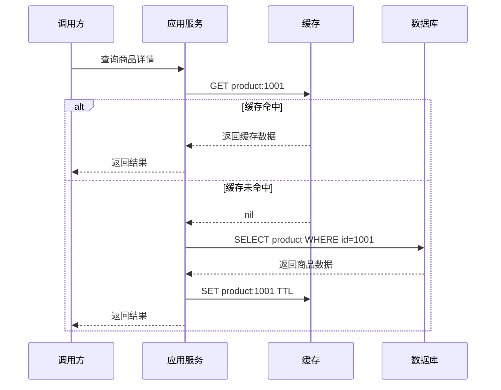

# 缓存到底解决什么问题

## 1. 这一章解决什么问题

很多系统第一次遇到性能瓶颈时，最自然的反应就是“加 Redis”。这个判断有时正确，有时也会把一个简单问题变成一个更复杂的问题。缓存不是银弹，它解决的是“重复访问同一批数据时，后端系统反复承担昂贵计算或存储访问”的问题。

缓存的本质是用更快、更靠近调用方、更容易横向扩展的存储层，承接一部分读请求。它可以降低数据库压力、缩短接口响应时间、削峰填谷，也能在下游短暂异常时提供降级数据。但它同时会引入一致性、过期、容量、热点、雪崩和运维复杂度。

所以，学习缓存的第一步不是学习 Redis 命令，而是回答三个问题：

- 这类数据是否值得缓存？
- 缓存命中后能减少什么成本？
- 缓存失效、数据过期或缓存异常时，业务能否接受？

## 2. 核心概念

### 缓存的本质

缓存依赖两个常见规律：

- 时间局部性：刚被访问过的数据，短时间内大概率会再次被访问。
- 空间局部性：某个数据被访问时，与它相关的一组数据也可能被访问。

例如商品详情、用户资料、配置项、热门榜单、文章计数、Feed 流首屏，都天然具有重复访问特征。它们适合通过缓存减少数据库、搜索引擎、远程服务或复杂计算的压力。

### 缓存命中率

命中率是缓存价值最核心的指标之一：

```text
命中率 = 缓存命中请求数 / 总读取请求数
```

命中率高，说明大部分请求被缓存承接；命中率低，缓存层反而可能变成额外网络跳转。一个缓存设计是否成功，不能只看 Redis QPS，还要看数据库回源比例、P95/P99 延迟、热点分布、内存成本和故障时的退化表现。

### 缓存不是数据库

缓存通常更适合保存“可再生”的数据：

- 可以从数据库重新加载。
- 可以从消息流或日志中恢复。
- 可以通过重新计算生成。
- 短时间不一致业务可接受。

如果某类数据丢失后不可恢复，或者强一致性要求极高，缓存就不应该作为唯一事实源。

## 3. 原理拆解

一个典型 Cache Aside 读流程如下：



这个流程看起来简单，但背后有几个关键点：

- 缓存 key 如何设计，是否支持版本、租户、业务隔离。
- 缓存 value 是否过大，是否需要压缩、拆分或只缓存必要字段。
- TTL 如何设置，是否会造成同一时刻大量过期。
- 缓存未命中时，是否会有大量请求同时打到数据库。
- 数据更新后，缓存如何删除或刷新。

## 4. 工程取舍

### 缓存适合什么场景

适合缓存的数据通常具备这些特征：

- 读多写少，例如商品详情、用户基础资料、配置数据。
- 计算成本高，例如复杂聚合、排行榜、推荐候选集。
- 对短暂不一致可容忍，例如点赞数、阅读数、非交易类展示数据。
- 热点明显，例如活动页、爆款商品、热门内容。
- 访问链路长，例如依赖多个远程服务拼装的数据。

### 缓存不适合什么场景

这些场景要谨慎：

- 写多读少，缓存还没被读几次就失效。
- 强一致性要求极高，例如支付余额扣减的唯一事实源。
- 数据基数巨大且访问分散，命中率很低。
- value 过大，缓存层网络和内存成本过高。
- 业务无法接受缓存异常后的降级策略。

### 缓存引入的额外问题

缓存会把“一个数据库查询问题”变成“一个分布式系统问题”：

- 一致性：数据库和缓存可能短暂不一致。
- 可用性：缓存故障时是否会拖垮数据库。
- 容量：内存水位、淘汰策略、成本控制。
- 热点：单 key 或单分片被打爆。
- 治理：监控、告警、压测、扩容、迁移、故障演练。

## 5. 实战方案

### 评估是否应该加缓存

可以用下面这张表做架构评审：

| 问题 | 判断标准 |
|---|---|
| 数据是否重复访问 | 同一 key 在短时间内被多次读取 |
| 命中后能节省什么 | DB 查询、RPC 调用、搜索查询、复杂计算 |
| 是否允许不一致 | 明确可接受的延迟窗口，例如 1 秒、10 秒、1 分钟 |
| 数据是否可恢复 | 缓存丢失后能从 DB 或计算链路重建 |
| 是否有热点风险 | 是否存在爆款、活动、明星用户、热门帖子 |
| 失效时如何兜底 | 限流、降级、返回旧值、排队、熔断 |

### 简化版 Cache Aside 伪代码

```java
public ProductDTO getProduct(long id) {
    String key = "product:" + id;
    ProductDTO cached = redis.get(key);
    if (cached != null) {
        return cached;
    }

    ProductDTO value = productRepository.findById(id);
    if (value == null) {
        redis.setex(key, 60, NullValue.INSTANCE);
        return null;
    }

    int ttl = 3600 + ThreadLocalRandom.current().nextInt(300);
    redis.setex(key, ttl, value);
    return value;
}
```

这里已经包含几个基础治理动作：

- 空值缓存：降低不存在 id 的穿透风险。
- TTL 抖动：避免大量 key 同时过期。
- 统一 key 前缀：便于排查和隔离。

### 第一批监控指标

上线缓存后，至少要看这些指标：

- 缓存命中率。
- Redis QPS、P95/P99 延迟。
- 数据库 QPS 是否下降。
- 缓存连接数、超时数、错误数。
- key 数量、内存水位、淘汰 key 数。
- 慢查询、Big Key、Hot Key。
- 回源请求峰值。

## 6. 常见问题

### 为什么加了缓存接口还是慢？

常见原因是命中率不够、value 太大、序列化成本高、缓存和应用跨机房、连接池配置不合理，或者接口慢点根本不在数据库访问上。加缓存前应该先做链路追踪，确认瓶颈位置。

### 缓存命中率越高越好吗？

大多数读缓存场景中，命中率越高越好。但也要看成本。如果为了追求极高命中率缓存大量低频数据，可能导致内存成本和淘汰压力明显上升。缓存不是仓库，它应该优先服务高价值访问。

### 缓存 TTL 设置多久合适？

TTL 取决于数据更新频率、一致性要求、重建成本和访问热度。配置类数据可以较长，但需要变更通知；商品库存类数据要谨慎；热点内容可以逻辑过期加异步刷新；不存在的数据空值缓存 TTL 应较短。

## 7. 小结

- 缓存的核心价值是利用局部性，把重复访问从慢链路转移到快链路。
- 判断是否加缓存，要同时看访问模式、命中收益、一致性要求和失效风险。
- 缓存适合读多写少、热点明显、可容忍短暂不一致、可重建的数据。
- 缓存会引入一致性、热点、雪崩、容量和运维治理问题。
- 一个成熟的缓存方案必须同时包含 key 设计、TTL、回源保护、监控告警和降级预案。
