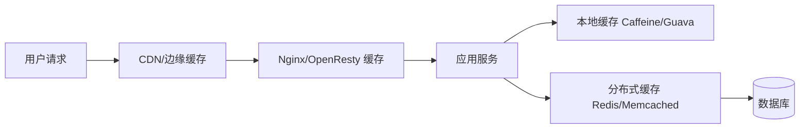
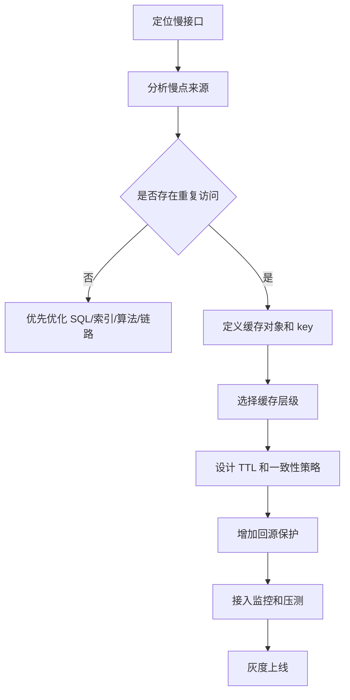

# 业务数据访问性能太低时如何引入缓存

## 1. 这一章解决什么问题

当接口变慢、数据库 CPU 升高、慢查询变多时，缓存常常是最先被讨论的方案。但“加缓存”不是一个动作，而是一组设计：缓存什么、放在哪里、如何命名、何时过期、怎样回源、如何更新、故障时怎么降级。

这一章关注从业务性能问题出发，如何一步步引入缓存，而不是一开始就陷入 Redis 命令或组件细节。

## 2. 核心概念

### 性能瓶颈的来源

业务数据访问慢，通常来自几类成本：

- 存储成本：数据库索引不合理、扫描行数大、磁盘 I/O 高。
- 网络成本：跨服务调用、跨机房访问、依赖链路过长。
- 计算成本：复杂聚合、权限过滤、推荐排序、统计分析。
- 并发成本：同一时间大量请求打到同一资源。
- 序列化成本：大对象传输和反序列化消耗 CPU。

缓存适合优化其中“可复用”的部分。如果每次请求都访问完全不同的数据，缓存收益会很有限。

### 缓存层级

缓存不一定只有 Redis。常见层级如下：



不同层级解决的问题不同：

- CDN：适合静态资源、活动页、公开内容。
- 网关缓存：适合轻量接口、短 TTL 数据。
- 本地缓存：极低延迟，但一致性和容量受限。
- 分布式缓存：通用性强，支持集群和共享访问。
- 数据库：最终事实源。

## 3. 原理拆解

### 从慢接口到缓存方案

一次比较稳妥的引入过程：



### 缓存对象设计

缓存对象不是数据库表的简单复制。一个好的缓存对象应该服务具体读场景：

- 商品详情页可以缓存聚合后的展示 DTO。
- 用户基础资料可以缓存稳定字段，动态字段单独读取。
- 榜单可以缓存 TopN 列表，而不是缓存全量数据。
- 权限结果可以缓存用户在某资源上的判断结果，但 TTL 要短。

缓存对象越贴近读模型，命中后的收益越明显；越贴近底层表模型，应用层还需要继续拼装，收益会打折。

## 4. 工程取舍

### 本地缓存还是分布式缓存

| 维度 | 本地缓存 | 分布式缓存 |
|---|---|---|
| 延迟 | 极低，无网络开销 | 需要网络访问 |
| 容量 | 受单机内存限制 | 可水平扩展 |
| 一致性 | 多实例一致性较弱 | 统一存储，一致性更容易治理 |
| 适合场景 | 配置、字典、极热点小对象 | 用户、商品、会话、计数、聚合结果 |
| 风险 | 实例间旧值、内存挤占 | 网络、集群、热点、雪崩 |

在高并发核心链路中，常见做法是本地缓存 + 分布式缓存 + DB 组合使用。极热点数据先打到本地缓存，未命中再访问 Redis，最后才回源数据库。

### 缓存整对象还是缓存字段

整对象缓存简单，适合商品详情、文章详情、用户资料。字段级缓存更灵活，适合频繁变化的计数、状态、库存。

一个常见拆分方式：

```text
product:base:{id}      -> 商品基础信息，TTL 长
product:price:{id}     -> 价格，TTL 中等或事件驱动更新
product:stock:{id}     -> 库存，TTL 短或走专门库存服务
product:stat:{id}      -> 浏览/收藏/销量计数，异步汇总
```

这样可以避免一个字段频繁变化导致整个大对象不断失效。

## 5. 实战方案

### Key 设计规范

建议从一开始就建立 key 规范：

```text
{业务}:{对象}:{标识}:{版本}

product:detail:1001:v1
user:profile:2001:v2
feed:timeline:uid:3001:v1
counter:article:like:9001
```

设计时要考虑：

- 可读性：线上排查时能看懂。
- 隔离性：不同业务域不要混用前缀。
- 版本化：结构变化时可以平滑切换。
- 分片友好：Redis Cluster 中需要关注 hash tag。
- 长度控制：key 太长也会增加内存成本。

### TTL 设计

TTL 可以按数据类型分层：

| 数据类型 | 建议 TTL | 说明 |
|---|---:|---|
| 配置/字典 | 10 分钟到数小时 | 结合变更通知主动删除 |
| 商品详情 | 5 分钟到 1 小时 | 热点商品可逻辑过期 |
| 用户资料 | 5 分钟到 30 分钟 | 修改后主动删缓存 |
| 空值缓存 | 30 秒到 5 分钟 | 防穿透，避免长期污染 |
| 榜单 | 秒级到分钟级 | 可异步刷新 |
| 计数 | 视业务而定 | 常用异步汇总和冷热分层 |

避免所有 key 使用相同 TTL，可以加入随机抖动：

```java
int ttl = baseTtlSeconds + ThreadLocalRandom.current().nextInt(jitterSeconds);
redis.setex(key, ttl, value);
```

### 回源保护

缓存未命中时，最危险的是大量并发同时回源。可以使用单飞机制：

```java
public ProductDTO getProduct(long id) {
    String key = "product:detail:" + id;
    ProductDTO cached = redis.get(key);
    if (cached != null) return cached;

    return singleFlight.execute(key, () -> {
        ProductDTO secondCheck = redis.get(key);
        if (secondCheck != null) return secondCheck;

        ProductDTO dbValue = productRepository.findById(id);
        redis.setex(key, randomTtl(), dbValue);
        return dbValue;
    });
}
```

本质是同一时刻同一个 key 只允许一个线程回源，其他线程等待或返回旧值。

### 灰度上线步骤

1. 先只读缓存，不命中仍走旧链路，并记录命中率。
2. 小流量写入缓存，检查数据大小、TTL、错误率。
3. 打开读缓存，观察接口延迟和 DB QPS。
4. 模拟缓存不可用，确认降级策略不会压垮 DB。
5. 扩大流量，并加入热点 key、big key 监控。

## 6. 常见问题

### 为什么缓存上线后数据库压力没有明显下降？

可能原因包括：缓存对象选错、key 粒度过细、TTL 太短、访问分布太分散、代码路径没有真正命中缓存、缓存异常后静默回源。需要同时看命中率、回源比例、DB QPS 和接口链路追踪。

### 本地缓存会不会造成脏数据？

会。本地缓存最大问题是多实例之间无法天然同步。常见治理方式是短 TTL、消息广播失效、版本号、配置中心推送，或者只缓存可容忍短暂旧值的数据。

### 所有查询都应该缓存结果吗？

不应该。低频查询、强一致查询、复杂任意条件查询、大结果集查询，都不适合无脑缓存。缓存应该优先服务稳定、明确、高频、可重建的读模型。

## 7. 小结

- 引入缓存前要先定位慢点，确认存在重复访问和可复用结果。
- 缓存对象应面向读模型设计，而不是简单复制数据库表。
- 本地缓存和分布式缓存解决的问题不同，核心链路常常组合使用。
- key、TTL、回源保护和监控必须在第一版就纳入设计。
- 缓存上线应灰度推进，并提前演练缓存故障时的退化路径。
