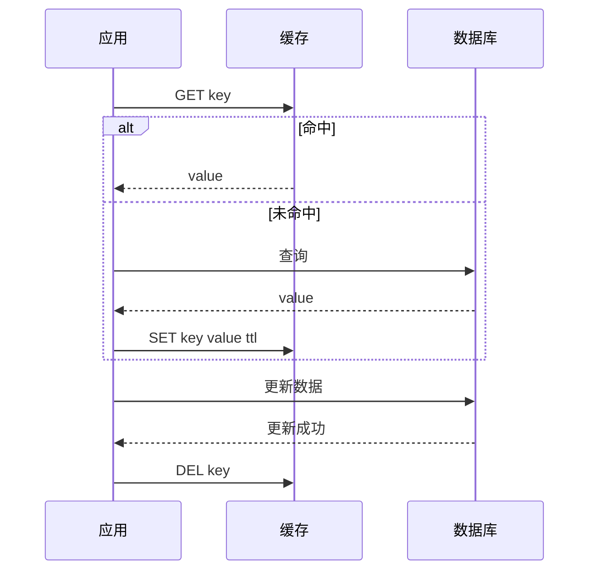
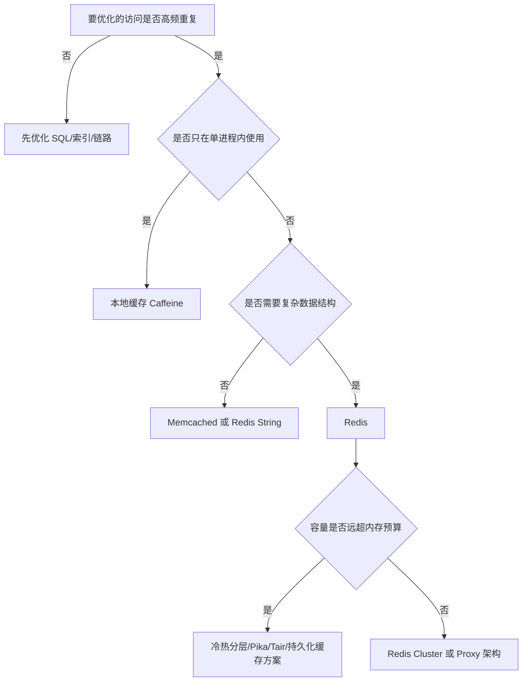

# 缓存模式与组件选型

## 1. 这一章解决什么问题

缓存选型最容易陷入两个极端：一种是所有场景都用 Redis，另一种是把各种缓存模式讲成抽象概念，落地时仍然不知道怎么选。真正的选型要从业务读写模型出发：谁负责加载数据、谁负责更新缓存、缓存与数据库之间允许多长时间不一致、故障时优先保可用还是保一致。

这一章把常见缓存模式和组件放在同一张地图里，帮助你在设计时做工程取舍。

## 2. 核心概念

### Cache Aside

Cache Aside 是最常见的模式，也叫旁路缓存。应用代码先读缓存，缓存未命中再读数据库，然后把结果写回缓存。更新数据时通常先更新数据库，再删除缓存。

优点是简单、通用、可控；缺点是一致性细节需要应用自己处理。

### Read Through

Read Through 中，应用只访问缓存服务，缓存服务在未命中时负责加载后端数据。它把回源逻辑封装在缓存层或缓存代理中。

优点是应用简单；缺点是缓存层需要理解数据源和业务加载逻辑，通用性较弱。

### Write Through

Write Through 中，写请求先写缓存，由缓存同步写入数据库，成功后才返回。

优点是缓存与数据库更容易保持一致；缺点是写延迟变高，缓存层复杂度上升。

### Write Back

Write Back 中，写请求先写缓存并立即返回，缓存再异步刷入数据库。

优点是写性能极高；缺点是数据丢失风险和恢复复杂度高，一般不适合作为交易数据主路径，更多用于可重建或可补偿的场景。

### Refresh Ahead

Refresh Ahead 是预刷新模式。缓存系统在 key 过期前异步刷新，避免用户请求触发慢回源。

适合热点数据、榜单、推荐结果、活动配置等。

## 3. 原理拆解

### 常见缓存模式对比

| 模式 | 读路径 | 写路径 | 一致性 | 适合场景 |
|---|---|---|---|---|
| Cache Aside | 应用读缓存，未命中读 DB | 应用写 DB 后删缓存 | 最终一致 | 最通用的业务缓存 |
| Read Through | 应用只读缓存 | 通常仍由应用写 DB | 依赖缓存加载器 | 标准化数据访问层 |
| Write Through | 读缓存 | 写缓存并同步写 DB | 较强 | 写入链路可接受更高延迟 |
| Write Back | 读缓存 | 写缓存，异步写 DB | 较弱 | 高写入、可补偿场景 |
| Refresh Ahead | 读缓存 | 后台提前刷新 | 可控延迟 | 热点数据、定时榜单 |

### Cache Aside 读写流程

为什么更新时更推荐删除缓存，而不是直接更新缓存？因为业务写模型和读模型可能不同。数据库更新的是底层事实，缓存保存的可能是多个表聚合后的展示对象。删除缓存可以让下一次读取重新构建，降低写路径复杂度。

## 4. 工程取舍

### 组件选择：本地缓存、Memcached、Redis

| 组件 | 优势 | 局限 | 推荐场景 |
|---|---|---|---|
| Caffeine/Guava | 极低延迟、无网络、适合进程内热点 | 多实例一致性差、容量有限 | 配置、字典、小对象热点 |
| Memcached | 简单高性能、多线程、内存管理成熟 | 数据结构少、无持久化、客户端分片 | 纯 KV、大规模读缓存 |
| Redis | 数据结构丰富、生态完整、持久化和集群能力强 | 单 key 大对象和阻塞命令风险高 | 通用缓存、计数、排行榜、分布式协调 |
| Pika/Tendis/Tair | 可承载更大容量或增强企业能力 | 运维和兼容性需评估 | 大容量、冷热分层、云厂商方案 |
| Dragonfly/KeyDB | 多线程、高吞吐、Redis 协议兼容 | 生态成熟度和生产经验需验证 | 高吞吐 Redis 替代评估 |

### 读多写少和写多读少

读多写少是缓存最舒适的区域。写多读少则要谨慎，因为频繁写会导致缓存频繁失效，命中率低，还增加双写复杂度。写多场景更适合考虑：

- 写入队列削峰。
- 批量聚合。
- 日志型存储。
- 异步物化视图。
- 针对热点读模型做局部缓存，而不是缓存所有写入结果。

### 一致性要求决定模式

如果业务能接受秒级不一致，Cache Aside + TTL + 主动删除通常足够。如果要求更可靠的最终一致，可以引入消息补偿或 CDC。如果要求强一致，就要减少缓存参与关键写路径，或者让缓存只承担展示，不承担决策。

## 5. 实战方案

### 选型决策树

### 按业务类型选择

| 业务类型 | 推荐方案 |
|---|---|
| 商品详情 | Cache Aside + Redis/Memcached + TTL 抖动 |
| 用户会话 | Redis String/Hash + 合理过期 |
| 配置中心数据 | 本地缓存 + 变更推送 + 短兜底 TTL |
| 排行榜 | Redis ZSet + 定期归档 |
| UV 统计 | HyperLogLog 或 Bitmap，按精度要求选择 |
| 秒杀库存 | Redis Lua 原子扣减 + 异步下单 + DB 最终校验 |
| Feed 首屏 | 多级缓存 + 推拉结合 + 降级返回 |

### 组件选型检查清单

- 数据结构是否真的需要 Redis 的复杂类型。
- 是否需要持久化，持久化恢复时间是否可接受。
- 是否需要跨机房访问，延迟预算是多少。
- 最大 value 多大，是否存在 Big Key。
- 热点 key 如何识别和打散。
- 客户端是否支持连接池、超时、熔断、读写分离。
- 扩缩容时 key 迁移或缓存抖动如何处理。
- 运维团队对该组件是否有成熟经验。

## 6. 常见问题

### Redis 能替代 Memcached 吗？

很多场景可以，但不代表 Redis 永远更合适。Memcached 的价值在于简单、纯粹、多线程、少阻塞，适合作为大规模 KV 读缓存。Redis 更像一个丰富的数据结构服务器，适合更复杂的业务建模。

### 为什么不建议所有场景都用 Write Back？

Write Back 会把数据可靠性压力转移到缓存层。一旦缓存宕机、异步刷盘失败或消息丢失，就可能导致数据丢失。除非数据可重建、可补偿，或者你有非常成熟的日志和恢复机制，否则不要把它用于核心交易事实。

### 缓存模式能混用吗？

可以。一个系统里常常同时存在 Cache Aside、本地缓存、预刷新、异步写入。例如商品详情用 Cache Aside，榜单用定时刷新，热点配置用本地缓存，计数用 Redis 累加后异步落库。

## 7. 小结

- 缓存模式选择，本质是选择读写职责和一致性边界。
- Cache Aside 最通用，但需要应用处理一致性、回源和失效。
- Redis 不只是缓存，Memcached 也没有过时，组件选择要回到业务模型。
- 读多写少、可容忍短暂不一致、可重建的数据最适合缓存。
- 真正的选型方案必须包含运维、扩容、监控和故障降级。
