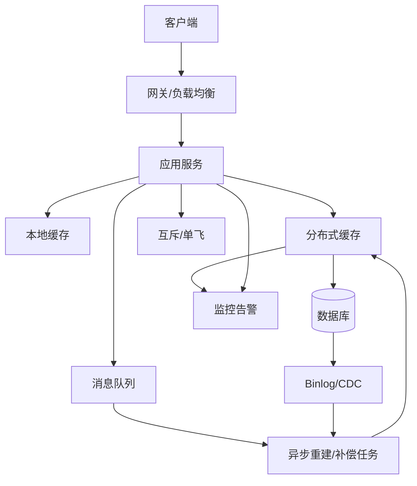
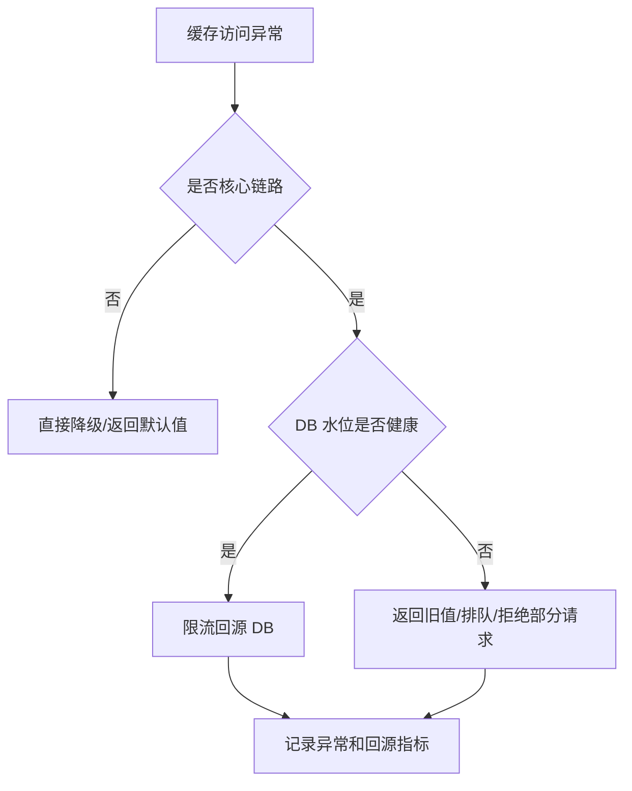

# 缓存架构设计清单

## 1. 这一章解决什么问题

缓存架构设计不是画一条“应用 -> Redis -> 数据库”的线。真正上线后，会遇到 key 怎么管、TTL 怎么设、容量怎么估、热点怎么拆、缓存挂了怎么办、数据不一致怎么查、扩容怎么迁移、监控告警看什么等一系列问题。

这一章用架构评审清单的方式，把设计缓存系统前应该问的问题集中起来。它更像一份工程化备忘录，适合在新项目设计、缓存改造、线上事故复盘时使用。

## 2. 核心概念

### 缓存架构的四个目标

一个成熟的缓存架构通常追求四件事：

- 性能：降低平均延迟和 P99 延迟。
- 稳定：缓存异常时不拖垮数据库和下游服务。
- 可控：容量、命中率、热点、错误率都能观测和治理。
- 可演进：支持扩容、迁移、版本升级和业务模型变化。

### 缓存系统的关键对象

设计时至少要描述清楚：

- 缓存数据：缓存哪些对象，value 多大，如何序列化。
- 缓存 key：命名、版本、租户、分片、过期。
- 缓存链路：应用、本地缓存、分布式缓存、数据库、消息。
- 缓存策略：读写模式、TTL、一致性、回源保护。
- 运维策略：监控、告警、压测、扩容、降级、演练。

## 3. 原理拆解

### 缓存架构全景



这张图里有两个关键思想：

- 缓存不是孤立组件，而是读链路、写链路、异步链路和监控链路的组合。
- 稳定性不靠“缓存永远不挂”，而靠缓存挂掉、失效、热点、迁移时系统有退路。

### 容量估算

缓存容量不能拍脑袋。一个粗略公式：

```text
总内存 = key 数量 * (平均 key 大小 + 平均 value 大小 + 元数据开销) / 目标内存利用率
```

Redis 中还要考虑：

- 对象编码开销。
- 字典和指针开销。
- 内存碎片率。
- AOF rewrite 或 RDB fork 时的写时复制放大。
- 主从复制、备份和预留水位。

生产上不要把 Redis 内存打满，通常要设置水位告警，并给 fork、复制、突发写入留出余量。

## 4. 工程取舍

### 命中率和一致性

TTL 越长，命中率通常越高，但旧值窗口也越长。TTL 越短，一致性更好，但回源更多，雪崩风险更高。高价值缓存设计不是简单追求长 TTL，而是把数据分层：

- 强一致数据：少缓存或短 TTL，只做展示加速。
- 一般业务数据：主动删除 + TTL 兜底。
- 热点展示数据：逻辑过期 + 异步刷新。
- 统计计数：异步聚合 + 周期落库。

### 成本和性能

缓存使用内存，成本比磁盘数据库更高。缓存越多，命中率可能越高，但也可能缓存污染、淘汰频繁、运维成本上升。设计时要把低频数据挡在缓存之外，把内存留给真正高价值的热数据。

### 可用性和保护数据库

缓存故障时，系统有两种失败方式：

- Fail Open：绕过缓存直接访问 DB，可能压垮 DB。
- Fail Closed：直接降级或限流，牺牲部分可用性保护核心系统。

真实系统通常分级处理：核心读请求限流回源，非核心请求降级，热点请求返回旧值，后台任务暂停或降速。

## 5. 实战方案

### 架构评审清单

| 类别 | 必问问题 |
|---|---|
| 数据 | 缓存对象是什么？平均/最大 value 多大？是否可重建？ |
| Key | 命名规范是什么？是否需要版本？Redis Cluster 是否需要 hash tag？ |
| TTL | 过期时间如何确定？是否加随机抖动？是否存在同批过期？ |
| 一致性 | 更新后删缓存还是更新缓存？失败如何补偿？ |
| 回源 | 未命中时是否有互斥、单飞、限流？ |
| 热点 | 如何发现 Hot Key？是否需要本地缓存、多副本、拆 key？ |
| 大 key | 如何发现 Big Key？是否拆分？删除是否异步？ |
| 容量 | 内存估算多少？水位告警多少？淘汰策略是什么？ |
| 故障 | Redis 超时、主从切换、网络分区时怎么降级？ |
| 监控 | 命中率、延迟、错误、回源、内存、淘汰、慢查询是否都有指标？ |

### Key 规范示例

```text
{app}:{domain}:{object}:{id}:v{version}

mall:product:detail:1001:v1
mall:user:profile:2001:v2
content:article:stat:9001:v1
feed:{uid:3001}:timeline:v1
```

Redis Cluster 中，如果需要多个 key 落到同一个 slot，可以使用 hash tag：

```text
cart:{uid:3001}:items
cart:{uid:3001}:summary
```

### 缓存故障降级策略



不要在缓存异常时让所有请求无保护地穿透到数据库。缓存故障演练时，应该重点观察数据库是否被突发回源打满。

### 最小监控面板

建议至少建一个缓存服务面板：

- 应用侧：缓存命中率、缓存访问耗时、缓存错误率、回源 QPS。
- Redis 侧：ops、connected_clients、used_memory、mem_fragmentation_ratio。
- 淘汰侧：expired_keys、evicted_keys、keyspace_hits、keyspace_misses。
- 延迟侧：slowlog、latency doctor、P95/P99。
- 复制侧：master_link_status、master_repl_offset、slave_repl_offset、复制延迟。
- 保护侧：限流次数、降级次数、互斥等待耗时。

### 可运行示例：Spring Boot + Redis

本系列补充了一个可运行示例工程：

```text
examples/spring-boot-redis-cache-lab/
```

它覆盖了缓存架构评审中最基础、也最容易出问题的几条链路：

- Cache Aside：先读缓存，未命中回源，回填 Redis。
- 本地缓存：用 Caffeine 做短 TTL L1 缓存，降低极热点访问 Redis 的压力。
- 空值缓存：不存在商品写入短 TTL 空值，减少重复穿透。
- 互斥重建：缓存未命中时用 Redis `SET NX EX` 做轻量锁，避免并发回源。
- 写后删除：更新商品后删除 Redis key 并失效本地缓存。
- 指标观察：通过 `/api/products/cache-stats` 查看 local hit、Redis hit、miss、null hit、rebuild。

启动方式：

```bash
cd examples/spring-boot-redis-cache-lab
docker compose up --build
```

压测方式：

```powershell
.\scripts\bench-products.ps1 -Url "http://localhost:8080/api/products/1" -Requests 2000 -Concurrency 50
.\scripts\bench-products.ps1 -Url "http://localhost:8080/api/products/1/mutex" -Requests 2000 -Concurrency 100
```

压测结果不要只记录 QPS。至少要同时记录 P95/P99、错误数、cache-stats、Redis `INFO stats` 和 `INFO memory`。如果没有实际运行压测，就只保留命令和结果模板，不要把预估值写成结论。

## 6. 常见问题

### 什么时候应该做多级缓存？

当 Redis 成为高频读链路瓶颈，或者存在极热点 key 时，可以考虑本地缓存 + Redis。多级缓存会提升性能，但也会增加一致性复杂度，所以适合缓存配置、热点详情、推荐候选、Feed 首屏等可容忍短暂旧值的数据。

### 缓存需要压测吗？

需要。缓存压测不只是测 Redis QPS，还要测未命中回源、批量过期、热点 key、主从切换、网络抖动和缓存不可用时的系统表现。很多事故不是缓存扛不住，而是缓存一抖，数据库先倒。

### 为什么要关注 Big Key？

Big Key 会放大网络传输、序列化、内存分配和删除成本。Redis 单线程命令执行路径上，大 key 可能造成明显阻塞。即使 Redis 版本支持 lazyfree，也应从建模上避免大对象无限增长。

## 7. 小结

- 缓存架构设计要同时覆盖读写路径、过期策略、一致性、容量、热点、故障和监控。
- 缓存容量要估算，并为内存碎片、fork、复制和突发写入预留空间。
- 缓存异常时不能无保护回源，必须有限流、降级、旧值或排队策略。
- key 规范、TTL 分层、回源保护和监控面板是缓存治理的基础设施。
- 好的缓存架构不是“快”，而是在快的同时可观测、可恢复、可演进。
