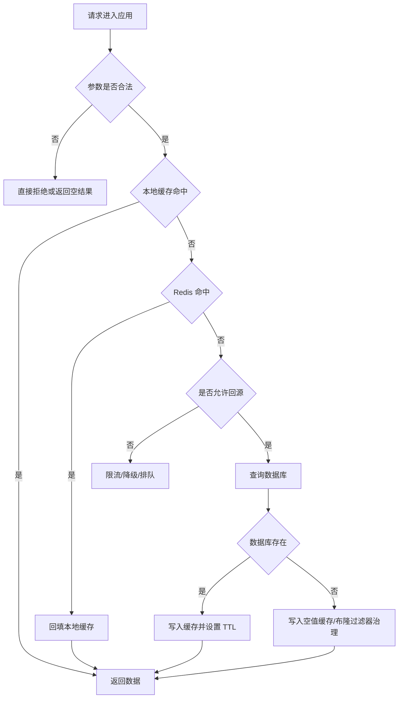

# 缓存失效、穿透、雪崩治理：从问题现场到工程防线

## 1. 问题背景

缓存系统最容易被低估的地方，不是“怎么把数据放进 Redis”，而是“缓存不按预期工作时，系统还能不能扛住”。很多线上事故的起点都很普通：一次批量发布、一次商品大促、一个 TTL 配置过于整齐、一个接口忘了做参数校验。结果却可能是缓存命中率瞬间下跌，数据库连接池被打满，应用线程池排队，最终演变成全链路超时。

缓存失效、缓存穿透和缓存雪崩经常被放在一起讨论，因为它们都表现为“请求绕过缓存压到后端”。但三者的根因不同：

- 缓存失效：数据本来应该在缓存里，但因为过期、删除、淘汰或重建失败而不在。
- 缓存穿透：请求查询一个缓存和数据库都不存在的数据，缓存无法沉淀结果。
- 缓存雪崩：大量 key 在同一时间不可用，或者缓存集群整体不可用，导致回源流量陡增。

治理这些问题的关键不是背方案清单，而是建立一套分层防线：入口挡非法请求，中间合并和限流，缓存层错峰和预热，数据库层保护和降级，最后用监控与演练确认防线真的有效。

## 2. 核心概念

### 缓存失效

缓存失效指缓存中的 key 无法继续命中，常见原因包括 TTL 到期、主动删除、内存淘汰、节点故障、部署切换、数据结构变更、冷启动未预热等。

单个 key 失效通常不是问题，真正危险的是“失效与流量高峰重叠”。例如首页配置、商品详情、活动库存、风控规则这类高频数据，如果刚好在高峰期过期，会触发大量请求同时回源。

### 缓存穿透

缓存穿透是指请求查询不存在的数据，例如不存在的商品 id、被删除的用户 id、恶意构造的随机 key。由于数据库查不到结果，应用没有把结果写入缓存，下一次同样请求仍然会穿透到数据库。

穿透不只来自攻击，也来自业务自然行为：爬虫扫描、历史链接、客户端重试、分页越界、灰度期间 id 规则不一致，都可能制造大量无效查询。

### 缓存雪崩

缓存雪崩是系统级问题。它可能由批量 key 同时过期引起，也可能由 Redis 集群不可用、网络抖动、客户端连接池耗尽、DNS/配置中心异常等基础设施问题引起。雪崩的危险在于请求会集中打向数据库，而数据库通常不是按“缓存完全失效”设计容量的。

### 击穿与雪崩的区别

热点 key 失效导致大量请求打到数据库，常被称为缓存击穿。它更像“单点爆破”；雪崩则是“大面积塌陷”。工程上两者的治理方案有交集：互斥重建、请求合并、热点续期、限流降级。

## 3. 原理拆解

### 请求穿过缓存的典型链路



这个链路里，每一层都可以放一道防线。越靠前的防线成本越低，越靠后的防线越接近核心资源，越需要谨慎保护。

### 批量过期为什么会放大流量

假设一个活动页有 100 万个商品缓存，TTL 统一设置为 3600 秒。活动上线时批量预热，1 小时后大量 key 同时过期。平时缓存命中率 98%，数据库只承受 2% 的读请求；一旦命中率降到 70%，数据库读流量会变成平时的 15 倍。数据库连接池、慢 SQL、锁等待、磁盘 I/O 会相互放大，应用线程也会被阻塞。

```text
正常：10000 QPS * 2% miss = 200 QPS 回源
异常：10000 QPS * 30% miss = 3000 QPS 回源
放大：3000 / 200 = 15 倍
```

所以缓存治理要重点关注“miss 流量”而不是只看总 QPS。

### 缓存重建的并发竞争

热点 key 过期后，如果 1000 个请求同时发现缓存为空，最差情况下会同时查数据库并写缓存。这不仅浪费资源，还可能引入旧值覆盖新值的问题。常见的重建控制有三类：

- 互斥锁：只有一个请求回源，其他请求等待或返回旧值。
- 单飞机制：同进程内相同 key 的请求共享同一个 Future。
- 异步刷新：请求线程不直接重建，由后台任务刷新缓存。

伪代码示例：

```java
public Product getProduct(Long id) {
    String key = "product:" + id;
    Product cached = redis.get(key);
    if (cached != null) {
        return cached;
    }

    String lockKey = "lock:rebuild:" + key;
    boolean locked = redis.set(lockKey, "1", "NX", "PX", 3000);
    if (!locked) {
        Product stale = redis.get("stale:" + key);
        if (stale != null) {
            return stale;
        }
        sleep(50);
        return redis.get(key);
    }

    try {
        Product dbValue = productDao.findById(id);
        redis.set(key, dbValue, randomTtl(1800, 300));
        redis.set("stale:" + key, dbValue, 7200);
        return dbValue;
    } finally {
        redis.del(lockKey);
    }
}
```

这里的重点不是代码本身，而是三个工程细节：锁必须有过期时间，等待方不能无限阻塞，热点数据最好保留一份短期可用的旧值。

## 4. 工程取舍

### TTL 随机化不是万能药

TTL 加随机抖动可以避免同批 key 同时过期，例如基础 TTL 为 30 分钟，随机增加 0 到 5 分钟。它适合治理“批量写入导致的整齐过期”，但不能解决 Redis 宕机、热点 key 击穿、恶意穿透。

```java
int baseSeconds = 30 * 60;
int jitterSeconds = ThreadLocalRandom.current().nextInt(0, 5 * 60);
redis.set(key, value, baseSeconds + jitterSeconds);
```

### 空值缓存要控制副作用

空值缓存能有效治理穿透，但会带来两个问题：

- 缓存污染：大量不存在的 key 被写入 Redis，占用内存。
- 短暂不一致：数据刚创建后，旧的空值缓存还没过期，用户仍然查不到。

因此空值缓存的 TTL 应该短，通常从几十秒到几分钟，并且只对通过基础校验的 key 生效。对于恶意随机 key，应该在入口限流或布隆过滤器层拦截，不能全部写 Redis。

### 布隆过滤器适合做“存在性前置判断”

布隆过滤器可以判断“一个 key 一定不存在，或者可能存在”。它有误判率，但没有漏判：如果判断不存在，就可以直接拒绝回源；如果判断可能存在，再查缓存和数据库。

布隆过滤器适合商品 id、用户 id、文章 id 这类全集相对明确的数据。它不适合强一致要求极高、删除频繁、全集无法加载的场景。删除频繁时可以考虑 Cuckoo Filter、Counting Bloom Filter，或者接受一段时间的误判。

### 降级不是失败，而是保护系统

当缓存和数据库都承压时，继续追求完整返回往往会把系统拖垮。合理降级包括返回旧值、返回部分字段、关闭非核心模块、延迟刷新、排队处理、提示稍后重试。降级策略要提前设计，不能等事故发生时临时决定哪些接口可以牺牲。

## 5. 实战方案

### 方案一：缓存失效治理

推荐组合：

- TTL 增加随机抖动，避免批量 key 同时过期。
- 热点 key 使用逻辑过期，由后台线程异步刷新。
- 发布、扩容、迁移后执行缓存预热。
- 重要数据保留 stale 副本，异常时返回旧值。
- 对缓存 miss 率、回源 QPS、DB 连接池等待建立告警。

逻辑过期示例：

```json
{
  "data": {
    "id": 1001,
    "name": "cache-note"
  },
  "expireAt": "2026-05-25T20:30:00+08:00"
}
```

请求读取时，如果 `expireAt` 未过期，直接返回；如果过期，先返回旧数据，同时尝试抢锁触发后台刷新。这样用户请求不会被数据库查询阻塞，适合允许短时间旧值的场景，如商品详情、配置、榜单。

### 方案二：缓存穿透治理

入口到存储的防线可以这样排：


落地建议：

- id 必须做格式和范围校验，例如负数、超长字符串、非法前缀直接拒绝。
- 对同一 IP、用户、设备、接口维度做限流。
- 对确定不存在的数据写入短 TTL 空值缓存。
- 对数据全集稳定的业务使用布隆过滤器。
- 数据创建成功后，要同步更新布隆过滤器，必要时删除对应空值缓存。

空值缓存伪代码：

```java
User user = userDao.findById(userId);
if (user == null) {
    redis.set("user:" + userId, CacheNull.INSTANCE, 60);
    return null;
}
redis.set("user:" + userId, user, randomTtl(1800, 300));
return user;
```

### 方案三：缓存雪崩治理

雪崩治理要从“缓存层不可用”这个更坏的假设出发：

- 应用侧设置 Redis 超时，避免请求长时间卡在缓存访问。
- 缓存失败后不能无限重试，重试要有预算和退避。
- DB 回源必须有限流阈值，超过阈值返回降级结果。
- 核心接口准备本地缓存或静态快照。
- Redis 部署要有主从、哨兵或 Cluster，客户端要正确处理故障转移。
- 演练 Redis 节点宕机、网络延迟、连接池耗尽、批量 key 过期。

一个较稳妥的读取策略：

```java
public Result query(Query q) {
    try {
        Result cache = redisClient.get(q.key(), 30, TimeUnit.MILLISECONDS);
        if (cache != null) {
            return cache;
        }
    } catch (RedisTimeoutException e) {
        metrics.increment("cache.timeout");
    }

    if (!rateLimiter.tryAcquire()) {
        return fallbackSnapshot(q);
    }

    return singleFlight.execute(q.key(), () -> {
        Result db = dao.query(q);
        if (db != null) {
            redisClient.set(q.key(), db, randomTtl(900, 120));
        }
        return db;
    });
}
```

### 排障步骤

线上出现疑似缓存雪崩时，不要只盯 Redis。建议按下面顺序排查：

1. 看入口 QPS、错误率、P95/P99 延迟是否突增。
2. 看缓存命中率、miss QPS、Redis 超时数、连接池等待数。
3. 看 Redis `used_memory`、`evicted_keys`、`expired_keys`、`blocked_clients`、慢日志。
4. 看数据库连接池、活跃 SQL、慢查询、CPU、I/O、锁等待。
5. 抽样分析 miss key，判断是批量过期、穿透、热点击穿还是节点不可用。
6. 临时开启限流、降级、延长热点 TTL 或预热关键 key。
7. 事故后补齐监控、压测和演练，而不是只把 TTL 调大。

Redis 常用排查命令：

```bash
redis-cli info stats
redis-cli info memory
redis-cli slowlog get 20
redis-cli --bigkeys
redis-cli --hotkeys
```

## 6. 常见问题

### TTL 应该设置多长？

TTL 没有统一答案。变化频繁、强一致要求高的数据 TTL 要短；变化慢、读多写少的数据 TTL 可以长；热点数据可以逻辑过期加异步刷新。工程上更重要的是“不同业务分层设置 TTL”，不要全站统一 30 分钟。

### 布隆过滤器误判会不会导致数据查不到？

标准布隆过滤器会误判“可能存在”，不会把真实存在的数据判断为不存在，前提是新增数据及时写入过滤器。因此它最多导致一部分不存在的数据继续查缓存和数据库，不会直接导致已有数据不可见。真正要注意的是初始化不完整、更新链路失败、过滤器版本切换。

### 空值缓存和布隆过滤器是否二选一？

不是。布隆过滤器适合挡住大量随机不存在的 key，空值缓存适合挡住重复查询的少量不存在 key。很多系统会两者一起用：先用布隆过滤器做大范围拦截，再用空值缓存吸收重复 miss。

### 返回旧值是否会影响业务正确性？

取决于业务。商品详情、文章内容、配置展示通常可以接受秒级到分钟级旧值；库存扣减、账户余额、支付状态不能随意返回旧值。治理方案必须按数据等级拆分，不能把所有缓存都当成同一种数据。

### 缓存雪崩时为什么不能直接扩大数据库连接池？

连接池变大只能让更多请求同时进入数据库，可能把数据库压得更快。正确做法是限制回源并发，保护数据库的稳定吞吐。连接池大小应该与数据库能力匹配，而不是与突发流量匹配。

## 7. 小结

- 缓存失效关注 key 为什么没命中，缓存穿透关注不存在数据如何被反复查询，缓存雪崩关注大面积不可用后的系统保护。
- TTL 随机化能解决批量过期，但不能替代限流、降级、预热和热点重建。
- 空值缓存适合治理重复无效查询，但要设置短 TTL，并避免被恶意随机 key 污染。
- 布隆过滤器是存在性前置判断，适合全集明确、读多写少的业务。
- 热点 key 失效要用互斥重建、单飞机制、逻辑过期或异步刷新治理。
- 雪崩治理的核心是限制回源，把数据库当成需要被保护的稀缺资源。
- 真正可靠的缓存系统要有监控、预案和故障演练，不能只靠代码里的几个 if。
