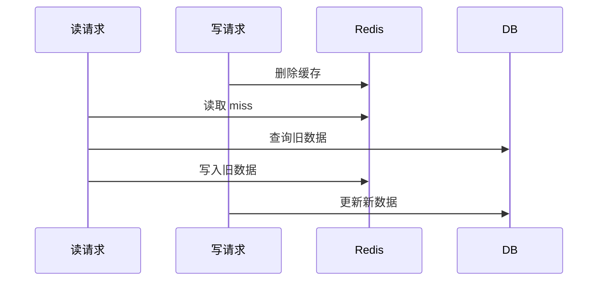
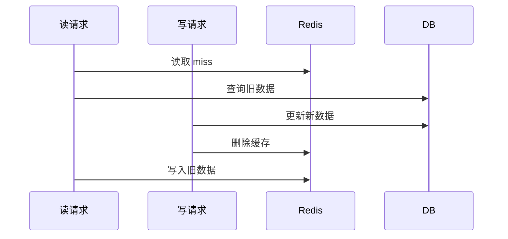
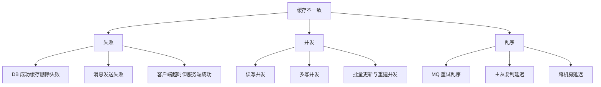
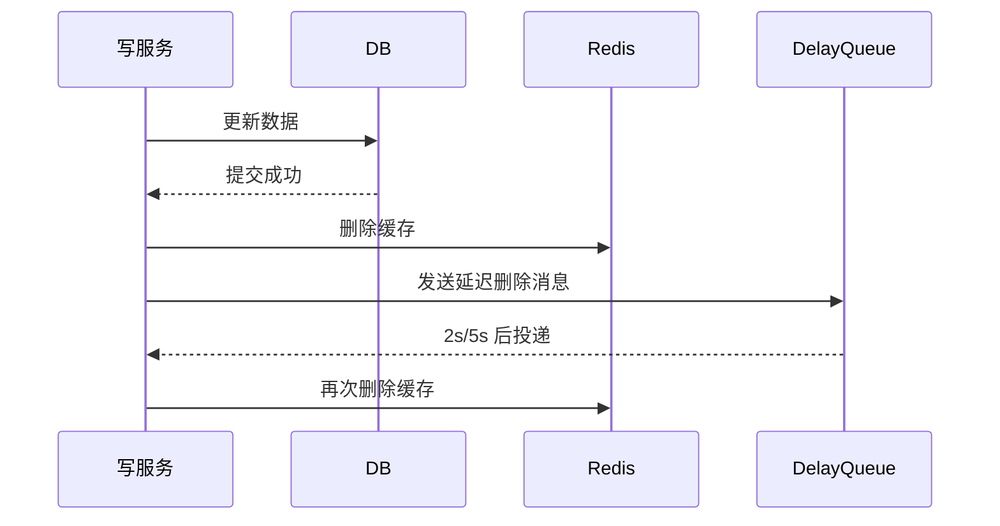
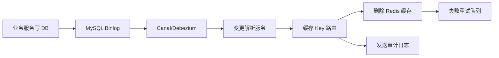

# 缓存与数据库一致性方案：没有银弹，只有可解释的取舍

## 1. 问题背景

引入缓存后，系统会多出一份数据副本。只要数据存在副本，就一定会遇到一致性问题：数据库已经更新，缓存还是旧值；缓存已经删除，另一个并发请求又把旧值写回；消息通知丢了，缓存一直不刷新；主从延迟导致读到旧数据。很多团队最初会把这个问题理解成“更新数据库时顺手更新缓存”，上线后才发现真正难的是并发、失败和顺序。

缓存与数据库一致性没有放之四海皆准的完美方案。更现实的目标是：先定义业务能接受的一致性级别，再选择对应的写入策略、补偿链路和观测指标。账户余额、订单状态、库存扣减、商品详情、用户昵称、排行榜，对一致性的要求完全不同，不应该使用同一套缓存策略。

这篇文章围绕最常见的 Cache Aside 模式展开，拆解为什么会不一致，以及如何用删除缓存、延迟双删、版本号、CDC、消息补偿、幂等写入等方法把风险控制在可接受范围内。

## 2. 核心概念

### 强一致、最终一致与可接受旧值

强一致表示写入成功后，后续读取必须看到最新值。最终一致表示短时间内可能读到旧值，但系统会在有限时间内收敛到新值。可接受旧值则是工程上的业务约定，例如商品描述允许旧 30 秒，库存和支付状态不允许旧。

缓存通常不适合承诺强一致，尤其是在分布式部署、主从复制、跨机房访问的场景下。更常见的做法是让数据库作为事实源，缓存作为可丢弃、可重建的派生副本。

### Cache Aside

Cache Aside 是最常见的模式：

- 读：先读缓存，缓存 miss 再读数据库，并把结果写入缓存。
- 写：先写数据库，再删除缓存，下一次读取时重建缓存。

它的优点是简单、通用、缓存可被动重建；缺点是并发读写时可能出现短暂不一致，需要补偿和监控。

### 双写

双写是指写数据库的同时写缓存。直觉上它似乎能让缓存立即变新，但实际风险更高：数据库写成功、缓存写失败怎么办？两个并发更新乱序怎么办？缓存 TTL 与业务版本如何对齐？因此大多数场景更推荐“更新数据库，删除缓存”，而不是“更新数据库，更新缓存”。

### 延迟双删

延迟双删是先删除缓存，再更新数据库，最后延迟一段时间再删除一次缓存；也有人采用先更新数据库，再删除缓存，再延迟删除一次。它的目标是清理并发读请求可能写入的旧缓存。

延迟双删不是强一致方案，只是降低脏缓存残留概率的工程补丁。延迟时间要根据业务读写耗时、数据库主从延迟、网络抖动和接口 P99 来估算。

### CDC 与 Binlog 订阅

CDC 是 Change Data Capture，常见做法是订阅 MySQL Binlog，把数据库变更转换成缓存删除或刷新事件。它能把缓存一致性从业务写链路中解耦出来，也能补偿业务代码遗漏的缓存删除，但会引入消息延迟、重复消费、顺序和回放问题。

## 3. 原理拆解

### 为什么推荐“更新数据库后删除缓存”

先看两个常见写法。

方案 A：先删除缓存，再更新数据库。



在这个时序里，读请求可能把旧数据重新写进缓存。如果这个缓存 TTL 很长，脏数据会持续存在。

方案 B：先更新数据库，再删除缓存。



这个方案也不是绝对安全，但触发条件更苛刻：读请求必须先 miss，再查到旧值，然后写请求更新并删除缓存，最后读请求才把旧值写回。实际发生概率通常低于先删缓存方案。为了进一步降低风险，可以在读请求写缓存时带版本号，或在写请求后做延迟二次删除。

### 一致性风险来自三个维度



只讨论“先操作谁”是不够的。真实系统里，失败、并发和乱序会同时存在，因此需要补偿链路和版本控制。

### 版本号如何防止旧值覆盖新值

给缓存值增加 `version` 或 `updateTime`，读请求回填缓存时使用 CAS 或 Lua 判断版本，避免旧值覆盖新值。

```lua
-- KEYS[1] = cache key
-- ARGV[1] = new version
-- ARGV[2] = new value
-- ARGV[3] = ttl seconds
local current = redis.call('HGET', KEYS[1], 'version')
if (not current) or (tonumber(ARGV[1]) >= tonumber(current)) then
  redis.call('HSET', KEYS[1], 'version', ARGV[1], 'value', ARGV[2])
  redis.call('EXPIRE', KEYS[1], ARGV[3])
  return 1
end
return 0
```

版本号的本质是给“谁更新缓存”建立顺序规则。它不能减少 miss，但能防止乱序写入把缓存带回旧版本。

## 4. 工程取舍

### 删除缓存还是更新缓存

一般优先删除缓存。原因很简单：缓存经常不是数据库单行的镜像，而是聚合、裁剪、拼装后的读模型。更新数据库后同步构造这个读模型，成本高且容易遗漏字段。删除缓存让下一次读取自然重建，可以保持写链路轻量。

适合更新缓存的场景也存在：数据结构简单、写入后马上要大量读取、重建成本很高、业务能保证版本顺序。例如某些配置中心、计数器、库存可用量快照。但即便更新缓存，也要有失败补偿。

### 先删缓存还是后删缓存

默认选择“先更新数据库，再删除缓存”。它让数据库作为事实源，写成功后把派生副本作废。删除失败时，通过重试消息、CDC 或定时校验补偿。

“先删缓存，再更新数据库”通常只在特殊场景使用，并且要配合延迟双删。否则并发读写时旧值回填的概率更高。

### 缓存 TTL 是最后一道保险

即使有删除缓存、消息补偿、CDC，也应该给缓存设置 TTL。TTL 的意义不是日常刷新，而是在所有删除和补偿都失败时，让脏数据最终自然消失。对于核心业务，TTL 还可以分级：强一致读不走缓存，普通读走短 TTL，展示型读走长 TTL。

### 一致性和可用性要按接口分层

同一个业务对象可能有多种读法：

| 场景 | 一致性要求 | 推荐策略 |
|---|---:|---|
| 支付状态确认 | 高 | 读数据库或读强一致服务 |
| 订单列表展示 | 中 | Cache Aside + 短 TTL + 删除缓存 |
| 商品详情展示 | 中低 | Cache Aside + 逻辑过期 + 异步刷新 |
| 榜单/推荐 | 低 | 周期刷新 + 快照降级 |

不要让所有接口都为最高一致性付费，也不要让核心交易链路依赖弱一致缓存。

## 5. 实战方案

### 方案一：标准 Cache Aside 写链路

```java
@Transactional
public void updateProduct(ProductUpdateCommand cmd) {
    Product old = productDao.findForUpdate(cmd.id());
    Product updated = old.apply(cmd);
    productDao.update(updated);

    afterCommit(() -> {
        cacheDeleteProducer.send(new CacheDeleteEvent(
            "product:" + cmd.id(),
            updated.version()
        ));
    });
}
```

关键点：

- 缓存删除事件应该在数据库事务提交后发送，避免事务回滚但缓存已删。
- 删除缓存要可重试，不能只在本地 try-catch 打日志。
- 事件最好带业务 id、版本号、变更时间、traceId，方便排查。

消费者：

```java
public void onMessage(CacheDeleteEvent event) {
    String dedupKey = "dedup:cache-delete:" + event.eventId();
    if (!redis.set(dedupKey, "1", "NX", "EX", 86400)) {
        return;
    }

    redis.del(event.cacheKey());
    delayQueue.send(event, Duration.ofSeconds(2));
}
```

延迟消息可以再删除一次，清理并发读请求可能写入的旧值。

### 方案二：延迟双删

适用于读写并发明显、偶发旧值会造成用户体验问题但不影响资金安全的场景。



延迟时间不要拍脑袋。可以用下面的估算方式：

```text
delay = max(
  读请求 DB 查询 P99,
  写事务提交 P99,
  主从复制延迟 P99,
  缓存客户端超时上限
) + 安全冗余
```

如果读请求可能从只读库读取，还要把主从延迟纳入考虑。

### 方案三：CDC 订阅 Binlog 删除缓存

CDC 适合多服务共享同一张表、写入口很多、难以保证每个写入口都正确删除缓存的系统。



落地重点：

- 建立表字段到缓存 key 的映射规则，尤其是聚合缓存和列表缓存。
- 消费端必须幂等，因为消息可能重复。
- 处理乱序，必要时使用数据库版本号或 Binlog 位点。
- 监控消费延迟，延迟过高时缓存会长时间不一致。
- 保留死信队列和人工回放能力。

### 方案四：读路径版本校验

对于旧值覆盖风险较高的 key，读路径回填缓存时带版本判断：

```java
Record record = dao.findById(id);
CacheValue value = CacheValue.of(record.version(), record);
redis.eval(SET_IF_NEWER_SCRIPT, key, value.version(), value.json(), ttl);
```

如果数据库表没有版本号，可以使用 `updated_at`，但要注意时间精度和多机时钟问题。更稳妥的是数据库自增版本、逻辑时钟或变更序号。

### 方案五：对账与自动修复

一致性治理不能只依赖写链路。建议为核心缓存建立抽样对账：

1. 从访问日志或 Redis keyspace 抽样热点 key。
2. 批量读取缓存和数据库。
3. 比较版本号、更新时间或关键字段摘要。
4. 发现不一致后删除缓存或刷新缓存。
5. 输出不一致率、最大滞后时间、修复数量。

伪 SQL 和校验逻辑：

```sql
select id, version, updated_at
from product
where id in (:sampleIds);
```

```java
if (cache.version() < db.version()) {
    redis.del("product:" + id);
    metrics.increment("cache.repair");
}
```

## 6. 常见问题

### 为什么不使用分布式事务保证缓存和数据库一致？

因为缓存通常是派生数据，不值得为了它引入两阶段提交的复杂度和可用性损失。分布式事务还会让 Redis 与 DB 的故障相互耦合。多数业务更适合用最终一致：DB 作为事实源，缓存删除失败可重试，脏数据由 TTL 和对账兜底。

### 删除缓存失败怎么办？

删除失败必须进入可靠重试链路。常见做法是本地事务表、MQ 重试、CDC 补偿、定时扫描。只打印日志是不够的，因为线上短暂网络抖动很常见，失败事件需要被系统性消化。

### 更新缓存失败是否比删除缓存失败更严重？

通常是的。更新缓存失败可能导致缓存保留旧值；更新缓存成功但 DB 失败可能导致缓存出现不存在于数据库的新值。删除缓存的语义更简单：只要最终能删掉，下一次读取会从数据库重建。

### 主从延迟会影响缓存一致性吗？

会。如果缓存 miss 后读从库，而写请求刚提交到主库但尚未复制到从库，读请求可能查到旧值并写入缓存。解决办法包括关键读走主库、延迟双删时间覆盖主从延迟、读路径版本校验、半同步复制或按业务降低一致性承诺。

### 本地缓存如何与 Redis 保持一致？

本地缓存比 Redis 更难治理，因为每个应用实例都有一份副本。常见做法是短 TTL、本地缓存容量限制、Redis Pub/Sub 或 MQ 广播失效、配置中心推送版本号。强一致场景尽量不要依赖本地缓存。

## 7. 小结

- 缓存一致性的第一原则是让数据库成为事实源，缓存是可删除、可重建的派生副本。
- 默认优先选择“更新数据库后删除缓存”，而不是同步更新缓存。
- 延迟双删能降低并发读写导致旧值回填的概率，但不是强一致保证。
- 版本号、CAS、Lua 可以治理乱序写入和旧值覆盖。
- CDC/Binlog 适合写入口复杂的系统，但要处理延迟、重复、乱序和死信。
- TTL 是一致性兜底，监控和对账是发现问题的眼睛。
- 不同接口要定义不同一致性等级，不要让展示型缓存绑架交易链路。
