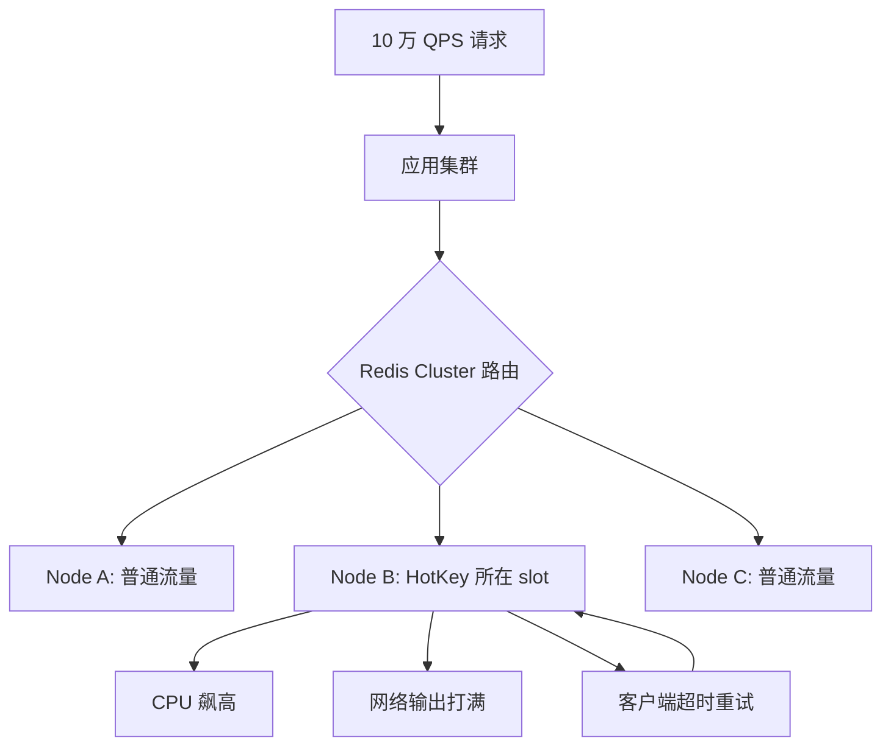
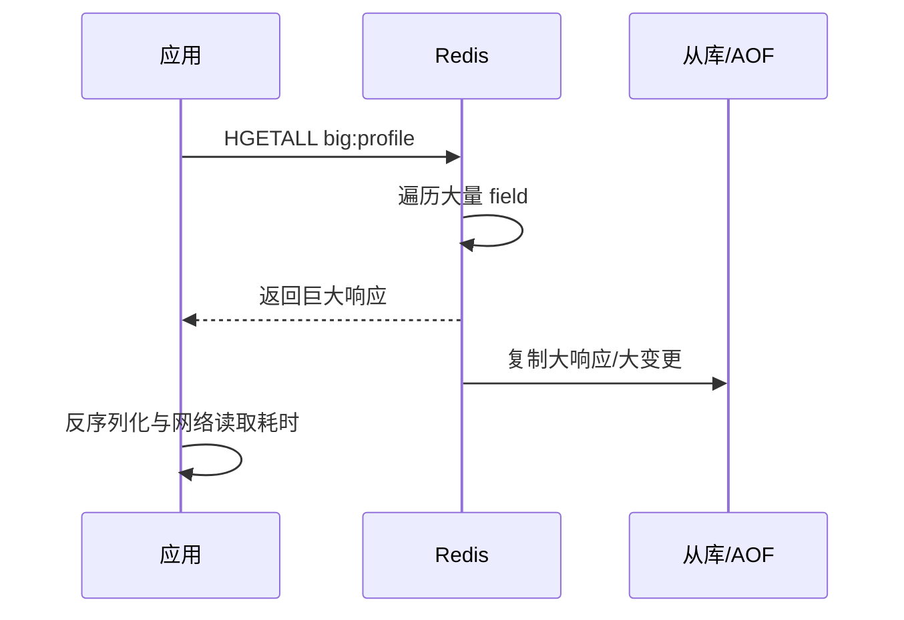
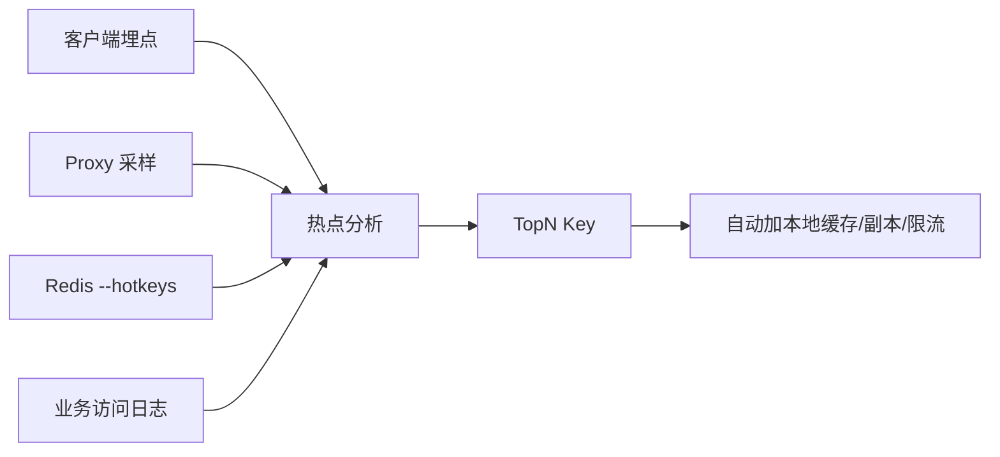

# HotKey 和 BigKey 治理实战：让缓存从能跑变成能扛

## 1. 问题背景

缓存系统最怕两类 key：一类是被访问得太频繁的 HotKey，一类是 value 太大的 BigKey。前者会把流量集中到单个 Redis 分片、单个 CPU 核、单条网络链路；后者会拉长命令执行时间、占用网络带宽、放大内存碎片，严重时阻塞 Redis 主线程。它们的共同点是：平时不一定显眼，一到大促、热点新闻、榜单刷新、批量任务或客户端异常重试，就会把缓存层的短板放大。

HotKey 和 BigKey 不是 Redis 独有的问题，Memcached、本地缓存、KV 存储、对象缓存都会遇到。但 Redis 的单线程命令执行模型让这些问题更容易体现为慢查询、超时、复制延迟、集群分片倾斜。

治理这两类问题，不能只靠某个命令临时扫描。更好的思路是：识别要前置，设计要拆分，访问要分散，异常要降级，最后用压测和演练验证治理效果。

## 2. 核心概念

### HotKey

HotKey 是访问频率显著高于其他 key 的缓存键。它可能来自真实业务热点，例如爆款商品、明星动态、秒杀活动、热门评论；也可能来自异常流量，例如爬虫、客户端重试、接口循环调用。

HotKey 的判断不只看 QPS 绝对值，还要看它是否造成资源倾斜。一个 key 每秒 500 次访问，在小集群可能是热点；在多级缓存完善的大系统里可能很正常。

### BigKey

BigKey 是 value 过大、元素过多或操作成本过高的 key。常见形式包括：

- String value 几百 KB 到数 MB。
- Hash、Set、ZSet、List 包含几十万甚至上百万元素。
- 单次 `HGETALL`、`SMEMBERS`、`ZRANGE 0 -1` 返回大量数据。
- 一个业务对象把所有关联数据都塞进一个 key。

BigKey 的风险不只在内存，还在操作耗时、网络传输、序列化、复制、AOF rewrite、迁移和删除。

### 热点分片

在 Redis Cluster 中，key 通过 slot 路由到节点。如果少数 HotKey 集中在一个 slot 或一个节点，该节点会先达到 CPU、网络或连接瓶颈，而其他节点还很空闲。集群扩容并不一定能解决热点，因为热点 key 仍然只落在一个分片上。

### 大 key 与慢命令

Redis 单条命令执行期间会占用主线程。大 key 上的全量读取、删除、聚合操作，会让后续请求排队。即使命令本身是 O(1)，如果返回结果巨大，也会消耗网络和客户端解析时间。

## 3. 原理拆解

### HotKey 如何压垮单个分片



热点最麻烦的地方在于正反馈：Redis 超时后，客户端重试会继续打到同一个 key；请求堆积后，应用线程池等待；等待变长后，上游又可能重试。最终，一个 key 变成整个链路的瓶颈。

### BigKey 为什么会制造长尾延迟



一次 BigKey 操作会影响四个位置：

- Redis 主线程：遍历、编码、删除等操作耗时。
- 网络链路：响应包大，输出缓冲区膨胀。
- 客户端：读取和反序列化变慢，连接被占用。
- 复制与持久化：大变更会放大复制延迟和 AOF 体积。

### HotKey 与 BigKey 的组合风险

最糟糕的情况是一个 key 既热又大。例如首页推荐一次读取 2MB 的 JSON，并且每秒被访问几千次。此时即使 Redis 命中率 100%，系统仍然可能因为网络和序列化被打垮。命中率高不代表缓存设计健康。

## 4. 工程取舍

### 拆 key 会提高复杂度

BigKey 拆分后，应用需要多次读取、聚合、处理部分失败，还要考虑分片数量和一致性。HotKey 复制成多个副本后，写入和失效也会变复杂。因此拆分不是越细越好，应该以“单次操作成本可控、热点可分散、业务能接受一致性”为边界。

### 本地缓存能救热点，但会带来一致性问题

本地缓存对 HotKey 非常有效，因为它直接把请求挡在进程内，避免所有流量打到 Redis。但它会让每个应用实例都有一份副本，更新和失效更难。适合读多写少、允许短暂旧值的数据，例如商品详情、配置、活动页素材。不适合账户、库存精确值、权限强校验。

### 读扩散适合热点读，写扩散适合低频写

HotKey 多副本通常是写扩散、读随机：

```text
product:1001:copy:0
product:1001:copy:1
product:1001:copy:2
product:1001:copy:3
```

读取时随机选择一个副本，写入时更新所有副本或先删所有副本。它适合读远多于写的热点数据。如果写频繁，副本越多，一致性和写成本越高。

### 删除 BigKey 要渐进

直接 `DEL` 一个巨大 Hash/Set/List 可能阻塞 Redis。Redis 4.0 以后可以使用 `UNLINK` 异步释放内存，但仍要注意复制、AOF 和业务重建流量。对于集合类大 key，更稳妥的是分批删除元素，或者在业务上切换新 key，旧 key 后台慢慢清理。

## 5. 实战方案

### HotKey 识别

识别要覆盖客户端、代理层、Redis 和业务日志四个视角。



常用方法：

- Redis LFU 模式下使用 `redis-cli --hotkeys` 抽样查看热点。
- Proxy 或客户端 SDK 统计 key 维度 QPS、P99、错误率。
- 业务日志按资源 id 聚合，例如商品 id、帖子 id、用户 id。
- 对入口请求做 TopN 滑动窗口统计，提前发现业务热点。

示例指标：

```text
cache_key_qps{key_pattern="product:{id}"} 12000
cache_key_miss_rate{key_pattern="product:{id}"} 0.02
redis_node_cpu{node="redis-3"} 92%
redis_command_latency_p99{cmd="GET"} 18ms
```

如果不能记录完整 key，可以记录 key pattern、slot、hash 后缀或采样后的 key，避免日志量和隐私问题。

### HotKey 治理

#### 1. 本地缓存

```java
LoadingCache<Long, Product> localCache = Caffeine.newBuilder()
    .maximumSize(10_000)
    .expireAfterWrite(Duration.ofSeconds(5))
    .refreshAfterWrite(Duration.ofSeconds(2))
    .build(id -> queryRedisOrDb(id));

public Product getProduct(Long id) {
    if (hotKeyDetector.isHot("product:" + id)) {
        return localCache.get(id);
    }
    return queryRedisOrDb(id);
}
```

本地缓存 TTL 不宜过长，最好支持热点动态开关。热点消退后要自动退出，避免长期占用内存和扩大不一致窗口。

#### 2. 多副本打散

```java
String readKey(long id) {
    int index = ThreadLocalRandom.current().nextInt(8);
    return "product:" + id + ":copy:" + index;
}

List<String> writeKeys(long id) {
    return IntStream.range(0, 8)
        .mapToObj(i -> "product:" + id + ":copy:" + i)
        .toList();
}
```

副本数应该根据热点流量和单分片能力估算，不要一上来复制几十份。副本写入失败时要有重试或统一删除策略。

#### 3. 请求合并与互斥重建

热点 key 失效时，应用内使用 singleflight 合并相同 key 的并发请求，跨进程使用 Redis 锁控制回源。等待方优先返回旧值或短暂等待，避免全部打到数据库。

#### 4. 限流和降级

当热点来自异常流量时，扩容缓存不是第一选择。应该按用户、IP、设备、接口、资源 id 做限流；非核心模块可以返回降级数据，例如隐藏评论区、减少推荐条数、返回静态快照。

### BigKey 识别

常用命令：

```bash
redis-cli --bigkeys
redis-cli memory usage product:1001
redis-cli scan 0 match 'product:*' count 1000
redis-cli object encoding product:1001
redis-cli slowlog get 20
```

注意 `--bigkeys` 是抽样扫描，不一定能找全；`MEMORY USAGE` 对大 key 有成本，不要在高峰期对大量 key 批量执行；线上扫描要限速，避免影响 Redis。

更可靠的做法是在写入侧控制大小：

```java
byte[] payload = serialize(value);
if (payload.length > 256 * 1024) {
    metrics.increment("cache.big_value.reject");
    throw new IllegalArgumentException("cache value too large");
}
redis.set(key, payload, ttl);
```

集合类 key 也要限制元素数量：

```java
Long size = redis.zcard(rankKey);
if (size != null && size > 100_000) {
    alert.warn("zset too large: {}", rankKey);
}
```

### BigKey 治理

#### 1. 业务维度拆分

把一个巨大对象拆成多个小 key：

```text
原始：
user:1001:profile -> 包含基础信息、权限、标签、统计、关注列表

拆分：
user:1001:base
user:1001:permission
user:1001:tags
user:1001:stats
user:1001:following:page:{n}
```

拆分后，接口按需读取，不再为了展示昵称而拉取完整用户画像。

#### 2. 分页与分桶

对于 List、Set、ZSet，不要提供全量读取接口。排行榜、评论、关注列表都应该天然分页。

```text
comment:post:9001:bucket:20260525
comment:post:9001:bucket:20260526
rank:game:daily:20260525:shard:0
rank:game:daily:20260525:shard:1
```

分桶维度可以是时间、业务分片、hash 分片。读请求再按需要聚合少量桶。

#### 3. 避免危险命令

线上代码中应避免：

```text
KEYS *
HGETALL big_hash
SMEMBERS big_set
LRANGE big_list 0 -1
ZRANGE big_zset 0 -1
DEL huge_key
```

替代方案：

- 使用 `SCAN/HSCAN/SSCAN/ZSCAN` 渐进遍历。
- 使用分页范围读取。
- 使用 `UNLINK` 或分批删除。
- 在 SDK 层拦截全量读取。

#### 4. 渐进删除

```java
public void deleteBigHash(String key) {
    String cursor = "0";
    do {
        ScanResult<Map.Entry<String, String>> result =
            redis.hscan(key, cursor, ScanParams.scanParams().count(500));
        cursor = result.getCursor();
        List<String> fields = result.getResult().stream()
            .map(Map.Entry::getKey)
            .toList();
        if (!fields.isEmpty()) {
            redis.hdel(key, fields.toArray(new String[0]));
        }
        sleep(10);
    } while (!"0".equals(cursor));
    redis.unlink(key);
}
```

实际生产中要把这个任务做成后台 Job，支持限速、暂停、重试和进度记录。

### 配置与告警建议

Redis 配置侧可以关注：

```conf
lazyfree-lazy-user-del yes
lazyfree-lazy-expire yes
slowlog-log-slower-than 10000
slowlog-max-len 256
client-output-buffer-limit normal 0 0 0
```

告警指标建议：

- 单节点 CPU 持续超过 80%。
- 单节点网络输出接近上限。
- `instantaneous_ops_per_sec` 与业务 QPS 不匹配。
- 慢日志出现大集合操作。
- `mem_fragmentation_ratio` 异常升高。
- `evicted_keys`、`blocked_clients`、复制延迟上升。
- 客户端 Redis P99 延迟突增。

## 6. 常见问题

### HotKey 是否一定要拆分成多个 key？

不一定。先看热点强度和业务特征。短暂热点可以用本地缓存、限流、预热和逻辑过期；长期稳定热点才更适合多副本。多副本会增加写入成本和一致性复杂度，不能无脑使用。

### Redis Cluster 扩容能解决 HotKey 吗？

通常不能。Cluster 扩容可以分摊普通 key，但单个 HotKey 仍然落在一个 slot 上。除非你把业务 key 拆成多个副本或多个逻辑分片，否则热点不会自然分散。

### 多大的 key 算 BigKey？

没有绝对标准。实践上可以先设置团队规范：String 超过 100KB 预警，超过 512KB 禁止；集合元素超过 1 万预警，超过 10 万必须拆分。具体阈值要结合网络、实例规格、P99 延迟和业务访问频率调整。

### `UNLINK` 是否可以彻底解决大 key 删除问题？

`UNLINK` 能把内存释放放到后台线程，减少主线程阻塞，但不能消除所有成本。大 key 仍然会影响复制、AOF、内存峰值和后台释放压力。最好从数据模型上避免产生 BigKey。

### 为什么命中率很高，接口还是慢？

可能是 HotKey 或 BigKey。命中率只说明请求没有回源数据库，不说明 Redis 操作便宜。一个 2MB 的 value 即使命中，也会消耗网络、序列化和客户端连接时间。

## 7. 小结

- HotKey 的核心问题是流量倾斜，BigKey 的核心问题是单次操作成本过高。
- 命中率高不代表缓存健康，还要看单 key QPS、value 大小、P99、节点倾斜和慢命令。
- HotKey 治理优先考虑本地缓存、请求合并、多副本、预热、限流和降级。
- BigKey 治理要从写入侧限制大小，从模型上拆分，从读取侧禁止全量操作。
- Redis Cluster 扩容不能自动解决单 key 热点，必须做业务层打散。
- 删除大 key 要使用 `UNLINK` 或渐进删除，并关注复制和 AOF 成本。
- 最好的治理不是事故后扫描，而是在 SDK、规范、监控和压测中提前阻断问题。
