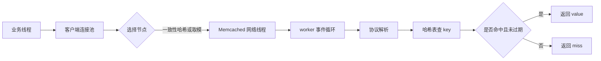
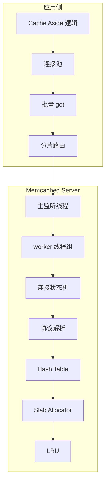
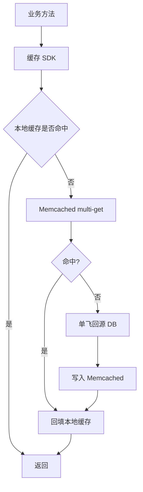

# Memcached 为什么高性能

## 1. 问题背景

很多团队第一次接触 Memcached，容易把它理解成“功能比 Redis 少的缓存”。这个判断不算错，但不完整。Memcached 的核心价值从来不是功能丰富，而是在一个极窄的边界里把缓存读写做到简单、稳定、低延迟。

在线业务里，大部分缓存访问其实只有几个动作：按 key 读、按 key 写、设置过期时间、删除。只要业务可以接受纯内存、无持久化、数据可重建，Memcached 就能用非常少的系统复杂度换来很高的吞吐。

Memcached 高性能来自一组互相配合的设计：事件驱动网络、多线程处理、简单协议、哈希定位、slab 内存分配、惰性过期、无持久化路径、客户端分片。它不像 Redis 那样提供丰富数据结构和持久化能力，也正因为少做了很多事，才更容易把延迟波动压低。

## 2. 核心概念

### 2.1 Memcached 的定位

Memcached 是一个分布式内存对象缓存系统。它本身不负责集群元数据、不负责数据复制、不负责持久化，服务端只管理本机内存中的 key-value 对象。

典型职责划分如下：

| 层次 | 负责什么 | 不负责什么 |
|---|---|---|
| Client | key 路由、连接池、超时重试、批量请求 | 服务端内存管理 |
| Memcached Server | 网络收发、协议解析、哈希表、slab、LRU | 跨节点复制、自动迁移 |
| Proxy/Twemproxy | 代理分片、连接复用、失败隔离 | 强一致、自动再平衡 |
| 业务系统 | 缓存模式、一致性、降级、回源 | 期待缓存天然可靠 |

### 2.2 高性能的关键约束

Memcached 不是“什么都能做”，它的高性能建立在明确约束上：

- key-value 模型简单，命令语义少。
- 数据全部在内存，不走磁盘持久化。
- 服务端不维护复杂集群状态。
- 内存分配采用 slab，避免频繁 malloc/free。
- 淘汰和过期尽量延迟处理，减少前台路径阻塞。
- 客户端承担分片，服务端保持轻量。

这些约束看起来像功能缺失，但在高 QPS 缓存场景里，恰好减少了大量不确定性。

## 3. 原理拆解

### 3.1 请求路径

一个普通 get 请求大致经历如下链路：



这条路径很短，没有磁盘 I/O，没有事务日志，没有复制确认，也没有复杂数据结构计算。对缓存来说，路径越短，平均延迟和尾延迟越容易控制。

### 3.2 架构组件



主监听线程接收连接后，将连接分发给 worker。worker 基于 libevent 处理读写事件，并通过状态机推进命令解析、数据读取、响应写回。数据定位依赖哈希表，内存分配依赖 slab class。

### 3.3 为什么 slab 能提升稳定性

普通对象分配如果频繁调用 malloc/free，容易产生内存碎片和锁竞争。Memcached 把内存切成若干 slab class，每个 class 负责固定大小范围的 item。

例如：

| slab class | chunk 大小 | 适合 value |
|---|---:|---|
| class 1 | 96B | 小状态、小标记 |
| class 8 | 1KB | 用户摘要 |
| class 20 | 32KB | 页面片段 |
| class 40 | 1MB | 接近最大对象 |

写入时根据 item 大小选择 class，后续淘汰也主要在同 class 内进行。这样做的收益是分配快、回收快、碎片可控；代价是如果对象大小分布不均，某些 class 可能很满，另一些 class 仍有空闲。

### 3.4 和 Redis 的性能路径对比

| 维度 | Memcached | Redis |
|---|---|---|
| 数据模型 | 简单 key-value | String/List/Hash/Set/ZSet/Stream 等 |
| 线程模型 | 多线程网络处理 | 命令执行主线程为主，Redis 6+ 支持 I/O 多线程 |
| 持久化 | 无 | RDB/AOF |
| 分片 | 客户端或代理 | Redis Cluster/Proxy/客户端 |
| 内存管理 | slab class | jemalloc + Redis 对象编码 |
| 适合场景 | 可重建缓存、高 QPS 简单读写 | 数据结构缓存、计数、排行榜、分布式协调 |

所以不能简单说谁更快。Memcached 在纯 get/set 场景路径更短；Redis 在复杂数据建模和生态能力上更强。

## 4. 工程取舍

### 4.1 选择 Memcached 的收益

- 简单：组件边界清晰，服务端状态少。
- 快：请求链路短，纯内存，无持久化扰动。
- 稳：slab 分配减少碎片问题，多线程模型适合多核机器。
- 易横向扩展：加节点后由客户端或代理重新路由。
- 成本可控：用作 L2/L3 缓存时，数据丢失可通过 DB 或下游服务重建。

### 4.2 需要接受的代价

- 服务端不复制，节点故障会造成该节点 key 大量 miss。
- 扩容缩容可能引发缓存重映射和回源压力。
- 数据结构单一，不适合原子计数、排行榜、集合运算等复杂场景。
- 缺少 Redis 那样成熟的持久化、复制、Cluster 和 Lua 能力。
- slab class 不均衡时，会出现局部内存紧张。

### 4.3 适合和不适合

适合：

- 页面片段缓存、用户资料摘要、会话类可重建数据。
- 读多写少，value 不大，命中率稳定的业务。
- 多层缓存中的共享缓存层。
- 对持久化没有要求，但对延迟稳定性要求高的场景。

不适合：

- 需要可靠落盘或主从复制的数据。
- 需要丰富数据结构和服务端原子逻辑。
- value 很大且访问模式极不稳定的对象缓存。
- 需要自动分片迁移和强治理能力的缓存平台。

## 5. 实战方案

### 5.1 基础部署建议

```bash
memcached -m 8192 -p 11211 -u memcache -l 0.0.0.0 -t 8 -c 20000
```

常见参数含义：

| 参数 | 含义 | 建议 |
|---|---|---|
| `-m` | 最大内存 MB | 预留系统内存，不要吃满机器 |
| `-t` | worker 线程数 | 通常接近 CPU 核心数，需要压测验证 |
| `-c` | 最大连接数 | 和客户端连接池总量一起规划 |
| `-I` | 最大 item 大小 | 不建议盲目调大，大 value 应先拆分 |
| `-f` | slab 增长因子 | 对象大小分布特殊时再调 |

### 5.2 客户端访问策略

实践上，不建议业务代码直接散落 get/set，而是封装一层缓存访问组件：



关键点：

- 使用 multi-get 合并同批请求。
- 连接池按节点隔离，避免一个节点慢拖垮全部请求。
- 设置短超时，缓存不应成为主链路长时间阻塞点。
- 对热点 key 增加本地缓存或请求合并。
- 对 miss 回源加并发保护，防止击穿 DB。

### 5.3 实践清单

- 容量：按 key 数、平均 value、元数据开销、命中率目标估算内存。
- TTL：核心热点不要同一时间批量过期，增加随机抖动。
- 分片：使用一致性哈希或代理，评估扩缩容时的回源峰值。
- 连接：总连接数 = 应用实例数 x 每实例每节点连接数，不能只看单机。
- 超时：读写超时通常以毫秒级设置，失败后允许降级或回源。
- 监控：持续观察 `get_hits`、`get_misses`、`evictions`、`curr_items`、`bytes`、`conn_yields`。

### 5.4 排障和调优思路

| 现象 | 可能原因 | 排查方向 |
|---|---|---|
| 命中率突然下降 | 节点重启、扩容重映射、TTL 批量过期 | 看节点 uptime、miss 曲线、发布记录 |
| evictions 持续增长 | 内存不足或 slab class 局部紧张 | 看 bytes、items、slabs stats |
| P99 变高 | 网络拥塞、连接池排队、worker 饱和 | 看网卡、CPU、连接池等待时间 |
| 某节点 QPS 过高 | 哈希倾斜、热点 key | 分析 key 分布，增加热点隔离 |
| 回源 DB 被打满 | 大量 miss 或击穿 | 请求合并、限流、预热、降级 |

## 6. 常见问题

### 6.1 Memcached 没有持久化，为什么还能用于核心业务？

因为缓存不是事实源。只要数据可以从 DB、搜索服务、对象存储或计算链路重建，缓存丢失就是性能事件，不是数据正确性事件。关键是要给 miss 回源设置保护，避免缓存故障演变成 DB 故障。

### 6.2 多线程一定比 Redis 单线程更快吗？

不一定。多线程能利用多核处理网络和命令，但也带来锁竞争、调度和 NUMA 问题。Redis 单线程命令执行减少锁竞争，配合高效数据结构，也能获得很高吞吐。比较二者要看命令类型、value 大小、客户端批量程度和机器配置。

### 6.3 为什么不直接全部用 Redis？

可以，但不一定经济。Redis 的能力更丰富，也意味着治理面更大。对于简单对象缓存，Memcached 的低复杂度反而是一种优势。很多大规模系统会同时使用二者：Memcached 承担大规模对象缓存，Redis 承担计数、集合、排行榜、分布式协调等场景。

### 6.4 Memcached 节点故障怎么处理？

常见方案是客户端摘除故障节点，短期内该节点 key 全部 miss 并回源；更稳妥的方案是在代理层做失败隔离，或者准备 backup pool。关键是提前压测“单节点故障后 DB 是否扛得住”。

## 7. 小结

- Memcached 高性能不是单点技巧，而是简单边界、短路径和少副作用共同作用的结果。
- 无持久化、无复制、服务端无复杂集群状态，换来了更稳定的缓存读写路径。
- slab 分配让内存管理更可控，但需要关注对象大小分布和 class 局部淘汰。
- 多线程事件模型适合多核机器，但最终吞吐仍受客户端批量、连接池和网络影响。
- Memcached 与 Redis 不是替代关系，更像不同工程约束下的两种缓存工具。
- 线上使用 Memcached，必须把回源保护、超时、降级、监控和容量规划一起设计。
