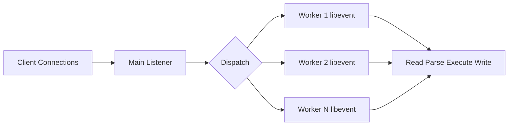
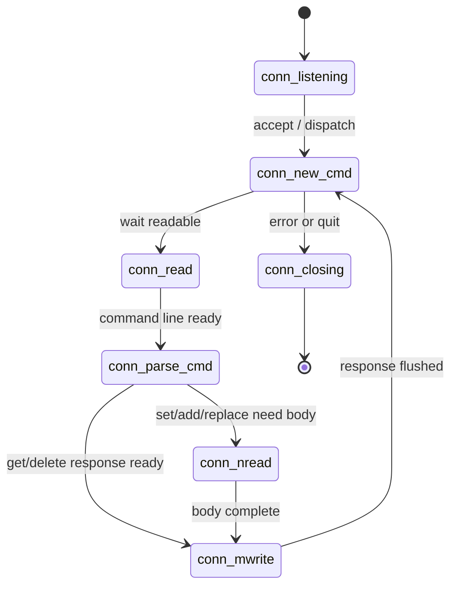
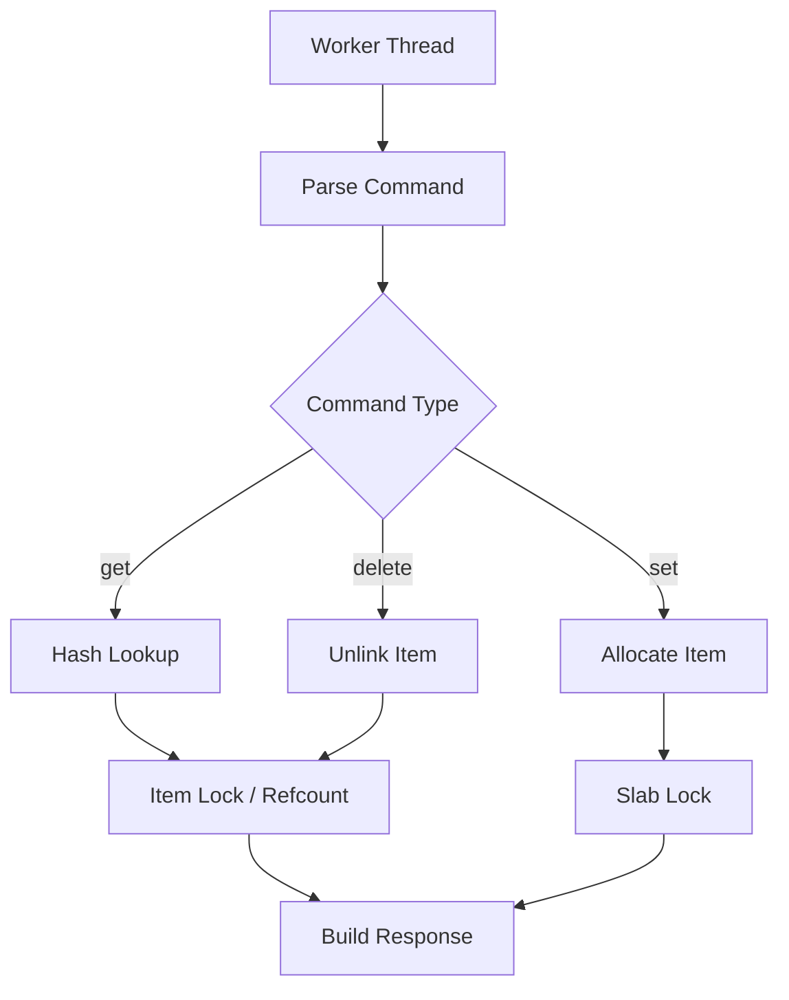

# Memcached 网络模型与状态机

## 1. 问题背景

缓存系统的性能瓶颈经常不在“查 key”本身，而在网络连接、协议解析、线程调度和响应写回。对于 Memcached 这种简单 key-value 服务来说，如果网络模型设计不好，即使哈希表查找再快，也会被连接数、慢客户端、阻塞读写拖垮。

Memcached 的网络模型有两个关键词：事件驱动和状态机。事件驱动让线程只在连接可读可写时工作，避免为每个连接创建线程；状态机把一个请求拆成多个阶段，逐步推进读取、解析、执行和写回。

理解这一层之后，很多线上现象会更好解释：为什么连接池过大反而变慢，为什么慢客户端会影响 worker，为什么 multi-get 会改变吞吐曲线，为什么 Redis 和 Memcached 的线程模型差异会影响工程选型。

## 2. 核心概念

### 2.1 主线程和 worker 线程

Memcached 通常由一个主监听线程接收新连接，再把连接分发给 worker 线程。worker 线程各自维护事件循环，处理分配到自己名下的连接。



这种模型的核心好处是：连接接入和请求处理解耦，worker 可以并行利用多核 CPU。

### 2.2 libevent

libevent 是 Memcached 网络事件的基础。它屏蔽了 epoll、kqueue、select 等平台差异，让 worker 可以用事件回调处理连接。

事件驱动模型不是“一直轮询连接”，而是把连接注册到事件循环里，等内核通知可读或可写时再处理。这样可以用较少线程承载大量长连接。

### 2.3 连接状态机

Memcached 的连接会在多个状态之间切换，例如：

- 等待读取命令。
- 解析命令行。
- 读取 value 数据。
- 执行命令。
- 构造响应。
- 写回响应。
- 关闭连接。

状态机的意义是把复杂 I/O 过程拆成小步骤，任何一步读不够、写不完，都可以挂起等待下一次事件，而不是阻塞整个线程。

## 3. 原理拆解

### 3.1 请求状态流转



一个 get 请求通常会从读取命令进入解析，然后查哈希表并写回响应。一个 set 请求多了读取 value body 的阶段。网络读写不一定一次完成，所以状态机会保存上下文，在下一次事件到来时继续。

### 3.2 多线程下的数据访问

worker 线程并发执行命令，但底层共享哈希表、slab 和 LRU。为了保证一致性，Memcached 内部会使用锁保护共享结构。高性能并不等于无锁，而是尽量缩小锁范围，并把热点操作设计得足够轻。



如果 value 很大、multi-get 返回很多数据，锁本身可能不是瓶颈，响应写回和网络带宽才会成为瓶颈。

### 3.3 文本协议解析

文本协议命令类似：

```text
get user:1001 profile:1001\r\n
set user:1001 0 60 12\r\n
hello world!\r\n
```

文本协议可读性好，解析成本也可控。Memcached 命令语义简单，所以解析路径不会像复杂 SQL 或脚本语言那样消耗大量 CPU。

### 3.4 Redis 对比

Redis 的经典模型是单线程执行命令，网络事件也在事件循环中处理。Redis 6 之后支持 I/O 多线程，但命令执行仍主要保持单线程语义。这样做的好处是内部数据结构访问简单，不需要大量锁；代价是单实例命令执行更依赖单核性能，遇到大 key 或慢命令更容易阻塞后续请求。

Memcached 则更早把网络和命令处理扩展到多线程，适合简单命令的并行处理。但多线程共享结构也会引入锁竞争，所以它更依赖简单命令、短临界区和良好的 key 分布。

| 维度 | Memcached | Redis |
|---|---|---|
| 请求并行 | 多 worker 并行处理 | 命令执行主线程串行为主 |
| 锁复杂度 | 需要保护共享结构 | 内部数据结构锁少 |
| 慢请求影响 | 影响所在 worker 和资源 | 可能阻塞主线程 |
| 适合 | 简单 get/set 高并发 | 丰富命令、数据结构操作 |

## 4. 工程取舍

### 4.1 worker 线程数不是越多越好

线程数过少，会浪费 CPU；线程数过多，会增加上下文切换、锁竞争和缓存失效。实际设置要结合：

- CPU 核心数。
- 网卡带宽。
- 请求包大小。
- get/set 比例。
- multi-get 批量大小。
- 是否存在热点 key。

一般可以从接近物理核心数开始压测，而不是盲目开到几十上百。

### 4.2 长连接和连接池的平衡

长连接减少 TCP 握手成本，但连接太多会带来 fd 压力、事件循环扫描成本和内存占用。客户端连接池应按“实例数 x 节点数 x 每节点连接数”计算总量。

如果应用实例很多，每个实例都为每个 Memcached 节点建几十条连接，总连接数会非常夸张。很多线上连接风暴并不是单个应用配置离谱，而是集群规模放大后的结果。

### 4.3 慢客户端问题

如果客户端读取响应很慢，服务端写缓冲可能积压，worker 需要更多时间处理写事件。对大 value、批量 get、弱网络客户端尤其明显。

治理手段包括：

- 限制 value 大小。
- 限制 multi-get 的 key 数和响应体大小。
- 设置客户端读超时。
- 对跨机房访问做隔离。
- 观察服务端写阻塞和连接让出指标。

## 5. 实战方案

### 5.1 网络层实践清单

- 连接池：每个节点使用小而稳定的连接池，避免按请求创建连接。
- 超时：连接超时、读超时、写超时分别配置，不使用无限等待。
- 批量：用 multi-get 合并请求，但控制单次 key 数和响应大小。
- 隔离：不同业务或不同优先级使用不同缓存池，避免互相拖累。
- 就近：应用和缓存尽量同机房或同可用区，跨地域请求要单独评估。
- 降级：缓存超时后快速失败，业务决定回源、返回旧值或降级。

### 5.2 压测方法

压测不要只看 QPS，还要看延迟分位和资源曲线：


需要覆盖三类流量：

- 命中读：最常见的稳定路径。
- 未命中读：会触发业务回源，要看系统整体。
- 写入流量：会触发 slab 分配、LRU 调整和可能的淘汰。

### 5.3 排障步骤

当 Memcached 延迟升高时，可以按下面顺序定位：

1. 看应用侧连接池等待时间，确认是否排队。
2. 看网络 RTT、丢包、重传和网卡带宽。
3. 看 Memcached CPU 是否单核或多核打满。
4. 看连接数是否接近 `-c` 上限。
5. 看 multi-get 是否返回过大响应。
6. 看是否有热点 key 造成锁竞争或单节点倾斜。
7. 看是否发生大量 miss，引发业务侧同步回源。

### 5.4 调优参考

| 调优项 | 作用 | 风险 |
|---|---|---|
| 增大 `-t` | 提高并行处理能力 | 锁竞争和上下文切换增加 |
| 增大连接池 | 降低应用排队 | 服务端连接数膨胀 |
| 使用 multi-get | 减少网络往返 | 单次响应过大导致尾延迟 |
| 缩小 value | 降低网络和内存压力 | 需要业务拆分对象 |
| 增加节点 | 分摊 QPS 和容量 | 扩容时 key 重映射 |

## 6. 常见问题

### 6.1 为什么同样 QPS 下 P99 比平均值更重要？

缓存位于主链路上，平均延迟好看不代表用户体验稳定。P99 升高通常意味着一部分请求正在经历排队、网络重传、慢客户端、热点 key 或回源放大。对缓存来说，尾延迟比平均值更早暴露风险。

### 6.2 multi-get 是不是越大越好？

不是。multi-get 可以减少 RTT，但单次请求 key 太多会带来大响应、长时间占用连接、增加解析和写回成本。实践中应按响应体大小和 P99 控制批量，而不是只按 key 数。

### 6.3 连接池应该怎么设？

先估算总连接数，再压测单连接吞吐。连接池的目标是让应用线程少排队，而不是把连接堆到服务端。通常每个应用实例到每个缓存节点保持少量长连接即可，具体值要看请求并发和响应大小。

### 6.4 Memcached 网络模型会不会被大 key 拖慢？

会。大 key 不只是内存问题，也是网络问题。它会放大响应体、占用 worker 写回时间、增加客户端反序列化成本。治理大 key 通常要从对象拆分、压缩策略、最大 value 限制和业务接口设计同时入手。

## 7. 小结

- Memcached 使用主监听线程加 worker 线程组，基于 libevent 处理大量长连接。
- 状态机让读、解析、执行、写回可以分阶段推进，避免单个连接阻塞线程。
- 多线程提升并行度，但线程数、连接数和批量大小都需要压测确定。
- 延迟问题常常来自连接池排队、慢客户端、大响应、热点 key 和网络抖动。
- Redis 更强调单线程命令执行的简单性，Memcached 更强调简单命令的多线程并行。
- 线上调优要同时看客户端、网络、服务端和回源链路，不能只盯 Memcached 进程。
