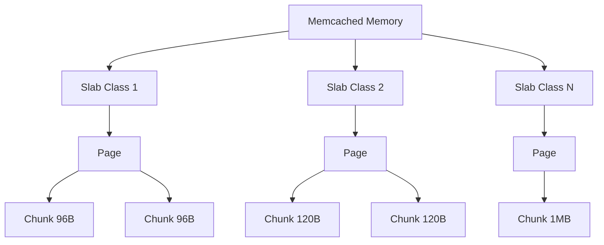
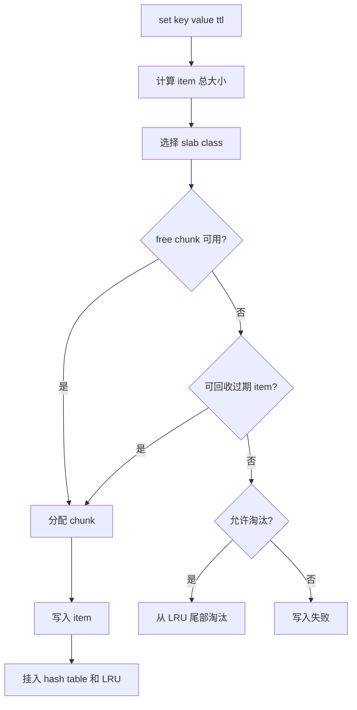

# Memcached 内存管理和淘汰机制

## 1. 问题背景

缓存系统最终都会遇到一个问题：内存不够时怎么办。对 Memcached 来说，这个问题尤其关键，因为它是纯内存组件，没有磁盘持久化兜底，也没有复杂的数据分层。写入一个新 item，要么找到合适空间，要么淘汰旧 item，要么失败。

很多线上故障表面上是“命中率下降”或“DB 回源变多”，根因却是内存管理没有理解清楚：某些 slab class 已经满了，热点对象被频繁挤掉，TTL 集中失效，或者 value 大小分布变化导致内存利用率下降。

理解 slab、item、过期、LRU 和淘汰策略，是把 Memcached 用稳的基础。

## 2. 核心概念

### 2.1 item

Memcached 存储的基本单位是 item。一个 item 不只包含 value，还包含 key、flags、过期时间、长度、引用计数、链表指针等元数据。

所以容量估算不能只算 value 大小：

```text
总内存 ~= item 数量 x (key 平均长度 + value 平均大小 + 元数据开销 + 对齐浪费)
```

### 2.2 slab、page、chunk

Memcached 使用 slab allocator 管理内存。

- page：较大的连续内存块，通常按 MB 级申请。
- slab class：负责一种 chunk 大小范围。
- chunk：存放 item 的固定大小槽位。



写入时，Memcached 根据 item 总大小选择最小可容纳它的 slab class。

### 2.3 TTL 和惰性过期

Memcached 的过期不是后台精确扫描所有 key。它通常在访问 item 时检查是否过期；如果过期，就当作 miss 并回收。这叫惰性过期。

惰性过期的好处是节省后台扫描成本，坏处是过期 key 如果长期不被访问，可能仍占据内存，直到被后续写入或维护流程回收。

### 2.4 LRU

LRU 的目标是淘汰“最近最少使用”的 item。Memcached 维护 LRU 队列，把近期访问的对象保留，把冷对象放到更容易淘汰的位置。

现代 Memcached 的 LRU 实现并不是教科书式单链表，而是更工程化的分段 LRU，例如 hot、warm、cold、temp 等队列，用来降低锁竞争并减少热点对象被误淘汰。

## 3. 原理拆解

### 3.1 写入时的内存路径



这说明 Memcached 内存不足时，不一定是整机内存满，也可能是目标 slab class 没有可用 chunk。即使其他 class 还有空间，也不一定能立刻被当前大小的对象使用。

### 3.2 slab class 局部紧张

假设业务突然把用户 profile 从 2KB 扩到 5KB，原来落在 class A，现在落在 class B。class B 的写入压力变大，就会更早发生淘汰。


这类问题看总内存使用率可能不明显，必须看 slabs 维度的 stats。

### 3.3 过期和淘汰的区别

| 机制 | 触发条件 | 含义 | 监控关注 |
|---|---|---|---|
| 过期 | TTL 到期后被访问或回收 | 业务主动设定生命周期 | miss 增长、expired_unfetched |
| 淘汰 | 内存不足，新 item 需要空间 | 容量压力导致旧 item 被挤掉 | evictions、evicted_unfetched |

如果 `evictions` 持续增长，说明缓存容量或对象分布已经无法承载写入压力。如果 `expired_unfetched` 很高，说明很多 key 写入后还没被读就过期，可能 TTL 太短或缓存价值不高。

### 3.4 Redis 对比

Redis 使用 jemalloc 管理内存，并通过 `maxmemory-policy` 控制淘汰策略，例如 allkeys-lru、volatile-lru、allkeys-lfu、noeviction 等。Redis 的过期删除包含惰性删除和定期删除，淘汰策略也更加多样。

Memcached 的策略更贴近“缓存池”：按 slab class 管理对象，内存满时围绕 LRU 淘汰。它没有 Redis 那样丰富的策略配置，但路径更简单。

| 维度 | Memcached | Redis |
|---|---|---|
| 内存分配 | slab allocator | jemalloc |
| 淘汰范围 | slab class 内为主 | 全局 key 空间按策略 |
| 过期处理 | 惰性为主，配合维护线程 | 惰性 + 定期 |
| 策略配置 | 相对简单 | 多种 maxmemory-policy |
| 主要风险 | slab 不均衡、局部淘汰 | 大 key、碎片、策略误选、阻塞 |

## 4. 工程取舍

### 4.1 slab 的收益

- 分配速度快，减少频繁系统调用。
- 固定大小 chunk 降低外部碎片。
- 对象生命周期短时，回收成本低。
- 适合大量小对象的缓存场景。

### 4.2 slab 的代价

- chunk 固定大小会产生内部浪费。
- 对象大小分布变化会导致某些 class 局部紧张。
- class 之间空间不能像通用堆一样自然流动。
- 最大 item 受配置限制，不适合无限放大 value。

### 4.3 LRU 的不完美

LRU 假设“最近访问过的未来更可能访问”，这个假设在多数业务里有用，但不是永远成立：

- 批量扫描会污染 LRU，把真正热点挤下去。
- 突发热点可能导致局部 class 抖动。
- 大对象会以更高内存成本占据缓存。
- TTL 设置过短时，LRU 还没发挥作用 key 就过期了。

所以线上不能只依赖 LRU，要结合 TTL、热点识别、本地缓存和容量隔离。

## 5. 实战方案

### 5.1 容量估算

估算一个缓存池时，可以先用下面的模板：

```text
key 数量: 5000 万
平均 key: 40B
平均 value: 800B
元数据和对齐: 100B~200B
副本/预留: 20%~30%

粗略内存 = 5000 万 x (40 + 800 + 150) x 1.3
         ~= 64GB
```

这只是初估，最终要以真实数据采样和 `stats slabs` 为准。

### 5.2 TTL 设计

TTL 不是越长越好，也不是越短越安全。

- 热点基础数据：较长 TTL，加异步刷新或主动失效。
- 变化较快数据：较短 TTL，但要防止集中失效。
- 可接受旧值数据：允许 stale cache，回源失败时返回旧值。
- 写后必须尽快可见：更新 DB 后删除缓存或写缓存，并加版本控制。

建议增加 TTL 抖动：

```text
实际 TTL = 基础 TTL + random(0, 抖动窗口)
```

这样可以避免大量 key 在同一秒失效。

### 5.3 监控指标

实践中至少关注：

| 指标 | 含义 | 关注点 |
|---|---|---|
| `bytes` | 当前占用内存 | 是否接近上限 |
| `curr_items` | 当前 item 数 | 是否异常下降 |
| `get_hits/get_misses` | 命中和未命中 | 命中率变化 |
| `evictions` | 淘汰次数 | 持续增长说明容量压力 |
| `expired_unfetched` | 过期前未读 | TTL 或写入价值问题 |
| `evicted_unfetched` | 淘汰前未读 | 写入浪费或容量不足 |
| `stats slabs` | class 维度分布 | 定位局部紧张 |

### 5.4 排障清单

当命中率下降时：

1. 确认节点是否重启，`uptime` 是否变小。
2. 查看是否有发布改变 key 格式或 value 大小。
3. 查看 `evictions` 是否突然增加。
4. 查看 `stats slabs`，定位哪个 class 淘汰严重。
5. 查看 `expired_unfetched`，判断 TTL 是否过短。
6. 采样 miss key，确认是新 key 增长还是老 key 被淘汰。
7. 评估回源 QPS，必要时限流、预热或临时扩容。

### 5.5 调优动作

- 对大 value 拆分，减少单个 item 对 slab class 的压力。
- 对热点 key 做本地缓存或复制到多个逻辑 key。
- 对低价值写入减少缓存，避免污染 LRU。
- 对不同大小对象拆缓存池，降低 slab 干扰。
- 对命中率敏感业务单独池化，避免和低价值业务混用。
- 扩容前做预热，避免新节点空缓存导致回源峰值。

## 6. 常见问题

### 6.1 为什么内存没有完全用满却发生淘汰？

可能是某个 slab class 局部满了。Memcached 按对象大小选择 class，如果目标 class 没有可用 chunk，就可能在该 class 内淘汰，即使其他 class 还有空闲。

### 6.2 为什么刚写入的 key 很快 miss？

常见原因包括 TTL 太短、写入后被同 class 淘汰、key 路由不一致、客户端使用不同前缀、服务端重启、value 超过最大 item 限制导致写入失败但业务没有检查返回值。

### 6.3 大 value 到底有什么问题？

大 value 会增加网络传输、占用更多 chunk、放大序列化成本，还可能让某个 slab class 淘汰变严重。缓存不是对象仓库，超过一定大小后应考虑拆分、压缩、只缓存摘要或换对象存储。

### 6.4 是否需要定期 flush_all？

生产环境通常不建议。`flush_all` 会让大量 key 同时失效，造成回源洪峰。更好的方式是使用版本化 key、业务前缀切换、灰度删除或异步重建。

## 7. 小结

- Memcached 的内存管理围绕 slab allocator 展开，核心是按对象大小分配固定 chunk。
- 过期是业务生命周期控制，淘汰是容量压力结果，二者要分开分析。
- 命中率下降不能只看总内存，必须看 slab class 维度。
- LRU 有用但不完美，批量扫描、大对象和低价值写入都会污染缓存。
- Redis 的淘汰策略更丰富，Memcached 的路径更简单，二者适合不同治理模型。
- 生产调优要从对象大小、TTL、缓存池隔离、热点保护和容量预热一起入手。
