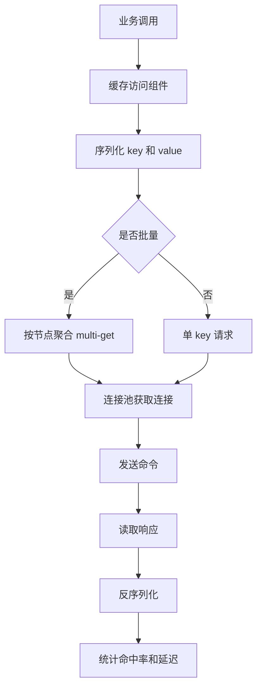
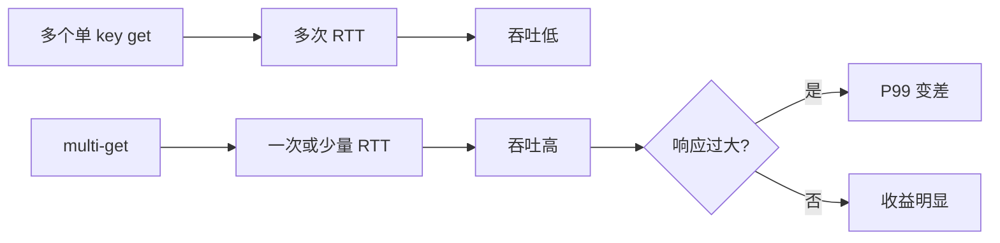
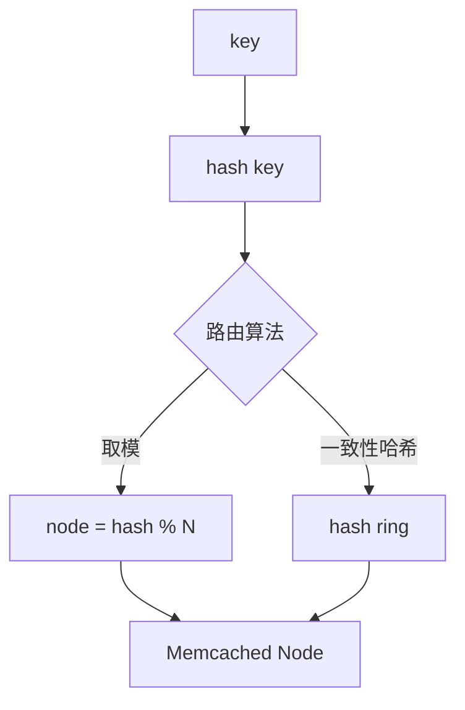
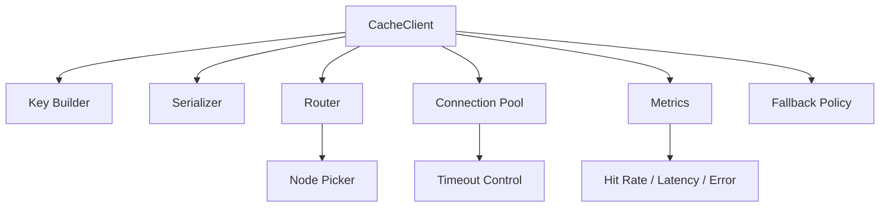

# Memcached 协议与客户端优化

## 1. 问题背景

很多缓存性能问题并不是服务端太慢，而是客户端用法不对：每个 key 一次网络往返、连接池配置失控、超时太长、失败重试放大流量、批量请求没有上限、序列化体积过大。这些问题叠在一起，会把一个本来很轻的缓存访问变成主链路瓶颈。

Memcached 服务端足够简单，客户端就承担了更多工程责任：分片路由、连接复用、请求合并、超时控制、失败处理、序列化压缩、命中率监控。写好客户端访问层，往往比调整服务端参数更重要。

这篇文章从协议和客户端两个角度拆解 Memcached 的优化方法。

## 2. 核心概念

### 2.1 文本协议

Memcached 文本协议以 ASCII 命令为主，可读性强，调试方便。例如：

```text
get user:1\r\n
set user:1 0 300 5\r\n
alice\r\n
delete user:1\r\n
```

文本协议适合排障和通用客户端，实现简单，但解析和响应体处理仍然需要注意批量大小。

### 2.2 二进制协议

二进制协议用固定头部描述请求和响应，机器解析更规整，支持一些文本协议不方便表达的能力。实际生产中，很多团队仍大量使用文本协议，因为它足够简单，生态成熟，问题定位方便。

选择协议时，不应只看理论性能，而要看客户端库成熟度、可观测性、排障成本和团队经验。

### 2.3 multi-get

multi-get 是 Memcached 客户端优化里最重要的动作之一。它把多个 key 合并到一次请求里，减少网络 RTT。

```text
get user:1 user:2 user:3 user:4\r\n
```

但 multi-get 不是无限合并。单次 key 太多会导致响应过大，P99 上升，并可能拖慢同连接上的其他请求。

### 2.4 CAS

CAS 是 compare-and-swap，用于避免并发覆盖。客户端先 gets 获得 value 和 cas token，再用 cas 命令更新。如果期间 value 被别人改过，cas 失败。

CAS 能解决一部分简单并发写问题，但不适合复杂事务。需要强一致更新逻辑时，Redis Lua 或数据库事务可能更合适。

## 3. 原理拆解

### 3.1 客户端访问链路



如果客户端使用一致性哈希，批量请求还需要先按节点拆分。例如 100 个 key 可能分布在 8 个节点上，客户端应向每个节点发送一个 multi-get，而不是串行发送 100 次 get。

### 3.2 批量请求的收益和风险



批量优化的边界一般由三件事决定：

- 单次请求 key 数。
- 单次响应字节数。
- 连接被占用的时间。

### 3.3 分片路由

Memcached 服务端不负责集群，所以客户端通常需要路由 key：



取模简单，但节点数变化会导致大量 key 重映射。一致性哈希在扩缩容时重映射比例较低，但实现和运维复杂度更高。使用 Twemproxy 时，路由逻辑从客户端下沉到代理层。

### 3.4 Redis 客户端对比

Redis 客户端也强调连接复用、pipeline、批量命令和超时控制。但 Redis 命令更丰富，客户端还要处理 MOVED/ASK、Cluster slot、脚本缓存、事务、Pub/Sub、Stream 消费等语义。Memcached 客户端的业务重心更集中：key 路由、multi-get、连接池和失败处理。

| 维度 | Memcached 客户端 | Redis 客户端 |
|---|---|---|
| 路由 | 客户端分片或代理分片 | Cluster slot、代理或单实例 |
| 批量 | multi-get 为主 | pipeline、MGET、Lua、事务 |
| 复杂语义 | 少 | 多 |
| 失败处理 | 节点摘除、降级回源 | 重定向、主从切换、重试语义 |
| 数据处理 | 序列化对象 | 多数据结构建模 |

## 4. 工程取舍

### 4.1 文本协议还是二进制协议

文本协议：

- 优点：可读、易调试、生态广。
- 缺点：解析有额外成本，部分能力表达不如二进制规整。

二进制协议：

- 优点：格式固定，机器解析友好。
- 缺点：排障不如文本直观，对客户端库依赖更强。

大多数业务可以优先选择成熟客户端默认协议。协议本身通常不是第一瓶颈，错误的连接池和批量策略才更常见。

### 4.2 连接池大小

连接池太小会排队，太大会拖垮服务端。合理做法是：

- 先压测单连接吞吐。
- 再按应用并发估算每节点连接数。
- 最后用服务端总连接数反推是否可承受。

不要只在单应用内看“每节点 20 条连接很少”，要乘以应用实例数和缓存节点数。

### 4.3 超时和重试

缓存访问不能使用过长超时。一次缓存超时如果等 1 秒，主接口基本已经失败。更合理的是短超时、有限重试、快速降级。

重试也要谨慎：

- 对读请求，重试可能有帮助，但会放大故障节点压力。
- 对写请求，重试要考虑幂等和覆盖顺序。
- 对超时请求，不知道服务端是否已执行，不能简单假设失败。

## 5. 实战方案

### 5.1 推荐的客户端封装



业务代码只应该表达“读哪个缓存、miss 后怎么回源”，不要散落协议细节。

### 5.2 multi-get 实践

建议为批量请求设置两个上限：

```text
max_keys_per_batch = 100~500
max_response_bytes = 512KB~2MB
```

真实值要压测决定。对于 value 较大的业务，按响应字节数限制比按 key 数更重要。

### 5.3 序列化和压缩

缓存 value 的大小直接影响网络、内存、slab 分布和客户端 CPU。常见建议：

- 小对象优先使用紧凑二进制序列化或 JSON 的裁剪字段版本。
- 大对象考虑拆分，而不是只靠压缩。
- 压缩要设置阈值，避免小对象压缩得不偿失。
- value 增加版本号，方便灰度升级序列化格式。
- 反序列化失败要当作 miss，并上报指标。

### 5.4 失败处理策略

| 失败类型 | 推荐处理 | 避免 |
|---|---|---|
| 连接失败 | 快速失败，短期摘除节点 | 每次请求长时间重连 |
| 读超时 | 记录指标，有限重试或回源 | 无限重试 |
| 写失败 | 允许丢缓存，依赖后续回源 | 阻塞主流程 |
| 反序列化失败 | 删除或覆盖坏值 | 反复读取坏值 |
| 节点故障 | 熔断、摘除、预热恢复 | 所有流量持续打故障节点 |

### 5.5 排障和调优清单

- 看客户端命中率，而不是只看服务端总命中率。
- 看连接池等待时间，判断是否池太小或服务端慢。
- 看单次 multi-get 的 key 数和响应大小。
- 看错误类型分布：连接失败、读超时、写超时、协议错误要分开。
- 看序列化耗时和 value 大小分布。
- 看节点级 QPS 是否倾斜。
- 看发布后 key 前缀、TTL、序列化版本是否变化。

## 6. 常见问题

### 6.1 缓存读失败要不要直接报错？

通常不要。缓存是加速层，不是事实源。读失败时可以回源、返回旧值、降级字段或跳过非核心数据。但如果缓存承载会话或限流状态，就要按业务正确性重新评估。

### 6.2 set 失败需要重试到成功吗？

多数 Cache Aside 场景不需要。set 失败只意味着这次没有写入缓存，下一次 miss 仍可回源。强行重试可能把缓存故障扩散到主链路。

### 6.3 如何避免缓存 key 冲突？

使用统一 key 规范：业务域、对象类型、主键、版本。示例：

```text
user:profile:v2:{uid}
order:summary:v1:{order_id}
```

版本号可以在结构变化时快速隔离老数据。

### 6.4 pipeline 和 multi-get 是一回事吗？

不是。multi-get 是一个命令读取多个 key；pipeline 是把多个命令连续发送后再批量读取响应。Memcached 文本协议常用 multi-get 解决批量读，Redis 更常通过 pipeline 提升多命令吞吐。

## 7. 小结

- Memcached 协议简单，但客户端工程不简单。
- multi-get 是减少 RTT 的关键优化，但要限制 key 数和响应大小。
- 客户端分片要考虑扩缩容时的重映射成本，一致性哈希或代理可以降低冲击。
- 连接池、超时、重试和熔断决定了缓存故障是否会拖垮主链路。
- 序列化体积会同时影响网络、内存、slab 和 CPU，必须纳入优化范围。
- 和 Redis 相比，Memcached 客户端语义更少，但对路由和批量访问更敏感。
