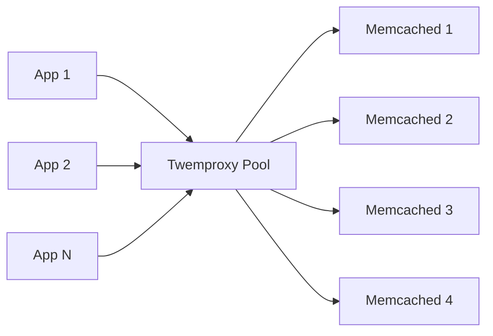
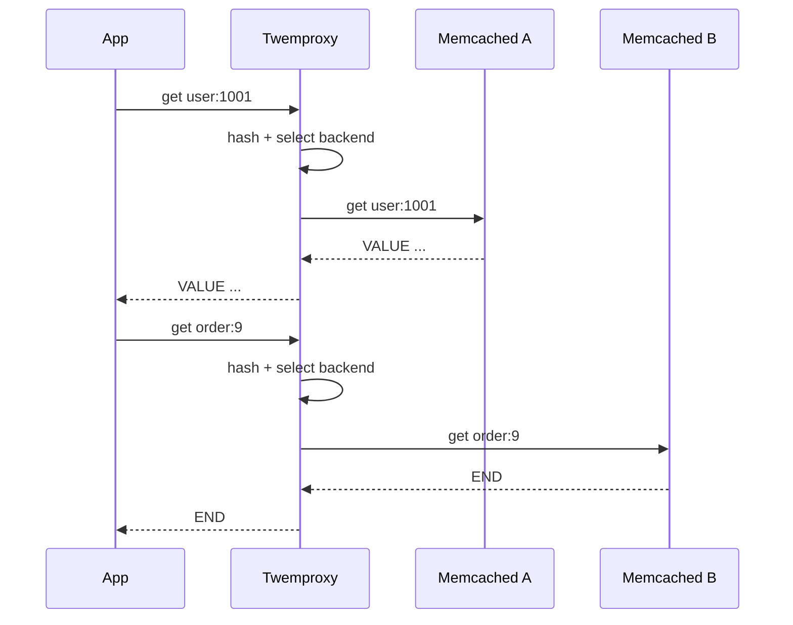
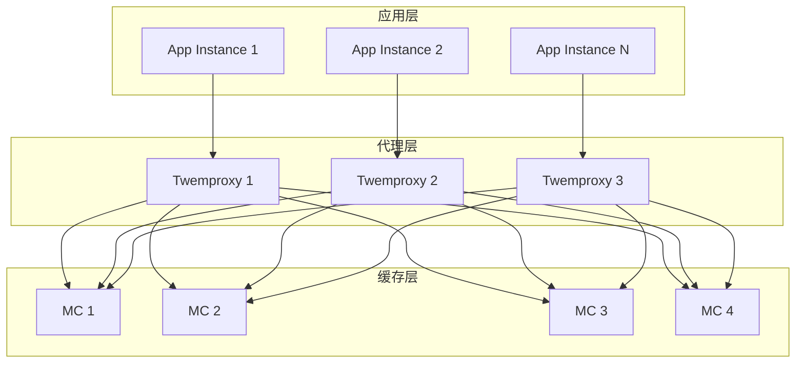
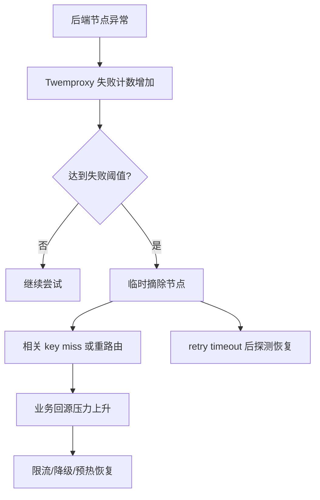

# Twemproxy 与代理分片实践

## 1. 问题背景

Memcached 服务端不提供内建集群能力，早期很多业务直接在客户端做分片。客户端分片简单直接，但当语言栈很多、业务团队很多、节点经常扩缩容时，问题就会变得明显：每种客户端都要实现一致的路由算法，配置发布容易不一致，故障节点摘除逻辑分散，连接数也会随着应用实例数膨胀。

Twemproxy，也叫 nutcracker，是 Twitter 开源的轻量级代理。它位于应用和缓存节点之间，负责请求路由、连接复用、后端分片和故障隔离。它不能把 Memcached 变成强一致集群，但能把很多客户端侧复杂度收敛到代理层。

理解 Twemproxy 的价值和限制，有助于判断什么时候该用代理，什么时候该坚持 smart client，什么时候该转向 Redis Cluster、Codis 或自研缓存平台。

## 2. 核心概念

### 2.1 代理分片

代理分片是指应用只连接代理，代理根据 key 选择后端缓存节点。



应用侧看到的是一个或少数几个代理地址，不需要感知所有 Memcached 节点。

### 2.2 连接复用

没有代理时，每个应用实例都可能连接每个缓存节点。实例数一多，后端连接数会迅速放大。

引入 Twemproxy 后，应用连接代理，代理再维护到后端节点的连接。后端看到的连接数明显减少，连接治理更集中。

### 2.3 一致性哈希

Twemproxy 支持多种分布算法，常见做法是使用一致性哈希。节点增减时，只影响哈希环上一部分 key，减少整体缓存抖动。

### 2.4 失败隔离

代理可以在后端节点失败时临时摘除节点，避免每个客户端都重复探测故障节点。但这也带来一致性和命中率问题：节点摘除后，该节点 key 会被路由到其他节点或直接 miss，回源压力会升高。

## 3. 原理拆解

### 3.1 请求流转



代理本身不理解业务语义，只按协议解析出 key 并路由。它不会自动从其他节点恢复数据，也不会复制数据。

### 3.2 连接数变化

假设有 200 个应用实例、20 个 Memcached 节点、每实例到每节点 2 条连接：

```text
无代理后端连接数 = 200 x 20 x 2 = 8000
```

如果引入 8 个 Twemproxy，每个代理到每个后端 4 条连接：

```text
有代理后端连接数 = 8 x 20 x 4 = 640
```

这就是代理在大规模场景中的直接价值：减少后端连接压力，也让故障处理集中。

### 3.3 配置模型

Twemproxy 的配置通常围绕 pool 展开：

```yaml
alpha:
  listen: 0.0.0.0:22121
  hash: fnv1a_64
  distribution: ketama
  auto_eject_hosts: true
  server_retry_timeout: 30000
  server_failure_limit: 3
  servers:
   - 10.0.0.1:11211:1
   - 10.0.0.2:11211:1
   - 10.0.0.3:11211:1
```

核心配置包括监听端口、哈希函数、分布算法、后端节点、失败摘除策略和重试窗口。

### 3.4 与 Redis 代理方案对比

Twemproxy 也支持 Redis 协议的一部分，但它不是 Redis Cluster。它更像一个轻量路由代理，不处理复杂命令的跨 slot 语义，也不提供 Redis Cluster 的迁移和重定向机制。

| 方案 | 适合场景 | 优点 | 限制 |
|---|---|---|---|
| Twemproxy + Memcached | 简单 key-value 缓存 | 轻量、连接复用、客户端简单 | 无自动迁移、无复制 |
| Smart Client | 客户端能力强、语言统一 | 少一跳、灵活 | 多语言治理复杂 |
| Redis Cluster | Redis 原生分片 | slot 迁移、生态成熟 | 客户端需处理重定向 |
| Codis/自研 Proxy | 平台化 Redis 服务 | 运维治理强 | 系统复杂度更高 |

## 4. 工程取舍

### 4.1 使用 Twemproxy 的收益

- 应用侧配置简单，减少多语言客户端分片差异。
- 后端连接数下降，缓存节点更稳定。
- 故障摘除集中，避免客户端各自为战。
- 可以按 pool 做业务隔离和容量规划。
- 迁移客户端时成本较低，应用只关心代理地址。

### 4.2 Twemproxy 的代价

- 多一跳网络转发，极致低延迟场景要评估。
- 代理自身成为关键链路，需要高可用部署。
- 不负责数据迁移，扩缩容仍会带来 miss。
- 部分复杂命令或大批量命令支持受限。
- 故障摘除会改变路由，可能引发回源峰值。

### 4.3 代理还是客户端分片

可以按下面思路选择：

| 条件 | 更适合 |
|---|---|
| 语言栈统一，团队少，追求最低延迟 | Smart Client |
| 语言栈多，连接数压力大，想集中治理 | Twemproxy |
| 需要自动迁移、平台化运维、丰富治理 | 自研 Proxy 或缓存平台 |
| 需要 Redis 数据结构和集群语义 | Redis Cluster 或 Redis Proxy |

## 5. 实战方案

### 5.1 部署拓扑

生产上不要只部署一个 Twemproxy。常见做法：



应用可以通过本机 sidecar、同机房 VIP、服务发现或配置中心选择代理。代理层本身要做健康检查和滚动发布。

### 5.2 扩容步骤

Memcached + Twemproxy 扩容的难点不是加机器，而是 key 重映射后的 miss 和回源峰值。

建议流程：

1. 评估当前命中率、DB 回源余量和热点 key。
2. 新增 Memcached 节点并完成基础压测。
3. 更新 Twemproxy 配置，先在小流量代理灰度。
4. 观察 miss、DB QPS、P99、错误率。
5. 必要时对热点 key 预热。
6. 分批滚动所有代理。
7. 扩容完成后复盘 key 分布和 slab 使用。

### 5.3 故障处理



节点故障时，不要只看代理是否自动摘除，还要看回源链路是否健康。缓存故障真正危险的地方，是把压力传给 DB。

### 5.4 实践清单

- 代理层至少多实例部署，避免单点。
- 应用到代理、代理到后端都要有独立超时。
- 配置变更必须灰度，避免全量 key 同时重映射。
- 按业务拆 pool，避免低价值缓存挤占核心业务资源。
- 监控代理的请求量、错误数、后端失败、连接数、队列和延迟。
- 故障演练要覆盖：单后端宕机、单代理宕机、配置错误、DB 回源过载。

### 5.5 排障和调优

| 现象 | 可能原因 | 处理 |
|---|---|---|
| 引入代理后延迟升高 | 多一跳、代理 CPU 瓶颈、连接不足 | 增加代理实例、调连接、就近部署 |
| 某后端 QPS 过高 | 哈希倾斜、热点 key、权重配置问题 | 检查分布算法和 key 热点 |
| 扩容后 miss 暴涨 | key 重映射 | 灰度扩容、预热、限流回源 |
| 代理频繁摘除节点 | 后端慢、超时过短、网络抖动 | 分析后端和网络，调整阈值 |
| 应用大量超时 | 代理排队或后端异常 | 分层看应用到代理和代理到后端延迟 |

## 6. 常见问题

### 6.1 Twemproxy 能解决 Memcached 高可用吗？

只能解决一部分。它可以做失败摘除和连接复用，但不复制数据，也不保证节点故障时数据仍命中。真正的高可用还需要业务回源保护、限流降级、预热和容量冗余。

### 6.2 Twemproxy 会不会成为瓶颈？

会。代理是额外一跳，也是集中转发点。需要多实例部署、就近接入、监控 CPU 和网络，并通过压测确认代理层容量。不要把所有业务都打到少数几个代理上。

### 6.3 扩容时能不能做到完全无 miss？

Memcached 代理分片通常做不到完全无 miss。除非有额外的数据迁移或双读双写机制，否则节点变化一定会影响部分 key。工程上重点是降低重映射比例，并控制回源峰值。

### 6.4 为什么不用 Redis Cluster 替代 Twemproxy？

如果业务需要 Redis 的数据结构、复制、Cluster slot 和迁移能力，Redis Cluster 更合适。但如果只是简单对象缓存，Memcached + Twemproxy 的运维模型更轻，成本也可能更低。选型要看业务语义，而不是只看组件名气。

## 7. 小结

- Twemproxy 的核心价值是把客户端分片、连接复用和失败隔离集中到代理层。
- 它适合简单 key-value 缓存的大规模访问，但不提供复制、持久化和自动数据迁移。
- 引入代理降低客户端复杂度，也增加了一跳和代理层高可用问题。
- 扩缩容的主要风险是 key 重映射和 DB 回源峰值，必须灰度和预热。
- 和 Redis Cluster、Codis、自研 Proxy 相比，Twemproxy 更轻，但治理能力也更有限。
- 判断是否使用代理，要从语言栈复杂度、连接规模、故障隔离和平台化诉求出发。
