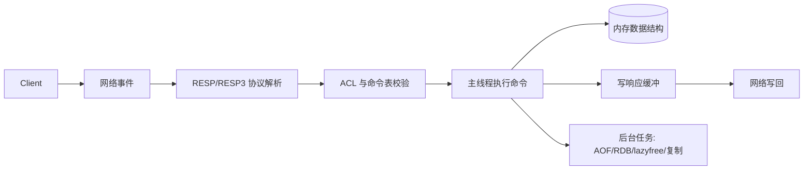
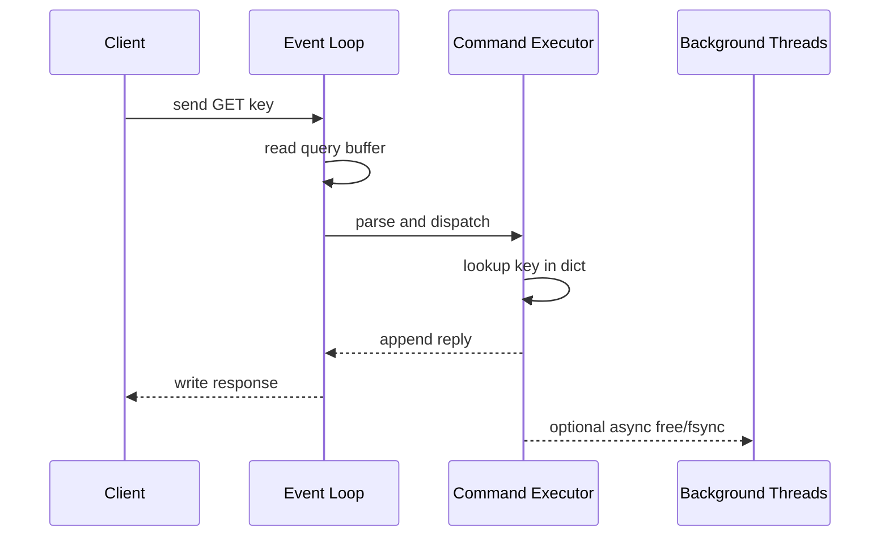

# Redis 运行机制总览

## 1. 问题背景

Redis 经常被简单理解成“内存版 KV”，这会让很多工程决策变得粗糙：所有热点都塞进去，所有并发都指望它扛，出了慢查询再去看 `SLOWLOG`。真正的 Redis 是一个事件驱动的内存数据库，命令执行、网络收发、后台任务、持久化、复制、集群路由都在同一个系统里互相牵制。

这一篇先建立全景图：Redis 为什么快，快在哪里会被打断，Redis 6/7 之后新增的多线程 I/O、ACL、client tracking、RESP3 等能力分别解决什么问题。后面的数据结构、协议、淘汰、持久化、复制和集群，都可以放回这张地图里理解。

## 2. 核心概念

Redis 的核心能力可以拆成几层：

| 层次 | 关注点 | 常见风险 |
|---|---|---|
| 网络层 | 连接、协议解析、响应写回、pipeline | 连接风暴、输出缓冲区膨胀、慢客户端 |
| 命令层 | 命令查找、权限校验、执行、慢查询记录 | 大 key、阻塞命令、Lua 执行过久 |
| 数据层 | String、Hash、List、Set、ZSet、Stream 等 | 编码膨胀、过度嵌套、内存碎片 |
| 后台层 | lazyfree、AOF fsync、rewrite、关闭 fd | fork 延迟、磁盘抖动、异步释放堆积 |
| 分布式层 | 复制、哨兵、Cluster、slot 迁移 | 主从延迟、脑裂、跨 slot 操作失败 |
| 治理层 | ACL、限流、监控、审计、client tracking | 权限过大、热点不可见、缓存一致性失控 |

Redis 早期被称为“单线程”，更准确的说法是：命令执行主路径基本单线程，网络 I/O 和后台重任务可以由其他线程协助。Redis 6 引入多线程 I/O 后，读写 socket 可以并行，但命令真正修改数据仍由主线程串行执行，这保证了绝大多数命令的原子性。

## 3. 原理拆解

一次普通请求会经历如下路径：



Redis 的事件循环同时处理文件事件和时间事件。文件事件负责 socket 可读可写，时间事件负责 `serverCron`，例如过期扫描、统计刷新、复制心跳、AOF rewrite 检查等。



多线程 I/O 的价值主要在网络包较多、value 较大、连接数较多时降低读写系统调用和协议处理压力。它不会让一个 `HGETALL` 大 key 或一段耗时 Lua 脚本变成并行执行。

## 4. 工程取舍

Redis 的高性能来自几类取舍。

第一，内存优先。大多数操作在内存数据结构上完成，延迟低，但容量、碎片率、淘汰策略变成一等问题。

第二，主线程串行执行命令。好处是模型简单、命令天然原子；代价是任何长耗时命令都会拖住后续请求。工程上要避免大 key、全量扫描、超长 Lua、同步删除大对象。

第三，持久化和复制异步化。AOF/RDB/复制能提高恢复能力，但会带来 fork、磁盘写、复制缓冲区等额外成本。缓存场景不应把 Redis 当成唯一事实源，除非你明确设计了数据丢失窗口和恢复流程。

第四，客户端承担更多责任。Redis Cluster 的 Smart Client 要理解 slot、MOVED/ASK、重试、拓扑刷新；Proxy 模式则把复杂度收敛到代理层，但增加一次网络转发和代理可用性问题。

## 5. 实战方案

基础运行配置可以从这组参数开始：

```conf
port 6379
bind 0.0.0.0
protected-mode yes
requirepass change-me

io-threads 4
io-threads-do-reads yes

maxmemory 16gb
maxmemory-policy allkeys-lfu
lazyfree-lazy-eviction yes
lazyfree-lazy-expire yes
lazyfree-lazy-server-del yes

appendonly yes
appendfsync everysec
aof-use-rdb-preamble yes
```

Redis 6/7 之后建议把 ACL 当作生产标配，而不是只靠一个全局密码：

```bash
redis-cli ACL SETUSER app_user on >app-pass ~app:* +@read +@write -@dangerous
redis-cli ACL SETUSER readonly on >ro-pass ~app:* +@read -@write
redis-cli ACL LIST
```

启用 client tracking 可以让客户端本地缓存具备失效通知能力，适合“本地缓存 + Redis + DB”的多级缓存：

```bash
CLIENT TRACKING ON BCAST PREFIX user: PREFIX sku:
HELLO 3
GET user:1001
```

调优与排障清单：

- 看延迟：`redis-cli --latency-history`、`LATENCY DOCTOR`、`SLOWLOG GET 20`。
- 看阻塞：`INFO clients` 中的 `blocked_clients`，以及慢命令是否集中在 `KEYS`、`HGETALL`、`ZRANGE` 大范围查询。
- 看内存：`INFO memory`、`MEMORY STATS`、`MEMORY USAGE key`、碎片率和 allocator。
- 看连接：`CLIENT LIST` 检查慢客户端、输出缓冲区、连接空闲时间。
- 看持久化：`INFO persistence` 中的 `rdb_bgsave_in_progress`、`aof_rewrite_in_progress`、`aof_delayed_fsync`。
- 看复制：`INFO replication` 的 `master_repl_offset`、`slave_repl_offset`、`master_link_status`。

## 6. 常见问题

**Redis 6 的多线程 I/O 是否等于命令多线程？**

不是。多线程 I/O 主要并行处理 socket 读写和部分协议读入，命令执行仍然由主线程串行完成。所以优化慢命令仍要从数据结构、命令范围、Lua 耗时、key 大小入手。

**为什么 Redis 很快但线上还是会抖？**

常见原因不是 CPU 不够，而是某个请求拖住主线程，例如删除超大 Hash、执行 `KEYS *`、AOF fsync 被磁盘拖慢、fork 时页表复制导致延迟尖刺、客户端输出缓冲区堆积。

**RESP3 值不值得升级？**

RESP3 增加了 map、set、push 等更丰富的类型，适合 client tracking、模块化能力和更强语义客户端。老系统如果只用简单 GET/SET，不必为了协议本身强行升级，但新客户端可以优先兼容 RESP3。

**ACL 会不会影响性能？**

ACL 校验有成本，但通常远低于网络、命令执行和业务序列化成本。生产环境更重要的是最小权限、危险命令隔离和审计。

## 7. 小结

- Redis 的快来自内存、事件驱动、紧凑数据结构和主线程串行模型。
- “单线程”不是完整描述，Redis 6/7 已经有多线程 I/O 和后台线程协作。
- 命令执行仍要避免长耗时操作，因为它会阻塞整个实例的主路径。
- ACL、RESP3、client tracking 让 Redis 更适合现代多租户和多级缓存架构。
- lazyfree 能降低大对象删除对主线程的冲击，但不能替代 key 设计治理。
- 运维 Redis 要同时看延迟、内存、连接、持久化、复制和慢命令。
- 后续理解数据结构、淘汰、持久化、复制和集群，都要回到这条请求处理链路上。
