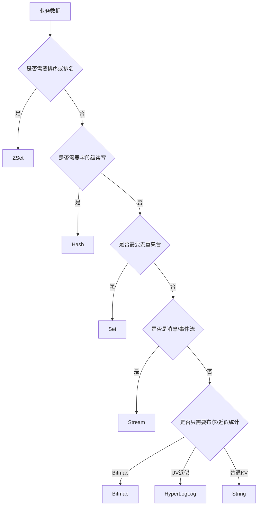

# Redis 核心数据类型选型

## 1. 问题背景

很多 Redis 线上问题并不是“Redis 不够快”，而是一开始把数据模型选错了：所有对象都序列化成 String，排行榜用 List 硬做，集合关系塞进超大 Hash，计数场景又用一堆独立 key 把内存和连接都打爆。

Redis 的数据类型不是语法糖，它们背后对应不同的内部编码、命令复杂度和内存布局。选型的目标不是“哪个命令方便”，而是让业务读写模式、容量规模、过期策略和运维成本匹配起来。

## 2. 核心概念

Redis 常用类型可以按业务语义理解：

| 类型 | 典型用途 | 关键命令 | 注意点 |
|---|---|---|---|
| String | 缓存对象、计数器、分布式锁、bitmap 底层 | `GET`、`SET`、`INCR`、`MGET` | 大对象序列化会放大网络和内存 |
| Hash | 对象字段缓存、购物车、小宽表 | `HGET`、`HSET`、`HMGET` | 字段过多会变成 big key |
| List | 简单队列、最近记录 | `LPUSH`、`BRPOP` | 不适合复杂消息可靠性 |
| Set | 去重、标签、关注关系 | `SADD`、`SISMEMBER`、`SINTER` | 大集合交并差会阻塞 |
| ZSet | 排行榜、延迟队列、时间线索引 | `ZADD`、`ZRANGE`、`ZPOPMIN` | score 设计决定查询成本 |
| Stream | 消息流、消费组、事件日志 | `XADD`、`XREADGROUP` | 需要治理 pending 和裁剪 |
| Bitmap | 签到、布尔画像、活跃统计 | `SETBIT`、`BITCOUNT` | offset 过大导致稀疏空间成本 |
| HyperLogLog | UV 近似统计 | `PFADD`、`PFCOUNT` | 近似统计，不可取明细 |
| Geo | 附近的人、门店距离 | `GEOADD`、`GEOSEARCH` | 底层是 zset，精度和范围要控制 |

Redis 7 继续强化了 listpack 等紧凑编码，很多小对象在低阈值下能用更少内存。但一旦超过阈值，编码转换会让内存和性能表现发生明显变化。

## 3. 原理拆解

数据类型选型可以按访问模式做一棵决策树：



一个商品详情缓存通常有两种建模方式：

```bash
# 方式一：整体 String，适合整对象读多、字段更新少
SET sku:1001 '{"id":1001,"price":3999,"stock":88}' EX 300
GET sku:1001

# 方式二：Hash，适合字段级读写
HSET sku:1001 id 1001 price 3999 stock 88
EXPIRE sku:1001 300
HMGET sku:1001 price stock
```

两者没有绝对优劣。String 适合批量读取和序列化对象直出，Hash 适合局部字段更新和减少重复 key 开销。对象字段很多、变更频繁、读取只取少数字段时，Hash 更自然；字段数量不可控时，需要拆分或限制。

## 4. 工程取舍

String 的工程优势是简单，客户端缓存、压缩、序列化都容易做；代价是字段级更新需要读改写，且大 value 会让网络和主线程复制成本变高。

Hash 的优势是字段级操作，适合对象属性缓存；代价是所有字段共享一个 TTL，无法给字段单独过期。大 Hash 删除、迁移、全量读取都会形成阻塞风险。

ZSet 的优势是按 score 排序，排行榜和延迟队列很好用；代价是写入和更新有 `O(logN)` 成本，范围查询要限制窗口，不能无边界 `ZRANGE 0 -1`。

Stream 提供消费组、pending、ack，比 List 更适合可靠消息；但它不是 Kafka，不能无成本长期存所有历史消息，必须设计 `MAXLEN`、消费积压告警和死信处理。

Bitmap 与 HyperLogLog 都是以精度或可读性换空间。Bitmap 可以精确按位表达，但 offset 过大时成本突增；HyperLogLog 非常省内存，但只能做近似基数统计。

## 5. 实战方案

对象缓存建议模板：

```bash
# 缓存空值防穿透，TTL 短一些
SET user:404 "__NULL__" EX 60

# 商品详情整对象缓存，TTL 加随机抖动由应用生成
SETEX sku:1001 367 '{"id":1001,"title":"phone","price":3999}'

# 热点对象字段缓存
HSET sku:1001:hot price 3999 stock 88 status online
EXPIRE sku:1001:hot 30
```

排行榜示例：

```bash
ZINCRBY rank:daily:20260525 1 user:1001
ZREVRANGE rank:daily:20260525 0 99 WITHSCORES
ZREVRANK rank:daily:20260525 user:1001
EXPIRE rank:daily:20260525 172800
```

Stream 消费组示例：

```bash
XGROUP CREATE order:events g1 $ MKSTREAM
XADD order:events MAXLEN ~ 100000 * orderId 1001 status paid
XREADGROUP GROUP g1 c1 COUNT 100 BLOCK 1000 STREAMS order:events >
XACK order:events g1 1700000000000-0
```

调优与排障清单：

- 每类 key 定义命名规范：业务前缀、实体、维度、日期，避免无法批量治理。
- 禁止无边界范围查询：`LRANGE 0 -1`、`HGETALL`、`SMEMBERS`、`ZRANGE 0 -1` 只能用于小 key。
- 对集合型 key 设成员上限，超过后拆分为分片 key。
- 用 `MEMORY USAGE` 抽样看不同建模方式的真实内存。
- 用 `SCAN` 配合类型统计，不在生产执行 `KEYS`。
- 对可丢弃缓存设置 TTL，对事实型数据明确持久化和恢复策略。

## 6. 常见问题

**对象缓存到底用 String 还是 Hash？**

整对象读多、字段更新少、需要压缩或直接传给前端时，用 String 更简单。字段级读写多、对象较小且字段稳定时，用 Hash 更省重复 key 成本。字段数量不可控时，不要把 Hash 当无限宽表。

**List 能不能做消息队列？**

可以做简单队列，但可靠消费、重试、消费组、积压追踪都要自己补。Redis 5 之后优先考虑 Stream，或者直接使用专业 MQ。

**Set 的交集为什么会打慢 Redis？**

大集合交并差需要遍历成员，主线程执行时间可能很长。生产上应限制集合规模，或把关系计算前置、离线化、分片化。

**Redis 模块里的 Bloom、TopK、Count-Min Sketch 要不要用？**

适合防穿透、热点识别、近似统计等场景，但要确认云厂商或自建环境支持 RedisBloom/Redis Stack，并把误判率、容量扩展、备份恢复纳入设计。

## 7. 小结

- 数据类型选型本质是业务访问模式建模。
- String 简单，Hash 适合字段级读写，ZSet 适合排序，Stream 适合事件流。
- Bitmap、HyperLogLog、Bloom 等结构用空间或精度取舍换性能。
- 集合型数据一定要治理上限，否则容易变成 big key。
- Redis 7 的 listpack 等紧凑编码能省内存，但不能替代良好的 key 设计。
- 线上排障要从命令复杂度、key 大小、访问频率和 TTL 共同分析。
