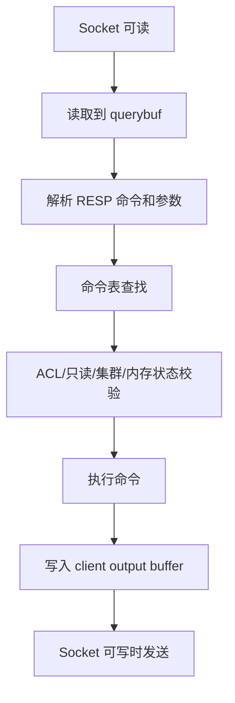
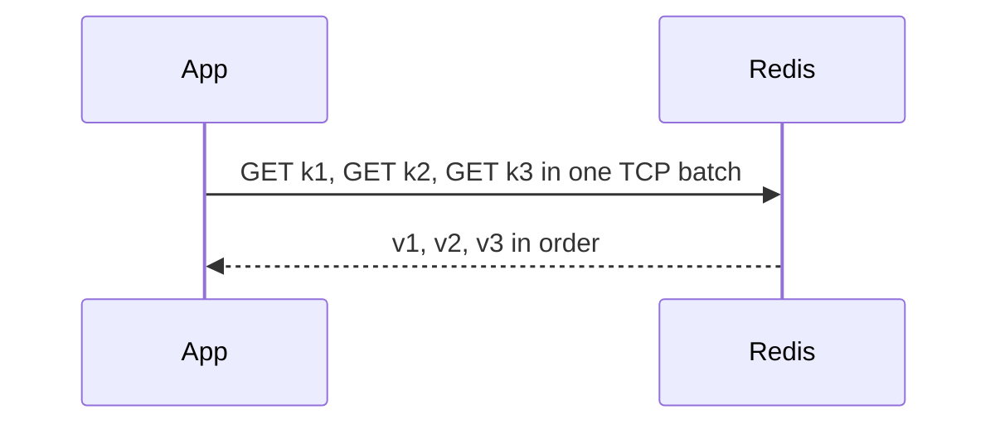

# Redis 协议与请求处理流程

## 1. 问题背景

Redis 客户端一旦用错，服务端再快也会被拖慢。典型问题包括：短连接打爆实例、没有 pipeline 导致 RTT 成本过高、批量响应太大挤爆输出缓冲区、慢客户端读不动导致内存上涨、Cluster 重定向处理不完善引发请求风暴。

理解 RESP 协议和请求处理流程，不是为了手写客户端，而是为了知道 pipeline、MGET、连接池、RESP3、client tracking、backpressure 这些工程能力为什么重要。

## 2. 核心概念

RESP 是 Redis Serialization Protocol。RESP2 常见类型包括简单字符串、错误、整数、批量字符串、数组。RESP3 增加了 map、set、boolean、double、push 等类型，让服务端可以表达更丰富的语义，尤其适合客户端缓存失效推送和模块响应。

客户端访问 Redis 时通常关注四件事：

- 连接复用：避免频繁 TCP 建连和认证。
- 批量发送：用 pipeline 或批量命令减少 RTT。
- 响应控制：避免一次返回过大数据。
- 错误处理：区分网络错误、命令错误、MOVED/ASK、超时和重试。

## 3. 原理拆解

RESP2 的一个 GET 请求编码大致如下：

```text
*2
$3
GET
$8
user:100
```

实际在线路上带 CRLF：

```text
*2\r\n$3\r\nGET\r\n$8\r\nuser:100\r\n
```

请求进入 Redis 后会沿着这条链路处理：



pipeline 的关键是把多个命令一次发出去，减少网络往返：



pipeline 不改变 Redis 单命令执行模型，只是减少 RTT 和系统调用。它也不是越大越好，过长的 pipeline 会增加服务端输出缓冲区、客户端等待时间和失败重试成本。

## 4. 工程取舍

`MGET` 和 pipeline 都能减少 RTT，但语义不同。`MGET` 是一个命令，适合多个 key 同槽或非 Cluster 场景；pipeline 是多个命令，适合混合命令批处理。Redis Cluster 下跨 slot 的 `MGET` 通常不可用，Smart Client 会按 slot 拆分或退化成 pipeline。

RESP3 的收益在于类型表达和 push 消息，适合新客户端和 client tracking。代价是老客户端兼容性，需要在连接初始阶段用 `HELLO 3` 协商。

连接池能降低建连成本，但池子过大也会制造上下文切换和内存压力。Redis 单实例通常不需要几千个活跃连接才能跑满，客户端应该用少量长连接加 pipeline，而不是靠无限连接并发。

## 5. 实战方案

协议协商与认证：

```bash
redis-cli
HELLO 3 AUTH app_user app-pass SETNAME order-service-01
PING
```

pipeline 示例：

```bash
printf '*2\r\n$3\r\nGET\r\n$6\r\nuser:1\r\n*2\r\n$3\r\nGET\r\n$6\r\nuser:2\r\n' | redis-cli --pipe
```

Cluster 重定向要正确处理：

```text
-MOVED 3999 10.0.0.12:6379
-ASK 3999 10.0.0.13:6379
```

`MOVED` 表示 slot 已经迁移，客户端应刷新拓扑；`ASK` 多发生在迁移中，客户端只对下一次请求发送 `ASKING`。

客户端建议配置：

```yaml
redis:
  timeout: 50ms
  connectTimeout: 200ms
  maxRedirects: 5
  pool:
    minIdle: 4
    maxActive: 64
  pipeline:
    maxBatchSize: 100
    maxWait: 2ms
  retry:
    maxAttempts: 1
    jitter: true
```

排障清单：

- `CLIENT LIST` 查看 `name`、`cmd`、`obl`、`omem`，识别慢客户端和输出缓冲区。
- `INFO clients` 关注 `connected_clients`、`client_recent_max_output_buffer`、`blocked_clients`。
- `INFO stats` 关注 `instantaneous_ops_per_sec`、`total_net_input_bytes`、`total_net_output_bytes`。
- 客户端埋点必须区分连接耗时、排队耗时、写入耗时、服务端耗时、读取耗时。
- pipeline 批量大小要压测，不要只看平均延迟，要看 P99 和超时率。
- Cluster 客户端要监控 MOVED/ASK 次数，异常升高通常意味着迁移、拓扑过期或网络抖动。

## 6. 常见问题

**pipeline 会不会破坏命令顺序？**

不会。同一连接上的命令按发送顺序执行，响应也按顺序返回。但多个连接之间没有全局顺序保证。

**pipeline 批量越大越好吗？**

不是。批量越大，RTT 成本越低，但单批等待时间、输出缓冲区和失败重放成本越高。在线业务通常选择几十到几百的小批次，离线回填可以更大。

**为什么慢客户端会影响 Redis？**

客户端读响应太慢时，服务端要把响应堆在 output buffer 里，占用内存。超过 `client-output-buffer-limit` 后连接会被断开，否则可能造成实例内存抖动。

**RESP3 是否要求服务端 Redis 7？**

RESP3 在 Redis 6 已经支持，Redis 7 的生态和客户端支持更完善。是否启用主要看客户端兼容性和是否需要 push、tracking 等能力。

## 7. 小结

- Redis 协议简单，但客户端工程质量决定线上表现。
- pipeline 降 RTT，MGET 降命令数量，两者适用场景不同。
- RESP3 更适合现代客户端缓存、模块响应和推送语义。
- 慢客户端、超大响应和连接风暴都是 Redis 常见隐性杀手。
- Cluster 客户端必须正确处理 MOVED、ASK 和拓扑刷新。
- 协议层排障要同时看服务端 `CLIENT LIST` 和客户端分段耗时。
