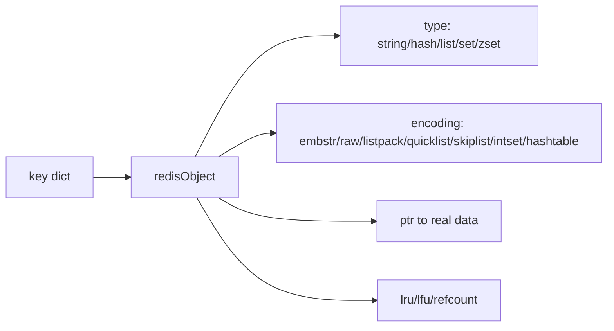
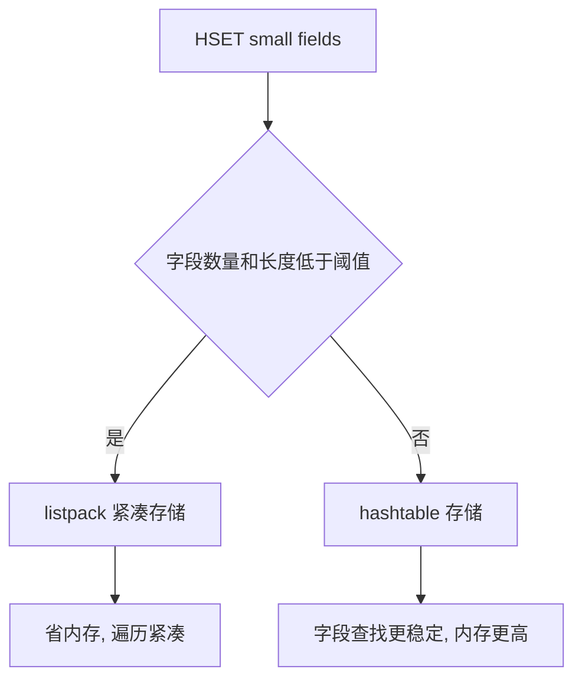

# Redis 内部数据结构笔记

## 1. 问题背景

Redis 对外提供 String、Hash、List、Set、ZSet、Stream，但真正决定内存和性能的是内部编码：SDS、dict、listpack、quicklist、skiplist、intset 等。不了解这些结构，就很难解释为什么一个 Hash 刚开始很省内存，字段多了突然膨胀；为什么小整数 Set 很紧凑，混入字符串后内存上去了；为什么 ZSet 排名查询快，但写入不是常数复杂度。

这一篇不是源码逐行阅读，而是把内部结构和工程选型连起来。

## 2. 核心概念

| 内部结构 | 用途 | 工程含义 |
|---|---|---|
| SDS | Redis 字符串实现 | 二进制安全，长度获取 O(1)，预分配减少扩容 |
| dict | 全局 keyspace、Hash 编码之一 | 哈希查找快，渐进式 rehash 避免长阻塞 |
| listpack | 紧凑连续内存编码 | 小 Hash/ZSet/Stream 节点省内存，但修改可能搬移 |
| quicklist | List 底层结构 | 链表串起 listpack，兼顾插入和内存紧凑 |
| skiplist | ZSet 排序索引 | 支持按 score 范围查询和排名 |
| intset | 小整数 Set 编码 | 整数集合省内存，混入非整数会转编码 |

Redis 7 中 ziplist 已逐步被 listpack 替代。listpack 避免了 ziplist 某些级联更新问题，是现代 Redis 紧凑编码的关键。

## 3. 原理拆解

Redis 对象大致由 `redisObject` 包一层类型、编码、LRU/LFU 信息和指针：



Hash 的编码转换是很典型的例子：



相关阈值可以通过配置查看：

```bash
redis-cli CONFIG GET '*listpack*'
redis-cli OBJECT ENCODING user:1001
redis-cli MEMORY USAGE user:1001
```

常见编码示例：

```bash
SET name alice
OBJECT ENCODING name

HSET user:1 name alice age 18
OBJECT ENCODING user:1

SADD ids 1 2 3
OBJECT ENCODING ids

ZADD rank 10 u1 20 u2
OBJECT ENCODING rank
```

## 4. 工程取舍

紧凑编码省内存，但不代表所有操作都更快。listpack 是连续内存，适合小对象，缓存局部性好；但中间插入、删除、更新较长字段时可能触发内存搬移。hashtable 占用更多指针和元数据，但字段查找稳定。

skiplist 支持 ZSet 的范围查询和排名，它不是最省内存的结构，但在实现复杂度、查询效率和增量更新之间取得了平衡。

dict 的渐进式 rehash 避免了一次性扩容阻塞，但 rehash 期间每个命令会顺手搬迁一部分 bucket。如果实例长期空闲后突然访问，仍可能观察到一些延迟波动。

SDS 的预分配减少扩容成本，但频繁修改大字符串仍会造成内存碎片和复制成本。缓存大 JSON 时要考虑压缩、拆字段或拆 key。

## 5. 实战方案

内存优化配置示例：

```conf
hash-max-listpack-entries 512
hash-max-listpack-value 64
zset-max-listpack-entries 128
zset-max-listpack-value 64
set-max-intset-entries 512
list-max-listpack-size -2
```

这些阈值不是越大越好。可以按业务抽样压测：

```bash
# 写入样本
redis-cli HSET profile:1 f1 v1 f2 v2 f3 v3
redis-cli OBJECT ENCODING profile:1
redis-cli MEMORY USAGE profile:1

# 观察大 key
redis-cli --bigkeys
redis-cli --memkeys
```

大 Hash 拆分方案：

```text
原始：user:attrs:{uid} -> 5000 fields

拆分：
user:attrs:{uid}:base
user:attrs:{uid}:profile
user:attrs:{uid}:risk
user:attrs:{uid}:ext:{bucket}
```

调优与排障清单：

- 每次新增 Redis 数据模型，都记录预估 key 数、field/member 数、平均 value 大小和峰值。
- 用 `OBJECT ENCODING` 验证实际编码，避免想象中的结构和真实结构不一致。
- 小对象优先利用 listpack/intset，超大对象主动拆分。
- 对 ZSet 排行榜限制 TopN 查询，不允许全量导出走线上实例。
- 删除大对象优先 `UNLINK`，并开启 lazyfree。
- 关注 `mem_fragmentation_ratio`，但不要只看一个指标，要结合 RSS、allocator、fork 场景判断。

## 6. 常见问题

**listpack 是不是一定比 hashtable 好？**

不是。listpack 省内存，适合小集合；hashtable 查找更稳定，适合字段多、更新频繁、值较大的场景。Redis 的阈值就是为了在两者之间切换。

**为什么 Set 里都是数字时特别省内存？**

因为可能使用 intset。intset 连续存储整数，编码紧凑；一旦加入非整数成员，可能转为 hashtable，内存明显上升。

**ZSet 为什么既能查成员又能按分数排序？**

较大 ZSet 通常同时维护 dict 和 skiplist。dict 负责按 member 找 score，skiplist 负责按 score 排序和范围查询，所以功能强但内存成本更高。

**Redis 内部结构需要在业务代码里感知吗？**

不需要感知源码细节，但要感知规模阈值和命令复杂度。工程上关注“这个 key 会不会变大”“这个命令会不会遍历全量”就足够有效。

## 7. 小结

- Redis 外部类型背后有多种内部编码。
- listpack 是 Redis 7 之后理解小对象内存优化的重点。
- dict、skiplist、quicklist 分别支撑查找、排序和列表场景。
- 编码转换可能带来内存和性能突变，要用命令验证。
- 大 key 问题本质上常常是内部结构规模失控。
- 数据结构选型要和 TTL、删除方式、持久化、复制一起考虑。
