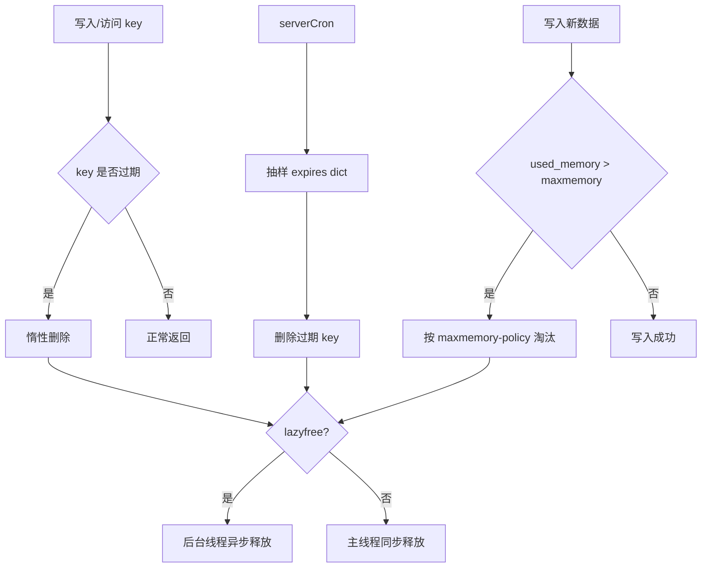

# Redis 过期淘汰与内存治理

## 1. 问题背景

Redis 用作缓存时，最怕两类事故：一类是 key 没过期，内存持续上涨，最后触发 OOM 或 noeviction；另一类是大量 key 同时过期，回源流量把数据库打穿。过期、淘汰、内存碎片、lazyfree、big key 删除，这些机制共同决定了缓存是否稳定。

这一篇关注一个问题：当 Redis 内存接近上限时，哪些 key 会被删除，删除发生在什么时候，删除本身会不会拖慢主线程。

## 2. 核心概念

Redis 删除 key 有三条路径：

- 惰性删除：访问 key 时发现过期，再删除。
- 定期删除：后台周期性抽样扫描过期字典。
- 内存淘汰：写入时发现超过 `maxmemory`，按策略淘汰 key。

常见淘汰策略：

| 策略 | 含义 | 适用场景 |
|---|---|---|
| noeviction | 超内存后写入报错 | Redis 存事实数据，不允许丢 |
| allkeys-lru | 所有 key 中近似 LRU 淘汰 | 通用缓存 |
| volatile-lru | 只淘汰设置 TTL 的 key | 混合缓存与少量常驻数据 |
| allkeys-lfu | 所有 key 中按访问频率淘汰 | 热点明显、缓存污染敏感 |
| volatile-ttl | 淘汰剩余 TTL 更短的 key | TTL 代表业务价值时 |
| allkeys-random | 随机淘汰 | 简单但命中率不稳定 |

Redis 的 LRU/LFU 是近似算法，通过采样降低开销。不要期待它像离线精确 LRU 一样完美。

## 3. 原理拆解

过期和淘汰的关系如下：



TTL 字典和 keyspace 字典是分开的。设置过期时间后，Redis 会在 expires 字典里记录 key 的过期时间戳。访问 key 时先检查是否过期；定期任务则抽样检查一批 key，避免一次扫描所有 key。

## 4. 工程取舍

`allkeys-lfu` 在热点明显、长尾 key 很多的场景通常比 LRU 更抗缓存污染。例如突发爬虫或批量任务访问大量冷 key 时，LFU 更不容易把长期热点挤掉。但 LFU 对访问计数有衰减和近似，参数需要结合业务调。

`volatile-*` 策略要求所有可淘汰 key 都设置 TTL。如果业务漏设 TTL，Redis 可能找不到足够可淘汰 key，最终写入失败。

lazyfree 能把大对象释放放到后台线程，降低主线程卡顿。但内存不是瞬间归还，短时间内 `used_memory` 可能还在高位。它解决的是释放耗时，不解决容量规划。

TTL 随机化能降低雪崩，但不能替代预热、请求合并、限流和降级。对于热点 key，可能需要逻辑过期加异步刷新，而不是简单设置短 TTL。

## 5. 实战方案

推荐缓存实例配置：

```conf
maxmemory 16gb
maxmemory-policy allkeys-lfu
maxmemory-samples 10

lazyfree-lazy-eviction yes
lazyfree-lazy-expire yes
lazyfree-lazy-server-del yes
replica-lazy-flush yes

active-expire-effort 5
```

业务写入 TTL 加抖动：

```java
int baseTtlSeconds = 300;
int jitter = ThreadLocalRandom.current().nextInt(0, 60);
redis.setex("sku:" + skuId, baseTtlSeconds + jitter, json);
```

大 key 删除使用 `UNLINK`：

```bash
UNLINK big:hash:1001
UNLINK big:zset:rank:20260525
```

内存排障命令：

```bash
INFO memory
INFO stats
MEMORY STATS
MEMORY DOCTOR
redis-cli --bigkeys
redis-cli --hotkeys
```

治理清单：

- 设置 `maxmemory`，不要让 Redis 吃满机器内存。
- 缓存 key 默认必须有 TTL，常驻 key 需要白名单。
- TTL 增加随机抖动，避免同批数据同时过期。
- 对大对象启用 lazyfree，并用 `UNLINK` 代替 `DEL`。
- 监控 `evicted_keys`、`expired_keys`、`keyspace_hits`、`keyspace_misses`。
- 监控内存碎片率、RSS、fork 耗时和写入失败数。
- 对热点 key 使用逻辑过期、异步刷新或本地缓存兜底。

## 6. 常见问题

**为什么 key 设置了 TTL 却没有准时删除？**

Redis 不保证到点立刻删除。过期 key 可能在下次访问时惰性删除，也可能被定期抽样删除。TTL 是可见性语义，不是实时调度器。

**evicted_keys 上涨一定是坏事吗？**

作为纯缓存，少量淘汰是正常现象；但淘汰持续上涨并伴随命中率下降、DB 回源升高，就说明容量或策略有问题。

**noeviction 适合缓存吗？**

一般不适合纯缓存。它会在内存满时让写入报错，导致业务异常。只有当 Redis 存的是不可丢数据或特殊状态时才考虑。

**内存碎片率高该怎么办？**

先看是否发生过大 key 删除、fork、写入波动，再考虑 `activedefrag yes`。碎片率不能脱离 RSS 和业务流量单独判断。

## 7. 小结

- Redis 过期删除包括惰性删除和定期删除，淘汰是内存压力下的策略选择。
- 缓存实例必须设置 `maxmemory` 和明确淘汰策略。
- LFU 更适合热点明显且容易被冷流量污染的缓存。
- lazyfree 降低释放大对象的主线程阻塞，但不等于释放容量规划压力。
- TTL 抖动、逻辑过期、请求合并和限流要一起使用。
- 内存治理要同时看容量、命中率、淘汰、碎片和回源压力。
