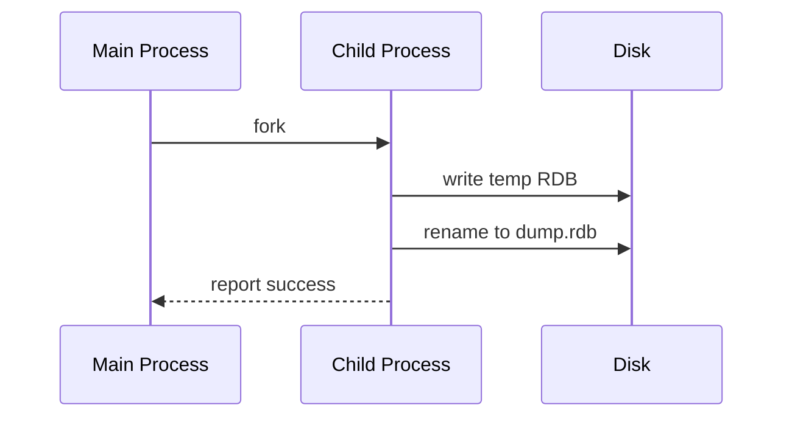
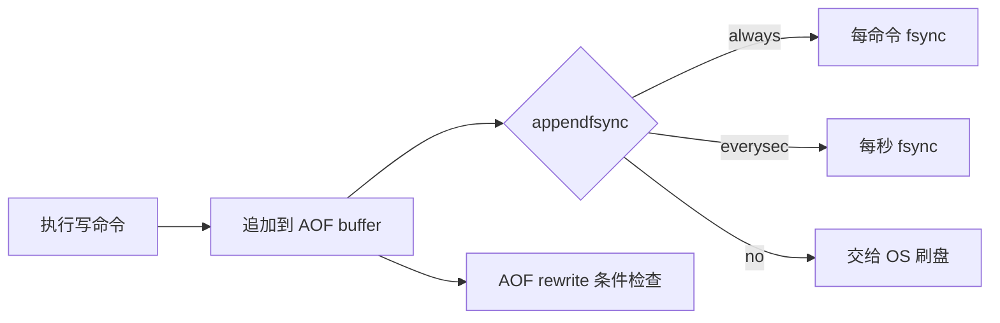
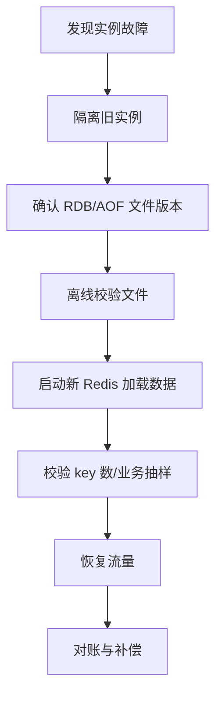

# Redis 持久化与故障恢复

## 1. 问题背景

很多团队一边说 Redis 只是缓存，一边又在里面放库存、令牌、会话、队列和幂等状态。等实例崩溃或机器重启后，才发现“缓存丢了”并不总是可以接受。Redis 持久化的价值，是在性能、恢复速度和数据丢失窗口之间做取舍。

这一篇讲 RDB、AOF、AOF rewrite、混合持久化和恢复流程，也会强调一个底线：持久化提升恢复能力，但不能把 Redis 变成没有设计成本的数据库。

## 2. 核心概念

| 机制 | 特点 | 优势 | 代价 |
|---|---|---|---|
| RDB | 定期生成快照 | 文件紧凑，恢复快 | 快照间隔内数据可能丢 |
| AOF | 追加写命令日志 | 数据丢失窗口小 | 文件更大，rewrite 和 fsync 有成本 |
| AOF rewrite | 重写最小命令集 | 压缩 AOF 文件 | fork、磁盘写、rewrite buffer |
| 混合持久化 | AOF 文件前半是 RDB，后半是增量 AOF | 恢复快，丢失窗口小 | 文件格式和运维认知更复杂 |

Redis 7 的 multi-part AOF 将 base、incremental、manifest 拆开管理，降低 rewrite 期间的一些复杂度。工程上仍要关注磁盘、fork、fsync 和恢复演练。

## 3. 原理拆解

RDB 生成流程：



AOF 写入链路：



混合持久化恢复时，Redis 先加载 AOF base 部分的 RDB，再回放增量 AOF。这样避免纯 AOF 大文件逐条回放过慢。

## 4. 工程取舍

RDB 适合缓存预热和灾后快速恢复，但不能承诺秒级数据不丢。AOF `everysec` 是大多数生产场景的折中，通常最多丢 1 秒左右数据，但磁盘抖动时仍可能出现延迟。

`appendfsync always` 数据安全更强，但写延迟明显上升，不适合高吞吐缓存。`appendfsync no` 性能好，但完全依赖操作系统刷盘，丢失窗口不可控。

fork 是持久化的重要风险点。RDB 和 rewrite 都需要 fork 子进程，实例内存越大，页表复制和写时复制成本越高。高写入期间 fork 会放大内存占用，也可能带来延迟尖刺。

如果 Redis 只是可重建缓存，可以降低持久化强度，甚至关闭 AOF，把精力放在预热、限流和回源保护上。如果 Redis 存半状态数据，就必须明确 RPO、RTO、恢复脚本和对账机制。

## 5. 实战方案

常见配置：

```conf
save 900 1
save 300 10
save 60 10000

appendonly yes
appendfsync everysec
no-appendfsync-on-rewrite yes
auto-aof-rewrite-percentage 100
auto-aof-rewrite-min-size 1gb
aof-use-rdb-preamble yes
```

备份与校验：

```bash
redis-cli BGSAVE
redis-cli INFO persistence
redis-check-rdb dump.rdb
redis-check-aof --fix appendonly.aof
```

恢复流程建议：



排障清单：

- `INFO persistence` 查看最近一次 RDB/AOF 状态和失败原因。
- 监控 `latest_fork_usec`，fork 耗时升高要评估实例内存和宿主机压力。
- 监控 `aof_delayed_fsync`，持续增加说明磁盘刷写跟不上。
- AOF rewrite 期间关注磁盘空间，至少预留一份 AOF/RDB 额外空间。
- 定期做冷备恢复演练，不要只备份不验证。
- 主从都开启持久化时，注意不要把损坏或空数据实例提升为主库。

## 6. 常见问题

**只开 RDB 可以吗？**

如果 Redis 只是可重建缓存，可以。若里面有订单幂等、库存扣减、会话等状态，只开 RDB 可能丢失较多最近写入，需要业务接受或补偿。

**AOF everysec 是否绝对只丢 1 秒？**

不是绝对。它表达的是刷盘策略，极端磁盘卡顿、系统崩溃、虚拟化问题都可能扩大窗口。设计上仍要用“约 1 秒级风险”看待。

**AOF rewrite 会阻塞 Redis 吗？**

rewrite 主要由子进程完成，但 fork、rewrite 期间写时复制、磁盘 I/O 都可能影响主线程延迟。

**混合持久化适合所有场景吗？**

适合希望兼顾恢复速度和较小丢失窗口的场景。若运维工具链很旧，先确认备份、校验、恢复流程是否支持。

## 7. 小结

- RDB 快照恢复快，但丢失窗口取决于快照间隔。
- AOF 数据丢失窗口小，但要付出日志、fsync 和 rewrite 成本。
- 混合持久化是现代 Redis 常用折中。
- fork、磁盘和写时复制是持久化延迟抖动的核心来源。
- 缓存场景也要定义 RPO/RTO，不能只说“丢了再查 DB”。
- 真正可靠的恢复能力来自备份、校验、演练和业务补偿。
