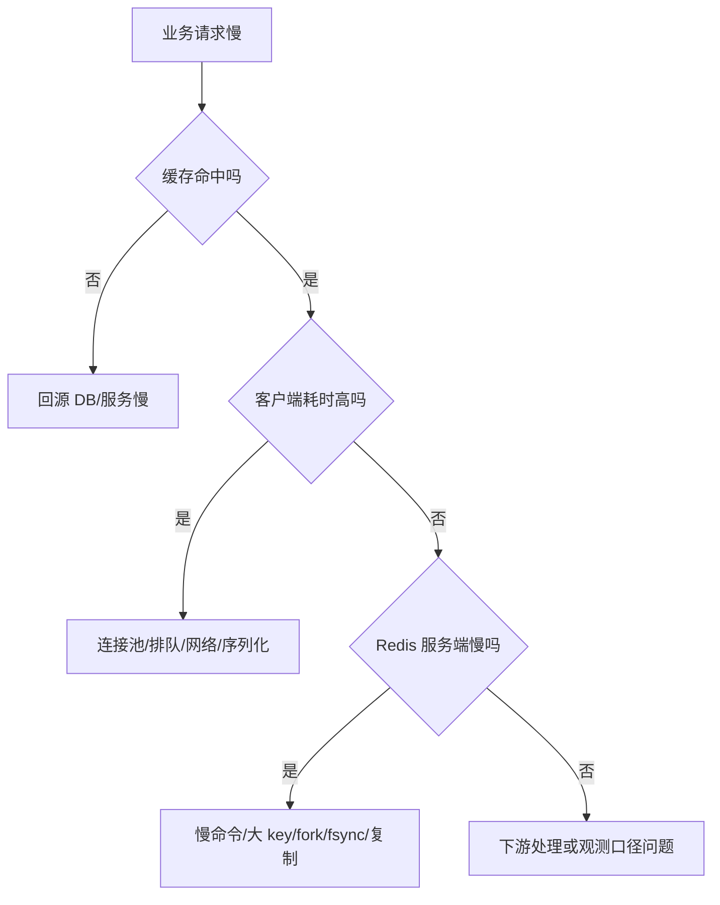

# Redis 性能优化实战

## 1. 问题背景

Redis 性能优化最容易走偏：一上来调内核参数、加机器、开多线程，却没有先看命令是不是大范围扫描、key 是不是过大、客户端是不是每次请求都新建连接。Redis 很快，但它不是无穷快。优化要从请求链路、数据模型、客户端、服务端和架构分层一起看。

这一篇给一套可落地的优化框架，目标不是追求 benchmark 上的峰值，而是让线上 P99、超时率、命中率和恢复能力稳定。

## 2. 核心概念

Redis 性能由五类因素决定：

- 命令复杂度：单命令是否遍历大量元素。
- 数据大小：key/value 是否过大，响应是否过大。
- 网络往返：是否使用连接池、pipeline、批量命令。
- 服务端后台任务：持久化、复制、过期删除、lazyfree、fork。
- 架构拓扑：单实例、主从读写分离、Cluster、Proxy、多级缓存。

优化顺序建议是：先减少不必要请求，再优化单次请求，再治理服务端阻塞，最后扩容和分层。

## 3. 原理拆解

排查慢请求可以按这条链路拆：



一次请求的耗时应拆成：

```text
total = app_queue + serialize + pool_wait + tcp_write + redis_exec + tcp_read + deserialize
```

只看 Redis `SLOWLOG` 不够，因为 `SLOWLOG` 记录的是命令执行时间，不包含网络传输、客户端排队、响应读取和反序列化。

## 4. 工程取舍

pipeline 能显著提升吞吐，但会增加单批延迟。在线接口要控制批量上限；离线任务可以用更大批次，但要隔离实例或限速。

Lua 能减少多次往返并保证原子性，但脚本执行期间会占用主线程。Lua 适合短小原子逻辑，不适合复杂循环、远程调用或大范围扫描。

读写分离能提升读吞吐，但会引入主从延迟和读一致性问题。对强一致读，仍要走主库或做版本校验。

多线程 I/O 适合网络瓶颈明显的场景。如果慢在命令执行或大 key 遍历，开 I/O 线程收益有限。

## 5. 实战方案

客户端优化：

```java
// 思路示例：批量读取，限制批次，避免 N 次 GET
List<String> keys = buildKeys(ids);
for (List<String> batch : Lists.partition(keys, 100)) {
    List<String> values = redis.mget(batch);
    merge(values);
}
```

Lua 扣库存示例：

```lua
local stockKey = KEYS[1]
local orderKey = KEYS[2]
local orderId = ARGV[1]

if redis.call('SISMEMBER', orderKey, orderId) == 1 then
  return 2
end

local stock = tonumber(redis.call('GET', stockKey) or '0')
if stock <= 0 then
  return 0
end

redis.call('DECR', stockKey)
redis.call('SADD', orderKey, orderId)
return 1
```

服务端配置：

```conf
slowlog-log-slower-than 10000
slowlog-max-len 1024
latency-monitor-threshold 100

io-threads 4
io-threads-do-reads yes

client-output-buffer-limit normal 0 0 0
client-output-buffer-limit replica 256mb 64mb 60
client-output-buffer-limit pubsub 32mb 8mb 60
```

压测命令：

```bash
redis-benchmark -h 127.0.0.1 -p 6379 -t get,set -n 1000000 -c 100 -P 16 -d 128
memtier_benchmark --server=127.0.0.1 --port=6379 --clients=50 --threads=4 --pipeline=16 --data-size=256
```

### Spring Boot 接口压测示例

只测 Redis 原生命令还不够。业务接口通常还包含 JSON 序列化、连接池排队、本地缓存、回源逻辑、Lua 脚本和应用线程池。因此本系列补充了一个接口级示例：

```text
examples/spring-boot-redis-cache-lab/
```

启动：

```bash
cd examples/spring-boot-redis-cache-lab
docker compose up --build
```

商品缓存接口压测：

```powershell
.\scripts\bench-products.ps1 -Url "http://localhost:8080/api/products/1" -Requests 2000 -Concurrency 50
curl http://localhost:8080/api/products/cache-stats
```

秒杀 Lua 接口压测：

```powershell
curl -X POST "http://localhost:8080/api/seckill/1001/prepare?stock=1000"
.\scripts\bench-seckill.ps1 -ActivityId 1001 -Requests 2000 -Concurrency 100
curl http://localhost:8080/api/seckill/1001/stock
```

建议把结果写入：

```text
examples/spring-boot-redis-cache-lab/docs/benchmark-results.md
```

这份模板会记录运行环境、请求数、并发数、QPS、平均延迟、P95/P99、错误数、缓存命中统计和秒杀库存校验。示例创建时当前机器没有可用的 Java/Maven/Redis 命令，Docker Desktop 后台也未启动，所以这里不填未运行的“假数据”。

优化清单：

- 禁止生产使用 `KEYS`、无边界 `SCAN`、大范围 `ZRANGE`、大 key `HGETALL`。
- 用 `MGET`、pipeline、Lua 减少 RTT，但控制批量大小。
- key/value 过大时拆分、压缩或改结构。
- 热点 key 用本地缓存、读副本、key 分片或逻辑过期异步刷新。
- 慢查询结合客户端分段耗时一起看。
- 后台任务高峰错开，AOF rewrite、RDB、离线回填不要撞业务峰值。
- 对批处理任务加限速和熔断，避免污染缓存。

## 6. 常见问题

**Redis CPU 没满，为什么还是超时？**

可能慢在网络、客户端连接池排队、输出缓冲区、大响应读取、磁盘 fsync 或 fork。CPU 只是一个指标，不能代表端到端延迟。

**开更多连接能提升吞吐吗？**

不一定。少量长连接加 pipeline 往往更有效。连接太多会增加内存、调度和服务端管理成本。

**Lua 一定比多命令快吗？**

短脚本通常更快，因为减少 RTT；长脚本会阻塞主线程，风险更大。Lua 要设置脚本规范和耗时监控。

**读写分离如何处理延迟？**

对允许最终一致的读走副本；对刚写后的读走主库，或带版本号判断副本是否追上。业务要明确读一致性等级。

## 7. 小结

- Redis 优化先看数据模型和命令复杂度，再看配置和扩容。
- `SLOWLOG` 只覆盖服务端执行时间，客户端分段埋点同样重要。
- pipeline、MGET、Lua 都是减少往返的工具，但要控制批量和阻塞风险。
- 大 key、热 key、慢客户端是线上性能故障高频原因。
- 多线程 I/O 有价值，但不能修复慢命令和错误建模。
- 真正稳定的高性能来自限流、隔离、监控、压测和容量规划。
