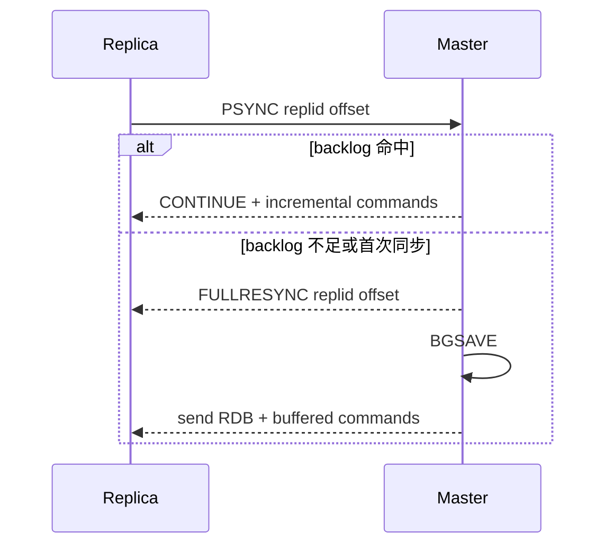
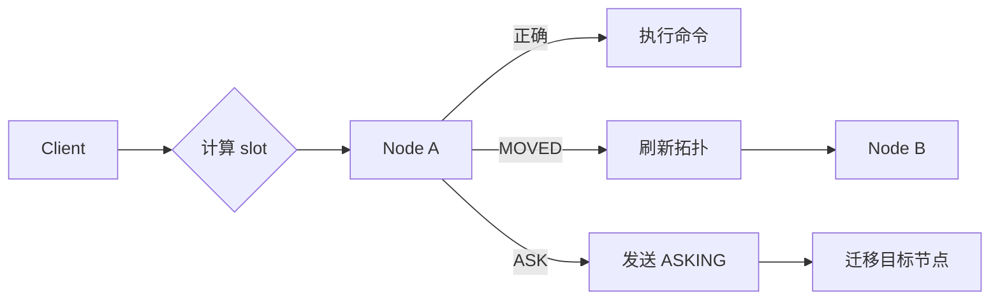
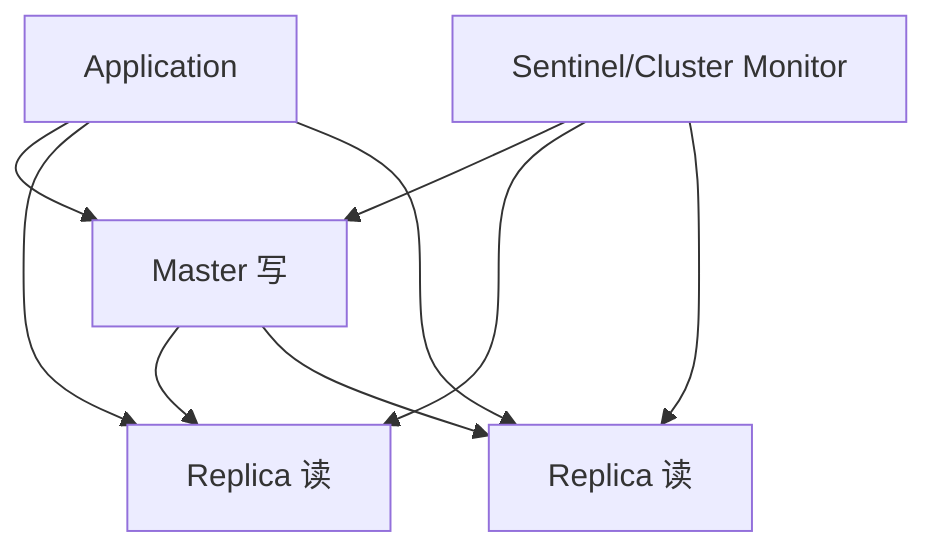

# Redis 复制与集群架构

## 1. 问题背景

单机 Redis 再快，也会遇到容量、可用性和运维边界。主从复制解决读扩展和故障恢复，哨兵解决主从自动切换，Cluster 解决分片和水平扩容。再往上，Proxy 和 Smart Client 决定业务如何感知集群。

这一篇讨论 Redis 从“单实例缓存”走向“分布式缓存服务”时的核心机制和工程取舍。

## 2. 核心概念

| 能力 | 解决问题 | 主要风险 |
|---|---|---|
| 主从复制 | 数据冗余、读扩展 | 主从延迟、复制中断、缓冲区溢出 |
| PSYNC | 增量复制 | repl backlog 不够会退化全量 |
| Sentinel | 主从监控和自动故障转移 | 脑裂、误判、客户端切换 |
| Cluster | slot 分片、自动重定向 | 跨 slot 限制、迁移复杂度 |
| Proxy | 屏蔽分片和拓扑 | 代理瓶颈和可用性 |
| Smart Client | 客户端直连分片 | 客户端复杂、语言实现不一致 |

Redis Cluster 将 keyspace 分成 16384 个 hash slot。key 通过 CRC16 计算 slot，带 `{tag}` 的 key 只对 tag 部分计算，便于把相关 key 放到同一 slot。

## 3. 原理拆解

复制流程：



Cluster 请求路由：



主从读写分离架构：



## 4. 工程取舍

主从复制适合提升读吞吐，但不适合无脑承诺强一致。副本读可能读到旧值，尤其在写高峰、网络抖动、全量同步后。业务需要决定哪些读可以走副本。

哨兵部署简单，适合主从小集群；Cluster 更适合容量分片和横向扩展，但跨 slot 多 key 操作受限。业务如果大量依赖多 key 原子操作，要么设计 hash tag，要么把这些操作收敛到单 slot，要么改业务模型。

Proxy 模式对业务友好，客户端像连单机 Redis 一样访问；代价是代理层要做高可用、扩缩容、监控和性能优化。Smart Client 性能路径更短，但每种语言客户端都要正确处理拓扑刷新和重定向。

## 5. 实战方案

复制相关配置：

```conf
replicaof 10.0.0.1 6379
masterauth master-pass
replica-read-only yes
repl-backlog-size 256mb
repl-backlog-ttl 3600
min-replicas-to-write 1
min-replicas-max-lag 10
```

Cluster 创建示例：

```bash
redis-cli --cluster create \
  10.0.0.1:6379 10.0.0.2:6379 10.0.0.3:6379 \
  10.0.0.4:6379 10.0.0.5:6379 10.0.0.6:6379 \
  --cluster-replicas 1
```

hash tag 示例：

```bash
MSET user:{1001}:profile p1 user:{1001}:quota q1
EVALSHA script 2 user:{1001}:profile user:{1001}:quota
```

排障清单：

- `INFO replication` 查看复制偏移、主从延迟、连接状态。
- 监控 `master_repl_offset` 与副本 offset 差值。
- `ROLE` 快速确认节点角色。
- Cluster 用 `CLUSTER NODES`、`CLUSTER SLOTS` 检查 slot 分布。
- 迁移期间监控 MOVED/ASK、客户端超时和 slot 状态。
- 设置合理 `repl-backlog-size`，避免短暂断连就全量同步。
- 故障切换后检查旧主是否被隔离，避免脑裂写入。

## 6. 常见问题

**主从复制是同步的吗？**

默认异步。主库执行写命令后会传播给副本，但不等待所有副本确认。可以用 `WAIT` 增强写后复制确认，但会增加延迟，且不等于分布式事务。

**PSYNC 为什么还会全量同步？**

如果副本请求的 offset 不在主库 repl backlog 中，或者 replid 不匹配，就只能全量同步。backlog 太小、断连太久都可能触发。

**Cluster 是否支持跨 key 操作？**

只支持同 slot 的多 key 操作。可以用 `{hashTag}` 控制相关 key 落同一 slot，但不要把所有 key 都打到一个 tag，否则会形成热点分片。

**Proxy 和 Smart Client 怎么选？**

团队语言栈多、希望业务少感知集群时选 Proxy；追求更短链路、客户端成熟、团队能治理拓扑复杂度时选 Smart Client。

## 7. 小结

- 复制解决冗余和读扩展，但带来延迟一致性问题。
- PSYNC 依赖 repl backlog，容量不足会退化为全量同步。
- Sentinel 适合主从高可用，Cluster 适合分片扩容。
- Cluster 的 16384 slot 是理解路由、迁移和跨 key 限制的核心。
- Proxy 简化客户端，Smart Client 缩短链路，取舍在复杂度归属。
- 生产集群要监控复制延迟、重定向、slot 状态和故障切换过程。
