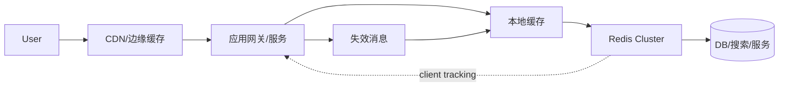
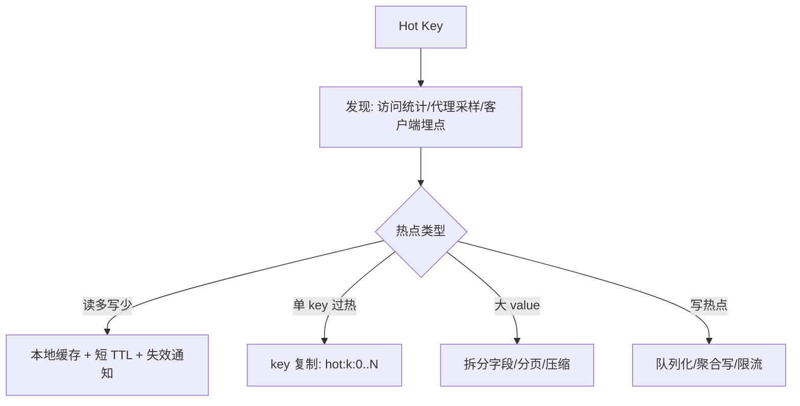
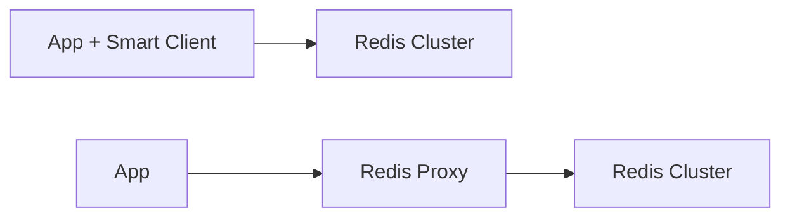

# Redis 亿级 QPS 还需要什么

## 1. 问题背景

单个 Redis 实例很快，但“亿级 QPS”从来不是靠一个 Redis 参数调出来的。真正的高并发缓存体系，是把请求挡在更靠近用户、更靠近应用、更便宜的位置：CDN、本地缓存、Redis Cluster、Proxy、读副本、异步刷新、热点隔离、限流降级一起工作。

这一篇讨论当 Redis 本身已经优化到位后，系统还缺哪些能力，才能支撑亿级访问和故障下的稳定性。

## 2. 核心概念

亿级 QPS 的关键词不是“单点更强”，而是“分层、分片、隔离、治理”。

| 能力 | 目标 | 示例 |
|---|---|---|
| 多级缓存 | 减少 Redis 压力 | CDN、本地 Caffeine、Redis |
| 热点治理 | 防止单 key 打爆单分片 | 热 key 发现、本地缓存、key 复制 |
| 分片扩展 | 扩大容量和吞吐 | Redis Cluster、Proxy 分片 |
| 流量调度 | 控制峰值和故障扩散 | 限流、熔断、降级、灰度 |
| 一致性治理 | 控制多层缓存脏读 | TTL、版本号、client tracking、消息失效 |
| 可观测性 | 快速定位瓶颈 | 命中率、P99、热 key、slot、复制延迟 |

Redis 6/7 的 client tracking 给多级缓存提供了更好的失效通知基础，但它不是全局一致性魔法。工程上仍要配合版本号、短 TTL、消息补偿和兜底回源。

## 3. 原理拆解

一个典型多级缓存访问链路：



热点 key 扩散方案：



Proxy 与 Smart Client 的位置不同：



Smart Client 把 slot 路由放在应用内，Proxy 把路由和治理放在中间层。

## 4. 工程取舍

多级缓存能显著降低 Redis QPS，但会增加一致性复杂度。本地缓存命中率越高，Redis 压力越小；本地缓存 TTL 越长，脏读风险越高。适合读多写少、短时间脏读可接受、可用版本号纠偏的场景。

热点 key 复制能把单 key 读压力摊到多个 key 或多个分片，但写入和失效要同步到所有副本。读多写少非常合适，写多热点则更应该做聚合、队列化或限流。

Proxy 能集中做路由、限流、热 key 发现、连接复用和迁移屏蔽，适合平台化缓存服务。代价是代理自身要高可用，且多一跳网络延迟。

Cluster 能扩展容量和吞吐，但无法消除单 slot 或单 key 热点。亿级 QPS 下，热点治理往往比平均分片更重要。

## 5. 实战方案

本地缓存加 Redis 的读取模板：

```java
Value v = localCache.getIfPresent(key);
if (v != null && !v.isExpired()) {
    return v;
}

v = redis.get(key);
if (v != null) {
    localCache.put(key, v.withSoftTtl(2_000));
    return v;
}

return singleFlight.load(key, () -> {
    Value db = dbLoad(key);
    redis.setex(key, ttlWithJitter(300), db);
    localCache.put(key, db.withSoftTtl(2_000));
    return db;
});
```

client tracking 失效通知：

```bash
HELLO 3
CLIENT TRACKING ON BCAST PREFIX sku: PREFIX user:
GET sku:1001
```

热点 key 复制：

```java
int replica = ThreadLocalRandom.current().nextInt(16);
String readKey = "hot:sku:" + skuId + ":" + replica;

// 更新时写入所有副本，或由异步任务刷新
for (int i = 0; i < 16; i++) {
    redis.setex("hot:sku:" + skuId + ":" + i, 30, value);
}
```

体系化治理清单：

- L1 本地缓存命中率、Redis 命中率、DB 回源率分层统计。
- 热 key 实时发现：客户端采样、Proxy 统计、Redis `--hotkeys` 辅助。
- 大促前预热：按业务优先级预热，不做全量无脑灌入。
- 限流降级：Redis 超时后返回旧值、默认值或排队，而不是直接打 DB。
- 分片水位：按 QPS、内存、网络、slot、big key 多维度看，不只看节点数。
- 故障演练：Redis 宕机、Proxy 宕机、主从切换、DB 回源过载、消息失效延迟。
- 多租户隔离：业务前缀、ACL、实例隔离、连接数和慢命令限制。

## 6. 常见问题

**Redis Cluster 扩容后就能支撑亿级 QPS 吗？**

不一定。Cluster 解决平均容量和吞吐，解决不了热点 key、回源风暴、客户端重试风暴和多级缓存一致性。

**本地缓存会不会导致脏数据？**

会，所以要用短 TTL、版本号、失效消息、client tracking 或读时校验降低风险。关键是业务要定义可接受的脏读窗口。

**Proxy 是不是一定比 Smart Client 好？**

不是。Proxy 适合平台治理和多语言统一接入，Smart Client 适合低延迟和客户端能力成熟的团队。两者都需要监控和迁移策略。

**亿级 QPS 下最重要的指标是什么？**

不是单实例 QPS，而是端到端 P99、缓存分层命中率、热点集中度、回源率、错误率、重试率和故障时降级效果。

## 7. 小结

- 亿级 QPS 是体系能力，不是单 Redis 能力。
- 多级缓存把请求挡在更便宜的位置，但要治理一致性。
- Redis Cluster 扩平均吞吐，热点治理解决局部打爆。
- Proxy 和 Smart Client 的核心差异是复杂度放在哪里。
- client tracking、ACL、RESP3 等能力让 Redis 更适合平台化缓存。
- 高并发缓存系统必须具备限流、降级、预热、演练和可观测性。
