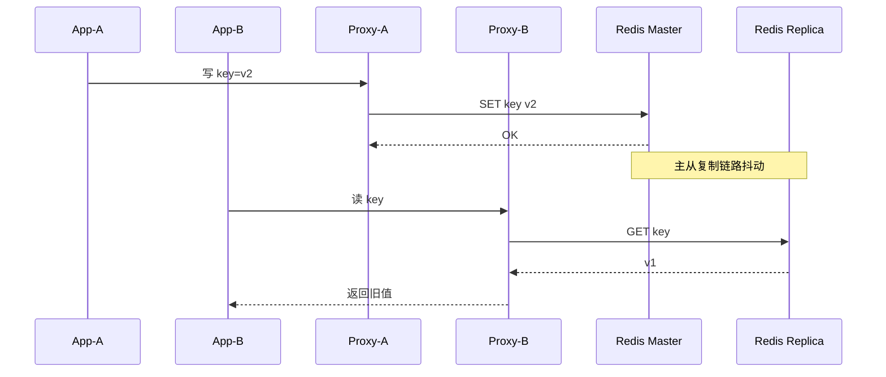
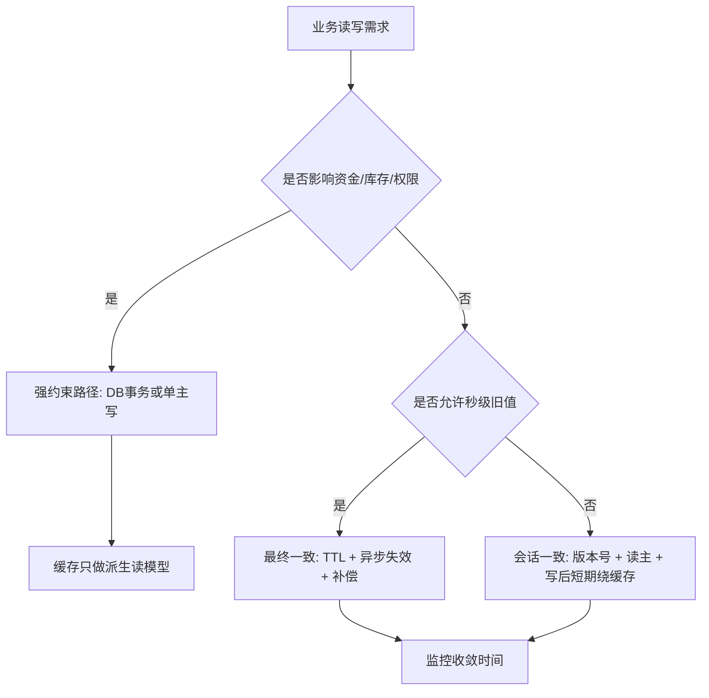
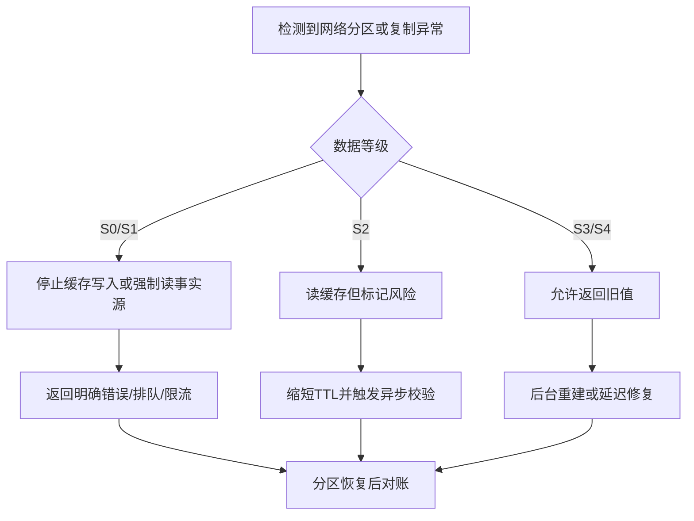

# CAP 与 BASE 在缓存体系中的实践

## 1. 问题背景

缓存系统一开始往往很简单：业务读 Redis，未命中再读数据库，更新时删除缓存。单机房、单集群、小流量时，这套模型看起来足够可靠；一旦系统进入多节点、多可用区、多租户、跨机房的阶段，问题就会变得不那么温顺。

一次网络抖动可能让客户端连接到旧主节点；一次主从切换可能让部分读请求读到旧值；一次跨机房链路中断可能让两个机房都认为自己还能继续提供服务。缓存的核心价值是低延迟和高吞吐，但分布式环境会不断追问：当网络不可信时，你更愿意牺牲一致性，还是牺牲可用性？

CAP、PACELC 和 BASE 不是拿来背概念的，它们更像缓存架构评审时的提问清单。它们帮助我们把“这个缓存到底要多准、多快、多可用”说清楚。

## 2. 核心概念

### CAP：不是简单三选二

CAP 包含三个维度：

- C，Consistency，一致性。所有客户端在同一时刻看到的数据结果一致，常见语义接近线性一致性。
- A，Availability，可用性。每个非故障节点都能在有限时间内响应请求。
- P，Partition tolerance，分区容忍性。网络分区发生时，系统仍然能继续运行。

很多人把 CAP 讲成“只能三选二”，但在缓存体系里更重要的是程度问题。网络分区不是每天发生，但一定要设计；一致性不是只有强一致和不一致，也有读己之写、单调读、会话一致、最终一致；可用性也不是 100% 和 0%，而是 SLA、错误率、P99 延迟和降级能力。

### PACELC：分区之外也有取舍

CAP 主要讨论分区发生时的取舍。PACELC 进一步补了一句：如果发生分区 P，要在 A 和 C 之间选择；否则 Else，要在 Latency 和 Consistency 之间选择。

对缓存系统来说，这个补充特别关键。大多数时间没有网络分区，但我们仍然经常为了低延迟牺牲一致性，例如：

- 读从库换取吞吐，但接受复制延迟。
- 本地缓存加 Redis 多级缓存，接受短时间脏读。
- 写数据库后异步删缓存，接受最终一致窗口。
- 跨地域就近读缓存，接受区域间同步延迟。

### BASE：缓存系统的现实主义

BASE 是 Basically Available、Soft State、Eventually Consistent：

- 基本可用：核心链路继续服务，非核心能力可降级。
- 软状态：系统允许中间状态存在，例如缓存和数据库短时间不一致。
- 最终一致：通过重试、补偿、对账、过期等机制，让系统最终收敛。

缓存天生适合 BASE。它多数时候不是事实源，而是性能层。我们要做的不是追求每个 key 永远强一致，而是明确哪些数据可以最终一致，哪些数据必须走强约束路径。

### 网络分区

网络分区不是“机器挂了”这么简单。它可能表现为：

- 客户端到 Proxy 通，Proxy 到 Redis 不通。
- A 可用区到 B 可用区高延迟，部分连接超时。
- Redis 主从之间复制链路中断，但客户端仍能写主节点。
- 配置中心更新失败，部分 Proxy 使用新路由，部分 Proxy 使用旧路由。
- Kubernetes 节点网络插件异常，Pod 存活但东西向流量异常。

缓存体系设计要假设“节点活着不代表链路可靠，链路偶发成功不代表系统健康”。

## 3. 原理拆解

### 分区下的缓存读写分歧



这个例子里没有节点宕机，只有复制链路延迟。系统可用性很好，但读一致性下降。如果业务是商品详情页，旧值可能可以接受；如果是账户余额、库存扣减、风控状态，就不能把读请求随意打到副本。

### CAP 在缓存场景里的实际含义

| 场景 | 偏向选择 | 结果 | 适用数据 |
|---|---|---|---|
| 主从复制读从库 | A + P，弱 C | 读请求可用，可能读旧值 | 商品、配置展示、Feed 摘要 |
| 分区时拒绝写入 | C + P，弱 A | 避免脑裂写，部分请求失败 | 库存、额度、强权限 |
| 本地缓存兜底 | A + P，弱 C | Redis 故障时继续返回旧数据 | 推荐、榜单、画像标签 |
| 多机房独立写 | A + P，弱全局 C | 两边都能写，恢复后冲突合并 | 点赞计数、行为日志 |
| 单主强路由写 | C + P，弱局部 A | 写路径统一，跨区延迟上升 | 订单状态、账户状态 |

缓存架构里最怕“嘴上说最终一致，代码按强一致写”。比如业务读到缓存就直接做不可逆决策，但缓存更新却依赖异步消息，这就是模型错配。

### 一致性级别拆分



一个实用做法是按业务动作分类，而不是按表分类。同一个用户资料，头像展示可以最终一致，实名认证状态可能需要强一致；同一个商品，标题可以短暂旧值，库存扣减不能旧值驱动。

## 4. 工程取舍

### 什么时候追求强一致

适合强一致或近强一致的缓存场景：

- 缓存结果会直接影响资金、库存、额度、权限。
- 读到旧值会造成不可逆副作用。
- 数据写入频率不高，但正确性优先级极高。
- 业务已经有 DB 事务、状态机或幂等单据作为事实源。

常见做法是让缓存退出决策中心：关键判断读数据库或强一致服务，缓存只做展示加速。必要时使用版本号、CAS、Lua 原子脚本、写后读主、短期绕缓存等方式缩短不一致窗口。

### 什么时候接受最终一致

适合 BASE 的场景：

- 页面展示、推荐结果、排行榜、用户画像、社交计数。
- 数据可通过 TTL 自然修复。
- 业务允许短时间旧值，且有补偿或对账能力。
- 高可用和低延迟比瞬时一致更重要。

最终一致不是“随缘一致”。它至少需要四件事：失效机制、重试机制、观测指标、修复工具。没有修复路径的最终一致，本质上是把脏数据留给用户发现。

### PACELC 下的延迟取舍

| 设计 | 延迟收益 | 一致性代价 | 工程补偿 |
|---|---:|---|---|
| 读本地缓存 | 极高 | 本地副本可能旧 | 短 TTL、失效广播、版本校验 |
| Redis 读从库 | 高 | 主从复制延迟 | 关键读走主、监控 lag |
| 跨机房就近读 | 高 | 区域间同步延迟 | 区域版本、冲突合并 |
| 异步删除缓存 | 中 | 删除失败会脏读 | 消息重试、延迟双删、CDC |
| 批量刷新缓存 | 中 | 刷新期间混合版本 | 灰度版本 key、双读校验 |

缓存越靠近用户，越容易获得低延迟，也越容易偏离事实源。工程上要给每层缓存标注“最大可接受陈旧时间”，比如 L1 本地缓存 1 秒，Redis 30 秒，离线物化视图 5 分钟。

## 5. 实战方案

### 方案一：按一致性等级设计缓存策略

| 等级 | 业务例子 | 缓存策略 | 兜底策略 |
|---|---|---|---|
| S0 强一致 | 余额扣减、库存扣减 | 缓存不做最终决策，只缓存展示结果 | DB/状态机为准，失败即拒绝 |
| S1 会话一致 | 用户刚修改昵称后立刻查看 | 写后删除缓存，当前会话短期读主或绕缓存 | 版本号校验 |
| S2 秒级最终一致 | 商品详情、权限展示副本 | Cache Aside + TTL + 消息失效 | 延迟双删、重试队列 |
| S3 分钟级最终一致 | 榜单、画像、推荐 | 定时刷新、异步物化 | 过期返回旧值、后台重建 |
| S4 可丢弃缓存 | 临时特征、实验分组缓存 | TTL 自动淘汰 | 直接回源或默认值 |

### 方案二：用版本号压住乱序更新

缓存更新链路里，乱序比失败更隐蔽。比如 v3 先写缓存，v2 的延迟消息后到，又把缓存覆盖回旧值。解决思路是把版本带进缓存 value 或 metadata。

```text
cache value = {
  data: {...},
  version: db_update_time 或单调递增版本,
  expireAt: ...
}
```

写缓存前比较版本：只有新版本大于等于旧版本才允许覆盖。Redis 可以用 Lua 保证比较和写入原子化。

### 方案三：分区时的降级决策



分区降级策略要提前写入配置中心，而不是事故发生时临时改代码。对于云原生部署，可以把降级开关做成 ConfigMap 或独立配置服务，Proxy 和业务 SDK 监听配置变更。

### 监控指标

CAP/BASE 相关监控不只看 Redis 是否存活，更要看一致性是否正在失控：

- `cache_hit_rate`：命中率突然下降，可能是批量失效或路由错乱。
- `stale_read_detected_total`：通过版本比对发现的旧读次数。
- `replication_lag_seconds`：主从复制延迟。
- `cache_invalidation_delay_ms`：从 DB 更新到缓存失效完成的延迟。
- `message_retry_backlog`：缓存失效消息积压量。
- `read_from_replica_ratio`：读副本比例，结合 lag 判断风险。
- `partition_detected_total`：Proxy、ClusterManager、存储节点观测到的网络分区次数。
- `consistency_repair_total`：对账修复的 key 数量。

### 架构评审清单

- 这个缓存 key 的事实源是谁？DB、消息日志、还是另一个服务？
- 读到旧值的最大业务损失是什么？能否补偿？
- 写后多久必须被其他用户看到？
- 分区时是拒绝写、继续写、还是只读？
- 主从延迟超过阈值后，客户端是否自动切回主节点？
- 缓存失效消息失败后有没有重试、死信和人工修复入口？
- 是否有版本号或时间戳防止乱序覆盖？
- 多级缓存之间是否定义了最大陈旧时间？
- 灰度发布和扩缩容时，路由配置是否可能出现新旧混用？
- 是否演练过配置中心不可用、Redis 主从断链、Proxy 半数不可用？

## 6. 常见问题

### CAP 是否意味着缓存系统一定不能强一致？

不是。CAP 说的是网络分区时无法同时保证强一致和完全可用。缓存系统可以在关键路径上选择强一致，例如分区时拒绝写入、只读主节点、依赖 DB 事务。但代价是延迟上升或可用性下降。

### Redis Cluster 是 CP 还是 AP？

不能简单贴标签。Redis Cluster 在 slot 归属、主从切换、少数派不可写等方面偏向避免脑裂写；但客户端读取副本、故障转移窗口、异步复制又会带来最终一致问题。具体表现取决于读写路由、复制配置、故障检测阈值和业务降级策略。

### 缓存最终一致需要多久才算合理？

看业务。商品详情可能接受几十秒，权限状态可能只能接受几百毫秒，风控状态可能不接受缓存旧值。建议用“最大可接受陈旧时间”描述，而不是笼统说“最终一致”。

### TTL 能不能解决所有不一致？

TTL 是最后的安全网，不是主要治理手段。TTL 太短会打爆回源，太长会放大脏读窗口。更完整的方案通常是：更新事件失效缓存、失败重试、版本校验、TTL 兜底、定期对账。

## 7. 小结

- CAP 的重点不是背“三选二”，而是在网络分区下明确一致性和可用性的边界。
- PACELC 提醒我们，即使没有分区，也一直在低延迟和一致性之间做选择。
- BASE 很适合缓存体系，但最终一致必须有可观测、可重试、可修复的闭环。
- 缓存数据要按业务动作划分一致性等级，不能按组件一刀切。
- 网络分区可能发生在客户端、Proxy、存储、配置中心、跨机房链路和 Kubernetes 网络层。
- 强一致数据应让缓存退出最终决策，最终一致数据则要控制陈旧窗口。
- 版本号、延迟双删、CDC、消息重试、对账修复，是缓存一致性治理的常用组合。
- 真正可靠的缓存架构，不是永远不出错，而是出错时知道牺牲什么、保护什么、如何恢复。
