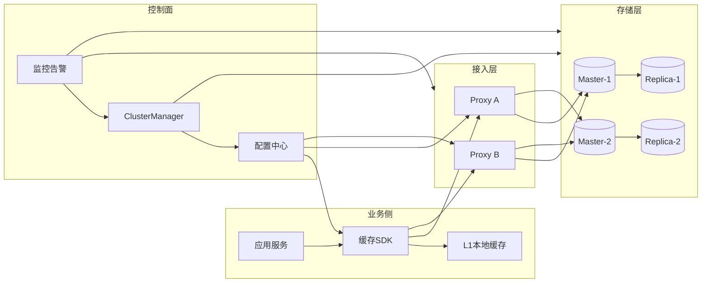
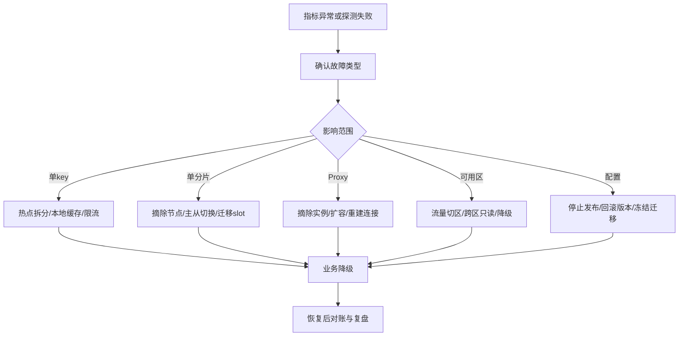
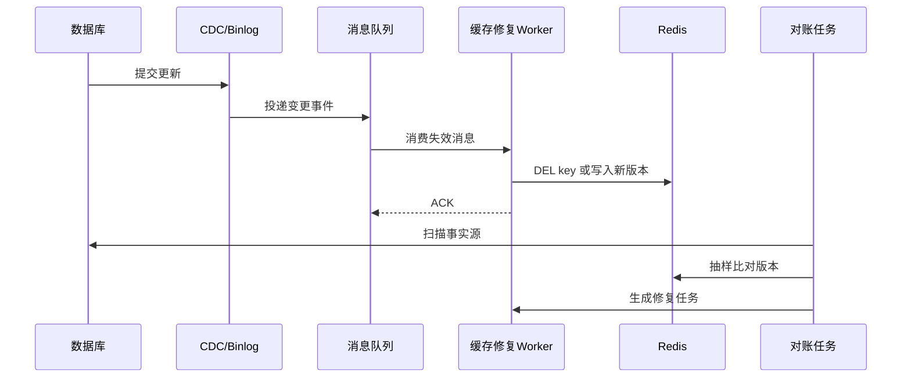
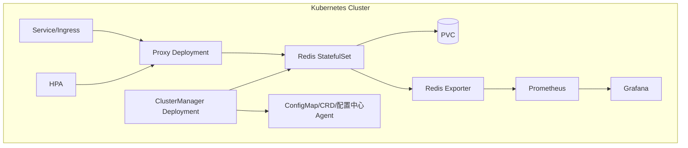

# 可靠分布式缓存体系设计

## 1. 问题背景

当业务规模变大，缓存不再只是“应用旁边的一组 Redis”。它会变成一套基础设施：有 Proxy，有存储集群，有配置中心，有监控告警，有容量治理，有故障切换，有多租户隔离，还要支持扩缩容和灰度发布。

可靠的缓存体系不是追求“永不故障”。在真实生产环境里，节点会宕机，网络会分区，主从会延迟，配置会推错，热点 key 会突然打穿单个分片，Kubernetes 节点也可能因为驱逐或网络插件异常带来抖动。可靠性的核心是：故障被及时发现、影响被限制在小范围、系统能降级服务、恢复后能自动或半自动修复。

这一篇更偏工程视角：如何把 CAP/BASE 的取舍落到一套可以长期运行的分布式缓存体系里。

## 2. 核心概念

### 可靠性不是单点能力

Redis 主从复制、哨兵、Cluster、AOF、RDB 都是可靠性组件，但它们解决的是局部问题。体系化可靠性至少包含：

- 架构可靠：无单点，故障域清晰。
- 数据可靠：可恢复、可重建、可对账。
- 路由可靠：客户端、Proxy、配置中心视图一致。
- 运维可靠：扩缩容、迁移、发布、回滚流程可控。
- 观测可靠：指标、日志、追踪、事件能解释系统状态。
- 组织可靠：演练、预案、权限和变更审批跟得上。

### 分层缓存体系

典型高并发系统不会只有一层缓存：

- L1：进程内缓存，例如 Caffeine、本地 Map、Guava Cache。
- L2：分布式缓存，例如 Redis、Memcached。
- L3：跨机房或持久化缓存，例如 Pika、Tair、SSD KV、物化视图。
- 回源层：数据库、搜索引擎、对象存储、下游服务。

层数越多，命中率和可用性越好，但一致性和排障复杂度也会上升。

### 故障域

故障域是“一个故障最多影响多大范围”。可靠缓存设计要避免一个租户、一个 key、一个机房、一次发布拖垮全局。常见故障域包括：

- 单 key：Hot Key、Big Key。
- 单分片：slot 倾斜、慢命令阻塞。
- 单 Proxy：连接耗尽、CPU 打满。
- 单可用区：机房网络或电力问题。
- 单租户：流量突增、错误批量删除。
- 单配置版本：路由发布错误。

### 云原生部署思路

Kubernetes 适合承载缓存周边服务，例如 Proxy、ClusterManager、Exporter、配置控制面；存储节点是否放在 Kubernetes 内，需要看团队对网络、磁盘、调度和故障恢复的掌控程度。

常见模式：

- Proxy 无状态化，用 Deployment + HPA 扩缩容。
- Redis 存储用 StatefulSet + PVC，或者使用云厂商托管 Redis。
- ClusterManager 独立部署，负责拓扑、迁移、故障流程编排。
- 配置中心使用 etcd、Consul、Nacos、ZooKeeper 或云配置服务。
- 监控使用 Prometheus + Grafana + Alertmanager，日志进入 Loki/ELK。

## 3. 原理拆解

### 可靠缓存体系的基本拓扑

这里要特别区分数据面和控制面。数据面负责请求转发和读写，要求低延迟、高吞吐；控制面负责拓扑、配置、迁移、故障切换，要求正确性、可审计和可回滚。把两者混在一起，常见后果是一次控制面抖动直接影响所有线上请求。

### 故障处理闭环

这个流程里最重要的不是“自动化越多越好”，而是每个动作都要可解释。比如自动主从切换可以很快恢复可用性，但如果业务依赖强一致，切换窗口里的数据丢失风险必须被记录、告警和补偿。

### 最终一致修复链路

缓存失效消息可能丢、可能乱序、可能重复。可靠设计要把这些情况当成正常输入：消息必须幂等，更新必须带版本，失败必须进重试或死信，对账任务负责兜底。

## 4. 工程取舍

### Proxy 模式和 Smart Client 模式

| 模式 | 优点 | 代价 | 适用场景 |
|---|---|---|---|
| Proxy | 业务接入简单，路由集中，便于多语言统一治理 | 多一跳延迟，Proxy 本身要高可用 | 多语言、多租户、平台化缓存服务 |
| Smart Client | 少一跳，性能好，客户端直连存储 | SDK 复杂，升级困难，语言栈多时代价高 | 单语言体系、团队能统一客户端 |
| 混合模式 | 核心链路可直连，普通业务走 Proxy | 治理模型更复杂 | 大型公司缓存平台 |

Proxy 不只是转发器。成熟 Proxy 还会承担限流、熔断、认证、路由热更新、慢请求隔离、热点识别、协议转换和指标上报。

### 可用性和一致性的平衡

可靠缓存体系通常不是全局统一策略，而是按租户、业务、key 前缀、命令类型分级：

- 强一致租户：分区时拒绝写，关键读走主，扩缩容窗口更保守。
- 高可用租户：允许读旧值，故障时返回本地缓存或默认值。
- 高吞吐租户：允许批量、pipeline、异步刷新，限制强事务语义。
- 低成本租户：共享实例，弱 SLA，容量和 QPS 有硬配额。

### 多租户隔离

多租户要隔离的不只是 key 命名空间，还包括：

- 容量：内存配额、Big Key 限制、淘汰策略隔离。
- 性能：QPS、连接数、pipeline 深度、慢命令限制。
- 权限：命令白名单、ACL、只读账号、危险命令禁用。
- SLA：不同租户不同副本数、不同故障恢复目标。
- 变更：租户级迁移、灰度、回滚，不影响其他租户。

如果只靠 key prefix 做隔离，一个租户的热 key 就可能把共享分片打满，导致其他租户一起超时。

### 扩缩容取舍

扩容可以解决容量和吞吐问题，但会引入迁移风险：

- 迁移期间可能出现双写、读旧路由、slot 锁定。
- 大 key 迁移会阻塞网络和事件循环。
- Proxy 与配置中心的路由版本如果不一致，会出现请求打错分片。
- 缩容比扩容更危险，因为它通常伴随数据搬迁和资源回收。

实践上，扩缩容要有速率限制、批次控制、回滚点和迁移观测指标。不要在业务高峰做大规模 slot 迁移。

## 5. 实战方案

### 可靠缓存平台能力清单

| 能力 | 最小可用版本 | 成熟版本 |
|---|---|---|
| 路由管理 | 静态配置 + 手动发布 | 版本化路由 + 灰度 + 自动回滚 |
| 故障切换 | 人工主从切换 | 自动探测 + 仲裁 + 事件审计 |
| 扩缩容 | 手工迁移 slot | 分批迁移 + 限速 + 热点感知 |
| 多租户 | key prefix 隔离 | 独立配额、ACL、限流、SLA |
| 可观测性 | Redis Exporter 基础指标 | 数据面、控制面、业务一致性指标 |
| 故障演练 | 偶尔手工演练 | 周期性 GameDay + 自动化注入 |
| 数据修复 | TTL 兜底 | CDC、重试、死信、对账修复 |

### Kubernetes 部署建议

落地建议：

- Proxy 使用无状态 Deployment，开启 PodDisruptionBudget，避免升级时实例被同时驱逐。
- Redis 如果部署在 K8s 内，使用 StatefulSet、反亲和、固定存储卷和拓扑分布约束。
- 主从不要调度到同一节点或同一可用区。
- 给 Redis Pod 设置合理的 `requests` 和 `limits`，避免 CPU 抢占导致延迟尖刺。
- 慎用自动垂直扩容，Redis 内存和 fork 行为对资源变化敏感。
- 控制面变更使用 CRD 或版本化配置，所有拓扑变化可审计。
- 关键集群可以选择云托管 Redis，K8s 只承载 Proxy、监控和运维控制面。

### 故障演练清单

- Redis Master 宕机：验证故障检测、主从切换、客户端路由刷新、数据丢失窗口。
- Replica 延迟升高：验证读从降级、关键读切主、告警阈值。
- Proxy 半数不可用：验证负载均衡摘除、连接重建、HPA 扩容。
- 配置中心不可用：验证 Proxy 是否使用本地快照继续服务。
- 错误路由发布：验证灰度发布、回滚、版本冻结。
- 热 key 爆发：验证热点发现、本地缓存、请求合并、租户限流。
- Big Key 迁移：验证迁移限速、慢查询、网络出口水位。
- 跨可用区网络分区：验证切区、只读模式、恢复后对账。

### 监控指标

数据面指标：

- 请求量、错误率、P50/P95/P99/P999 延迟。
- 命中率、回源量、空值命中率。
- 慢命令数、阻塞客户端数、连接数。
- 内存使用率、碎片率、淘汰 key 数、过期 key 数。
- 网络入出流量、pipeline 深度、客户端输出缓冲区。

控制面指标：

- 路由版本分布，是否存在多版本长期共存。
- slot 迁移进度、迁移失败次数、迁移耗时。
- 主从切换次数、切换耗时、仲裁失败次数。
- 配置发布成功率、回滚次数。
- ClusterManager 任务队列积压。

一致性指标：

- 主从复制延迟。
- 缓存失效消息延迟。
- 对账差异率。
- 修复任务成功率。
- 旧版本覆盖拦截次数。

### 架构评审清单

- 是否定义了缓存服务的 RTO 和 RPO？
- Proxy、配置中心、ClusterManager、监控系统是否存在单点？
- 路由配置是否版本化，是否支持灰度和回滚？
- 多租户是否隔离容量、QPS、连接数、命令权限和 SLA？
- 扩缩容是否支持限速、暂停、回滚和迁移校验？
- 故障切换是否有仲裁机制，如何避免脑裂？
- Redis 持久化策略是否和业务数据恢复目标一致？
- 数据修复是否具备 CDC、重试、死信、对账闭环？
- Kubernetes 部署是否考虑反亲和、PDB、资源限制和驱逐策略？
- 是否定期做故障演练，并把演练结果转成阈值和自动化动作？

## 6. 常见问题

### 有了 Redis Cluster，还需要 Proxy 吗？

不一定。Redis Cluster 已经提供 slot 分片、重定向和故障转移能力。如果业务语言统一、客户端能力强、治理要求不复杂，可以直接使用 Cluster 客户端。但在多语言、多租户、统一限流、权限、监控、迁移平台化的场景里，Proxy 可以显著降低业务接入和治理成本。

### AOF 开 always 就一定更可靠吗？

不一定。`appendfsync always` 可以缩小数据丢失窗口，但会显著增加写延迟和磁盘压力。缓存多数不是事实源，常见策略是 `everysec` 或关闭持久化，依赖数据库和 CDC 重建。关键是明确 RPO：故障时最多允许丢多少缓存数据。

### 多副本是不是越多越好？

副本越多，读扩展和容灾越好，但复制链路、内存成本、故障切换复杂度都会增加。对于强一致读，副本多也不能自动解决旧读问题。副本数应由 SLA、读流量、可用区容灾和成本共同决定。

### 为什么配置中心是缓存体系的风险点？

缓存路由依赖配置中心。一旦配置中心不可用，新 Proxy 可能无法启动，路由变更无法发布；如果配置错误，影响范围可能比单个 Redis 故障更大。成熟系统要让 Proxy 持有本地快照，并让配置发布具备灰度、校验和回滚。

## 7. 小结

- 可靠缓存体系是数据面、控制面、运维面、观测面共同作用的结果。
- Proxy、存储节点、配置中心、ClusterManager、监控系统要各司其职，避免控制面抖动拖垮数据面。
- 多租户隔离要覆盖容量、性能、权限、SLA 和变更流程。
- 扩缩容不是简单加机器，核心难点是迁移过程中的路由一致性、限速和回滚。
- Kubernetes 可以提升部署效率，但 Redis 存储层要谨慎处理调度、磁盘、网络和资源限制。
- 故障演练要覆盖节点、Proxy、配置、网络、热点、大 key 和跨可用区分区。
- 缓存可靠性最终要落到指标：延迟、错误率、复制延迟、路由版本、迁移状态和一致性差异。
- 好的缓存平台不是让业务永远感觉不到故障，而是把故障变小、变短、变得可恢复。
