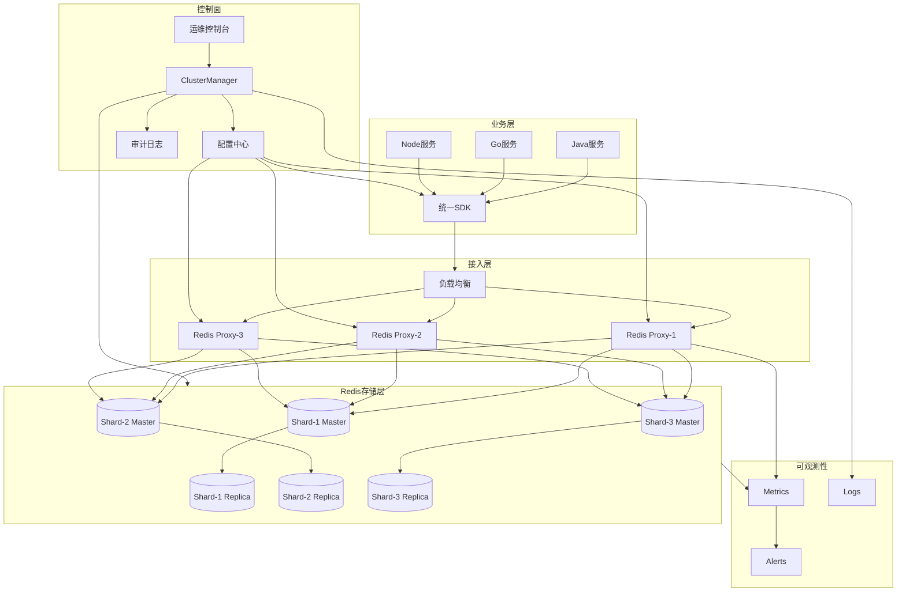
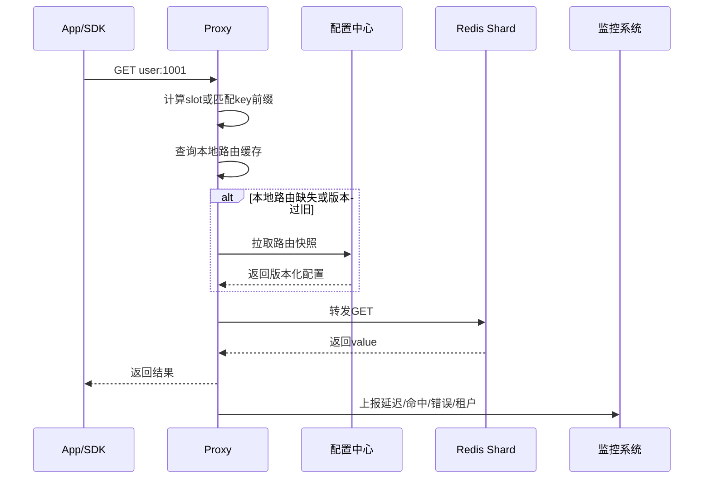
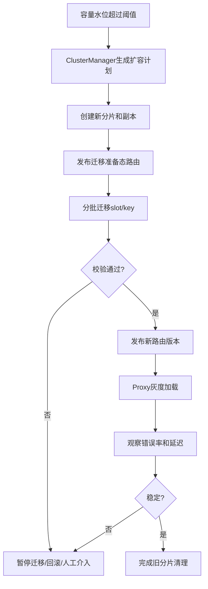
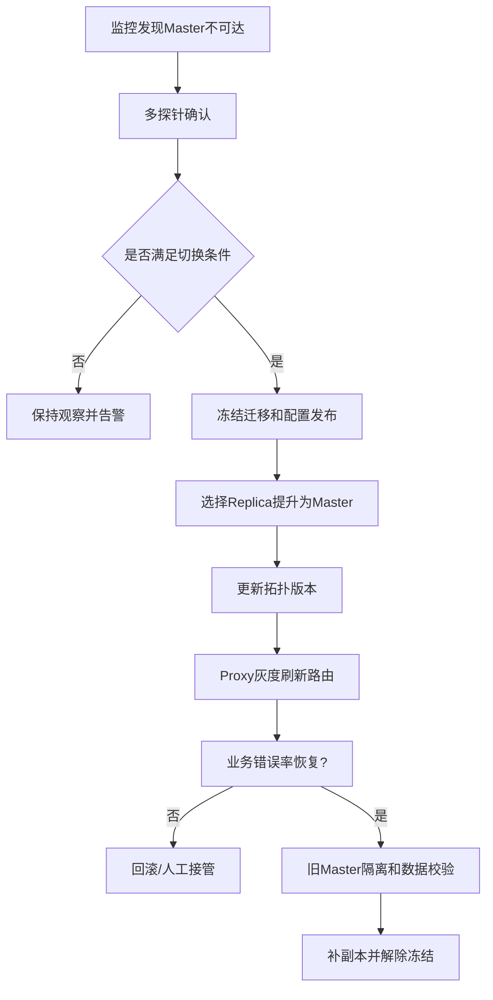

# 典型分布式 Redis 服务架构

## 1. 问题背景

很多团队从“申请一个 Redis 实例”开始，慢慢走向“建设一套 Redis 服务平台”。这个变化背后不是技术炫技，而是业务规模带来的必然要求：实例越来越多，租户越来越多，语言栈越来越杂，扩容迁移越来越频繁，线上故障也越来越需要标准化处理。

典型分布式 Redis 服务不只是 Redis Cluster。它通常由 Proxy、Redis 存储节点、配置中心、ClusterManager、监控告警、运维控制台、审计系统和客户端 SDK 组成。它的目标是让业务像使用一个稳定服务一样使用 Redis，同时让平台侧可以治理容量、性能、故障、权限和成本。

这一篇拆一个可落地的 Redis 服务架构，重点不在“某个开源项目怎么安装”，而在每个组件为什么存在、承担什么边界、工程上要怎么取舍。

## 2. 核心概念

### Proxy

Proxy 是 Redis 服务平台的数据接入层。它通常负责：

- 根据 key 或 slot 路由到正确 Redis 分片。
- 维护到后端 Redis 的连接池。
- 屏蔽后端拓扑变化，降低客户端复杂度。
- 提供认证、限流、熔断、命令白名单。
- 采集请求指标，识别慢请求、热 key、大 value。
- 在迁移期间处理双读、重定向或临时路由。

Proxy 的挑战是低延迟和高稳定性。它多一跳网络，但换来治理能力；如果 Proxy 做得太重，就会成为新的瓶颈。

### 存储节点

存储层由 Redis Master、Replica 或 Redis Cluster 分片组成。它承担真正的数据读写，关注点包括：

- 分片策略：slot、hash tag、一致性哈希或业务分库。
- 高可用：主从复制、故障转移、跨可用区部署。
- 持久化：RDB、AOF、混合持久化，或完全依赖回源重建。
- 内存治理：maxmemory、淘汰策略、Big Key、碎片率。
- 性能治理：慢命令、Lua 执行时间、pipeline、连接数。

### 配置中心

配置中心保存 Redis 服务的拓扑和策略，例如：

- 租户到集群的映射。
- key 前缀或 slot 到分片的路由。
- Proxy 后端列表。
- 权限、限流、超时、降级策略。
- 配置版本和灰度状态。

配置中心是控制面核心。它不应该参与每次请求，但它决定每次请求会被转发到哪里。

### ClusterManager

ClusterManager 是缓存平台的大脑，负责任务编排：

- 创建实例、扩容、缩容、迁移。
- 主从切换、故障摘除、恢复加入。
- 路由版本生成和发布。
- 容量水位巡检。
- 迁移进度校验和数据一致性检查。
- 调用 Kubernetes、云 API 或物理机管控系统。

### 监控与审计

监控系统回答“现在是否健康”，审计系统回答“谁在什么时候做了什么变更”。Redis 服务平台必须同时具备这两种能力。没有审计的自动化，出了事故很难复盘；没有监控的自动化，只是在更快地扩大影响。

## 3. 原理拆解

### 总体架构

这张图里，业务请求路径尽量短：App -> SDK -> LB/Proxy -> Redis。控制面不在请求链路上，避免配置中心或 ClusterManager 抖动直接放大到业务延迟。

### 请求路由流程

Proxy 拉取配置不能成为同步瓶颈。成熟实现一般会在启动时加载完整快照，运行中异步监听变更；如果配置中心短暂不可用，Proxy 继续使用最后一个已知安全版本。

### 扩容迁移流程

迁移流程要有状态机。最危险的是“脚本跑到一半失败，但系统不知道当前处于什么阶段”。ClusterManager 应该记录每个任务的阶段、输入、输出、操作者、耗时和回滚方式。

## 4. 工程取舍

### Redis Cluster、Codis、自研 Proxy 怎么选

| 方案 | 优点 | 代价 | 适合场景 |
|---|---|---|---|
| Redis Cluster | 原生支持，生态成熟，无额外 Proxy | 客户端要理解重定向和拓扑，治理能力分散 | 中小规模、客户端统一 |
| Codis/类 Codis | Proxy 屏蔽分片，迁移能力成熟 | 项目版本和生态需要评估，功能受实现限制 | 存量 Proxy 架构、传统 Redis 服务化 |
| 自研 Proxy | 治理能力最贴合业务，多租户能力强 | 研发和运维成本高，稳定性压力大 | 大规模、多语言、多租户平台 |
| 云 Redis | 运维成本低，SLA 清晰 | 可定制性有限，成本和厂商绑定 | 团队规模有限或核心诉求是稳定交付 |

选择时不要只看 QPS。更关键的问题是：谁负责路由一致性？谁负责故障切换？谁负责扩容迁移？谁负责权限和审计？谁为故障兜底？

### Proxy 做薄还是做厚

薄 Proxy 只做路由和连接复用，延迟低、稳定性好；厚 Proxy 增加限流、熔断、热点识别、协议兼容、读写分离、租户治理，平台能力强但风险也更集中。

一个比较稳妥的边界是：Proxy 可以做请求级治理，不应该承载复杂业务语义。比如可以按租户限流，不要在 Proxy 里理解订单状态；可以识别 hot key，不要在 Proxy 里决定业务降级文案。

### 多租户模型

常见多租户隔离方式：

- 共享集群 + key prefix：成本低，隔离弱。
- 共享物理资源 + 独立逻辑 DB 或 namespace：接入简单，但 Redis 逻辑库在 Cluster 场景受限。
- 独立实例：隔离强，成本高。
- 独立 Proxy 入口 + 后端共享分片：治理较灵活。
- 独立集群：适合高 SLA 或高风险业务。

平台可以按租户等级提供套餐：基础共享、独享实例、高可用跨区、强治理白金版。听起来有点像云产品，但内部平台本来就需要成本和 SLA 对齐。

### 云原生部署取舍

云原生不是把所有 Redis 进程塞进 Kubernetes 就结束了。Redis 对延迟、内存和磁盘 I/O 敏感，要关注：

- Pod 重调度是否会导致主从同时受影响。
- PVC 性能是否满足 AOF rewrite 和 RDB fork。
- CNI 抖动是否会制造假分区。
- HPA 是否只扩 Proxy，而不是盲目扩存储。
- 节点驱逐、滚动升级是否遵守 PDB 和拓扑约束。
- 监控是否能区分 Pod、Node、Redis、Proxy 四层问题。

对很多团队来说，混合架构更现实：Redis 存储用云托管或专用节点，Proxy、控制面和监控跑在 Kubernetes 中。

## 5. 实战方案

### 组件职责边界

| 组件 | 职责 | 不建议承担 |
|---|---|---|
| SDK | 超时、重试、连接、基础路由感知、本地缓存 | 复杂迁移逻辑、平台策略硬编码 |
| Proxy | 路由、连接池、限流、认证、指标、热点识别 | 业务语义、长事务、复杂计算 |
| Redis | 数据存储、过期、淘汰、复制、原子命令 | 跨 key 强事务、大规模离线计算 |
| 配置中心 | 版本化配置、订阅通知、本地快照 | 高频请求链路、复杂任务编排 |
| ClusterManager | 扩缩容、迁移、故障切换、巡检 | 直接承载业务读写流量 |
| 监控系统 | 指标、日志、告警、看板、SLO | 替代故障预案 |

### 租户接入流程

这个流程的价值是把“谁能用多少资源、能执行什么命令、出了问题谁告警”前置。很多缓存事故不是 Redis 技术问题，而是接入时没有定义边界。

### 故障处理流程：主节点异常

切换前要确认“故障”不是监控单点误判。常见做法是多探针、多可用区、多角色投票，避免把健康主节点误切掉。

### 监控指标模板

Proxy 指标：

- `proxy_qps{tenant,cmd}`：按租户和命令统计 QPS。
- `proxy_latency_p99{tenant}`：租户级 P99 延迟。
- `proxy_backend_error_total`：后端 Redis 错误数。
- `proxy_route_version{instance}`：各 Proxy 加载的路由版本。
- `proxy_rate_limited_total{tenant}`：限流次数。
- `proxy_hotkey_detected_total`：热点 key 识别次数。

Redis 指标：

- `redis_used_memory_ratio`：内存使用率。
- `redis_mem_fragmentation_ratio`：内存碎片率。
- `redis_evicted_keys_total`：淘汰 key 数。
- `redis_expired_keys_total`：过期 key 数。
- `redis_connected_clients`：客户端连接数。
- `redis_blocked_clients`：阻塞客户端数。
- `redis_master_link_down_since_seconds`：复制链路异常时间。
- `redis_instantaneous_ops_per_sec`：实例 OPS。
- `redis_slowlog_len`：慢日志长度。

控制面指标：

- `cluster_task_pending_total`：待执行任务数。
- `cluster_migration_speed_bytes`：迁移速率。
- `cluster_failover_total`：故障切换次数。
- `config_publish_failed_total`：配置发布失败次数。
- `route_version_skew_seconds`：路由版本分裂持续时间。

### 架构评审清单

- 请求链路上是否依赖配置中心实时响应？
- Proxy 是否无状态，是否支持横向扩容和滚动升级？
- 后端 Redis 主从是否跨节点、跨可用区部署？
- 租户是否有明确的容量、QPS、连接数和命令权限限制？
- 是否支持危险命令禁用，例如 `KEYS`、`FLUSHALL`、大范围 `SCAN` 滥用治理？
- 扩容迁移是否有任务状态机、限速、校验和回滚？
- 路由发布是否灰度，Proxy 路由版本是否可观测？
- 监控能否按租户、命令、分片、Proxy 维度下钻？
- 故障切换是否冻结其他变更，避免多个控制面任务交叉？
- Kubernetes 或云部署是否定义 PDB、反亲和、资源请求和节点维护策略？

## 6. 常见问题

### Proxy 会不会成为性能瓶颈？

会，所以 Proxy 要保持数据路径简单，尽量无状态，可水平扩展。性能设计上要关注连接复用、批量转发、事件模型、零拷贝或少拷贝、指标异步上报。平台侧要给 Proxy 本身做容量规划，而不是只规划 Redis 节点。

### 为什么不让业务直接连 Redis Cluster？

可以直接连，特别是语言栈统一、规模可控、客户端质量高的团队。但当业务很多、客户端版本不一、需要统一限流审计、多租户隔离和迁移透明时，Proxy 的治理价值会超过那一跳延迟成本。

### 配置中心挂了，Redis 服务还能用吗？

应该能用。Proxy 和 SDK 都应缓存最后一次成功加载的路由快照。配置中心故障期间，禁止高风险变更，已有请求继续按旧配置服务。等配置中心恢复后，再做版本校验和补偿发布。

### 扩容时为什么会出现短暂错误？

通常来自路由版本不一致、迁移中的 key 被读写、客户端连接未刷新、或者大 key 迁移阻塞。解决办法是迁移状态机、双读校验、迁移限速、Proxy 灰度加载新路由，以及迁移期间对大 key 做专项处理。

### Redis 服务平台是否必须自研？

不必须。云 Redis、Redis Cluster、开源 Proxy、商业缓存产品都可以满足不同阶段需求。自研适合治理诉求很强、规模足够大、团队有长期维护能力的场景。架构设计的关键不是自研与否，而是组件边界、故障流程和可观测性是否完整。

## 7. 小结

- 典型分布式 Redis 服务由 SDK、Proxy、Redis 存储、配置中心、ClusterManager、监控审计共同组成。
- 数据面要短、稳、可扩展；控制面要正确、可审计、可回滚。
- Proxy 的核心价值是屏蔽拓扑、统一治理和多租户接入，但必须控制复杂度。
- 配置中心要版本化，Proxy 和 SDK 要能使用本地快照继续服务。
- ClusterManager 要把扩缩容、迁移、故障切换做成状态机，而不是一次性脚本。
- 多租户治理要覆盖资源、权限、SLA、成本和变更边界。
- 云原生部署适合承载 Proxy 和控制面，Redis 存储层需要更谨慎地评估网络、磁盘和调度。
- 一个成熟 Redis 服务平台的标志，是业务能简单接入，平台能精细治理，故障能被快速限制和恢复。
