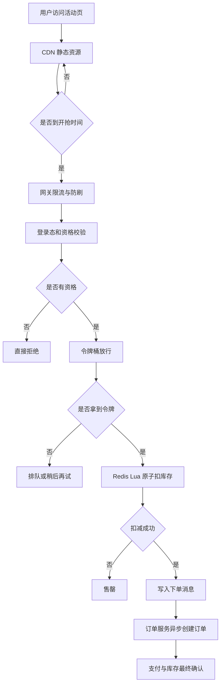

# 秒杀系统缓存设计：把请求挡在上游

## 1. 问题背景

秒杀系统最难的地方，不是把一个下单接口写出来，而是在极短时间内承受远超日常峰值的访问，并且仍然保证库存不超卖、订单不重复、用户体验可控。

一个典型秒杀活动会同时面对几类压力：商品详情页被反复刷新，开抢瞬间按钮被集中点击，库存扣减接口被并发冲击，订单系统和支付系统被洪峰拖垮。数据库如果直接暴露在这个链路里，基本等于让核心资产站在流量风口上。

所以秒杀缓存设计的核心目标不是“让 Redis 替代数据库”，而是分层拦截：静态流量尽量留在 CDN，非法流量尽量留在网关，非资格用户尽量留在业务前置校验，真实抢购请求再进入 Redis 原子扣减，最终通过队列异步创建订单。

## 2. 核心概念

### CDN 静态化

商品介绍、活动规则、图片、倒计时脚本等内容尽量静态化并推到 CDN。活动开始前预热 CDN，降低源站压力。动态信息只保留必要字段，例如用户是否登录、是否有资格、当前是否售罄。

### 资格校验

秒杀不是所有请求都应该进入扣库存阶段。资格校验可以包含登录态、风控结果、活动报名、地域限制、会员等级、限购记录、设备指纹等。它的价值是把“明显不该参与的人”提前挡住。

### 库存缓存

活动库存通常预加载到 Redis。扣减库存必须是原子操作，常见方案是 Lua 脚本一次性完成库存判断、扣减、用户幂等记录和返回结果。

### 令牌桶与排队

令牌桶用于把进入后端的请求速率控制在系统可承受范围内；排队用于削峰填谷，把瞬时并发变成消息队列中的有序消费。

### 异步下单与幂等

Redis 扣减成功不等于订单创建成功。更稳的做法是扣减成功后写入消息队列，由订单服务异步消费。订单服务需要用业务唯一键保证幂等，例如 `activityId + skuId + userId`。

## 3. 原理拆解

秒杀链路可以看成一条不断“缩流”的管道。



Lua 扣库存脚本的职责不宜过重，但关键原子性要放在里面。

```lua
-- KEYS[1] = stock key
-- KEYS[2] = user purchased set key
-- ARGV[1] = userId
-- ARGV[2] = requestId

if redis.call("SISMEMBER", KEYS[2], ARGV[1]) == 1 then
  return {err = "DUPLICATE"}
end

local stock = tonumber(redis.call("GET", KEYS[1]) or "0")
if stock <= 0 then
  return {err = "SOLD_OUT"}
end

redis.call("DECR", KEYS[1])
redis.call("SADD", KEYS[2], ARGV[1])
return {ok = "SUCCESS"}
```

这里有几个细节：

- `SISMEMBER + DECR + SADD` 必须在同一个 Lua 脚本里执行，避免并发穿透。
- 用户购买记录不能只依赖订单表，因为订单创建是异步的，扣减阶段需要先占位。
- `requestId` 可以用于日志追踪和重复请求识别，但真正业务幂等仍应以用户和商品维度为准。

## 4. 工程取舍

秒杀系统没有绝对完美，只有明确取舍。

| 方案 | 收益 | 代价 | 适用场景 |
|---|---|---|---|
| CDN 静态化 | 极大降低源站请求 | 动态信息表达能力弱 | 活动页、规则页、商品素材 |
| 前置资格校验 | 减少无效扣库存请求 | 资格数据要提前准备 | 报名制、会员制、限购活动 |
| Redis 预扣库存 | 高并发下保证原子扣减 | 需要补偿和对账 | 库存有限、并发极高 |
| MQ 异步下单 | 削峰，保护订单系统 | 用户需要等待结果 | 下单链路复杂、支付后置 |
| 排队页 | 体验可控，保护系统 | 实时性下降 | 大促活动、热点商品 |
| 严格同步下单 | 语义简单 | 高峰容易拖垮 DB | 小规模活动、低并发商品 |

库存一致性也要取舍。秒杀链路一般优先防超卖，允许短时间少卖。因为超卖会带来履约和资损问题，少卖可以通过库存回补、订单超时释放来修复。

## 5. 实战方案

### 活动开始前

- 静态资源上传 CDN，并完成预热。
- 活动配置、商品基础信息、库存数量加载到 Redis。
- 资格名单写入 Redis Set、Bitmap 或布隆过滤器。
- 设置活动开关：未开始、进行中、已售罄、已结束。
- 压测网关、Redis、MQ、订单消费能力，并预估令牌发放速率。

### 抢购请求处理

```text
1. 网关校验基本参数、登录态、签名和时间窗口。
2. 风控识别异常 IP、设备、账号和请求频率。
3. 校验活动状态，未开始或已售罄直接返回。
4. 校验用户资格，非目标用户直接拒绝。
5. 令牌桶放行，超过速率进入排队或失败提示。
6. Redis Lua 原子扣减库存并写入用户占位记录。
7. 扣减成功后发送下单消息。
8. 订单服务用唯一键幂等创建订单。
9. 支付超时或订单失败时释放库存并写补偿事件。
```

### 幂等设计

幂等至少要覆盖三层：

- 请求层：同一个 `requestId` 短时间内只处理一次。
- 业务层：同一用户对同一活动商品只能成功一次。
- 消费层：订单服务消费 MQ 消息时用唯一索引防止重复建单。

订单表可以建立唯一键：

```sql
UNIQUE KEY uk_activity_sku_user(activity_id, sku_id, user_id)
```

即使 MQ 重投、服务重启、消费者重复消费，数据库唯一键仍然是最后一道防线。

### 防刷设计

防刷不能只靠一个限流器。更稳的做法是分层治理：

- CDN 层限制异常 User-Agent 和来源。
- 网关层按 IP、账号、设备、活动维度限流。
- 业务层校验一次性令牌、时间戳、签名和资格。
- Redis 层使用短 TTL 计数器记录请求频率。
- 风控层对异常设备、代理 IP、批量账号做动态封禁。

### 监控指标

秒杀活动期间建议盯这些指标：

| 指标 | 关注点 |
|---|---|
| CDN 命中率 | 静态化是否真正挡住流量 |
| 网关 QPS / 拒绝率 | 防刷和限流是否生效 |
| 资格校验通过率 | 是否有异常流量进入核心链路 |
| Redis P99 延迟 | Lua 脚本是否阻塞，实例是否过载 |
| 扣减成功数 / 失败数 | 库存消耗是否符合预期 |
| MQ 堆积量 | 订单系统消费能力是否足够 |
| 订单创建成功率 | 异步链路是否稳定 |
| 支付超时释放量 | 是否需要库存回补 |

### 可运行示例：Redis Lua 扣库存

本系列的示例工程提供了一版 Spring Boot + Redis Lua 秒杀扣库存实现：

```text
examples/spring-boot-redis-cache-lab/
```

Lua 脚本在一次 Redis 原子执行中完成三件事：

- 判断用户是否已经抢购成功，避免重复下单。
- 判断库存是否大于 0，避免超卖。
- 扣减库存、记录用户、写入 Redis Stream 订单事件。

启动：

```bash
cd examples/spring-boot-redis-cache-lab
docker compose up --build
```

准备库存并压测：

```powershell
curl -X POST "http://localhost:8080/api/seckill/1001/prepare?stock=1000"
.\scripts\bench-seckill.ps1 -ActivityId 1001 -Requests 2000 -Concurrency 100
curl http://localhost:8080/api/seckill/1001/stock
```

结果校验重点：

- `SUCCESS` 数量不应超过初始库存。
- `SUCCESS + Remaining Stock` 应等于初始库存。
- 相同用户重复请求应返回 `DUPLICATED`。
- P99 延迟不能只看平均值，Lua 脚本过长会拖住 Redis 主线程。

示例工程附带 `docs/benchmark-results.md` 作为压测结果模板。当前环境没有实际跑通容器和压测，所以文档里只提供可复现实验步骤，不写未验证的结果数值。

## 6. 常见问题

### Redis 扣减成功，但订单创建失败怎么办？

需要补偿机制。订单创建失败后发送库存释放事件，或者由对账任务扫描“已扣减但无订单”的记录进行回补。注意回补也要幂等，避免重复加库存。

### 为什么不直接用数据库扣库存？

数据库行锁在低并发下很可靠，但秒杀高峰会让热点库存行成为瓶颈。Redis 更适合做高并发预扣，数据库负责最终订单和资金语义。

### Lua 脚本会不会成为瓶颈？

会。Lua 是原子执行，脚本过长会阻塞 Redis 主线程。脚本里只做必要判断和写入，不做复杂计算，不扫大集合，不返回大结果。

### 如何防止超卖？

核心是库存判断和扣减必须原子化，订单创建必须幂等化。Redis Lua 防止缓存层超卖，数据库唯一键和最终库存校验防止订单层重复履约。

### 如何处理少卖？

少卖通常来自订单失败、支付超时、风控误杀、消息消费失败。可以通过库存回补、延迟队列、对账任务修复。秒杀更怕超卖，少卖可以接受但要可观测。

## 7. 小结

- 秒杀缓存设计的第一原则是上游拦截，越靠前挡住流量，系统越稳。
- CDN 静态化解决页面访问洪峰，不能让活动页请求全部打到源站。
- 资格校验、风控、防刷、令牌桶共同减少无效抢购请求。
- 库存扣减要用 Redis Lua 或等价原子机制，避免并发超卖。
- 异步下单能削峰，但必须配套幂等、补偿和对账。
- 秒杀系统优先防超卖，允许短时间少卖，并通过回补修复。
- 真正的秒杀稳定性来自全链路设计，不是某一个 Redis 命令。
