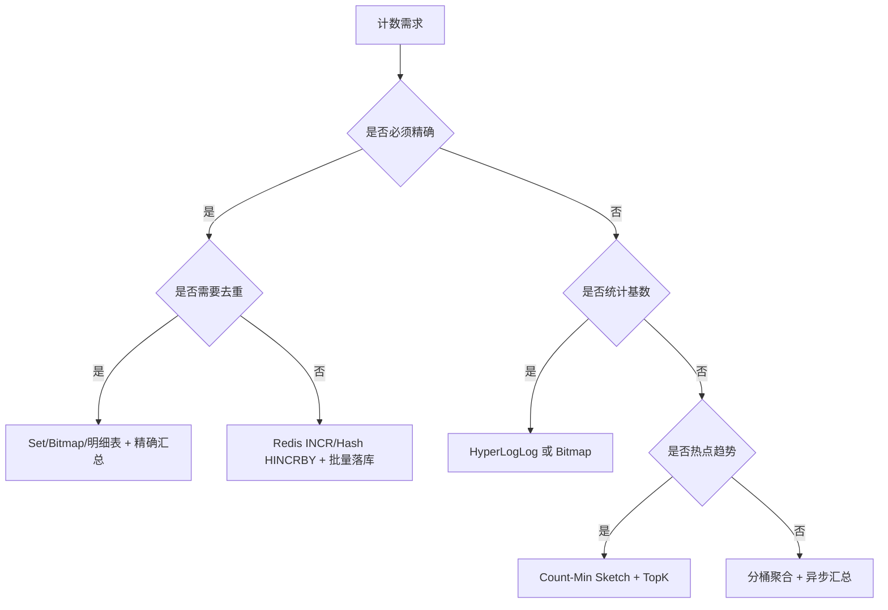
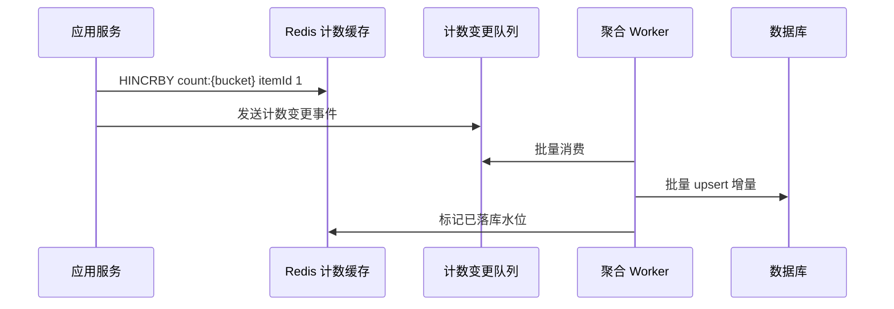

# 海量计数缓存架构：精确、近似与成本之间的平衡

## 1. 问题背景

点赞数、浏览数、播放数、收藏数、评论数、粉丝数、在线人数，这些看起来只是一个数字，但在大规模系统里往往是最容易被低估的基础能力。

计数服务的难点有三个：第一，写入频率高，热点内容可能每秒增长成千上万次；第二，读取范围广，列表页、详情页、推荐页都需要展示计数；第三，业务语义不统一，有些计数必须精确，有些只需要趋势，有些还要支持去重。

如果把所有计数都写数据库，数据库会被小粒度更新拖垮；如果把所有计数都放 Redis，内存成本和恢复成本又会很高。海量计数架构的关键，是先把计数类型分清楚，再决定精确度、存储结构、冷热分层和落库策略。

## 2. 核心概念

### 精确计数

精确计数要求每一次增减都不能丢，常见于库存、账户余额、订单数量、付费权益、用户已点赞状态等场景。精确计数通常需要幂等、防重、持久化和对账。

### 近似计数

近似计数允许存在可控误差，换取更低成本和更高吞吐。常见于 UV、曝光人数、趋势热度、推荐特征等场景。

### Redis 成本

Redis 的成本不只是内存价格，还包括复制成本、持久化成本、故障恢复时间、热点 key 风险、网络带宽和运维复杂度。一个 `String` 计数器看似只存 8 字节数字，实际还会产生 key、对象头、字典 entry、allocator 碎片等额外开销。

### 紧凑结构

海量计数应尽量减少 key 数量和对象开销。常见方案包括 Hash 打包、Bitmap、HyperLogLog、Count-Min Sketch、分桶计数、冷热分层。

## 3. 原理拆解

可以先用一个决策树判断计数模型。



不同数据结构适合不同问题。

| 结构 | 适合场景 | 优点 | 局限 |
|---|---|---|---|
| String / INCR | 单对象精确计数 | 简单，原子递增 | key 多时内存开销大 |
| Hash / HINCRBY | 同类对象打包计数 | 减少 key 开销 | 大 Hash 需要拆桶 |
| Bitmap | 连续用户 ID 去重 | 极致节省空间 | ID 稀疏时浪费，表达能力有限 |
| HyperLogLog | UV 近似基数 | 固定小内存 | 有误差，不能反查成员 |
| Count-Min Sketch | 高频项估计 | 适合热度和趋势 | 只增不减较自然，存在高估 |
| ZSet | 排行榜 | 排序方便 | 高写入和大集合成本高 |

### Count-Min Sketch 的直觉

Count-Min Sketch 不是保存每个对象的完整计数，而是用多组哈希映射到二维数组。写入时多个位置加一，查询时取这些位置的最小值。它会高估，不会低估，适合做热度估算和热点发现。

```text
increment(item):
  for i in 1..depth:
    index = hash_i(item) % width
    table[i][index] += 1

estimate(item):
  result = +inf
  for i in 1..depth:
    index = hash_i(item) % width
    result = min(result, table[i][index])
  return result
```

## 4. 工程取舍

### 精确与近似

计数不是天然都要精确。比如视频播放量展示 `123.4 万`，用户并不关心最后一位；但库存剩余 1 件时，误差就会变成事故。工程上要把计数分级：

- 强精确：库存、余额、权益、订单数量。
- 业务精确：点赞数、收藏数、评论数，可以最终一致。
- 近似可接受：UV、曝光、热度、趋势。
- 展示可降级：列表页计数、推荐页计数，可以延迟或显示缓存值。

### Redis 与数据库

Redis 适合承接高频读写和短周期聚合，数据库适合承接最终事实和长周期查询。不要把 Redis 当成唯一账本，除非你已经为持久化、复制、恢复和对账付出了足够工程成本。

### 热计数与冷计数

热数据保持在 Redis，冷数据落到数据库、ClickHouse、HBase、对象存储或其他低成本介质。冷热切换可以按时间、访问频率、业务状态进行。例如活动期内容放 Redis，活动结束后只保留数据库计数。

## 5. 实战方案

### 方案一：普通对象计数

适合点赞数、评论数、收藏数这类需要展示精确值但允许秒级延迟的业务。



关键点：

- 用 Hash 按 bucket 打包，避免每个对象一个 key。
- Worker 批量落库，例如每 1 秒或每 1000 条聚合一次。
- 数据库保存基准值，Redis 保存近期增量或最新值。
- 读取时优先读 Redis，缺失时从 DB 回源并回填。

### 方案二：UV 去重计数

如果用户 ID 连续且范围可控，Bitmap 很合适。

```text
SETBIT uv:video:20260525:{videoId} {userId} 1
BITCOUNT uv:video:20260525:{videoId}
```

如果用户 ID 稀疏、对象数量极多，HyperLogLog 更适合。

```text
PFADD uv:article:{articleId} userA userB userC
PFCOUNT uv:article:{articleId}
```

取舍很清楚：Bitmap 可以更精确，甚至能做集合运算；HyperLogLog 内存固定、成本稳定，但只能给近似基数。

### 方案三：热点趋势计数

热点趋势不一定需要精确计数，可以使用 Count-Min Sketch 估算对象访问频率，再把候选热点写入 ZSet 做短窗口排行。

```text
1. 每次曝光或点击写入 CMS。
2. 周期性扫描候选对象，估算热度。
3. 将热度超过阈值的对象写入 ZSet。
4. 榜单读取 ZSet，详情页再补精确计数。
```

### 批量落库伪代码

```text
while true:
  events = mq.poll(max=5000, timeout=1s)
  delta = groupBy(events, key=(bizType, objectId, counterType))

  begin transaction
  for item in delta:
    upsert counter_table
      set value = value + item.delta
      where key = item.key
  commit

  record checkpoint
```

为了避免重复消费导致多加，事件最好带唯一 ID，并在落库侧支持幂等；或者使用按对象聚合后的周期性快照写入，让 DB 以“设置当前值”而不是“累加增量”的方式更新。

### 恢复设计

Redis 故障恢复时，计数系统要能回答两个问题：基准值从哪里来，未落库增量如何补。

可选方案：

- Redis 开启 AOF，每秒 fsync，接受最多秒级丢失窗口。
- MQ 保留计数事件，Redis 恢复后从水位重新回放。
- DB 保存周期性快照，Redis 重建时加载快照加近期增量。
- 对关键计数保留明细表，通过离线任务重新汇总。

### 监控指标

| 指标 | 含义 |
|---|---|
| Redis 内存增长 | 判断计数 key 是否失控 |
| key 数量与 big hash 数量 | 发现打包策略是否需要拆桶 |
| HINCRBY / INCR QPS | 判断写入峰值 |
| 落库队列堆积 | 判断 DB 或 Worker 是否跟不上 |
| 计数回源率 | 判断缓存命中和回填质量 |
| Redis 与 DB 差值 | 判断最终一致性偏差 |
| 近似计数误差抽样 | 判断 HLL/CMS 参数是否合理 |

## 6. 常见问题

### 为什么 Redis 存计数会很贵？

因为 Redis 每个 key 都有元数据开销。海量小 key 会放大内存碎片、复制带宽、RDB/AOF 文件大小和恢复时间。Hash 打包和分桶能显著降低这类开销。

### Hash 打包会不会产生 Big Key？

会。所以要按业务 ID 做 bucket，例如 `counter:like:{hash(objectId) % 1024}`。每个 Hash 控制字段数量和 value 大小，超过阈值继续拆分。

### 计数丢了怎么办？

先看计数等级。强精确计数必须有明细、日志或事务账本可重放；展示型计数可以从 DB 快照、MQ 事件和离线汇总恢复。

### 点赞数需要保存用户明细吗？

如果要判断“我是否点赞过”，就必须保存用户维度状态。计数只是结果，不能替代关系事实。常见做法是明细表保存事实，Redis 保存计数和热点用户状态。

### 近似计数能不能用于结算？

不建议。近似结构适合展示、推荐、风控特征和趋势分析，不适合资金、库存、权益、奖惩等强语义场景。

## 7. 小结

- 海量计数先分清精确、业务精确、近似和展示降级四类。
- Redis 适合高频读写和短周期聚合，但不是免费账本。
- 海量小 key 会带来巨大元数据成本，Hash 打包和分桶很重要。
- Bitmap、HyperLogLog、Count-Min Sketch 分别解决不同的去重和估算问题。
- 热数据进 Redis，冷数据进低成本存储，冷热边界要可配置。
- 批量落库要关注幂等、顺序、水位和失败重试。
- 恢复能力来自快照、事件日志、明细表和对账任务的组合。
