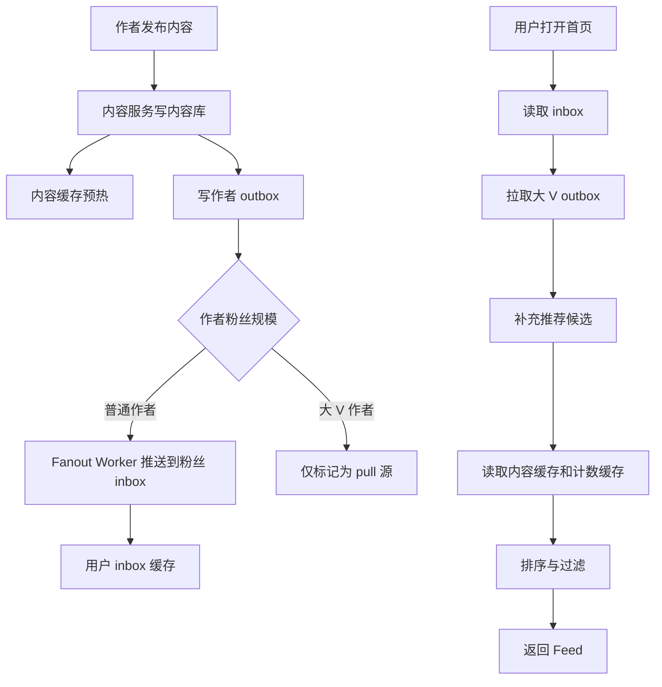

# 社交 Feed 缓存体系设计：读写扩散下的多级架构

## 1. 问题背景

Feed 流是社交产品最核心也最复杂的场景之一。用户打开首页，希望立刻看到关注的人、推荐内容、互动计数和排序结果；作者发布内容，又希望粉丝尽快看到。这里同时存在读扩散、写扩散、关系变更、内容审核、计数更新、排序召回和降级兜底。

如果每次打开 Feed 都实时查询“我关注的人最近发了什么”，大 V 用户、活跃用户和复杂排序会让数据库和搜索系统承受巨大压力。如果每次发布都把内容推给所有粉丝，大 V 发一条内容又会造成写入风暴。

Feed 缓存设计的关键，是根据用户关系和活跃度选择 push、pull 或 push-pull 混合模式，并围绕 inbox、outbox、内容缓存、计数缓存和排序缓存建立多级体系。

## 2. 核心概念

### Push 模式

作者发布内容后，系统主动把 feed item 写入粉丝的 inbox。读的时候只需要读取自己的 inbox，延迟低，适合普通作者和粉丝数不大的关系链。

### Pull 模式

用户读取 Feed 时，根据关注列表去拉取被关注者的 outbox，再合并排序。写入成本低，适合大 V、媒体号或粉丝数巨大的账号。

### Push-Pull 混合模式

普通作者走 push，大 V 走 pull。读取时先读 inbox，再拉取少量大 V outbox 和推荐内容，最后合并排序。这是社交 Feed 中最常见的工程折中。

### Inbox 与 Outbox

outbox 是作者视角的发件箱，记录作者发布过什么；inbox 是读者视角的收件箱，记录读者应该看到什么。outbox 更像事实流，inbox 更像读优化索引。

### 多级缓存

Feed 通常不是一个 Redis 就能解决，而是多级缓存组合：本地缓存、Redis/Memcached、搜索/推荐缓存、数据库、对象存储/CDN。

## 3. 原理拆解

混合 Feed 架构可以拆成发布链路和读取链路。



### 发布链路

```text
publish(authorId, contentId):
  save content
  cache content summary
  zadd outbox:{authorId} publishTime contentId

  if followerCount(authorId) < pushThreshold:
    enqueue fanout(authorId, contentId)
  else:
    mark author as pull_source
```

Fanout Worker 推送时不建议一次性把大内容写入每个粉丝 inbox，只写轻量 item。

```text
feed item = {
  contentId,
  authorId,
  publishTime,
  source,
  scoreHint
}
```

### 读取链路

```text
loadFeed(userId, cursor):
  inboxItems = zrevrangebyscore inbox:{userId} cursor limit
  pullItems = loadOutboxFromBigAuthors(userId, cursor)
  recommendItems = loadRecommendCandidates(userId)
  merged = mergeAndRank(inboxItems, pullItems, recommendItems)
  contents = batchGetContent(merged.contentIds)
  counts = batchGetCounters(merged.contentIds)
  return hydrate(merged, contents, counts)
```

读取链路的性能重点是批量化：批量读内容、批量读计数、批量过滤已读和屏蔽关系，避免 N+1 查询。

## 4. 工程取舍

### Push 的取舍

Push 模式读快写慢，适合“读远多于写”的普通用户。它的问题是粉丝多时写入放大严重，关注关系变化时还要修正 inbox。

### Pull 的取舍

Pull 模式写快读慢，适合大 V。它的问题是读取时需要合并多个 outbox，关注数量多时读放大明显，排序复杂度更高。

### 混合模式的边界

混合模式的关键是阈值。阈值不是固定数字，而是根据粉丝数、活跃粉丝数、发布频率、读取频率和系统容量动态调整。例如一个有 100 万粉丝但大多数不活跃的作者，不一定要完全走 pull；一个粉丝少但发布极频繁的账号，也可能需要特殊处理。

### 缓存一致性

Feed 场景通常接受最终一致。用户能接受某条内容晚几秒出现，但很难接受首页打不开。设计时要把“可用性”和“时效性”分开：普通内容允许延迟，互动计数允许延迟，删除和隐私变更必须尽快生效。

## 5. 实战方案

### 缓存分层

| 层级 | 内容 | 作用 |
|---|---|---|
| 本地缓存 | 热门作者、关系配置、降级开关 | 降低远程缓存访问 |
| Redis/Memcached | inbox、outbox、内容摘要、计数 | 承接 Feed 高频读写 |
| 搜索/推荐缓存 | 候选集、排序特征 | 支持个性化和召回 |
| 数据库 | 内容事实、关系事实、互动事实 | 最终存储和对账 |
| CDN/对象存储 | 图片、视频、静态资源 | 减少源站流量 |

### 关注关系缓存

关注关系既影响发布 fanout，也影响读取过滤。常见缓存包括：

- `following:{userId}`：用户关注的人。
- `followers:{authorId}`：作者的粉丝，用于 push。
- `relation_version:{userId}`：关系版本，用于判断 inbox 是否需要修正。
- `block:{userId}`：拉黑、屏蔽、静音关系。

粉丝列表可能很大，不适合一次性加载。Fanout 应该分页扫描粉丝关系，并记录进度水位。

```text
fanout(authorId, contentId):
  cursor = loadCursor(authorId, contentId)
  while hasNext(cursor):
    followers = scanFollowers(authorId, cursor, batch=1000)
    for follower in followers:
      zadd inbox:{follower} publishTime contentId
      zremrangebyrank inbox:{follower} 0 -maxInboxSize
    saveCursor(authorId, contentId, cursor)
```

### 内容缓存

Feed 列表不应该把完整正文冗余到 inbox。更合适的做法是：

- inbox/outbox 只保存内容 ID 和轻量排序字段。
- 内容摘要使用 `content:{contentId}` 缓存。
- 详情页使用更完整的内容缓存。
- 图片、视频走 CDN。
- 删除、审核失败、隐私变更通过内容状态快速过滤。

### 计数缓存

点赞、评论、转发、收藏等计数可以独立成计数服务。Feed 展示时批量读取计数，允许短时间延迟。

```text
MGET count:like:{id1} count:comment:{id1} count:share:{id1}
```

实际工程里更推荐按内容 ID 批量接口，而不是让 Feed 服务拼大量 key。

### 排序与降级

排序可以从简单到复杂分层：

- 时间倒序：最稳定，成本最低。
- 关注权重：亲密度、互动频次、作者质量。
- 内容质量：热度、新鲜度、负反馈。
- 个性化模型：推荐分、兴趣标签、实时特征。

降级策略要提前设计：

- 推荐服务不可用时，只返回关注流。
- 计数服务不可用时，返回缓存旧值或隐藏计数。
- 内容缓存 miss 过高时，限制回源并返回轻量卡片。
- Fanout 延迟时，读取阶段补拉 outbox。
- 排序模型超时时，切换时间倒序。

### 监控指标

| 指标 | 说明 |
|---|---|
| Feed 首页 P95/P99 | 用户体感核心指标 |
| inbox 命中率 | push 链路是否有效 |
| outbox 拉取耗时 | pull 源是否过多 |
| Fanout 队列堆积 | 发布扩散是否延迟 |
| 内容缓存命中率 | 是否存在回源风暴 |
| 计数批量接口耗时 | 互动数据是否拖慢 Feed |
| 删除/屏蔽生效延迟 | 隐私与合规风险 |
| 降级触发次数 | 系统是否长期带病运行 |

## 6. 常见问题

### 大 V 发文为什么不能直接 push 给所有粉丝？

因为写扩散太大。一个千万粉丝账号发文，如果每个粉丝 inbox 都写一条，就是千万级写入。更合理的是大 V 走 pull，读者打开 Feed 时再合并大 V outbox。

### 用户新关注一个人，历史内容要不要补进 inbox？

看产品语义。如果关注后希望看到对方近期内容，可以异步补最近 N 条；如果只看关注后的新内容，就不需要补历史。无论哪种，都要避免同步补大量历史内容。

### 用户取关或拉黑后，inbox 里的旧内容怎么办？

不一定要立刻物理删除。读取时根据关系版本、屏蔽列表和内容状态过滤即可。对强隐私场景，需要额外触发清理任务。

### Feed 缓存 miss 怎么处理？

先限制回源并做请求合并，避免大量用户同时打穿。然后从 outbox、推荐候选或数据库重建。重建失败时返回降级流，保证首页可用。

### inbox 应该保存多久？

通常保存最近 N 条或最近 N 天。Feed 是时间敏感业务，过旧内容可以走历史页、搜索或归档查询，不适合无限保留在 Redis。

## 7. 小结

- Feed 的核心矛盾是读扩散和写扩散，不能只靠单一缓存解决。
- Push 读快写慢，Pull 写快读慢，混合模式是主流选择。
- inbox 是读优化索引，outbox 是作者发布事实，两者职责不同。
- Feed 列表只保存轻量 item，内容、计数、关系应独立缓存并批量读取。
- 大 V、频繁发布者、活跃用户都需要单独策略。
- 删除、屏蔽、隐私变更要优先保证生效，普通计数和排序可以最终一致。
- 降级方案要提前内置，否则 Feed 首页会被某个依赖服务拖垮。
