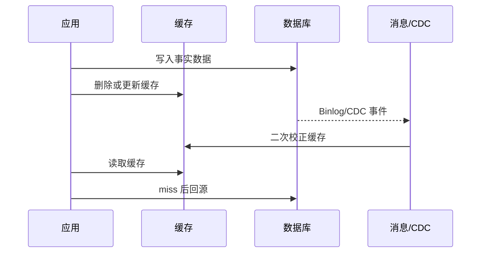

# 分布式缓存实战复盘清单：从设计到上线到运维

## 1. 问题背景

分布式缓存最容易出现一种错觉：只要把 Redis 集群搭起来，把热点数据放进去，系统就完成了性能优化。真正上线后才会发现，缓存引入的是一整套工程系统：容量、命中率、一致性、雪崩、热点、故障恢复、监控、成本和组织协作都会被牵动。

这篇不是讲某个单点技术，而是给整套分布式缓存项目做复盘清单。它适合在架构评审、上线前检查、故障复盘和容量治理时使用。

如果前面的文章是在讲“怎么设计秒杀、计数、Feed”，这一篇就是把它们背后的共性问题抽出来：什么时候该缓存，缓存什么，怎么失效，怎么扩容，怎么观测，出事以后怎么恢复。

## 2. 核心概念

### 缓存边界

缓存边界回答三个问题：哪些数据进缓存，哪些请求读缓存，缓存失败时是否允许回源。边界不清晰时，缓存很容易从性能优化变成隐藏的数据源。

### 一致性等级

不同业务对一致性的要求不同。库存、余额、权限属于强约束；Feed、计数、推荐属于最终一致；静态配置、活动页更偏缓存展示。先分级，后设计。

### 可观测性

缓存系统必须能被看见。命中率、延迟、内存、连接数、淘汰、回源、慢命令、主从延迟、队列堆积，都应该进入监控和告警。

### 故障预案

缓存不是永远可用。要提前定义 Redis 故障、网络分区、主从切换、缓存雪崩、DB 回源过载、数据不一致时的处理方式。

## 3. 原理拆解

一个完整缓存项目可以按生命周期拆解。


缓存请求链路也要清楚。

```text
read(key):
  value = localCache.get(key)
  if value exists:
    return value

  value = redis.get(key)
  if value exists:
    localCache.set(key, value, shortTtl)
    return value

  if not allowDbFallback(key):
    return degradeValue()

  value = singleFlight(key, loadFromDb)
  redis.set(key, value, ttlWithJitter)
  return value
```

这段伪代码里有几个复盘点：是否有本地缓存，Redis miss 后是否一定能回源，回源是否有请求合并，TTL 是否加随机抖动，降级值是否定义。

## 4. 工程取舍

### 性能与一致性

缓存提升性能的同时，会把一致性问题交给业务。Cache Aside 简单灵活，但会有短暂不一致；Write Through 一致性更强，但写链路更重；Write Back 性能好，但恢复和丢失风险更高。

### 成本与容量

缓存命中率不是越高越好。如果为了最后 1% 命中率付出 50% 内存成本，可能并不划算。容量设计要看数据价值、访问频率、对象大小和回源成本。

### 可用性与准确性

在秒杀里，宁可少卖也不能超卖；在 Feed 里，宁可返回旧内容也不能首页不可用；在计数里，宁可展示略旧数字也不能拖垮主链路。每个场景都要定义自己的优先级。

### 通用组件与业务定制

平台化缓存服务适合提供集群、监控、迁移、权限、容量治理等通用能力；但热点治理、降级语义、幂等逻辑、数据补偿往往必须由业务自己定义。

## 5. 实战方案

### 设计阶段 Checklist

| 检查项 | 关键问题 |
|---|---|
| 业务目标 | 是降低延迟、削峰、降低 DB 成本，还是增强可用性 |
| 数据类型 | 是事实数据、派生数据、索引数据，还是展示数据 |
| 一致性等级 | 强一致、最终一致、可丢弃、可重建分别是什么 |
| 读写模型 | 读多写少、写多读少、热点集中还是长尾访问 |
| 缓存模式 | Cache Aside、Read Through、Write Through、Write Back 怎么选 |
| 失效策略 | TTL、主动删除、版本号、CDC、消息通知如何组合 |
| 回源策略 | miss 后是否允许回源，是否做限流和请求合并 |
| 降级策略 | 缓存不可用、DB 不可用、依赖超时时返回什么 |

### Key 设计 Checklist

- key 命名包含业务域、对象类型、对象 ID 和版本。
- 避免无边界大 key，集合、Hash、ZSet 都要设置拆分阈值。
- TTL 加随机抖动，避免同一批 key 同时过期。
- 热点 key 有拆分、复制、本地缓存或特殊路由策略。
- key 中不要放敏感信息，例如手机号、身份证、明文 token。
- 多租户场景要有 namespace、配额、权限和限流隔离。

### 容量估算公式

```text
缓存容量 = 对象数量 * 平均对象大小 * 副本系数 * 编码膨胀系数 * 预留系数

建议：
  副本系数：主从至少 2
  编码膨胀系数：按 1.2 到 3 估算，海量小 key 取高值
  预留系数：至少 1.3，活动场景可取 2
```

容量评审时不要只看 value 大小。key、对象头、dict、allocator 碎片、AOF/RDB、复制缓冲区都要考虑。

### 上线前 Checklist

| 检查项 | 通过标准 |
|---|---|
| 压测 | 覆盖平均流量、峰值流量、热点 key 和批量过期 |
| 限流 | 网关、服务、Redis 客户端、DB 回源都有保护 |
| 熔断 | Redis 超时、连接池耗尽、慢查询时能快速失败 |
| 预热 | 核心 key 上线前可批量加载，预热失败可重试 |
| 灰度 | 可按用户、流量比例、业务线逐步放量 |
| 回滚 | 配置可回滚，缓存写入可停止，读路径可切回 DB |
| 数据校验 | 缓存与 DB 抽样对账，关键字段有版本或更新时间 |
| 告警 | P99、错误率、内存、淘汰、连接数、回源率已配置 |

### 运维监控 Checklist

| 类别 | 指标 |
|---|---|
| 性能 | QPS、RT、P95/P99、慢命令、pipeline 使用情况 |
| 命中 | 本地缓存命中率、Redis 命中率、DB 回源率 |
| 内存 | used_memory、内存碎片率、evicted_keys、big key 数量 |
| 连接 | connected_clients、blocked_clients、连接池等待时间 |
| 复制 | 主从延迟、复制积压缓冲区、全量同步次数 |
| 持久化 | RDB/AOF 耗时、AOF rewrite、fsync 延迟 |
| 稳定性 | 超时率、重试率、熔断次数、降级次数 |
| 业务 | 库存差异、计数差异、Feed 延迟、订单幂等冲突 |

### 故障复盘 Checklist

故障复盘不要只问“Redis 为什么慢”，要沿链路追问。

```text
1. 故障开始和恢复的准确时间是什么？
2. 影响了哪些业务、用户和接口？
3. 是命中率下降、热点过载、网络问题、慢命令，还是容量触顶？
4. 是否触发回源风暴？DB 是否被连带打满？
5. 限流、熔断、降级是否生效？为什么？
6. 是否出现数据不一致？影响范围如何修复？
7. 告警是否提前发现？是否存在监控盲区？
8. 后续如何通过配置、代码、容量或流程避免复发？
```

### 数据一致性复盘



一致性策略要明确：

- 写 DB 后删缓存，还是先删缓存再写 DB。
- 是否需要延迟双删。
- 是否用 CDC 做最终校正。
- 是否使用版本号防止旧值覆盖新值。
- 缓存重建失败是否有重试和死信。

## 6. 常见问题

### 缓存命中率低一定是坏事吗？

不一定。要看回源成本和业务目标。冷门数据命中率低但访问少，问题不大；热点接口命中率下降 1% 可能就足以打满 DB。

### TTL 越长越好吗？

不是。TTL 越长，命中率可能越高，但数据陈旧风险也越大。强业务语义的数据要结合主动失效、版本号和 CDC，而不是盲目拉长 TTL。

### 要不要所有接口都加本地缓存？

本地缓存能降低 Redis 压力，但会增加多副本一致性问题。适合配置、热点只读数据、短 TTL 容忍陈旧的数据，不适合频繁变更的强一致数据。

### Redis 故障时是否直接回源 DB？

不能一概而论。对低流量接口可以回源；对高流量核心接口必须限流、熔断、请求合并或返回降级值，否则缓存故障会升级为数据库故障。

### Big Key 只影响内存吗？

不是。Big Key 会影响网络传输、序列化、持久化、主从同步、删除耗时和集群迁移。治理 Big Key 要从数据模型开始，不只是扩容。

## 7. 小结

- 分布式缓存是系统工程，不是单个 Redis 集群。
- 设计前先明确业务目标、数据分级、一致性等级和失败语义。
- Key、TTL、容量、回源、降级、监控都要在上线前评审。
- 命中率要结合热点、回源成本和业务链路一起看。
- 高并发场景必须防止缓存故障放大成 DB 故障。
- 数据一致性需要版本号、消息、CDC、补偿和对账共同兜底。
- 运维复盘要关注链路、指标、预案和组织流程，而不是只定位单点原因。
