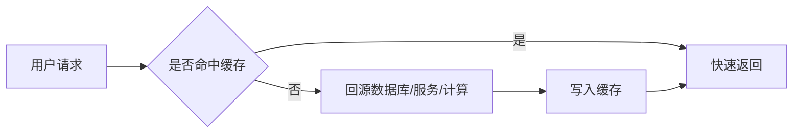
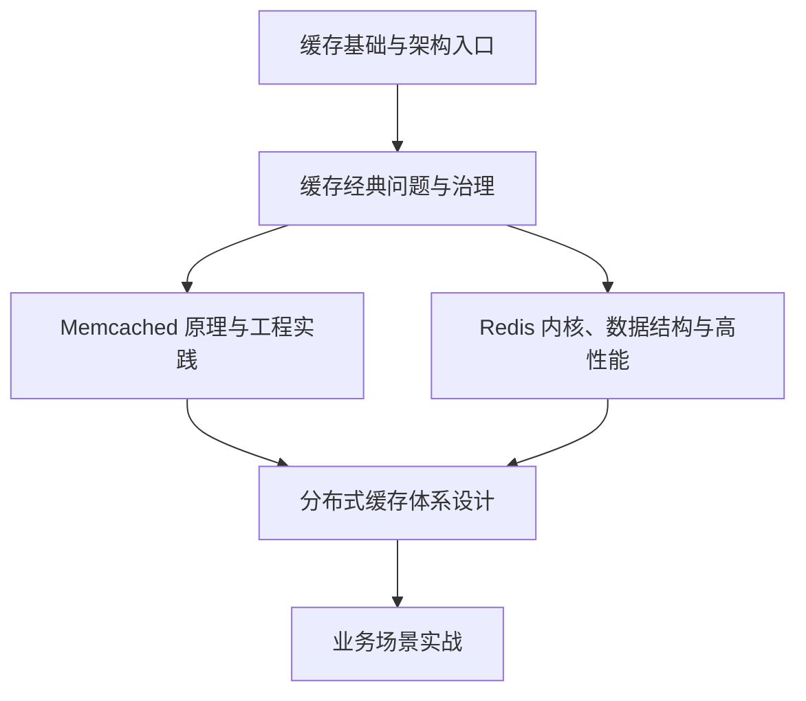
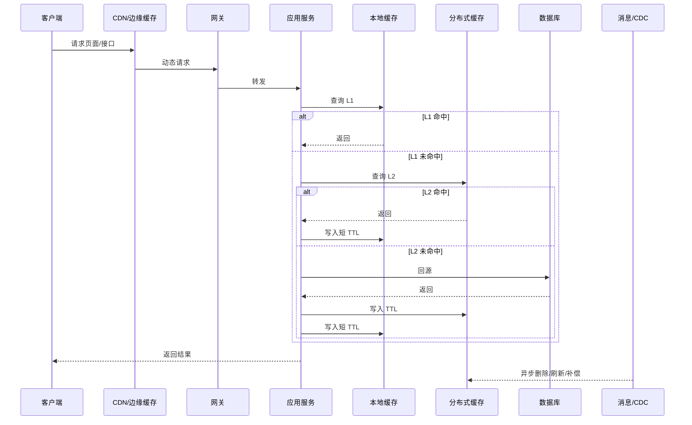

# 分布式缓存核心原理与实战总览

## 1. 为什么要系统学习分布式缓存

缓存是后端系统里最常见、也最容易被低估的基础设施。很多人第一次使用缓存，是为了让一个慢接口快一点；但在真实高并发系统中，缓存承担的角色远不止“加速查询”。

它会参与流量削峰、热点隔离、服务降级、读模型构建、计数聚合、活动库存保护、Feed 流首屏加载、跨服务结果复用。缓存设计得好，系统会明显更稳；设计得粗糙，缓存会把数据库一致性、热点、雪崩、容量和运维问题一起带进来。

所以这套博客的目标不是教你背 Redis 命令，而是建立一套完整的判断框架：

- 什么数据值得缓存？
- 用哪种缓存模式更合适？
- 缓存与数据库如何保持可接受的一致性？
- 缓存失效、穿透、雪崩、热点、大 key 如何治理？
- Memcached 和 Redis 为什么快，它们分别适合什么位置？
- 分布式缓存体系如何扩容、迁移、隔离、监控和容灾？
- 秒杀、计数、Feed 这类高并发场景里，缓存如何成为架构核心？

## 2. 缓存解决的不是“慢”，而是“重复的昂贵访问”

缓存的本质是利用局部性原理，用更快的访问路径承接重复请求。它适合优化的是“同一批数据被反复读取，且后端加载成本较高”的场景。

如果一个查询本身没有重复访问，或者每次请求条件都高度离散，缓存很可能只是额外增加一次网络访问。判断是否加缓存时，要优先看命中率、回源成本、数据一致性要求和失效时的退化路径。

一个好的缓存设计，至少要回答：

| 问题 | 设计关注点 |
|---|---|
| 缓存什么 | 读模型、聚合结果、热点对象、计数还是配置 |
| 放在哪里 | 本地缓存、Redis、Memcached、CDN、网关缓存 |
| 如何过期 | TTL、逻辑过期、主动删除、事件驱动刷新 |
| 如何更新 | 先写 DB 再删缓存、CDC 补偿、异步重建 |
| 如何保护 | 限流、单飞、互斥锁、降级、返回旧值 |
| 如何治理 | 命中率、延迟、内存、热点、大 key、慢查询 |

## 3. 本系列的知识地图

整套内容可以分成六块：

### 第一块：缓存基础与架构入口

这一部分回答“为什么要缓存”和“如何开始设计缓存”。重点包括：

- 缓存的本质：空间换时间、局部性、读路径优化。
- 缓存模式：Cache Aside、Read Through、Write Through、Write Back、Refresh Ahead。
- 组件选型：本地缓存、Memcached、Redis、Pika/Tair/Dragonfly 等。
- 架构清单：key、TTL、容量、一致性、监控、降级。

这一块是后续所有内容的入口。如果这里没有想清楚，后面用再多 Redis 技巧也只是局部修补。

### 第二块：缓存经典问题与治理

缓存工程最常见的问题基本都集中在这里：

- 缓存穿透：请求不存在的数据，绕过缓存打到数据库。
- 缓存击穿：热点 key 失效瞬间，大量请求同时回源。
- 缓存雪崩：大量 key 同时失效或缓存集群异常，引发数据库过载。
- 数据不一致：数据库更新和缓存更新之间存在时间窗口。
- Hot Key：单 key 或单分片被超高流量打爆。
- Big Key：大 value 导致网络、内存、删除和阻塞问题。

这部分最适合作为工程实战和面试复盘材料，因为它们几乎一定会在生产系统里出现。

### 第三块：Memcached 原理与工程实践

Memcached 的价值在于简单、纯粹和高性能。它不追求丰富数据结构，也不提供持久化，而是专注于内存 KV 缓存。

学习 Memcached 的意义不只是“会用一个老牌缓存组件”，更重要的是理解高性能缓存系统的设计思想：

- 简洁协议减少处理成本。
- 多线程事件模型提升并发处理能力。
- Slab 内存分配降低碎片和频繁 malloc/free。
- 客户端分片或代理分片实现水平扩展。
- 无持久化让它可以把复杂度留给上层架构。

当业务只需要大规模 KV 读缓存时，Memcached 仍然是值得理解的方案。

### 第四块：Redis 内核、数据结构与高性能

Redis 是现代业务系统中最常用的缓存组件之一，但它远不只是 key-value 存储。它同时提供数据结构、持久化、复制、Lua、事务、Stream、Cluster 和丰富生态。

Redis 主线需要重点理解：

- 请求处理：RESP 协议、事件循环、命令执行。
- 数据结构：SDS、dict、listpack、quicklist、skiplist、intset。
- 内存治理：过期删除、LRU/LFU、maxmemory、lazyfree。
- 可靠性：RDB、AOF、混合持久化、主从复制、故障恢复。
- 扩展性：Redis Cluster、Proxy、Smart Client、读写分离。
- 性能优化：pipeline、批处理、连接池、热点拆分、慢查询治理。

Redis 很强，但也容易被误用。很多线上问题都来自大 key、阻塞命令、无保护回源、错误重试、跨 slot 批量操作和主从延迟。

### 第五块：分布式缓存体系设计

单个缓存组件解决不了所有问题。当规模上来后，系统真正需要的是缓存体系：

- Proxy 或 Smart Client 负责路由。
- 存储节点负责数据承载。
- 配置中心负责拓扑和路由配置。
- ClusterManager 负责扩缩容、迁移和故障切换。
- 监控系统负责水位、延迟、错误、热点和容量。
- 多租户机制负责隔离业务、容量、权限和 SLA。

这一部分会进入 CAP、BASE、网络分区、最终一致性和故障演练。它关心的是：当缓存集群扩容、节点故障、网络抖动、主从切换、跨机房访问时，系统如何保持“可接受的正确”和“可控的可用”。

### 第六块：业务场景实战

最后一部分把前面的知识落到高并发业务：

- 秒杀：核心是把请求挡在上游，库存扣减必须原子、幂等、可恢复。
- 海量计数：核心是精确性、成本和吞吐之间的取舍。
- 社交 Feed：核心是读放大、写放大、关注关系和内容缓存的平衡。

业务场景没有标准答案，但有稳定的方法论：先识别流量形态，再拆读写路径，然后用缓存构建合适的中间态。

## 4. 一条真实缓存链路长什么样

一个成熟系统中的缓存链路通常不是单层 Redis：

这条链路里最容易被忽略的是失败路径：

- 本地缓存旧值怎么失效？
- Redis 超时时是否继续访问 DB？
- 回源请求是否有限流？
- 数据库更新后缓存删除失败怎么办？
- 热点 key 是否会把单个 Redis 分片打满？
- 批量过期时是否会形成回源洪峰？

缓存设计的成熟度，通常体现在这些异常路径上。

## 5. 推荐学习顺序

如果你是第一次系统学习，建议按下面的顺序：

1. 先读缓存基础，建立“缓存解决什么、不解决什么”的边界。
2. 再读经典问题，理解穿透、雪崩、一致性、Hot Key、Big Key。
3. 然后读 Redis 主线，掌握数据结构、事件模型、淘汰、持久化、复制、集群。
4. 补读 Memcached，从简单系统里提炼高性能设计思想。
5. 进入分布式缓存体系，理解 Proxy、配置、迁移、监控、CAP/BASE。
6. 最后读业务场景，把知识迁移到秒杀、计数、Feed。

如果你已经有 Redis 使用经验，可以优先读经典问题和业务场景，再回到 Redis 内核补齐原理。

## 6. 生产环境缓存设计的底线

无论业务大小，下面这些能力最好在早期就设计进去：

- 统一 key 规范和版本机制。
- TTL 分层和随机抖动。
- 空值缓存或布隆过滤器防穿透。
- 热点 key 识别和保护。
- Big Key 扫描和拆分规范。
- 未命中回源限流和请求合并。
- 数据更新后的缓存删除和补偿机制。
- 缓存异常时的降级策略。
- 命中率、延迟、错误、内存、淘汰、慢查询监控。
- 缓存不可用和批量过期的故障演练。

这些不是“大厂才需要”的能力，而是缓存一旦成为核心链路后必须具备的自保能力。

## 7. 小结

分布式缓存的难点不在“把数据放进 Redis”，而在如何围绕业务访问模式设计一个可控的读写体系。缓存越靠近核心链路，就越需要工程化治理。

这套系列会沿着一条主线展开：先理解缓存价值和边界，再掌握经典问题，然后深入 Memcached 与 Redis 的实现，最后进入分布式体系和高并发业务实战。读完后，你应该不仅能写缓存代码，也能评审缓存方案、排查缓存事故，并把缓存放到更大的系统架构中做取舍。
