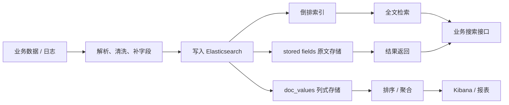

# ElasticSearch 到底解决什么问题

## 1. 这一章解决什么问题

很多团队第一次接触 Elasticsearch, 是因为 MySQL 的 `LIKE '%keyword%'` 越来越慢, 日志查不动, 或者运营同学想按时间、地区、状态、关键词做组合筛选和统计。ES 不是“更快的 MySQL”, 它真正擅长的是把大量文档变成可搜索、可过滤、可聚合的索引结构, 并在近实时场景下给出结果。

这篇文章先回答三个问题: 为什么需要 ES, ES 和 Lucene 的关系是什么, 以及它适合放在系统架构的什么位置。

## 2. 核心概念

| 概念 | 一句话理解 | 工程关注点 |
|---|---|---|
| Elasticsearch | 基于 Lucene 的分布式搜索与分析引擎 | 提供 REST API、集群、分片、副本、聚合、安全等能力 |
| Lucene | Java 实现的全文检索库 | 负责倒排索引、相关性评分、segment 等底层能力 |
| Index | 文档集合, 类似一类业务数据的逻辑容器 | 设计时要考虑分片数、字段类型、生命周期 |
| Document | ES 中的基本数据单元, JSON 结构 | 8.x 已移除多 type 建模, 通常统一使用 `_doc` 路径 |
| Field | 文档字段 | 字段类型决定能否分词、排序、聚合和范围查询 |
| Mapping | 字段结构和索引方式的定义 | 生产环境应显式设计, 避免动态映射失控 |
| Analyzer | 分词器 | 决定 text 字段如何被切词、归一化和建立倒排索引 |
| Shard | 索引的物理分片 | 影响扩展能力、并行度和资源成本 |
| Replica | 主分片的副本 | 提高可用性和读吞吐, 但增加写入成本 |

从数据模型上看, ES 存的是 JSON 文档; 从底层结构上看, 它依赖倒排索引、列式 `doc_values`、stored fields 等多种结构来服务不同查询。

## 3. 原理拆解

ES 能解决的问题可以分成四类。

第一类是全文检索。比如搜索“无线蓝牙耳机”, 你希望匹配“蓝牙运动耳机”“无线降噪耳机”, 而不是只做字符串完全相等。ES 会把文本分词, 建立 term 到 document 的倒排索引, 查询时再根据 BM25 等相关性算法打分。

第二类是结构化过滤。比如状态等于 `paid`, 价格在 `100-300`, 城市是 `Shanghai`, 创建时间在最近 7 天。ES 对 keyword、numeric、date、boolean 等字段有专门的索引结构, 很适合做多条件过滤。

第三类是聚合分析。比如按品牌统计销量, 按天统计日志量, 计算响应时间 P95。ES 的 aggregation 可以在搜索结果上继续做 bucket 和 metric 分析。

第四类是近实时检索。写入文档后通常经过 refresh 才能被搜索到, 默认 refresh 周期约 1 秒。它不是严格实时数据库, 但对日志、搜索、运营分析等场景足够接近实时。

一个简化链路如下:



## 4. 使用示例

下面的例子模拟商品搜索。可以直接在 Kibana Dev Tools 中运行。

先确认集群和节点状态:

```http
GET _cluster/health

GET _cat/nodes?v
```

```http
PUT products
{
  "mappings": {
    "properties": {
      "title": {
        "type": "text",
        "fields": {
          "keyword": { "type": "keyword", "ignore_above": 256 }
        }
      },
      "brand": { "type": "keyword" },
      "price": { "type": "double" },
      "status": { "type": "keyword" },
      "created_at": { "type": "date" }
    }
  }
}
```

```http
POST products/_bulk
{ "index": { "_id": "1" } }
{ "title": "无线蓝牙降噪耳机", "brand": "soundplus", "price": 299, "status": "online", "created_at": "2026-05-01" }
{ "index": { "_id": "2" } }
{ "title": "有线监听耳机", "brand": "studio", "price": 199, "status": "online", "created_at": "2026-05-02" }
```

```http
GET products/_search
{
  "query": {
    "bool": {
      "must": [
        { "match": { "title": "蓝牙耳机" } }
      ],
      "filter": [
        { "term": { "status": "online" } },
        { "range": { "price": { "gte": 100, "lte": 300 } } }
      ]
    }
  },
  "aggs": {
    "by_brand": {
      "terms": { "field": "brand" }
    }
  }
}
```

这个查询同时使用了全文检索、结构化过滤和聚合分析, 是 ES 最典型的价值组合。

## 5. 工程取舍

ES 适合:

- 商品、内容、知识库、日志等文档型搜索。
- 多条件筛选和聚合分析。
- 写入后秒级可见的近实时查询。
- 读多写多但允许最终一致的搜索服务。
- 对相关性排序、召回、分词、同义词有需求的系统。

ES 不适合:

- 替代事务型数据库承载核心订单扣款。
- 做复杂多表 join 和强一致事务。
- 保存无查询价值的海量冷数据。
- 对单条写入强实时可见有硬性要求的场景。
- 在 mapping 不受控的情况下接收任意 JSON。

ES 与常见系统的边界:

| 系统 | 更擅长 | 与 ES 的关系 |
|---|---|---|
| MySQL/PostgreSQL | 事务、关系模型、强一致 | 通常做主数据源, ES 做搜索视图 |
| ClickHouse | 大规模列式 OLAP | 更适合宽表统计, ES 更适合检索加轻中度聚合 |
| Redis | 缓存、低延迟 KV、简单搜索模块 | 可缓存热点查询, 不替代 ES 的全文检索建模 |
| OpenSearch | ES 7.10 分支后的开源搜索平台 | API 很多相似, 但生态、许可证和版本路线不同 |
| Lucene | 单机检索库 | ES 把 Lucene 包装成分布式搜索服务 |

## 6. 实战与排障

生产中最容易踩的坑不是“ES 查得慢”, 而是从一开始就把 ES 当数据库随便写。

常见排查顺序:

1. 查询慢时先看是否命中了错误字段, 例如对 `text` 字段做 `term` 精确查询, 或对高基数字段做大规模 terms 聚合。
2. 写入后查不到, 先理解 refresh 机制, 再决定是否临时使用 `refresh=true`, 不要把它作为高吞吐写入的默认配置。
3. mapping 失控时检查动态字段数量, 关注 `index.mapping.total_fields.limit`, 对不可控 JSON 优先考虑 `flattened`。
4. 磁盘增长快时检查副本数、segment merge、stored fields、日志保留周期和 ILM 策略。
5. 查询结果排序不符合预期时, 用 `_explain` 或 profile API 分析评分, 不要只靠直觉调 boost。

ES 8.x 还要注意安全默认开启。首次启动会生成 `elastic` 用户密码、HTTP CA 证书和 Kibana enrollment token。开发环境为了省事关闭安全可以理解, 但生产环境不要裸奔。

## 7. 小结

- ES 的核心价值是全文检索、结构化过滤、聚合分析和近实时查询的组合。
- Lucene 负责底层检索能力, ES 负责分布式服务化和生态集成。
- ES 不是事务数据库, 更适合作为业务数据的搜索视图或分析视图。
- mapping、分词器、分片和生命周期设计会长期影响成本和性能。
- 8.x 已移除多 type 建模, 安全能力默认开启, 开发和部署方式都要顺着新版本理解。
- 学 ES 的正确路径不是背 API, 而是把“数据如何建模、查询如何执行、资源如何消耗”串起来。
