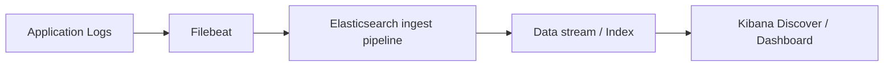
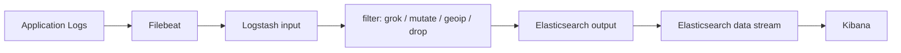
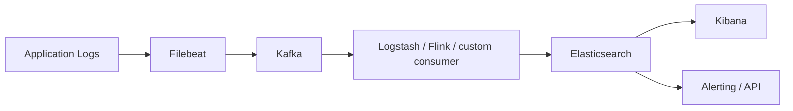

# Elastic Stack 生态与典型架构

## 1. 这一章解决什么问题

Elasticsearch 很少单独出现在生产系统里。日志需要采集, 指标需要上报, 数据需要清洗, 查询结果需要可视化, 权限和告警也要治理。Elastic Stack 的价值就在于把这些环节拼成一条完整链路。

这篇文章从日志和可观测性场景出发, 梳理 Beats、Elastic Agent、Logstash、Ingest Pipeline、Elasticsearch、Kibana 的职责, 再给出几种常见架构方案和取舍。

## 2. 核心概念

| 组件 | 定位 | 常见用途 |
|---|---|---|
| Elasticsearch | 存储、搜索、聚合分析引擎 | 日志检索、指标分析、搜索服务 |
| Kibana | 可视化与管理界面 | Dashboard、Dev Tools、Discover、告警、索引管理 |
| Logstash | 数据采集、解析、转换管道 | 复杂日志解析、字段规整、输出多目标 |
| Beats | 轻量采集器家族 | Filebeat 采日志, Metricbeat 采指标, Auditbeat 采审计 |
| Elastic Agent | 统一代理 | 配合 Fleet 管理采集策略, 覆盖日志、指标、APM 等 |
| Ingest Pipeline | ES 写入前的轻量处理管道 | grok、rename、set、date、geoip、user_agent |
| Fleet | Agent 集中管理 | 统一下发 integration 和采集策略 |

传统说法是 ELK: Elasticsearch + Logstash + Kibana。后来 Beats 出现, 架构常变成 Beats + Logstash + Elasticsearch + Kibana。近几年 Elastic 更推荐 Elastic Agent + Fleet 的统一采集方式, 但 Filebeat 和 Logstash 在很多公司仍然是主力。

## 3. 原理拆解

### 3.1 最小链路: Beats 直写 ES



这个方案部署简单, 延迟低, 运维成本低。适合日志格式稳定、解析逻辑不复杂、吞吐量中等的业务。

### 3.2 标准链路: Beats + Logstash + ES



Logstash 负责更复杂的 grok 解析、字段映射、条件分支、脱敏、分流输出。代价是 JVM 进程更重, 管道容量和堆内存要专门治理。

### 3.3 高吞吐链路: Beats + MQ + Logstash/Consumer + ES



Kafka 用来削峰填谷和隔离 ES 故障。当 ES 短时间不可用时, 采集端不至于马上丢日志; 当写入高峰出现时, 消费端可以按 ES 能承受的速度消化。

## 4. 使用示例

### 4.1 Filebeat 采集 Nginx 日志到 ES

如果使用 data stream, 可以先准备一个 ingest pipeline 做轻量解析:

```http
PUT _ingest/pipeline/nginx-access-pipeline
{
  "processors": [
    {
      "grok": {
        "field": "message",
        "patterns": [
          "%{IPORHOST:client.ip} - %{DATA:user.name} \\[%{HTTPDATE:nginx.access.time}\\] \"%{WORD:http.request.method} %{DATA:url.original} HTTP/%{NUMBER:http.version}\" %{NUMBER:http.response.status_code:int} %{NUMBER:http.response.body.bytes:int}"
        ]
      }
    },
    {
      "set": {
        "field": "event.dataset",
        "value": "nginx.access"
      }
    }
  ]
}
```

```yaml
filebeat.inputs:
  - type: filestream
    id: nginx-access
    enabled: true
    paths:
      - /var/log/nginx/access.log
    fields:
      service.name: nginx
      env: prod
    fields_under_root: true

output.elasticsearch:
  hosts: ["https://es01:9200"]
  username: "elastic"
  password: "${ELASTIC_PASSWORD}"
  ssl.certificate_authorities: ["/etc/filebeat/certs/http_ca.crt"]

setup.kibana:
  host: "https://kibana:5601"
```

### 4.2 Ingest Pipeline 做字段处理

```http
PUT _ingest/pipeline/nginx-access-pipeline
{
  "description": "Parse nginx access log",
  "processors": [
    {
      "grok": {
        "field": "message",
        "patterns": [
          "%{IPORHOST:client.ip} - %{DATA:user.name} \\[%{HTTPDATE:nginx.access.time}\\] \"%{WORD:http.request.method} %{DATA:url.original} HTTP/%{NUMBER:http.version}\" %{NUMBER:http.response.status_code:int} %{NUMBER:http.response.body.bytes:long}"
        ]
      }
    },
    {
      "date": {
        "field": "nginx.access.time",
        "formats": ["dd/MMM/yyyy:H:m:s Z"],
        "target_field": "@timestamp"
      }
    },
    {
      "remove": {
        "field": "nginx.access.time",
        "ignore_missing": true
      }
    }
  ]
}
```

```http
POST logs-nginx-default/_doc?pipeline=nginx-access-pipeline
{
  "message": "10.0.0.1 - - [25/May/2026:10:00:00 +0800] \"GET /api/products HTTP/1.1\" 200 1234"
}
```

### 4.3 Logstash 管道示例

```conf
input {
  beats {
    port => 5044
  }
}

filter {
  if [service][name] == "order-service" {
    json {
      source => "message"
      target => "event"
    }
    mutate {
      add_field => { "[@metadata][target_index]" => "logs-order-%{+YYYY.MM.dd}" }
    }
  }
}

output {
  elasticsearch {
    hosts => ["https://es01:9200"]
    user => "elastic"
    password => "${ELASTIC_PASSWORD}"
    cacert => "/etc/logstash/certs/http_ca.crt"
    index => "%{[@metadata][target_index]}"
  }
}
```

## 5. 工程取舍

Beats 直写 ES 的优势是简单, 但采集端和 ES 之间耦合更强。ES 写入压力过大时, 采集端 backpressure 能力有限, 日志保留依赖本地 spool 和重试策略。

Logstash 的优势是解析能力强, 插件生态成熟, 适合多来源、多目标、复杂清洗。缺点是资源占用高, 管道拥塞和插件性能要持续观察。

Kafka 的优势是缓冲和解耦, 适合高峰流量明显、日志不可丢、ES 维护窗口较多的系统。缺点是链路变长, 延迟增加, 运维复杂度上升。

Elastic Agent + Fleet 的优势是统一治理, 特别适合标准化可观测性平台。缺点是组织内已有 Filebeat/Logstash 体系时, 迁移需要评估集成成本。

## 6. 实战与排障

日志平台常见问题有三类。

第一类是采集不到。检查采集路径、文件权限、inode 轮转、Filebeat registry、容器日志路径和输出连接。

第二类是写入失败。检查 ES 安全配置、CA 证书、账号权限、索引模板、data stream 命名、磁盘水位、bulk 拒绝和 pipeline 解析错误。

第三类是字段不可用。检查 mapping 是否符合 ECS, 时间字段是否写入 `@timestamp`, keyword 子字段是否存在, 动态映射是否把数字识别成 text。

常用排查命令:

```http
GET _cat/indices/logs-*?v
GET _cat/data_streams?v
GET _ingest/pipeline/nginx-access-pipeline
GET logs-nginx-default/_search?size=1&sort=@timestamp:desc
GET _nodes/stats/ingest
```

日志字段建议尽量贴近 ECS, 例如 `service.name`, `host.name`, `event.dataset`, `log.level`, `trace.id`, `http.response.status_code`。这样 Kibana、APM 和安全分析会更容易联动。

## 7. 小结

- Elastic Stack 不是单个数据库, 而是一条采集、处理、存储、分析、可视化链路。
- Filebeat/Beats 适合轻量采集, Logstash 适合复杂清洗, Kafka 适合削峰和解耦。
- Ingest Pipeline 可以处理写入前轻量转换, 但不应承担过重计算。
- Elastic Agent + Fleet 更偏统一可观测性平台治理。
- 日志系统的关键不是“能写进去”, 而是字段规范、生命周期、容量和排障链路都可控。
- 生产环境优先围绕 ECS、data stream、ILM 和安全权限来设计。
