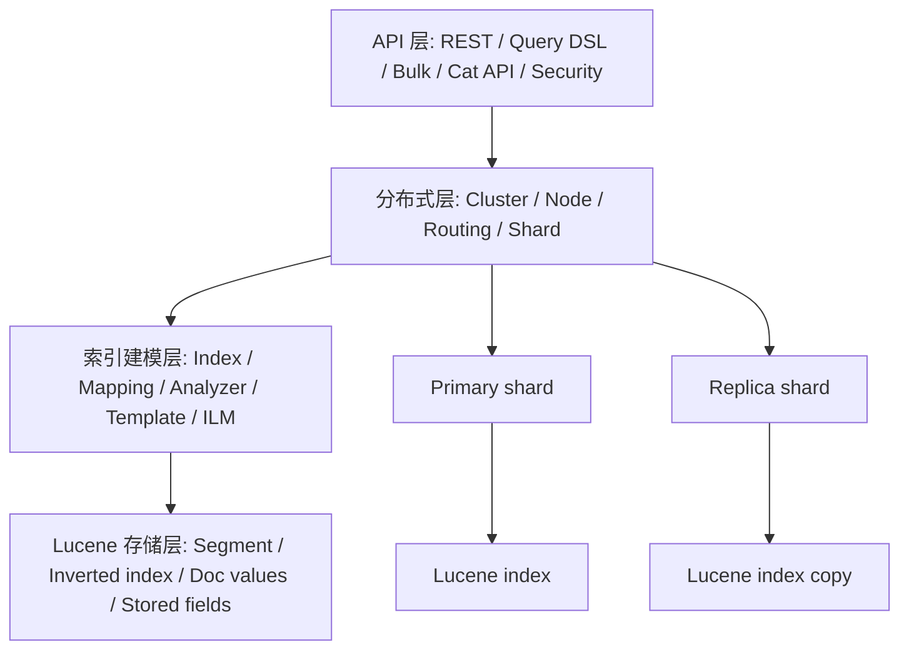

# ES 核心概念速查表

## 1. 这一章解决什么问题

ES 的概念很多, 初学时最容易把 index、shard、segment、document、mapping、analyzer 混在一起。实际写 DSL 或排查问题时, 又必须知道这些概念处在什么层次。

这篇文章用速查表的方式建立一个“概念地图”, 让后续学习索引建模、查询 DSL、写入链路和性能优化时有共同语言。

## 2. 核心概念

### 2.1 集群与节点

| 概念 | 说明 | 常见操作 |
|---|---|---|
| Cluster | 一个 ES 集群, 由多个节点组成 | `GET _cluster/health` |
| Node | 一个 ES 进程实例 | `GET _cat/nodes?v` |
| Master-eligible node | 可参与选主和管理集群元数据的节点 | 生产建议 3 个专用候选主节点 |
| Data node | 存储 shard 并执行读写的节点 | 可按 hot/warm/cold/frozen 分层 |
| Coordinating node | 接收请求、转发到分片、归并结果 | 所有节点默认都能协调请求 |
| Ingest node | 执行 ingest pipeline | 高写入解析场景可独立部署 |

### 2.2 数据与索引

| 概念 | 说明 | 注意点 |
|---|---|---|
| Document | JSON 文档, ES 的基本写入单元 | 8.x 不再使用多 mapping type |
| Field | 文档字段 | 字段类型决定查询能力和存储成本 |
| Index | 文档集合和分片集合 | 建模、分片、生命周期的基本单位 |
| Data stream | 面向时间序列追加写的逻辑数据流 | 日志、指标优先考虑 data stream |
| Alias | 索引别名 | 支持零停机切换和读写分离 |
| Mapping | 字段类型与索引方式 | 生产应显式控制 |
| Settings | 分片、副本、refresh、analysis 等设置 | 部分设置创建后不可直接修改 |

### 2.3 分片与底层结构

| 概念 | 说明 | 影响 |
|---|---|---|
| Primary shard | 主分片, 写入先落到主分片 | 数量影响扩展上限, 创建后通常不能直接改 |
| Replica shard | 副本分片 | 提高可用性和读能力, 增加写入复制成本 |
| Segment | Lucene 的不可变索引段 | refresh 产生可搜索 segment, merge 合并小段 |
| Translog | 事务日志 | 用于故障恢复, 和 flush、durability 相关 |
| Refresh | 让新写入文档可被搜索 | 默认约 1 秒, 过频会影响写入吞吐 |
| Flush | 提交 Lucene commit 并清理 translog | 不是每次写入都会发生 |
| Merge | 合并 segment | 消耗 IO 和 CPU, 影响写入和查询性能 |

### 2.4 查询与聚合

| 概念 | 说明 | 例子 |
|---|---|---|
| Query DSL | ES 的 JSON 查询语言 | `match`, `term`, `bool`, `range` |
| Query context | 需要计算相关性评分 | 全文搜索、带 `_score` 的查询 |
| Filter context | 只判断是否匹配, 不算评分 | 结构化过滤, 通常更容易缓存 |
| Aggregation | 聚合分析 | `terms`, `date_histogram`, `avg`, `percentiles` |
| Sort | 排序 | 通常依赖 keyword/date/numeric 字段的 doc_values |
| Pagination | 分页 | 深分页应使用 `search_after` + PIT |

## 3. 原理拆解

可以把 ES 理解成四层。



一次写入会从 API 层进入 coordinating node, 根据 `_id` 或 routing 找到目标 primary shard, 写入 Lucene 内存结构和 translog, 再复制到 replica。refresh 后, 文档才能被搜索请求看到。

一次搜索会由 coordinating node 分发到相关分片, 各分片执行 query phase 得到候选文档和排序信息, 再进入 fetch phase 拉取 `_source` 等字段, 最后归并返回。

## 4. 使用示例

### 4.1 查看集群、节点和分片

```http
GET _cluster/health
GET _cat/nodes?v
GET _cat/shards?v
GET _cat/indices?v
```

### 4.2 创建带别名的索引

```http
PUT orders-v1
{
  "settings": {
    "number_of_shards": 3,
    "number_of_replicas": 1,
    "refresh_interval": "1s"
  },
  "mappings": {
    "dynamic": "strict",
    "properties": {
      "order_id": { "type": "keyword" },
      "user_id": { "type": "keyword" },
      "amount": { "type": "scaled_float", "scaling_factor": 100 },
      "status": { "type": "keyword" },
      "created_at": { "type": "date" }
    }
  },
  "aliases": {
    "orders-read": {},
    "orders-write": { "is_write_index": true }
  }
}
```

### 4.3 检查字段映射

```http
GET orders-v1/_mapping
GET orders-v1/_settings
GET orders-v1/_field_caps?fields=amount,status,created_at
```

`_field_caps` 很适合排查多索引查询时字段类型不一致的问题。

## 5. 工程取舍

概念背后都有代价。

分片不是越多越好。分片提供并行度和扩展能力, 但每个 shard 都有固定资源开销。小索引过度分片会导致集群元数据变大、搜索 fan-out 变多、segment 管理成本上升。

副本不是越多越好。副本提高可用性和读吞吐, 但写入必须复制到副本, 存储成本也按副本数线性增长。

动态 mapping 不是不能用, 而是不该在不可控数据源上裸用。日志字段、用户自定义属性、埋点参数都容易造成字段爆炸。

`text` 和 `keyword` 不可混用。`text` 用来分词搜索, `keyword` 用来精确过滤、排序和聚合。很多字段需要 multi-fields 同时支持两种能力。

## 6. 实战与排障

常用诊断 API:

```http
GET _cluster/allocation/explain
GET _nodes/stats
GET _cat/thread_pool?v
GET _cat/segments?v
GET _cat/recovery?v
GET _tasks?detailed=true&actions=*reindex
```

看到问题时可以这样定位:

- 集群 yellow: 多半是 replica 没分配, 单节点开发环境常见。
- 集群 red: 至少有 primary shard 未分配, 要优先看 allocation explain。
- 写入 400: 常见于 mapping 冲突、字段类型错误、pipeline 失败。
- 写入 429: bulk 被线程池拒绝, 要降低并发、调 bulk size 或扩容数据节点。
- 查询慢: 看慢查询日志、profile API、分片数量、排序字段和聚合字段。
- 磁盘水位高: ES 会触发 shard allocation 限制甚至只读保护。

## 7. 小结

- ES 概念可以按 API、分布式、索引建模、Lucene 存储四层理解。
- Index 是逻辑建模单位, shard 是物理扩展单位, segment 是 Lucene 底层不可变段。
- Mapping 决定字段能不能搜索、过滤、排序和聚合。
- Analyzer 决定全文字段如何进入倒排索引。
- Query context 关注评分, filter context 关注是否匹配。
- Data stream、template、ILM 是 ES 8.x 日志和时间序列建模的关键组合。
- 速查概念不是为了背诵, 而是为了排障时能准确定位问题发生在哪一层。
