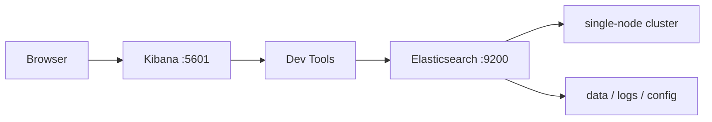

# ES 和 Kibana 本地安装实战

## 1. 这一章解决什么问题

学习 ES 最怕只看概念不动手。真正理解索引、mapping、查询和聚合, 必须有一个能反复试错的本地环境。ES 8.x 之后安全默认开启, 第一次启动会涉及密码、证书、Kibana enrollment token, 这让入门比 7.x 多了一点门槛。

这篇文章给出两种安装方式: Docker Compose 快速启动, 以及本地压缩包启动。个人学习优先推荐 Docker Compose。

## 2. 核心概念

| 项 | 说明 |
|---|---|
| Elasticsearch | 核心服务, 默认 HTTP 端口 9200 |
| Kibana | 可视化和 Dev Tools, 默认端口 5601 |
| elastic 用户 | 内置超级用户, 学习环境常用 |
| HTTP CA 证书 | ES 8.x 自动生成的 HTTP TLS CA |
| Enrollment token | Kibana 加入 ES 的一次性注册令牌 |
| Dev Tools | Kibana 内置 Console, 适合执行 REST API |

本地学习环境的目标很简单: 能访问 Kibana, 能在 Dev Tools 里执行 `GET /`, 能创建索引、写入文档、查询结果。

## 3. 原理拆解

ES 8.x 默认启用安全能力, 包括:

- HTTP 层 TLS。
- 内置用户密码。
- 节点间传输层 TLS。
- Kibana 通过 enrollment token 完成初始配置。

单节点开发环境可以简化很多配置, 但最好保留安全能力, 因为这更接近生产环境。Docker Compose 中常用环境变量 `discovery.type=single-node` 启动单节点, 用 `ELASTIC_PASSWORD` 指定 `elastic` 用户密码。

本地环境链路如下:



## 4. 使用示例

### 4.1 Docker Compose 单节点环境

在任意实验目录创建 `docker-compose.yml`:

```yaml
services:
  elasticsearch:
    image: docker.elastic.co/elasticsearch/elasticsearch:8.15.3
    container_name: es01
    environment:
      - node.name=es01
      - cluster.name=es-local
      - discovery.type=single-node
      - ELASTIC_PASSWORD=changeme_please
      - xpack.security.enabled=true
      - xpack.security.http.ssl.enabled=false
      - ES_JAVA_OPTS=-Xms1g -Xmx1g
    ports:
      - "9200:9200"
    volumes:
      - es-data:/usr/share/elasticsearch/data
    healthcheck:
      test: ["CMD-SHELL", "curl -s http://localhost:9200 | grep -q 'missing authentication credentials'"]
      interval: 10s
      timeout: 10s
      retries: 30

  kibana:
    image: docker.elastic.co/kibana/kibana:8.15.3
    container_name: kibana
    depends_on:
      elasticsearch:
        condition: service_healthy
    environment:
      - ELASTICSEARCH_HOSTS=http://elasticsearch:9200
      - ELASTICSEARCH_USERNAME=kibana_system
      - ELASTICSEARCH_PASSWORD=changeme_kibana
    ports:
      - "5601:5601"

volumes:
  es-data:
```

上面的配置为了本地简化关闭了 HTTP TLS, 但仍保留用户名密码。Kibana 使用 `kibana_system` 用户, 需要先给它设置密码。更省事的学习方式是先只启动 ES, 设置好密码后再启动 Kibana。

```powershell
docker compose up -d elasticsearch
docker exec -it es01 /usr/share/elasticsearch/bin/elasticsearch-reset-password -u kibana_system -i
docker compose up -d kibana
```

如果你不想处理 `kibana_system` 密码, 也可以用 ES 首次启动输出的 enrollment token 完成 Kibana 初始化。这种方式更贴近官方默认流程。

### 4.2 验证 ES

```powershell
curl -u elastic:changeme_please http://localhost:9200
```

预期能看到集群名称、版本号和 tagline。

### 4.3 Kibana Dev Tools 验证

打开:

```text
http://localhost:5601
```

进入 Dev Tools 后执行:

```http
GET /
GET _cluster/health
GET _cat/nodes?v
```

### 4.4 本地压缩包启动思路

如果使用 zip/tar 包:

1. 安装合适的 JDK 或使用 ES 自带 JDK。
2. 解压 Elasticsearch, 执行 `bin/elasticsearch`。
3. 记录控制台输出的 `elastic` 密码和 Kibana enrollment token。
4. 解压 Kibana, 执行 `bin/kibana`。
5. 浏览器访问 `http://localhost:5601`, 按引导输入 enrollment token。

开发机内存不足时, 调整:

```yaml
ES_JAVA_OPTS: "-Xms512m -Xmx512m"
```

但后续聚合和批量写入实验会受影响。

## 5. 工程取舍

本地学习环境有三种选择。

Docker Compose 最适合反复实验。优点是干净、可删除、可复现; 缺点是 Docker 资源占用较大。

压缩包启动更接近理解 ES 目录结构, 例如 `config`, `data`, `logs`, `plugins`; 缺点是清理环境时容易残留数据和配置。

Elastic Cloud 最省运维, 适合验证新版能力和团队协作; 缺点是成本和网络环境依赖。

安全配置也有取舍。纯本地可以关闭 HTTP TLS 降低学习成本, 但不要把这种配置搬到共享环境。只要端口对局域网开放, 裸 ES 就很危险。

## 6. 实战与排障

常见启动失败:

- 内存不足: 降低 `ES_JAVA_OPTS`, 或给 Docker Desktop 分配更多内存。
- 端口冲突: 检查 9200 和 5601 是否被占用。
- 单节点 yellow: 正常, 如果索引有副本而只有一个节点, replica 无法分配。
- Kibana 连不上 ES: 检查 `ELASTICSEARCH_HOSTS`、用户名、密码、TLS 设置。
- 密码忘记: 使用 `elasticsearch-reset-password -u elastic` 重置。
- 容器反复重启: `docker logs es01` 看具体异常, 常见是数据目录权限或配置项错误。

常用检查命令:

```http
GET _cluster/health
GET _cat/nodes?v
GET _cat/plugins?v
GET _license
GET _security/user
```

如果是 Windows 或 macOS 上的 Docker, 写入性能可能受文件系统挂载影响。学习环境影响不大, 压测时建议使用 Linux 主机或云服务器。

## 7. 小结

- 学 ES 需要一个可反复实验的 Kibana Dev Tools 环境。
- ES 8.x 默认开启安全能力, 本地也应该理解用户、密码、证书和 token。
- Docker Compose 是最适合个人学习的启动方式。
- 单节点环境出现 yellow 往往是副本无法分配, 不等于服务不可用。
- 本地可以为了学习降低 TLS 复杂度, 但生产环境必须认真配置安全。
- 安装不是目的, 能跑 DSL、看 mapping、查分片状态才是入门闭环。
