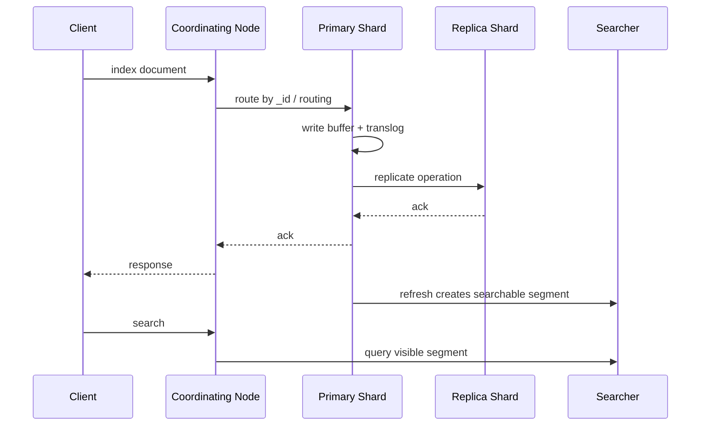

# 从第一条文档到第一次查询

## 1. 这一章解决什么问题

安装完成后, 下一步不是立刻研究复杂查询, 而是打通“创建索引 -> 写入文档 -> 查询文档 -> 更新删除 -> 批量写入”的最小闭环。这个闭环能帮助我们理解 ES 的基本 API 形态和返回结果。

这篇文章以订单数据为例, 用可以直接运行的 DSL 走完整个入门流程。

## 2. 核心概念

| 操作 | API | 说明 |
|---|---|---|
| 创建索引 | `PUT index` | 定义 settings 和 mappings |
| 写入文档 | `POST index/_doc/id` | 不指定 id 时自动生成 |
| 读取文档 | `GET index/_doc/id` | 按 id 精确获取 |
| 搜索文档 | `GET index/_search` | 使用 Query DSL |
| 更新文档 | `POST index/_update/id` | 局部更新或脚本更新 |
| 删除文档 | `DELETE index/_doc/id` | 标记删除, 后续 merge 清理 |
| 批量操作 | `POST _bulk` | 提升写入吞吐 |

ES 8.x 中已经没有早期版本的多 type 概念。API 路径里使用 `_doc` 是兼容路径, 不代表你还可以像 6.x 那样在一个索引里建多个 type。

## 3. 原理拆解

写入一条文档时, ES 大致做了这些事情:



`GET index/_doc/id` 和 `GET index/_search` 的可见性不完全一样。按 id 获取通常可以实时读取最新版本, 而搜索依赖 refresh。也就是说, 你刚写入后马上 search 可能查不到, 等默认 refresh 周期过去就能查到了。

入门阶段先记住:

- `_source` 是原始 JSON 文档。
- `_id` 是文档唯一标识。
- `_version` 是内部版本信息, 现在更推荐用 `_seq_no` 和 `_primary_term` 做并发控制。
- `_score` 是相关性评分, filter 查询或 match_all 时意义有限。

## 4. 使用示例

### 4.1 创建订单索引

为了让示例可重复执行, 可以先清理旧索引:

```http
DELETE orders-v1
```

```http
PUT orders-v1
{
  "settings": {
    "number_of_shards": 1,
    "number_of_replicas": 0
  },
  "mappings": {
    "dynamic": "strict",
    "properties": {
      "order_id": { "type": "keyword" },
      "user_id": { "type": "keyword" },
      "title": {
        "type": "text",
        "fields": {
          "keyword": { "type": "keyword", "ignore_above": 256 }
        }
      },
      "amount": { "type": "scaled_float", "scaling_factor": 100 },
      "status": { "type": "keyword" },
      "created_at": { "type": "date" }
    }
  }
}
```

学习环境用 1 个 primary shard、0 个 replica 可以避免单节点 yellow。生产环境通常至少 1 个 replica。

### 4.2 写入第一条文档

```http
POST orders-v1/_doc/1001
{
  "order_id": "1001",
  "user_id": "u001",
  "title": "蓝牙耳机订单",
  "amount": 299.00,
  "status": "paid",
  "created_at": "2026-05-25T10:00:00+08:00"
}
```

查看:

```http
GET orders-v1/_doc/1001
```

搜索:

```http
GET orders-v1/_search
{
  "query": {
    "match": {
      "title": "耳机"
    }
  }
}
```

如果刚写入立刻搜索不到, 可以等待 1 秒, 或在学习时临时使用:

```http
POST orders-v1/_doc/1002?refresh=true
{
  "order_id": "1002",
  "user_id": "u002",
  "title": "机械键盘订单",
  "amount": 499.00,
  "status": "created",
  "created_at": "2026-05-25T10:05:00+08:00"
}
```

不要在高吞吐生产写入中默认使用 `refresh=true`。

### 4.3 批量写入

```http
POST _bulk
{ "index": { "_index": "orders-v1", "_id": "1003" } }
{ "order_id": "1003", "user_id": "u001", "title": "显示器订单", "amount": 1299.00, "status": "paid", "created_at": "2026-05-25T11:00:00+08:00" }
{ "index": { "_index": "orders-v1", "_id": "1004" } }
{ "order_id": "1004", "user_id": "u003", "title": "蓝牙音箱订单", "amount": 199.00, "status": "cancelled", "created_at": "2026-05-25T11:30:00+08:00" }
```

bulk 请求每行都是一条 JSON, 最后一行也要换行。Kibana Dev Tools 通常会帮你处理, 但程序写入时要非常注意。

### 4.4 更新与删除

```http
POST orders-v1/_update/1002
{
  "doc": {
    "status": "paid"
  }
}
```

```http
POST orders-v1/_update/1002
{
  "script": {
    "source": "ctx._source.amount += params.extra",
    "params": {
      "extra": 20
    }
  }
}
```

```http
DELETE orders-v1/_doc/1004
```

### 4.5 查询、排序、分页

```http
GET orders-v1/_search
{
  "from": 0,
  "size": 10,
  "query": {
    "bool": {
      "must": [
        { "match": { "title": "订单" } }
      ],
      "filter": [
        { "term": { "status": "paid" } },
        { "range": { "amount": { "gte": 100 } } }
      ]
    }
  },
  "sort": [
    { "created_at": "desc" }
  ]
}
```

## 5. 工程取舍

显式 mapping 比动态 mapping 麻烦, 但更适合生产。订单金额如果被动态识别成 `float`, 后续统计精度可能不如预期; 状态字段如果被识别成 `text`, terms 聚合会遇到问题。

`PUT index/_doc/id` 和 `POST index/_doc/id` 都能指定 id 写入。业务有天然唯一键时可以使用业务 id, 便于幂等写入; 没有唯一键时让 ES 自动生成 id 写入更快, 因为无需先检查旧版本。

局部更新并不等于原地修改。Lucene segment 不可变, ES 更新文档本质上是写新版本并标记旧版本删除。所以频繁更新同一文档会增加写放大和 merge 压力。

## 6. 实战与排障

常见错误:

```json
{
  "error": {
    "type": "strict_dynamic_mapping_exception"
  }
}
```

说明你给 `dynamic: strict` 的索引写入了 mapping 中不存在的字段。解决方式是补 mapping 或清洗输入字段。

```json
{
  "error": {
    "type": "mapper_parsing_exception"
  }
}
```

通常是字段类型不匹配, 例如 date 格式错误、数字字段传了字符串且无法解析。

```json
{
  "errors": true,
  "items": []
}
```

bulk 返回中 `errors=true` 不代表全部失败。必须逐条检查 `items` 里的状态码和错误原因。

建议入门阶段养成三个习惯:

```http
GET orders-v1/_mapping
GET orders-v1/_search?size=1
GET orders-v1/_count
```

先确认 mapping, 再确认样例文档, 最后确认总量。很多问题不需要猜。

## 7. 小结

- ES 入门闭环是创建索引、写入、读取、搜索、更新、删除、批量写入。
- 搜索可见性受 refresh 影响, 不等于每次写入立刻可搜。
- `_source` 保存原始文档, `_score` 表示相关性评分。
- bulk 是生产写入的基础能力, 但要逐条检查失败项。
- 更新文档不是原地修改, 高频更新会带来额外成本。
- 生产环境应显式设计 mapping, 避免动态字段把类型猜错。
