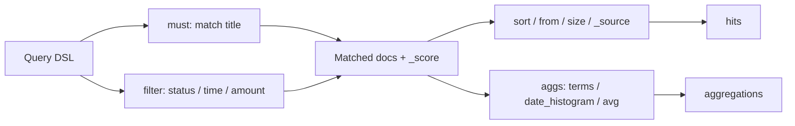

# 查询与聚合基础入门

## 1. 这一章解决什么问题

ES 的 Query DSL 看起来像一堆 JSON, 但背后有清晰的语义: 哪些条件参与评分, 哪些条件只是过滤, 哪些字段可以聚合, 哪些查询会非常昂贵。入门阶段不必马上掌握所有查询, 但要理解最常用的 match、term、range、bool、sort 和 aggregation。

这篇文章用订单数据继续演示基础查询与聚合。

## 2. 核心概念

| 查询/聚合 | 用途 | 常见字段 |
|---|---|---|
| `match` | 全文搜索, 会分词 | `text` |
| `term` | 精确匹配 | `keyword`, numeric, boolean |
| `terms` | 多值精确匹配 | `keyword` |
| `range` | 范围过滤 | numeric, date |
| `exists` | 字段是否存在 | 任意字段 |
| `bool` | 组合条件 | must/filter/should/must_not |
| `terms aggregation` | 分组统计 | `keyword` |
| `date_histogram` | 时间序列分桶 | `date` |
| `avg/sum/stats` | 指标统计 | numeric |

最重要的分界线是 query context 和 filter context。

query context 会计算 `_score`, 适合全文检索和相关性排序。filter context 只判断匹配与否, 常用于状态、时间、范围等结构化条件。

## 3. 原理拆解

一个典型查询通常长这样:



`bool` 查询的四个子句:

| 子句 | 是否参与评分 | 语义 |
|---|---:|---|
| `must` | 是 | 必须匹配 |
| `filter` | 否 | 必须匹配, 只过滤 |
| `should` | 通常是 | 可选匹配, 可影响评分 |
| `must_not` | 否 | 必须不匹配 |

如果一个 bool 中只有 `should`, 默认至少匹配一个; 如果已经有 `must` 或 `filter`, `should` 默认变成加分项。需要严格控制时使用 `minimum_should_match`。

## 4. 使用示例

假设已有 `orders-v1` 索引。

可以先写入一批示例订单, 方便复现后续查询:

```http
POST orders-v1/_bulk?refresh=true
{"index":{"_id":"o100"}}
{"title":"wireless headphone order","status":"paid","amount":399,"created_at":"2026-05-20T10:00:00+08:00","user_id":"u1"}
{"index":{"_id":"o101"}}
{"title":"bluetooth speaker order","status":"paid","amount":199,"created_at":"2026-05-21T11:00:00+08:00","user_id":"u2"}
{"index":{"_id":"o102"}}
{"title":"keyboard order","status":"cancelled","amount":99,"created_at":"2026-05-22T12:00:00+08:00","user_id":"u1"}
```

### 4.1 全文搜索

```http
GET orders-v1/_search
{
  "query": {
    "match": {
      "title": "蓝牙订单"
    }
  }
}
```

`match` 会使用字段的 analyzer 分词。中文效果取决于分词器, 默认 standard analyzer 对中文通常不够理想, 后续应使用 IK、智能分词或自定义 analyzer 优化。

### 4.2 精确过滤

```http
GET orders-v1/_search
{
  "query": {
    "term": {
      "status": "paid"
    }
  }
}
```

`term` 不会分析查询文本, 所以不要直接对 `text` 字段做中文 term 查询。精确匹配通常查 `keyword` 字段。

### 4.3 组合查询

```http
GET orders-v1/_search
{
  "_source": ["order_id", "title", "amount", "status", "created_at"],
  "query": {
    "bool": {
      "must": [
        { "match": { "title": "蓝牙" } }
      ],
      "filter": [
        { "terms": { "status": ["paid", "created"] } },
        { "range": { "amount": { "gte": 100, "lte": 500 } } },
        { "range": { "created_at": { "gte": "now-30d/d" } } }
      ]
    }
  },
  "sort": [
    { "created_at": "desc" }
  ],
  "from": 0,
  "size": 10
}
```

### 4.4 基础聚合

按状态统计订单数:

```http
GET orders-v1/_search
{
  "size": 0,
  "aggs": {
    "by_status": {
      "terms": {
        "field": "status",
        "size": 10
      }
    }
  }
}
```

按天统计订单金额:

```http
GET orders-v1/_search
{
  "size": 0,
  "query": {
    "range": {
      "created_at": {
        "gte": "now-30d/d"
      }
    }
  },
  "aggs": {
    "orders_per_day": {
      "date_histogram": {
        "field": "created_at",
        "calendar_interval": "day",
        "time_zone": "+08:00"
      },
      "aggs": {
        "total_amount": {
          "sum": { "field": "amount" }
        },
        "avg_amount": {
          "avg": { "field": "amount" }
        }
      }
    }
  }
}
```

### 4.5 统计指标

```http
GET orders-v1/_search
{
  "size": 0,
  "aggs": {
    "amount_stats": {
      "stats": {
        "field": "amount"
      }
    }
  }
}
```

## 5. 工程取舍

`from/size` 适合浅分页, 不适合翻到几万页。ES 需要在每个分片上取候选结果再全局排序, 深分页会放大内存和 CPU 消耗。后续生产列表页应考虑 `search_after` + PIT。

`terms` 聚合适合低到中等基数字段, 例如状态、城市、品牌。对用户 id、trace id 这种高基数字段做大 size 聚合, 成本会很高。

排序字段应尽量是 keyword、date 或 numeric, 并启用 doc_values。对 text 字段排序往往会触发 fielddata, 可能造成堆内存压力。

`wildcard`、`regexp`、前导通配符等查询不是不能用, 而是要严格限制场景。用户搜索框里直接暴露这些能力, 很容易把集群拖慢。

## 6. 实战与排障

查询结果不符合预期时:

```http
GET orders-v1/_analyze
{
  "field": "title",
  "text": "蓝牙耳机订单"
}
```

先看分词结果。很多全文搜索问题都是 analyzer 问题。

想看为什么某条文档匹配:

```http
GET orders-v1/_explain/1001
{
  "query": {
    "match": {
      "title": "蓝牙"
    }
  }
}
```

想分析查询耗时:

```http
GET orders-v1/_search
{
  "profile": true,
  "query": {
    "bool": {
      "must": [
        { "match": { "title": "蓝牙" } }
      ],
      "filter": [
        { "term": { "status": "paid" } }
      ]
    }
  }
}
```

聚合为空时, 检查字段类型。`text` 字段默认不适合 terms 聚合, 应使用 `title.keyword` 或专门的 keyword 字段。

## 7. 小结

- `match` 面向全文检索, `term` 面向精确匹配。
- `bool` 是组合业务查询的核心, filter 条件通常更适合放在 `filter` 子句中。
- 聚合通常把 `size` 设为 0, 只返回统计结果。
- `terms` 聚合依赖 keyword 等可聚合字段。
- 深分页、大范围正则、高基数聚合是入门阶段就要知道的风险点。
- 分词问题用 `_analyze`, 评分问题用 `_explain`, 性能问题用 profile API。
